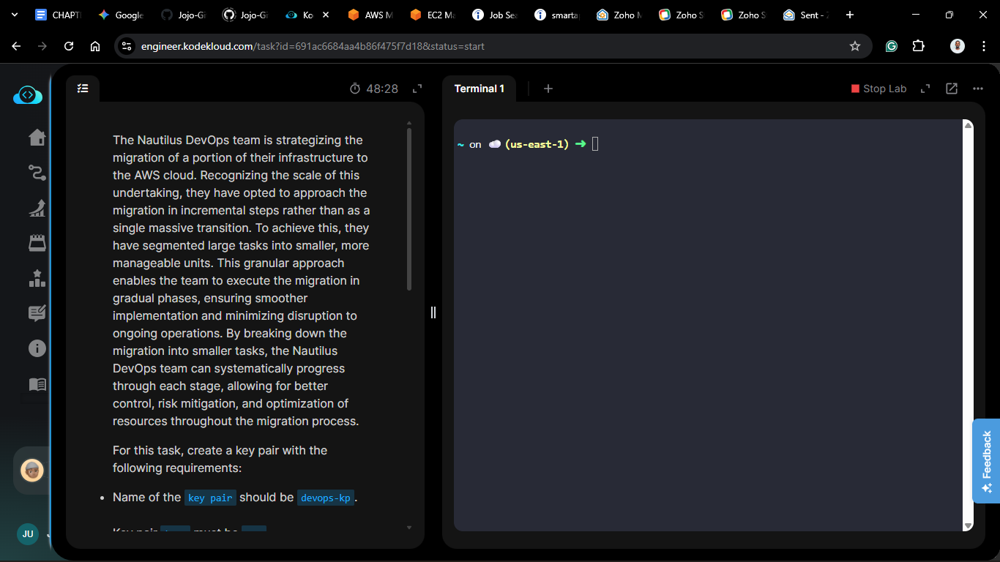
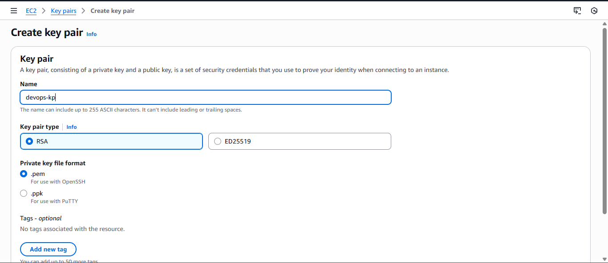
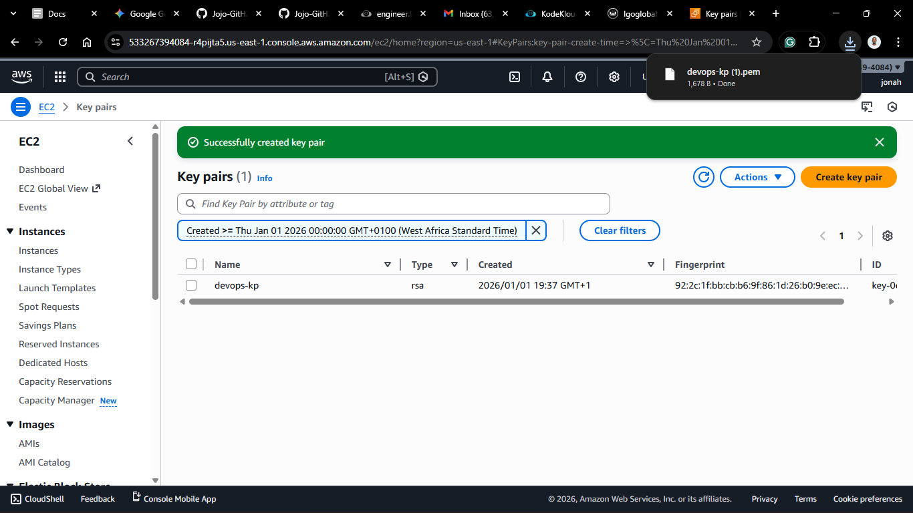
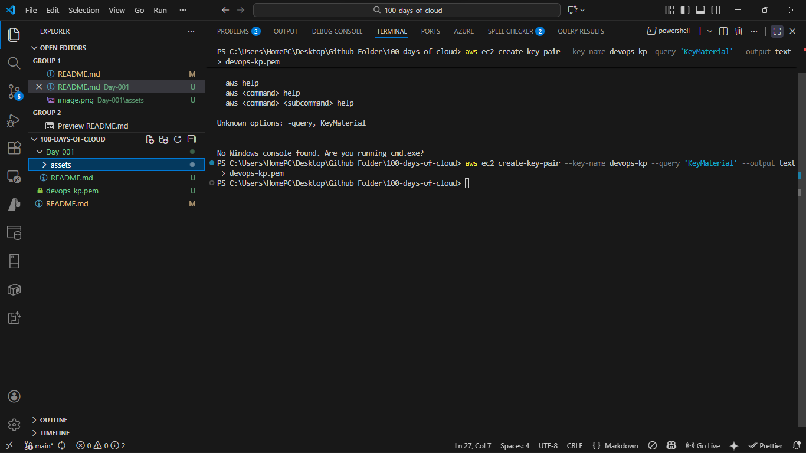

# Day 1: Creating Key Pairs on AWS

## Project Description

Today's task involved creating SSH key pairs to enable secure access to EC2 instances on AWS. This is a fundamental step in managing cloud infrastructure securely.



## Steps & Configuration

### Method 1: Using AWS Management Console

1. Log in to the [AWS Management Console](https://aws.amazon.com/console/).
2. Navigate to the EC2 Dashboard.
3. Click on "Key Pairs" in the left sidebar.
4. Click "Create Key Pair".
5. Enter a name for your key pair and click "Create", in this case, `devops-kp`.
   
6. The private key file (`.pem`) will be automatically downloaded. Store it securely.


### Method 2: Using AWS CLI
1. Ensure you have the AWS CLI installed and configured with your credentials.
2. Run the following command to create a key pair:
   ```bash
   aws ec2 create-key-pair --key-name devops-kp --query 'KeyMaterial' --output text > devops-kp.pem
   ```
   
3. If you want to go further and set permissions for the private key file, run:
   ```bash
   chmod 400 devops-kp.pem
   ```
   It is not required for this task but is a good practice to ensure the key file is secure.