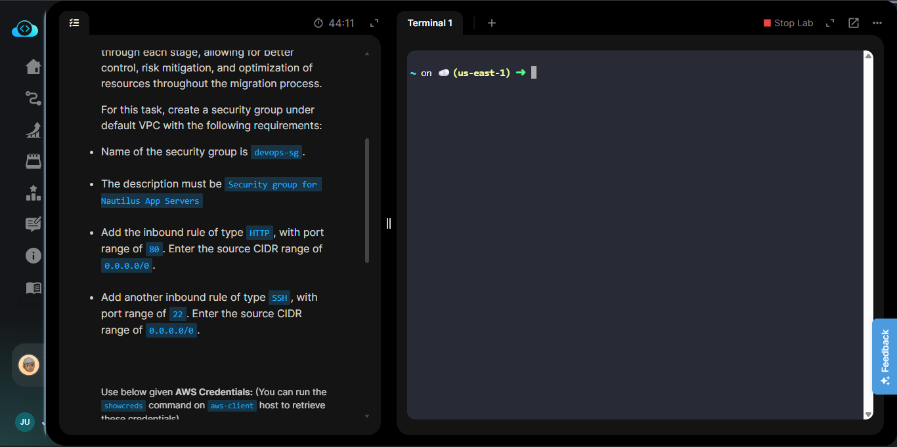
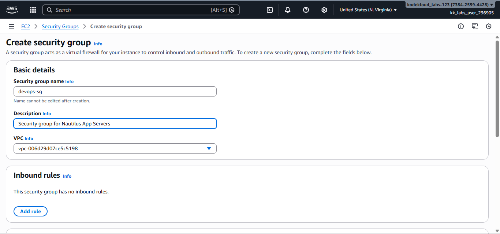
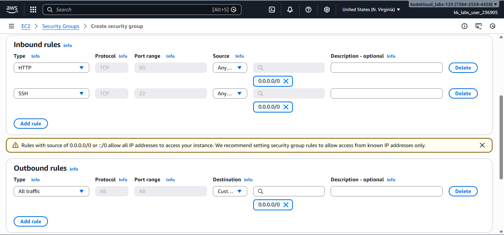
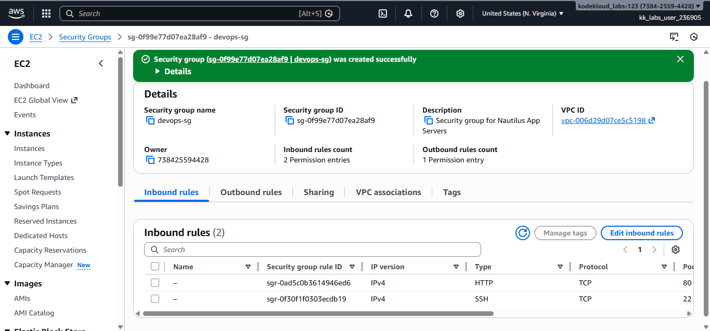
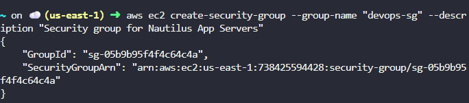
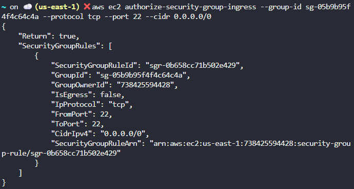
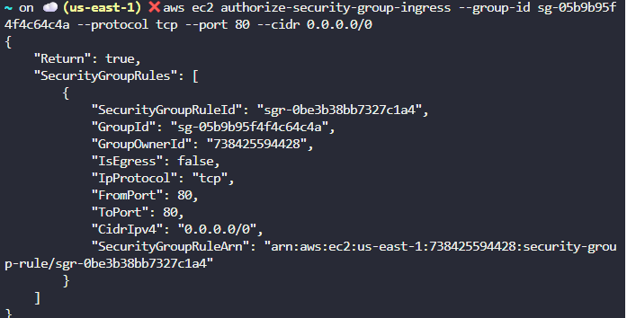
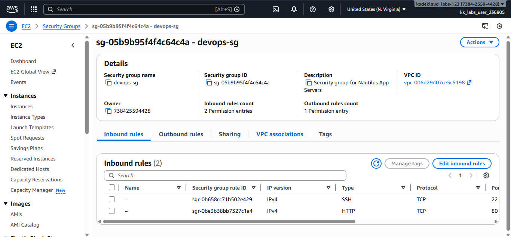

# Day 2: Creating Security Groups on AWS

## Project Description

Today's task focused on network security by creating Security Groups in AWS. A Security Group acts as a virtual firewall for your EC2 instances to control incoming and outgoing traffic.



## Steps & Configuration

### Method 1: Using AWS Management Console

1. Log in to the [AWS Management Console](https://aws.amazon.com/console/).
2. Navigate to the EC2 Dashboard.
3. Click on "Security Groups" in the left sidebar.
4. Click "Create Security Group".
5. Enter a name for your security group and click "Create".
   
6. **Inbound Rules:** Click "Add rule" and set the following rules:
   - Type: HTTP, Protocol: TCP, Port: 80, Source: Anywhere-IPv4 (0.0.0.0/0).
   - Type: SSH, Protocol: TCP, Port: 22, Source: Anywhere-IPv4 (0.0.0.0/0)
     
7. **Outbound Rules:** By default, all outbound traffic is allowed. You can modify this as needed.



### Method 2: Using AWS CLI

1. Ensure you have the AWS CLI installed and configured with your credentials.
2. Run the following command to create a security group:
   ```bash
   aws ec2 create-security-group --group-name "devops-sg" --description "Security group for Nautilus App Servers"
   ```
   
3. To add an inbound rule (ingress) allowing SSH (port 22) from anywhere:

   **FOR SSH:**

   ```bash
   aws ec2 authorize-security-group-ingress --group-name "devops-sg" --protocol tcp --port 22 --cidr 0.0.0.0/0
   ```

   
4. To add an inbound rule (ingress) allowing HTTP (port 80) from anywhere:
   **FOR HTTP:**

   ```bash
   aws ec2 authorize-security-group-egress --group-name "devops-sg" --protocol -1 --port all --cidr 0.0.0.0/0
   ```

   

5. Verify the security group and its rules:
   ```bash
   aws ec2 describe-security-groups --group-names "devops-sg"
   ```


