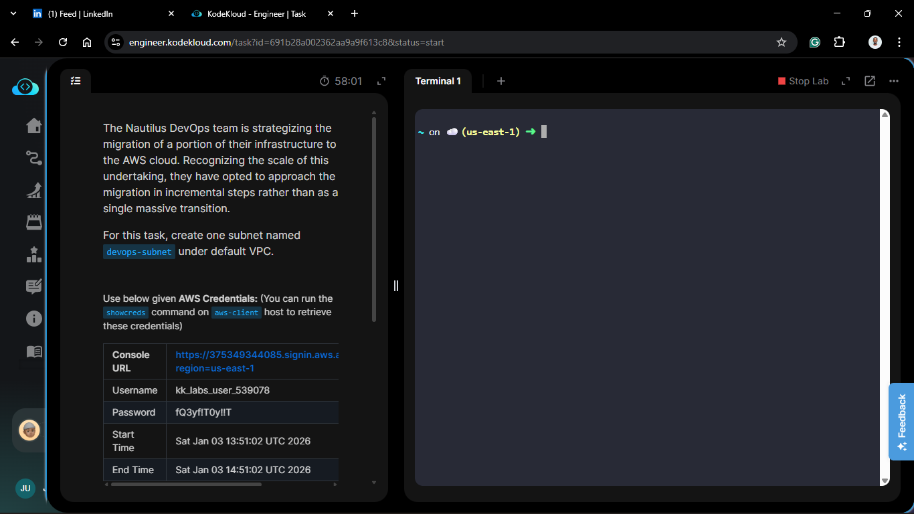
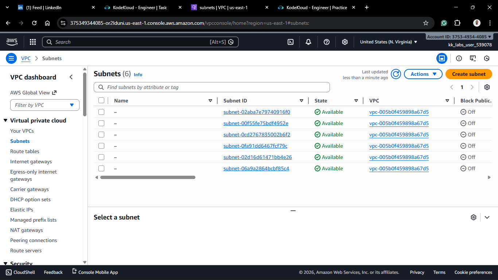
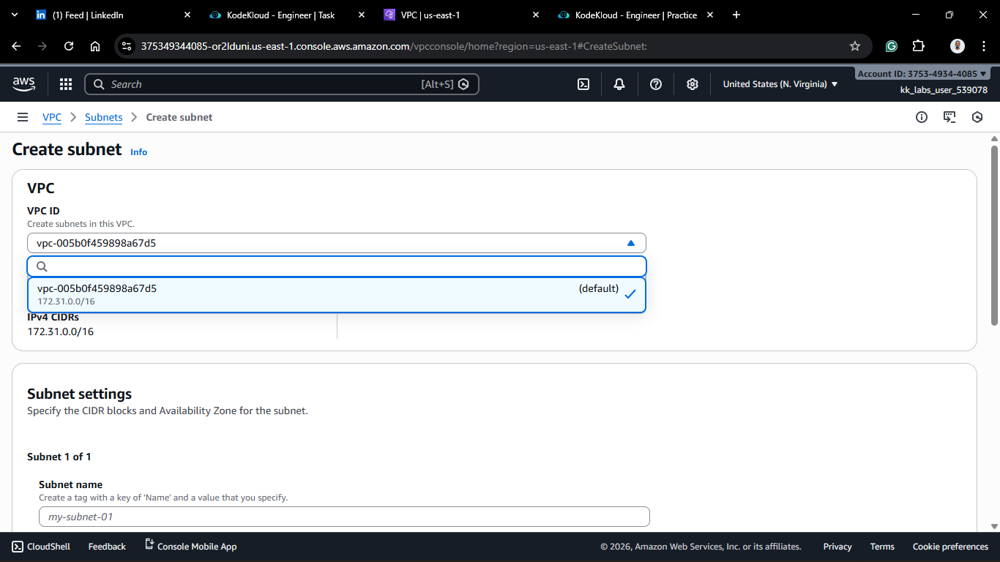
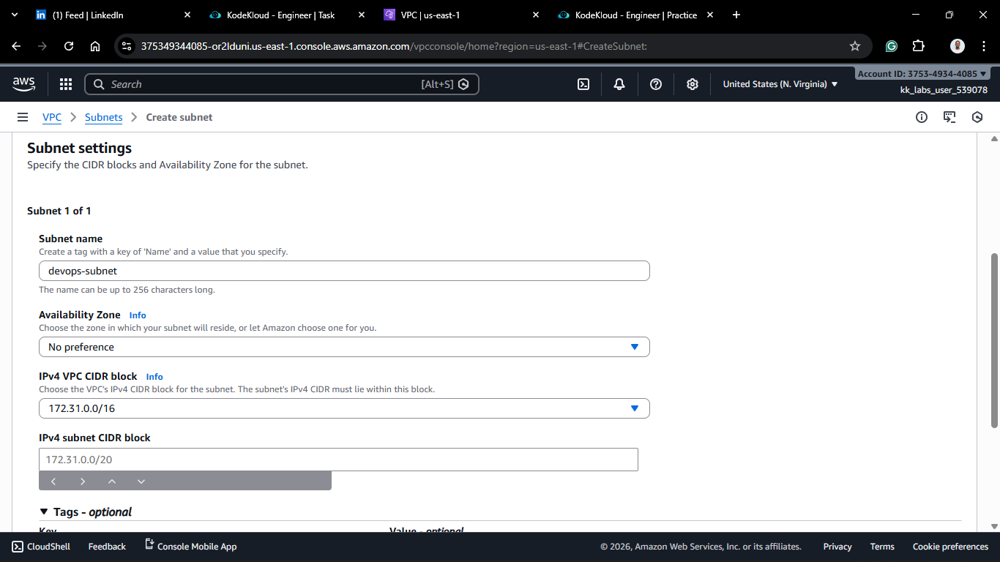
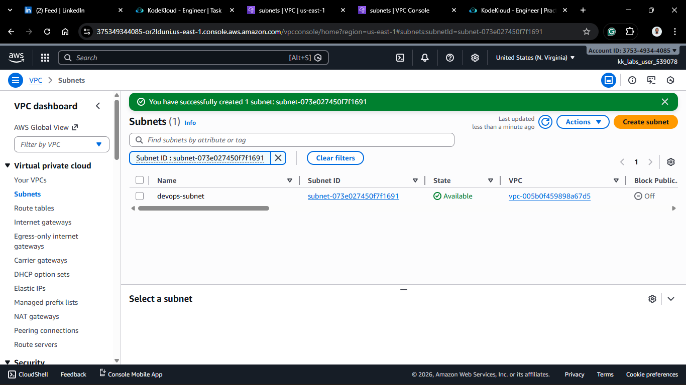
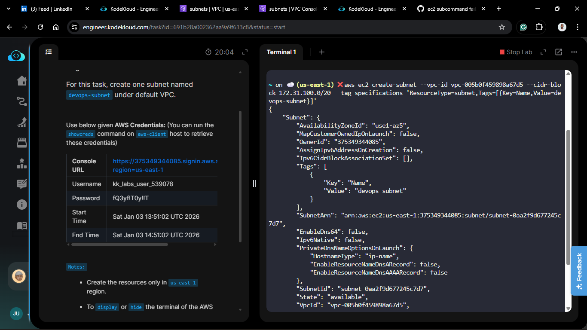
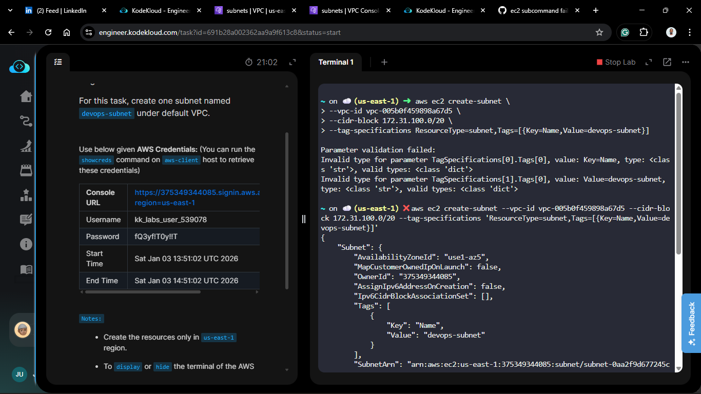

# Day 3: Creating Subnets & Understanding CIDR
## Project Description
Today's task involved partitioning a VPC (Virtual Private Cloud) into smaller networks called **subnets**. This is vital for organizing resources, managing traffic flow, and isolating public-facing resources from private ones. I also touched on **CIDR (Classless Inter-Domain Routing)** blocks to ensure our network "slices" do not overlap.



## Steps & Configuration
### Method 1: Using AWS Management Console
1. Log in to the [AWS Management Console](https://aws.amazon.com/console/).
2. Navigate to the VPC Dashboard.
3. Click on **Subnets** in the left sidebar > **Create Subnet**.
   
4. Select the VPC you want to create the subnet in, in our case, the default.
   
5. **Subnet Settings:**
   - Name tag: `devops-subnet`
   - Availability Zone: Select any available zone (e.g., `us-east-1a`)
   - IPv4 CIDR block: `172.31.100.0/20` (This provides 4096 IP addresses, )
  
> Note on CIDR:
> - The `/20` indicates that the first 20 bits are fixed for network identification, leaving 12 bits for host addresses. This allows for a range of IP addresses from `172.31.100.0` to `172.31.103.255`.
> - If you use a CIDR block that overlaps with existing subnets in the VPC, AWS will return an error, preventing the creation of the subnet.


6. Click **Create Subnet**.



<!-- 

 -->


### Method 2: Using AWS CLI
1. Ensure you have the AWS CLI installed and configured with your credentials.
2. Run the following command to create a subnet:
   ```bash
   aws ec2 create-subnet --vpc-id vpc-xxxxxx --cidr-block 172.31.100.0/20 --tag-specifications 'ResourceType=subnet,Tags=[{Key=Name,Value=devops-subnet}]'
   ``` 
   

**⚠️ Troubleshooting: The AWS CLI Tagging Issue**

I encountered a specific error while trying to run the create-subnet command by following the official AWS documentation examples. The command fails to parse the tags correctly.

**The Issue:** The standard documentation often suggests a format that leads to parsing errors where the CLI cannot interpret the JSON structure of the tags. This is actually a known open issue: [GitHub Issue #8720](https://github.com/aws/aws-cli/issues/8720).

**The Solution**: To fix this, you must wrap the entire value of `--tag-specifications` in single quotes.

❌ Broken: `ResourceType=subnet,Tags=[{Key=Name,Value=devops-subnet}]` (often fails in certain shells)

✅ Fixed: `'ResourceType=subnet,Tags=[{Key=Name,Value=devops-subnet}]'`



## 🧠 Theory: CIDR & Subnet Masks
- **VPC CIDR:** Usually a `/16` (e.g., `172.31.0.0/16`). This gives you ~65,536 IP addresses.

- **Subnet CIDR:** Usually a `/20` (e.g., `172.31.100.0/20`). This gives you 4096 addresses per subnet.

- **The Rule:** Subnet CIDRs must fall within the VPC CIDR range and must not overlap with other subnets in the same VPC.


