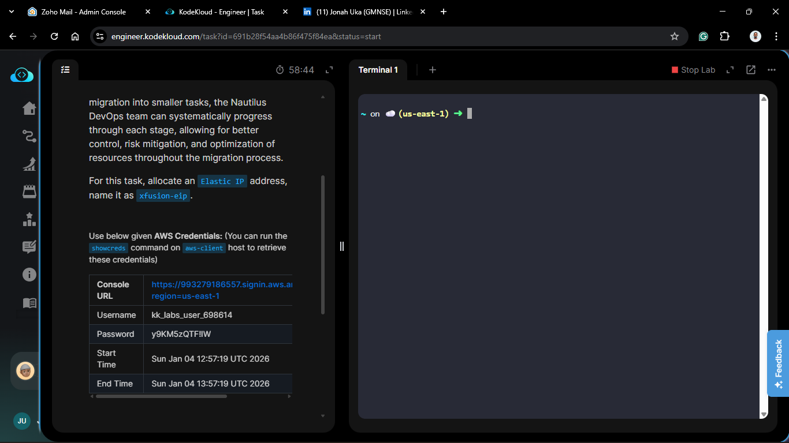
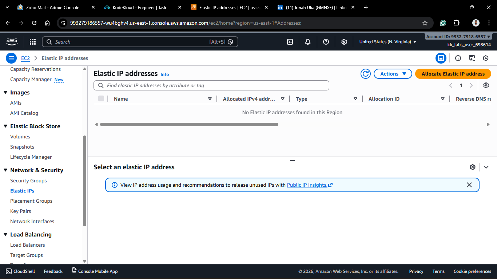
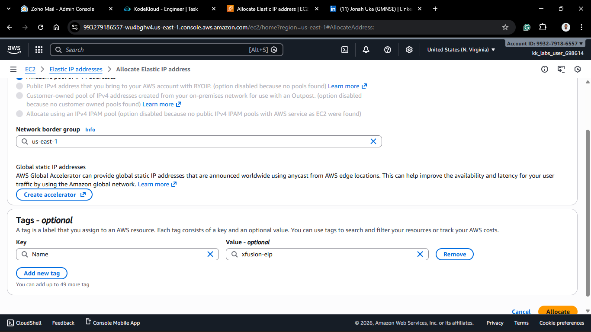
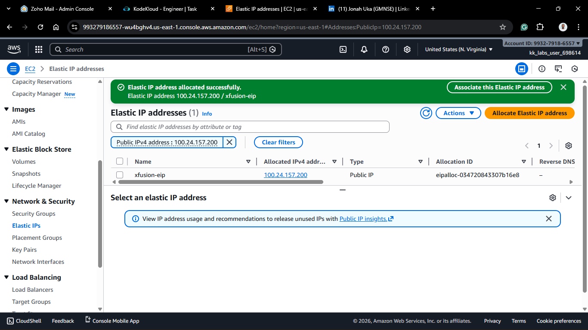
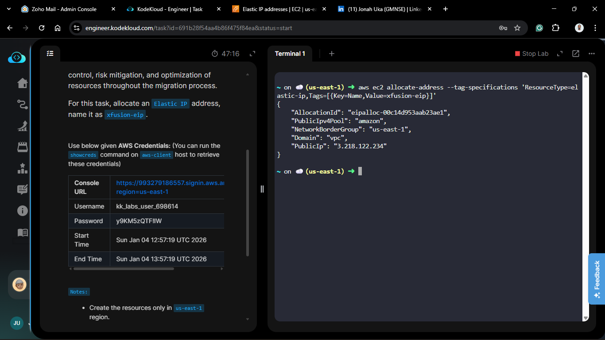
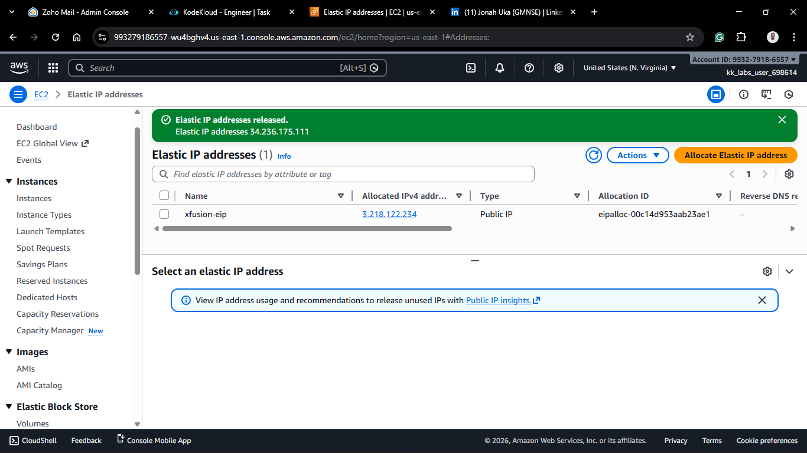

# Day 4: Allocate Elastic IP

## Project Description

Today's task involved allocating an **Elastic IP (EIP)** in AWS. An Elastic IP is a static, public IPV4 address. By allocating one, you are essentially "reserving" a public IP address from Amazon's pool for your account's exclusive use. Unlike standard public IPs, this address stays with you until you explicitly release it.



## Steps & Configuration

### Method 1: Using AWS Management Console

1. Log in to the [AWS Management Console](https://aws.amazon.com/console/).
2. Navigate to the EC2 Dashboard.
3. Under **Network & Security** in the left sidebar, click on **Elastic IPs**.
   
4. Click on **Allocate Elastic IP address**. - Keep the default settings (Amazon's pool of IPv4 addresses). - Click **Allocate**.
   



### Method 2: Using the AWS CLI

1. Ensure you have the AWS CLI installed and configured with your credentials.
2. Run the following command to allocate an Elastic IP:
   ```bash
   aws ec2 allocate-address --tag-specifications 'ResourceType=elastic-ip,Tags=[{Key=Name,Value=xfusion-eip}]'
   ```
   



⚠️ **Cost Warning Notice**: Elastic IPs that are not associated with a running instance may incur charges. AWS allows one free Elastic IP per account, but additional EIPs or unused EIPs can lead to costs. Always monitor your usage to avoid unexpected charges.
