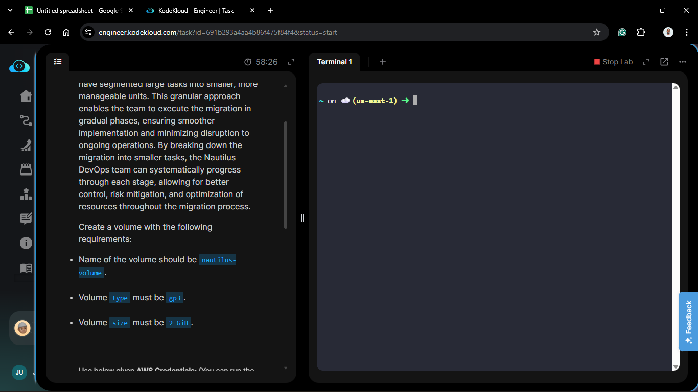
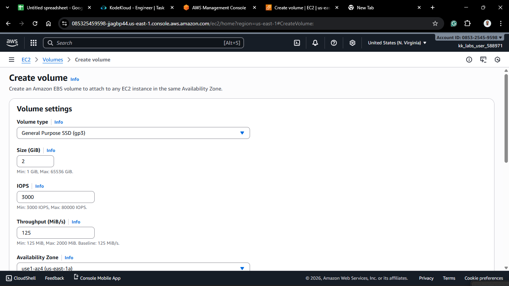
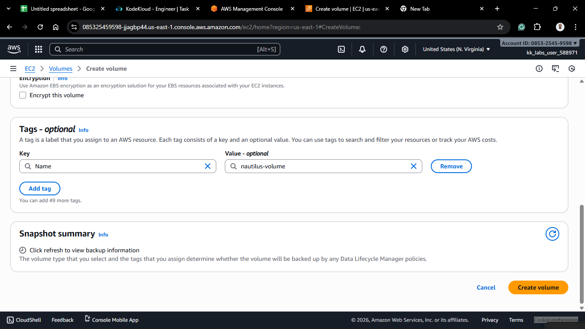
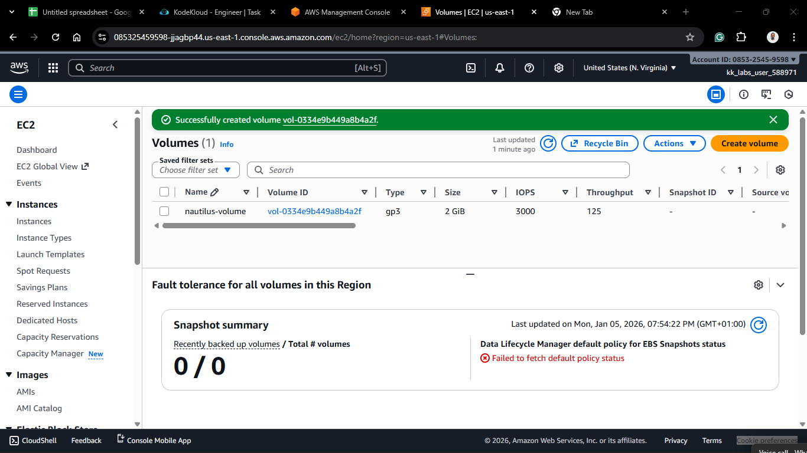
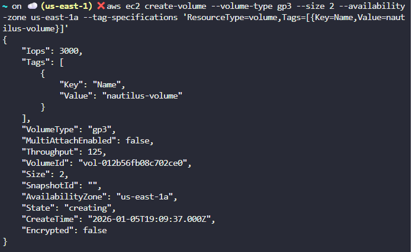
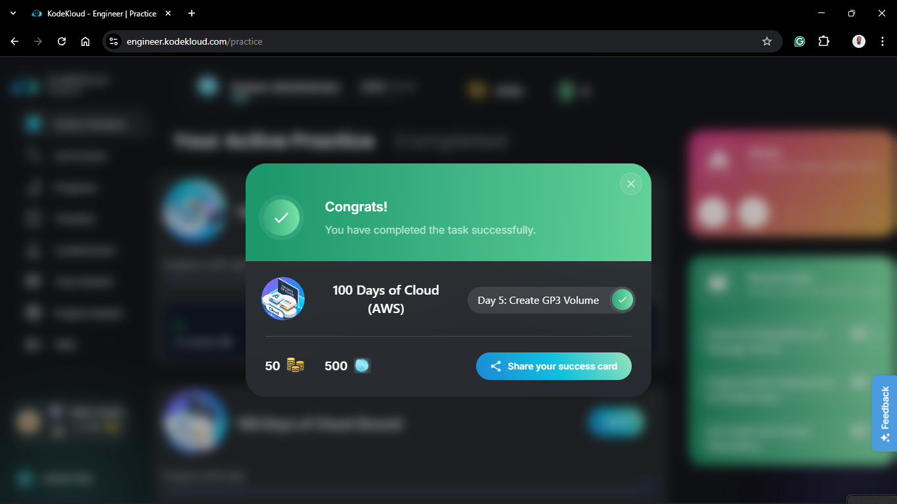

# Day 5: Create EBS Volume (GP3)

## Project Description

Today's task focused on **Elastic Block Store (EBS)**. Specifically, I created a **General Purpose SSD (gp3)** volume.



**Why gp3?**

With `gp3`, AWS allows you to provision storage capacity and performance (IOPS and Throughput) independently. This means you can have a high-performance drive without paying for unnecessary storage space.

## Steps & Configuration

### Method 1: Using AWS Management Console

1. Log in to the [AWS Management Console](https://aws.amazon.com/console/).
2. Navigate to the **EC2 Dashboard**.
3. Under "Elastic Block Store" in the left sidebar, click **Volumes**.
   
4. Click **Create volume**.
5. **Volume Settings:**
   - **Volume Type:** General Purpose SSD (gp3).
   - **Size (GiB):** 2.
   - **IOPS:** 3000 (Default baseline).
   - **Throughput:** 125 MB/s (Default baseline).
   - **Availability Zone:** `us-east-1a` (⚠️ **Critical:** This must match the AZ of the instance you plan to attach it to).
6. Add Tags :
   - Key: `Name`, Value: `nautilus-volume`
     
7. Click **Create volume**.
   

### Method 2: AWS CLI

1. Run the following command to create a 2GB gp3 volume in `us-east1a`

   ```bash
   aws ec2 create-volume \
       --volume-type gp3 \
       --size 2 \
       --availability-zone us-east-1a \
       --tag-specifications 'ResourceType=volume,Tags=[{Key=Name,Value=nautilus-volume}]'
   ```





## Theory: EBS-AZ Constraint

EBS volumes are **Availability Zone (AZ) locked**. If you create a volume in `us-east-1a`, you cannot attach it to a server in `us-east-1b`. To move data between AZs, you would need to create a snapshot and restore it in the new zone.
