# Day 6: Launch an EC2 Instance

## Project Description

Today's task involved launching an **EC2 Instance** in AWS. An EC2 instance is a virtual server in Amazon's Elastic Compute Cloud (EC2) for running applications on the AWS infrastructure.

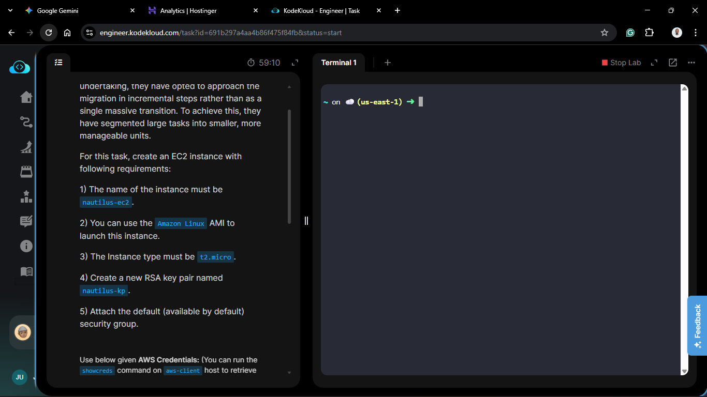

## Steps & Configuration

### Method 1: Using AWS Management Console

1. Log in to the [AWS Management Console](https://aws.amazon.com/console/).
2. Navigate to the **EC2 Dashboard** and click **Launch instances.**

   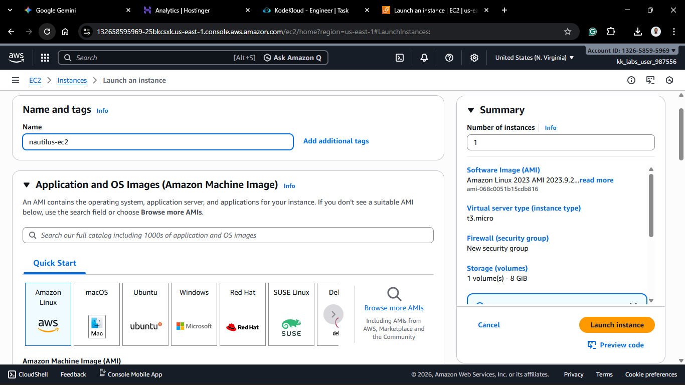

   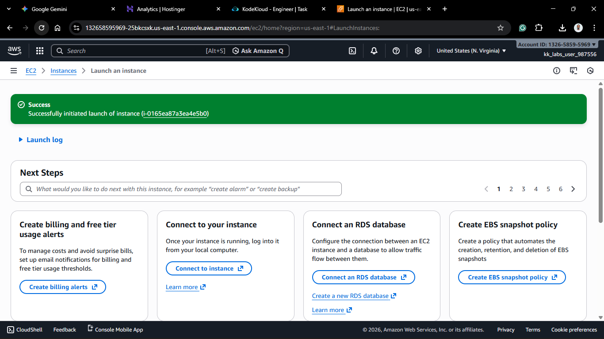 
3. **Name**: `nautilus-ec2` 
4. **Application and OS Images (AMI):** Amazon Linux 2023 AMI (Free tier Eligible) 
5. **Instance Type:** t2.micro

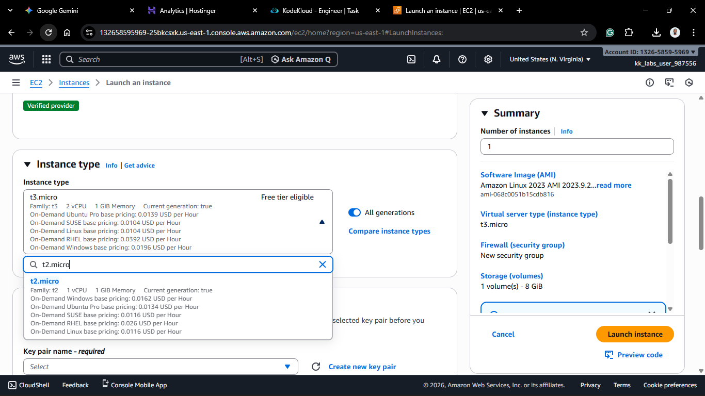 

6. **Key Pair:** Create `nautilus-kp`

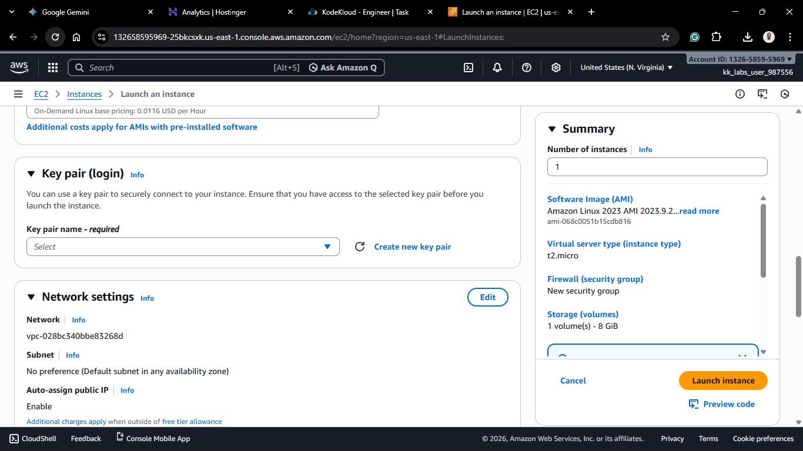
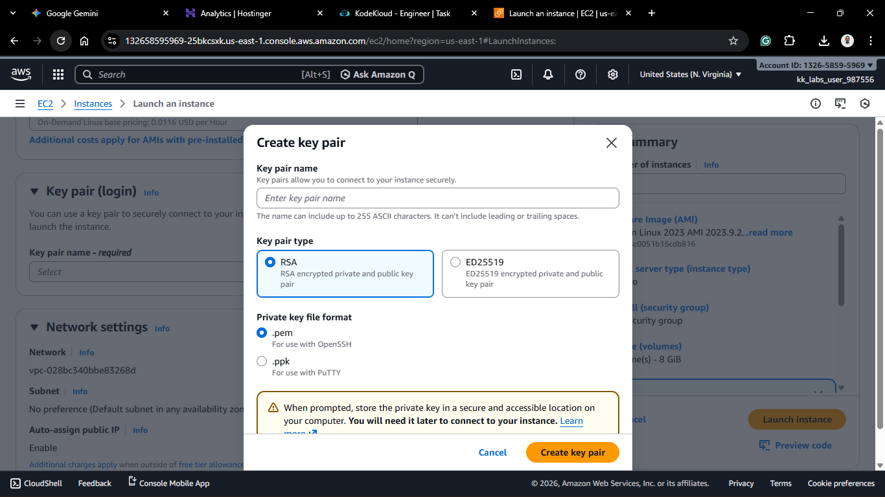 
7. **Network Settings:**
   - **VPC:** Select your VPC 
   - **Subnet:** No Preferences 
   - **Auto-assign Public IP:** Enable. 
   - **Firewall (Security Groups):** Select existing default security group
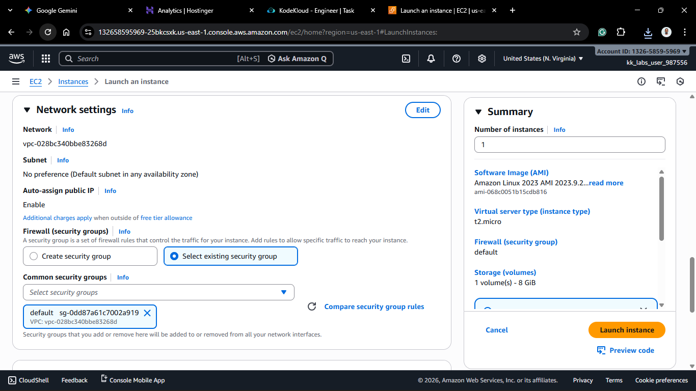  

8. **Configure Storage:** Default 8 GiB gp3 
9.  Click **Launch instance**
   


### Method 2: Using AWS CLI

1. Create the key pair (if you don't have one already):

   ```bash
   aws ec2 create-key-pair --key-name nautilus-kp --query 'KeyMaterial' --output text > nautilus-kp.pem

   chmod 400 nautilus-kp.pem
   ```

   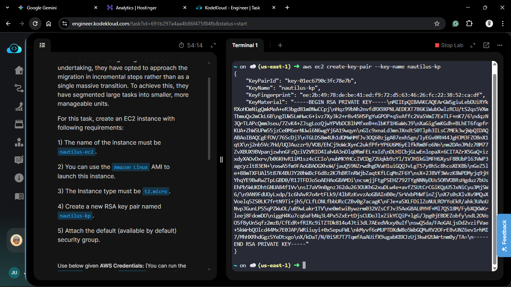

   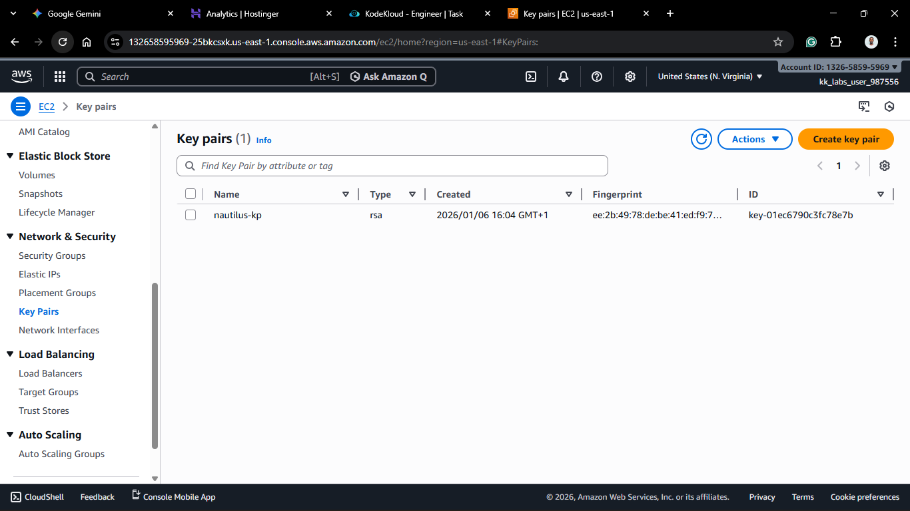

2. You need the **AMI-ID** for the region (e.g., `ami-068c0051b15cdb816` for US East N.Virginia). You can find it via the console or CLI.
3. Run the `run-instances` command:

   ```bash
   aws ec2 run-instances \
       --image-id ami-068c0051b15cdb816 \
       --instance-type t2.micro \
       --key-name nautilus-kp \
       --tag-specifications 'ResourceType=instance,Tags=[{Key=Name,Value=nautilus-ec2}]'
   ```

   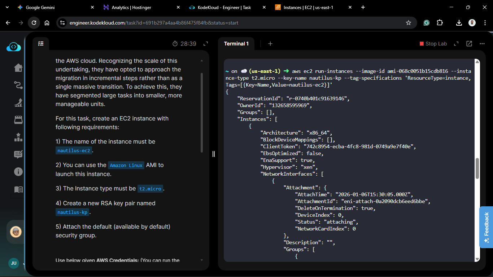

   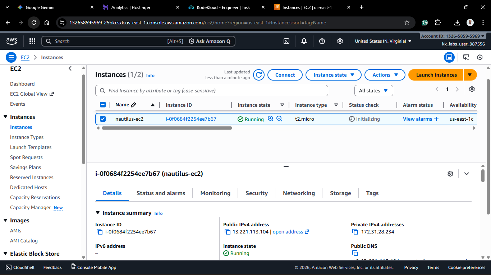

## Theory:

Launching an EC2 instance is often the first thing people do, but it doing correctly involves understanding the dependencies:

- **AMI:** The OS image that defines the software configuration of the instance.
- **Instance Type:** Defines the hardware of the host computer used for your instance.
- **Key Pair:** For secure SSH access.
- **Security Groups:** Virtual firewalls to control traffic.
- **VPC/Subnet:** Network configuration for the instance.
