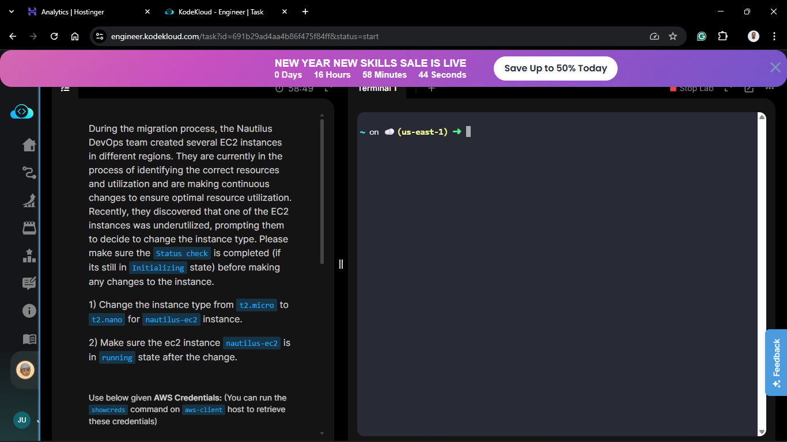
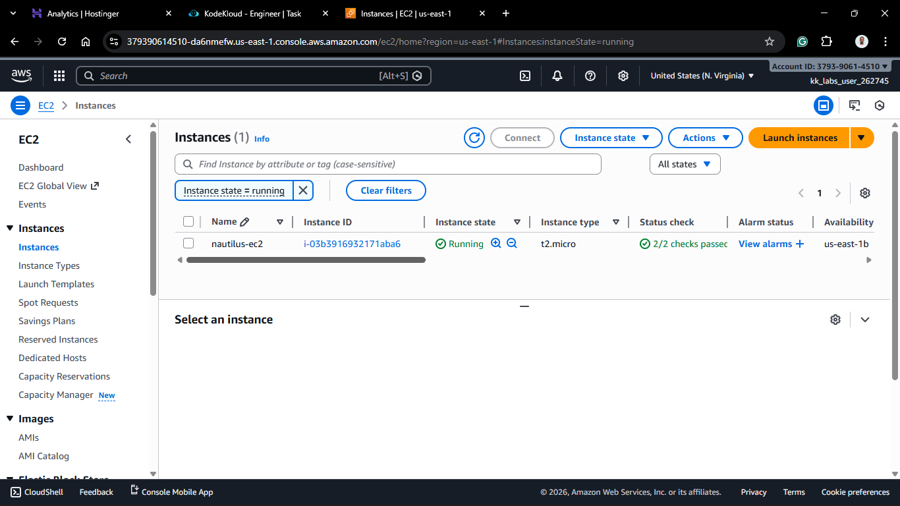
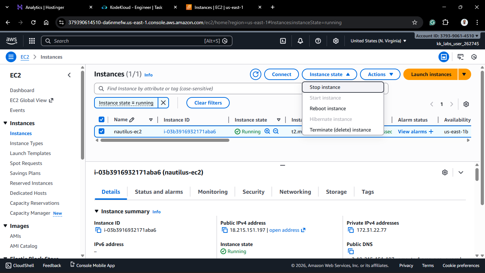
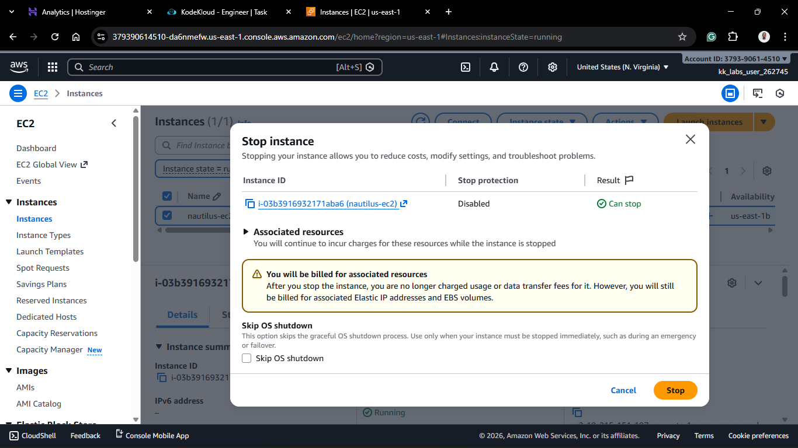
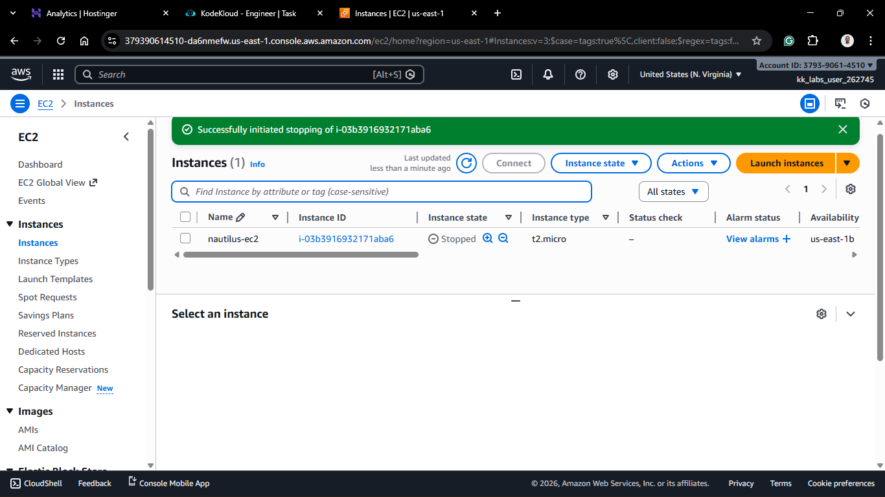
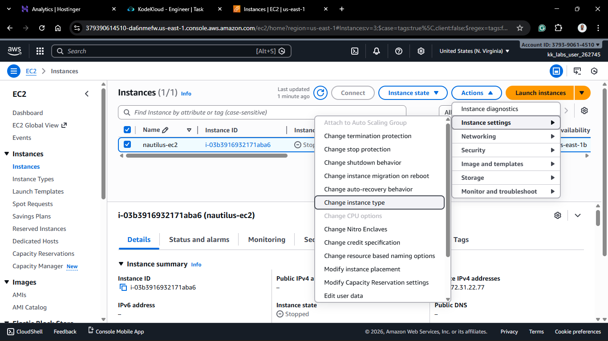
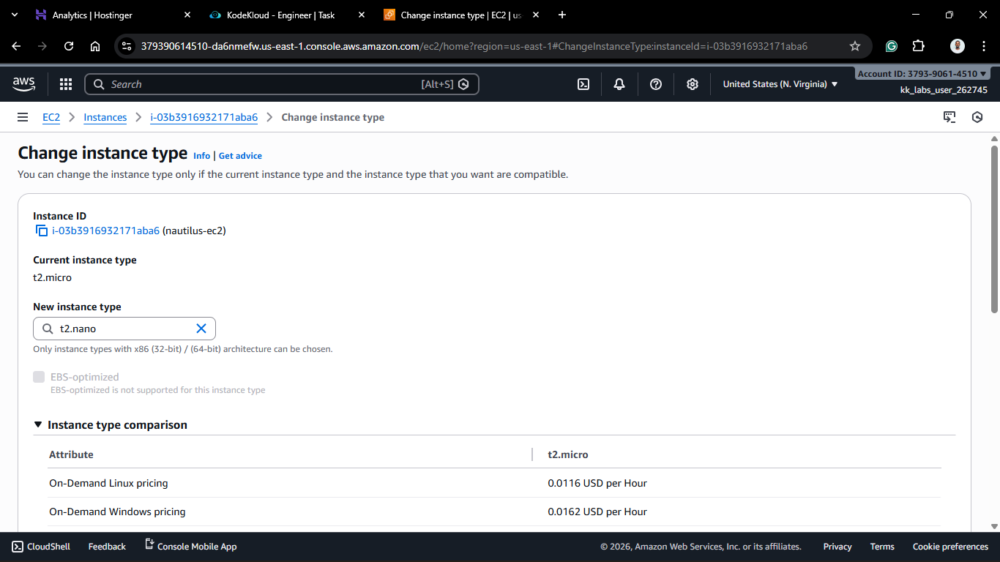
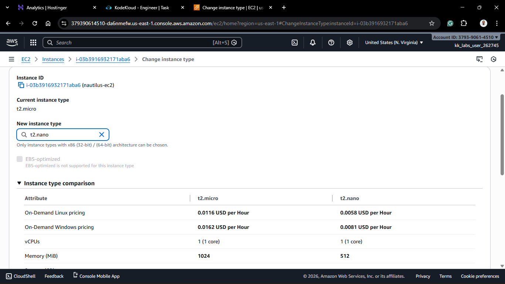
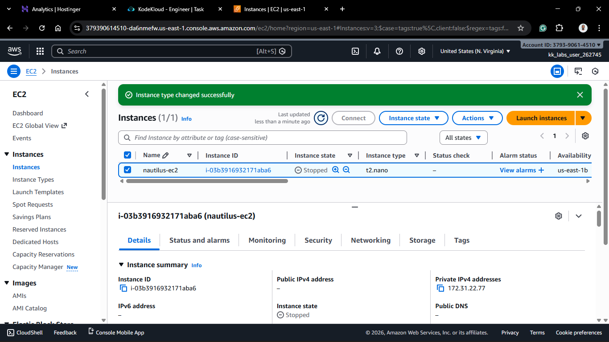
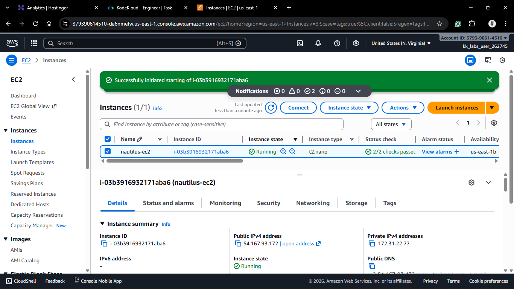

# Day 7: Change EC2 Instance Type (Right-Sizing)

## Project Description

Today's task involved **Right-Sizing** our infrastructure. In the real-world scenario (simulating the "Nautilus DevOps team"), we identified that our current EC2 instance running `t2.micro` was underutilized.
To optimize costs and resource utilization, the task was to scale it down to `t2.nano`.

**Objective:**

1. Identify the target instance (`nautilus-ec2`).
2. Change the instance type from `t2.micro` to `t2.nano`.
3. Ensure the instance is back in a **Running** state.

## Steps & Configuration

### Method: Using AWS Management Console

1. Log in to the [AWS Management Console](https://aws.amazon.com/console/).
2. Navigate to the **EC2 Dashboard**.
3. **Select the Instance:** Find `nautilus-ec2`.
   
4. **Stop the Instance:**
   - You cannot change the instance type while it is running.
   - Click **Instance State** > **Stop instance**.
   - _Wait for the instance state to change to `Stopped`._

5. **Change Instance Type:**
   - With the instance selected, click **Actions** > **Instance settings** > **Change instance type**.
   - From the dropdown, select **t2.nano**.
   - Click **Apply**.
     
     
     

6. **Start the Instance:**
   - Click **Instance State** > **Start instance**.
   - Verify that the instance returns to the `Running` state and the type is now listed as `t2.nano`.
     
     

## 🧠 Theory: Vertical Scaling

Changing the instance type is known as **Vertical Scaling**.

- **Scaling Up:** Increasing power (e.g., `t2.micro` -> `t2.medium`) for better performance.
- **Scaling Down:** Decreasing power (e.g., `t2.micro` -> `t2.nano`) for cost optimization.

**Important Note:** This process requires a brief period of downtime (Stop/Start), so it should always be performed during a maintenance window in production environments.
