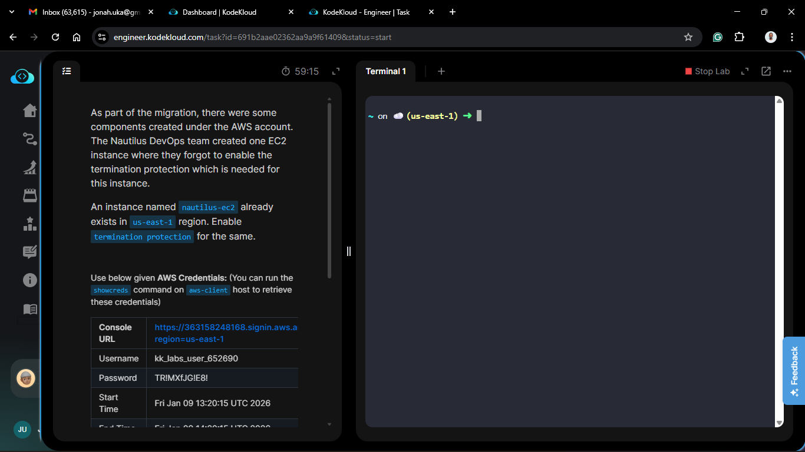
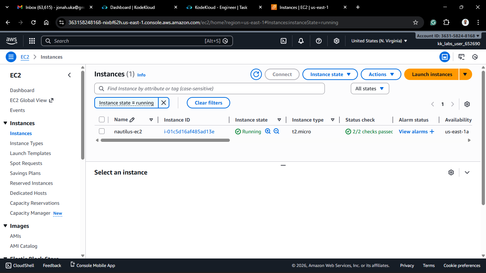
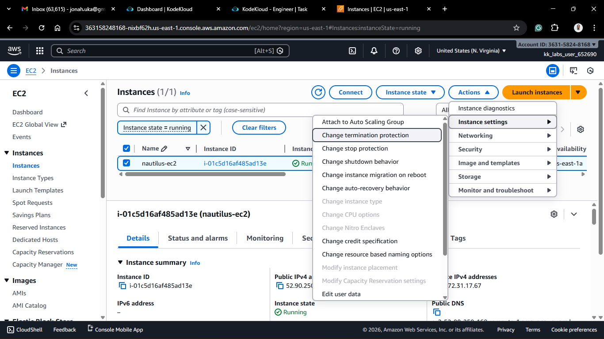
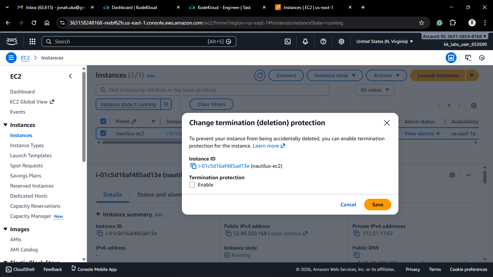
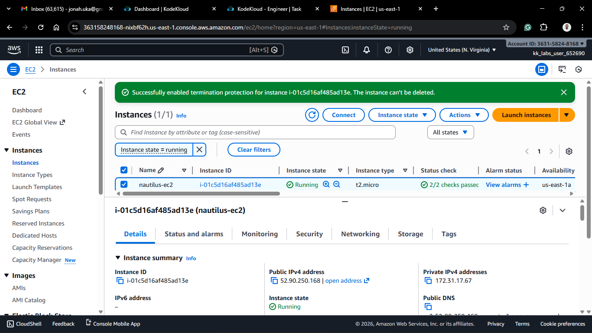
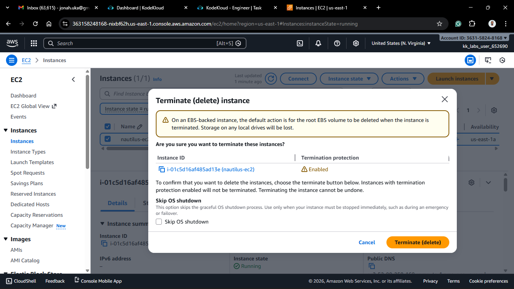
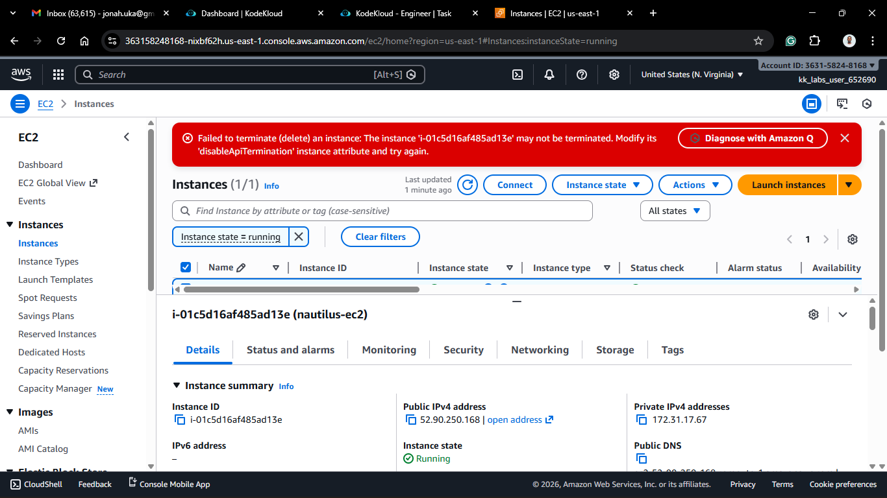

# Day 9 - Enable Termination Protection

## Project Description
Following yesterday's task of preventing accidental *shutdowns*, today's task focused on the ultimate safety measure: preventing accidental **deletion**. The scenario involved the same critical instance, `nautilus-ec2`, in the `us-east-1` region. To ensure its longevity during ongoing operations, I enabled **Termination Protection**.

**Why is this necessary?**

In AWS, "Terminating" an instance means **deleting** it. By default, if you click "Terminate," the instance and its local storage are wiped out immediately and permanently. There is no "Recycle Bin" or "Undo" button for a terminated EC2 instance. Termination Protection adds a mandatory confirmation step—you cannot delete the instance until you explicitly turn this setting off.

## Steps & Configuration

### Method: Using AWS Management Console
1. **Log in:** Access the [AWS Management Console](https://aws.amazon.com/console/) and navigate to the **EC2 Dashboard**.
2. **Select the Instance:** Choose the instance you want to protect (e.g., `nautilus-ec2`).
   
3. **Navigate to Settings:**
   - Click **Actions** at the top.
   - Hover over **Instance settings**.
   - Select **Change termination protection**.
  
  
4. **Enable Protection:**
   - Check the box for **Enable**.
   - Click **Save**.
  
  
*Verification: If you now try to Terminate this instance, AWS will alert you that the instance is protected.*

