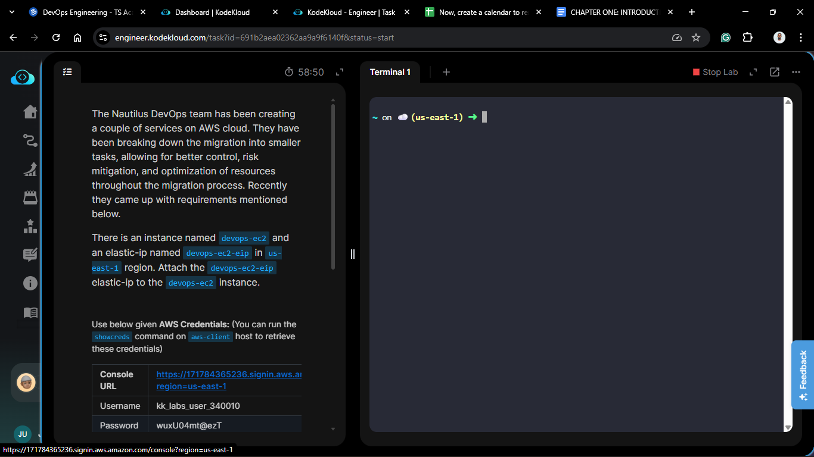
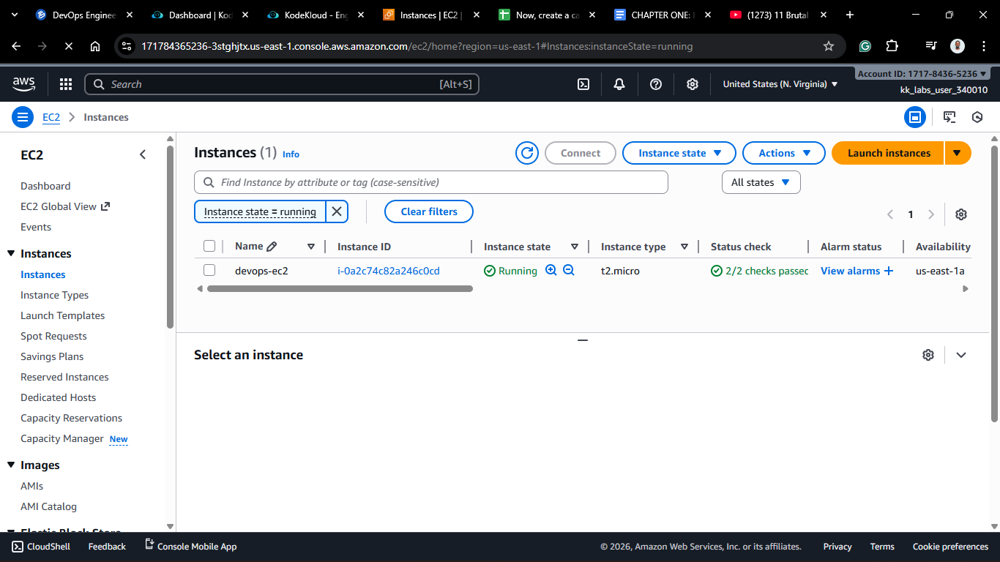
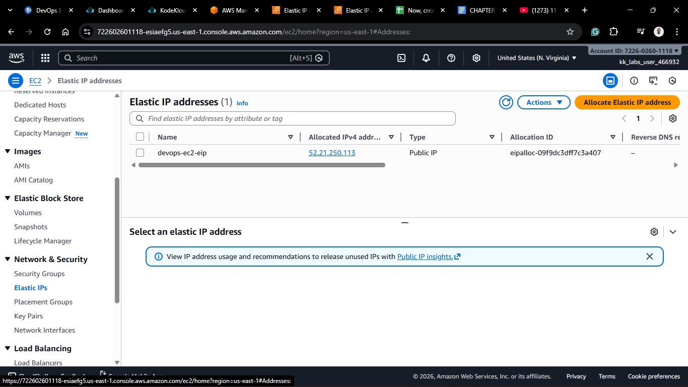
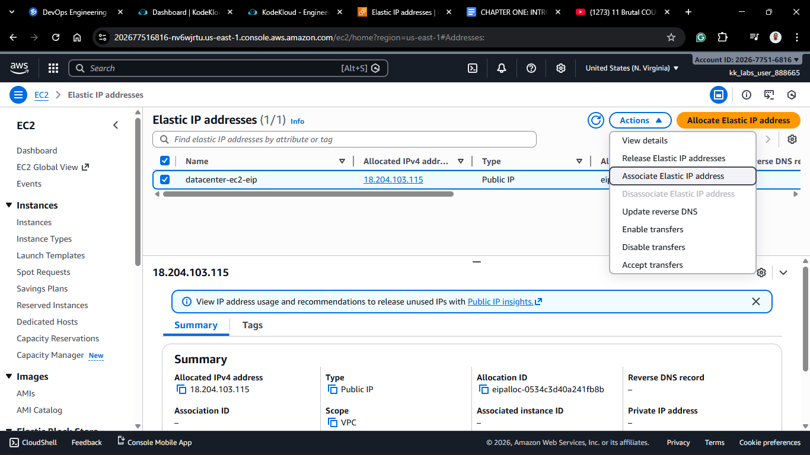
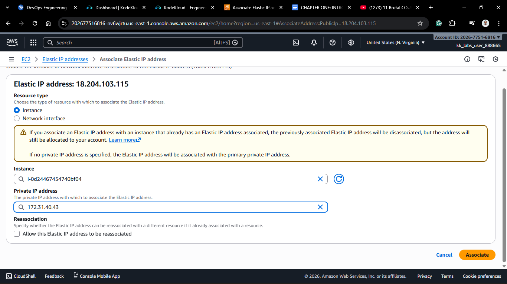
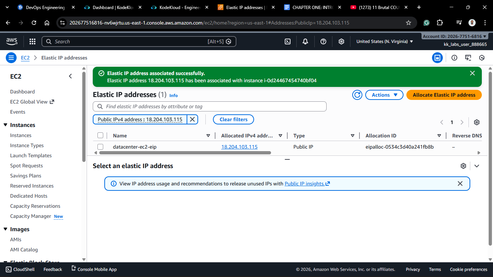

# Day 10: Attach Elastic IP to EC2 Instance

## Project Description

Today's task involved finalizing the network identity for our resources. In the Nautilus DevOps migration scenario, we have a server (`datacenter-ec2`) and a pre-allocated static IP (`datacenter-ec2-eip`).

The goal was to **Associate** the Elastic IP with the instance.

**Why is this necessary?**

By default, the `datacenter-ec2` instance has a dynamic public IP. If the team stops and starts this instance during the migration (which is common for maintenance), that IP would change, breaking any DNS records or scripts pointing to it. Attaching the Elastic IP gives it a permanent, static address.

## Steps & Configuration

### Method: Using AWS Management Console

1. **Log in:** Access the [AWS Management Console](https://aws.amazon.com/console/) and navigate to the **EC2 Dashboard**.
   
2. **Navigate to Elastic IPs:**
   - In the left sidebar, under **Network & Security**, click **Elastic IPs**.
     
3. **Select the EIP:**
   - Locate the Elastic IP named `datacenter-ec2-eip`.
   - Select the checkbox next to it.
4. **Associate:**
   - Click **Actions** in the top right corner.
   - Select **Associate Elastic IP address**.
     
5. **Configure Association:**

   - **Resource type:** Select **Instance**.
   - **Instance:** Click the search box and select `datacenter-ec2`.
   - **Private IP address:** (Optional) AWS will auto-select the private IP associated with the instance.
     

6. **Finalize:**
   - Click **Associate**.
     

_Verification: Navigate back to the "Instances" dashboard, select `datacenter-ec2`, and verify that the "Elastic IP addresses" field now displays the correct IP._

## 🧠 Theory: The Cost Reversal

On **Day 4**, we learned that an **idle** Elastic IP (allocated but not attached) costs money.
By performing today's task, we have actually **stopped the billing** for this IP (assuming the instance is running).

- **Unattached EIP:** Costs money (Hoarding penalty).
- **Attached EIP (to running instance):** Free (for the first one).

We solved a technical problem (static identity) and a financial problem (idle costs) in one move.
