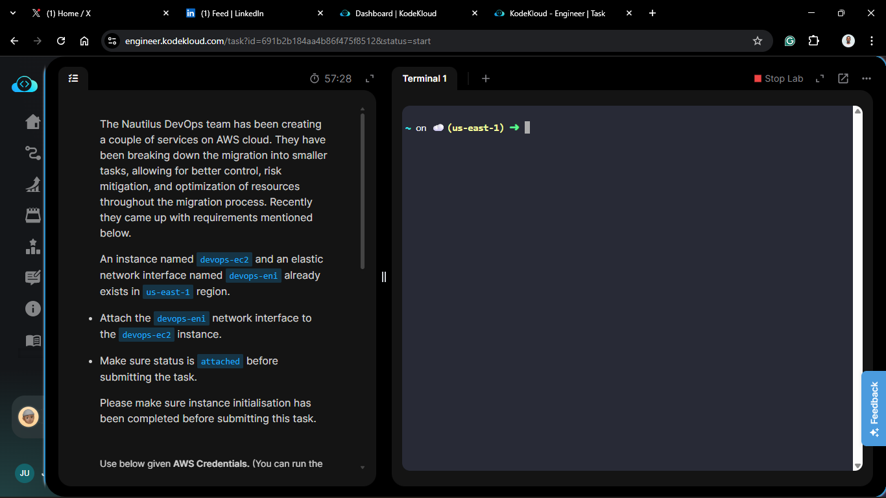
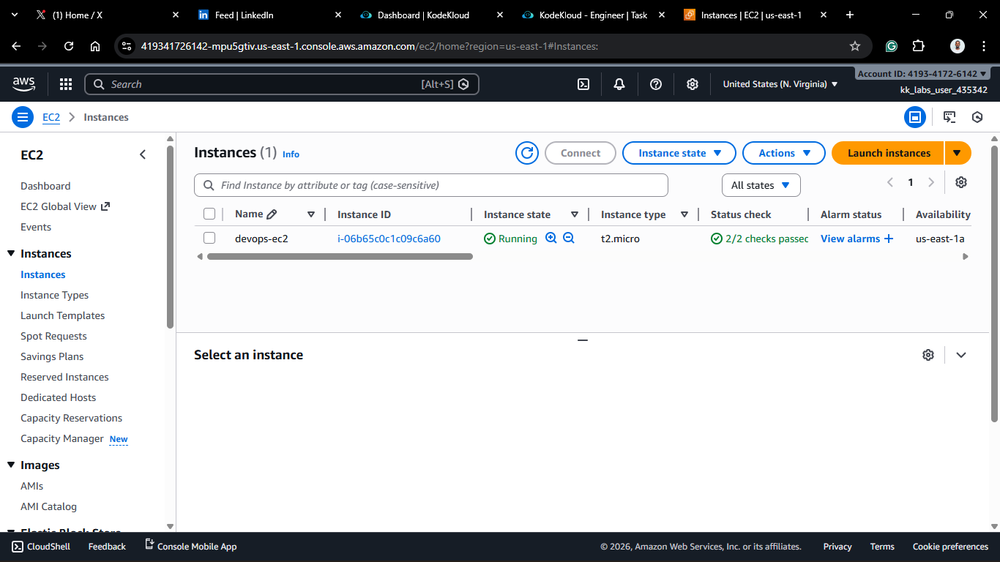
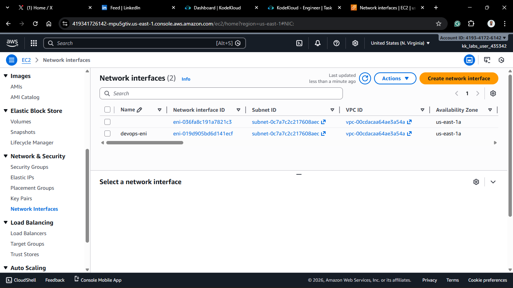
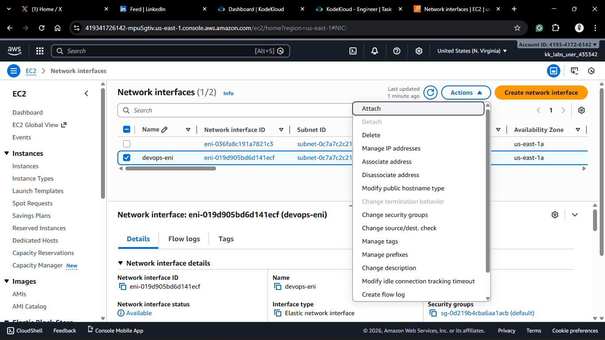
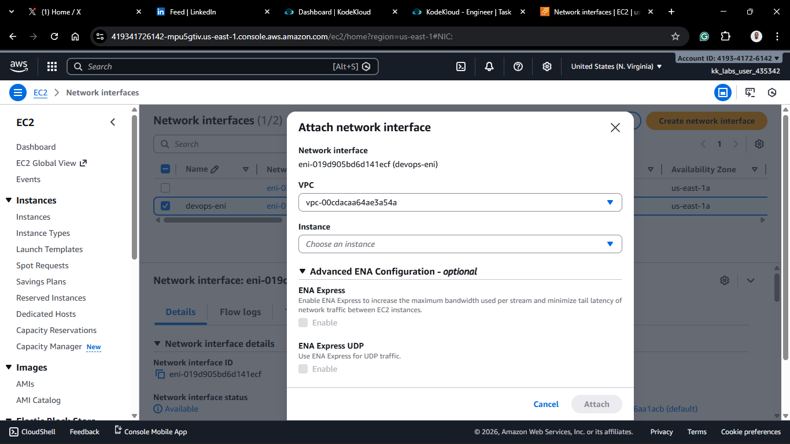
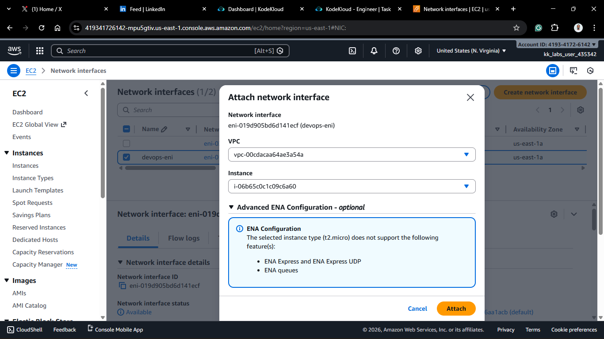
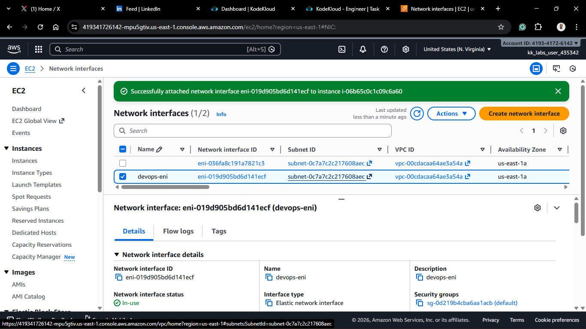
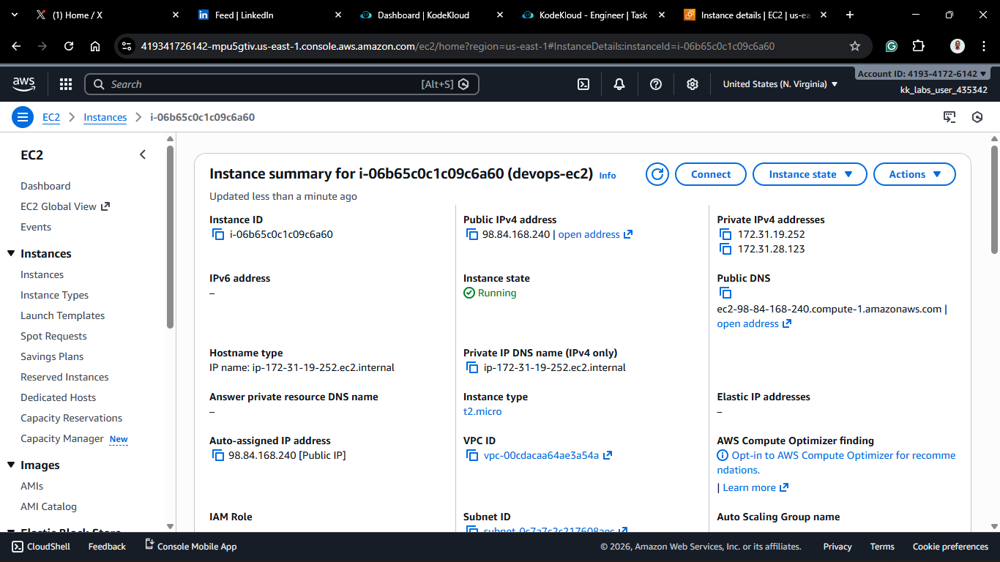
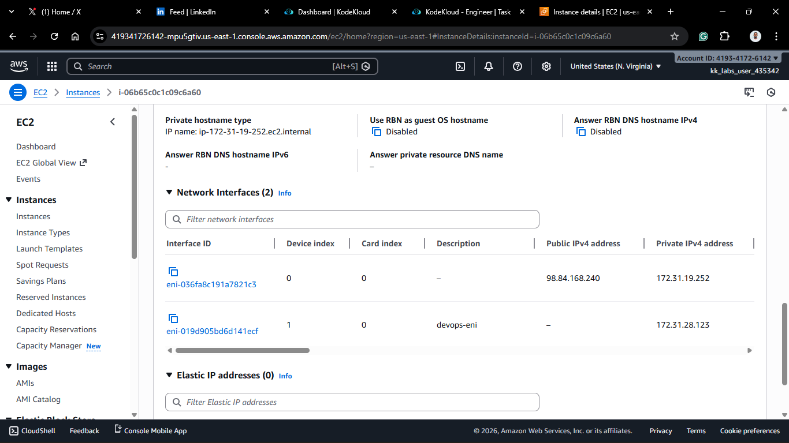

# Day 11: Attach Elastic Network Interface (ENI)

## Project Description

Today's task for the Nautilus DevOps team involved advanced networking configuration. I worked with **Elastic Network Interfaces (ENIs)**.

An ENI is essentially a **virtual network card**. By default, every EC2 instance comes with a primary ENI (eth0). However, you can create additional ENIs and attach them to instances to enable dual-homing or to separate management traffic from data traffic.

**The Task:**
Attach the pre-existing ENI (`devops-eni`) to the running instance (`devops-ec2`) in the `us-east-1` region.

## Steps & Configuration

### Method: Using AWS Management Console

1. **Log in:** Access the [AWS Management Console](https://aws.amazon.com/console/) and navigate to the **EC2 Dashboard**.
   

2. **Navigate to Network Interfaces:**

   - In the left sidebar, under **Network & Security**, click **Network Interfaces**.
     

3. **Select the ENI:**
   - Locate the network interface named `devops-eni`.
   - You will likely see its status is `Available` (meaning it is not currently attached to anything).
4. **Attach the ENI:**
   - With the ENI selected, click **Actions** > **Attach**.
     
5. **Configure Attachment:**
   - **Instance ID:** Search for and select `devops-ec2`.
   - Click **Attach**.
     
     
6. **Verification:**
   - Refresh the list. The status of `devops-eni` should change to **in-use**.
   - Navigate to the **Instances** page, select `devops-ec2`, and check the **Networking** tab. You should now see two Network Interfaces listed (the primary one and the new secondary one).
     
     
     

## 🧠 Theory: Why use a second ENI?

Why would you want two network cards in one server?

1.  **Traffic Segmentation:** Keep public web traffic on `eth0` and sensitive management/SSH traffic on `eth1` (on a private subnet).
2.  **Dual-Homing:** Connect a single instance to two different subnets for redundancy or specific routing needs.
3.  **Licensing:** Some software licenses are tied to a specific MAC address. An ENI allows you to move that MAC address (and the license) to a new server if the old one dies.
