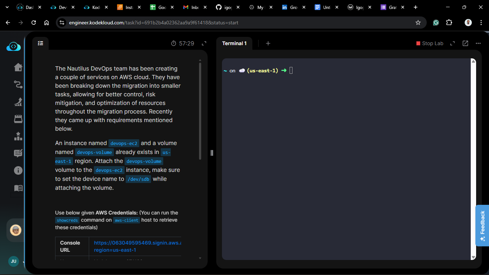
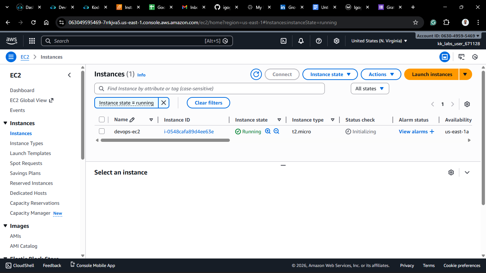
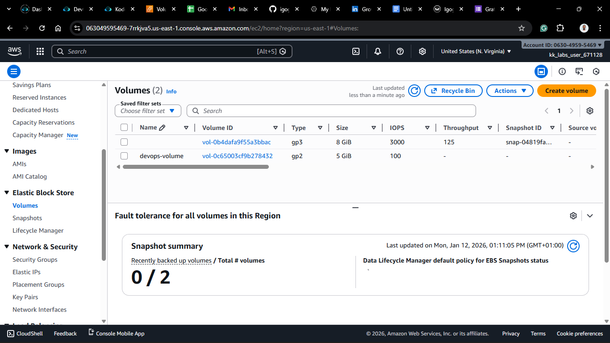
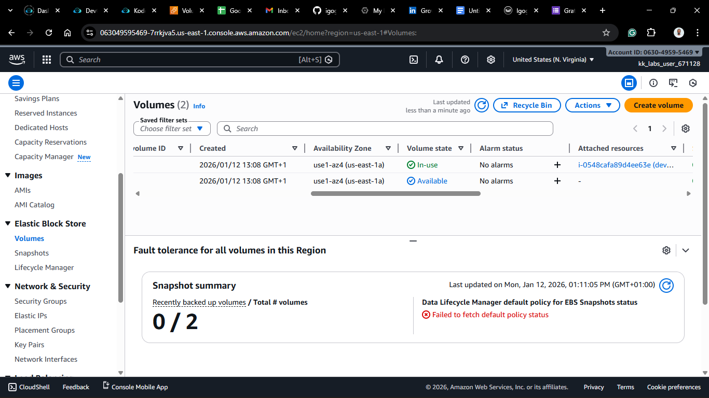
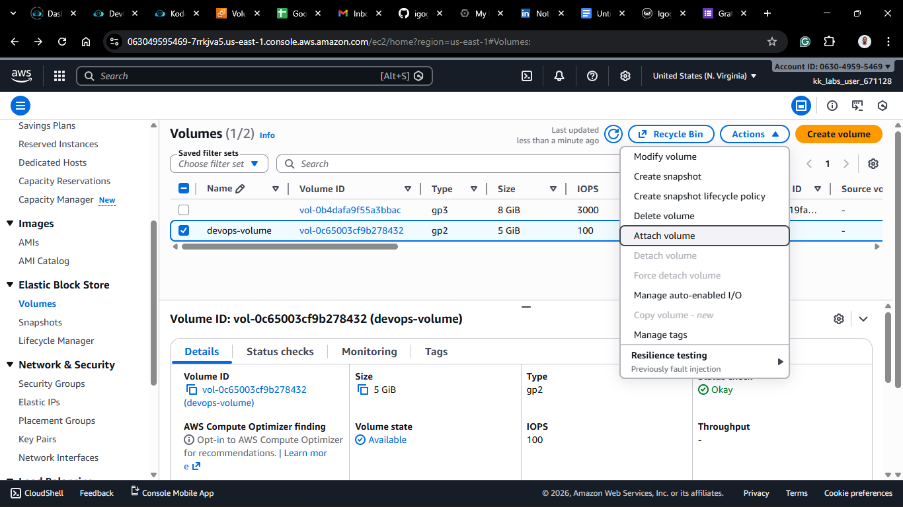
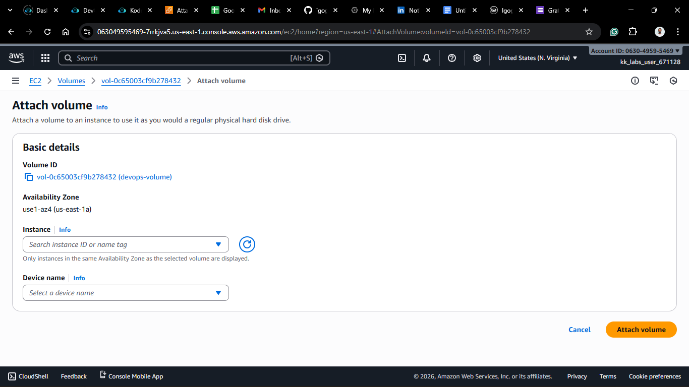
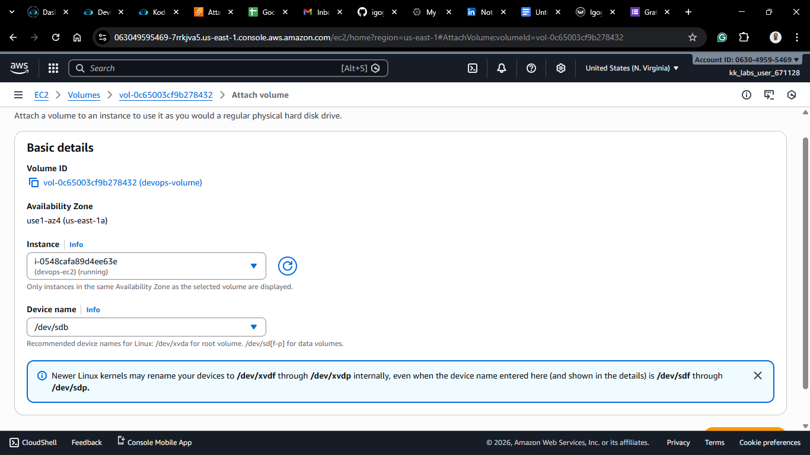
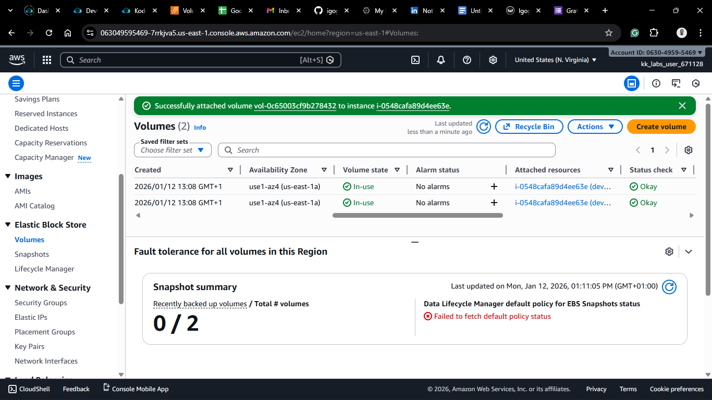
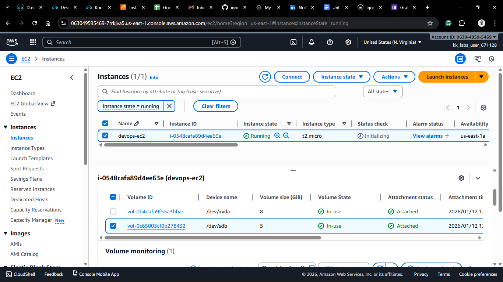

# Day 12: Attach Volume to EC2 Instance

## Project Description

Today's task for the Nautilus DevOps team involved storage management. I worked on attaching an existing **Elastic Block Store (EBS)** volume to a running instance.

**The Scenario**
We have a server (`devops-ec2`) and a separate storage volume (`devops-volume`) in the `us-east-1` region. The goal was to attach the volume to the instance using a specific device name: `/dev/sdb`.

This acts exactly like plugging an external hard drive into a computer while it's running.

## Steps & Configuration

### Method: Using AWS Management Console

1. **Log in:** Access the [AWS Management Console](https://aws.amazon.com/console/) and navigate to the **EC2 Dashboard**.
   
2. **Navigate to Volumes:**

   - In the left sidebar, under **Elastic Block Store**, click **Volumes**.
     

3. **Select the Volume:**

   - Locate the volume named `devops-volume`.
   - Ensure its state is `Available` (meaning it's not currently attached to another instance).
     _Note: The volume and the instance MUST be in the same Availability Zone (e.g., us-east-1a). You cannot attach a volume from 1a to an instance in 1b._
     

4. **Attach Volume:**

   - Select the volume, click **Actions**, and choose **Attach volume**.
     

5. **Configure Attachment:**

   - **Instance:** Search for and select `devops-ec2`.
   - **Device name:** The task requires a specific device name. Manually enter `/dev/sdb` in the field.
     
     

6. **Finalize:**

   - Click **Attach volume**.

7. **Verification:**
   - The volume state should change to `In-use`.
     
     

## 🧠 Theory: Device Naming & Mounting

Although we specified `/dev/sdb` in the AWS Console, the operating system (Linux) might see it differently depending on the virtualization type:

- On older instances, it appears as `/dev/sdb`.
- On newer Nitro-based instances, Linux may rename it to `/dev/xvdb` or `/dev/nvme1n1`.

**Important:** Just "attaching" the volume is like plugging in a USB drive. To actually use it to store files, you typically still need to log into the Linux terminal, create a file system (format it), and **mount** it to a directory.
