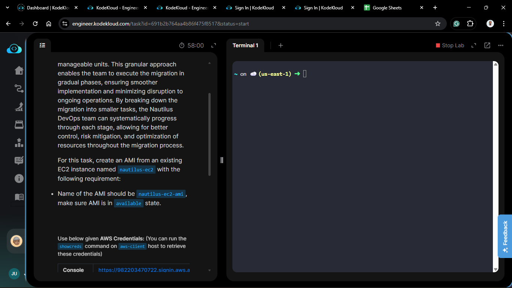
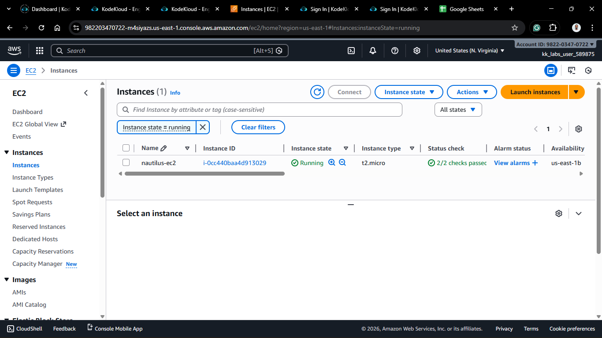
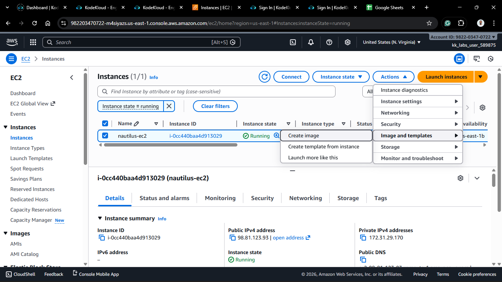
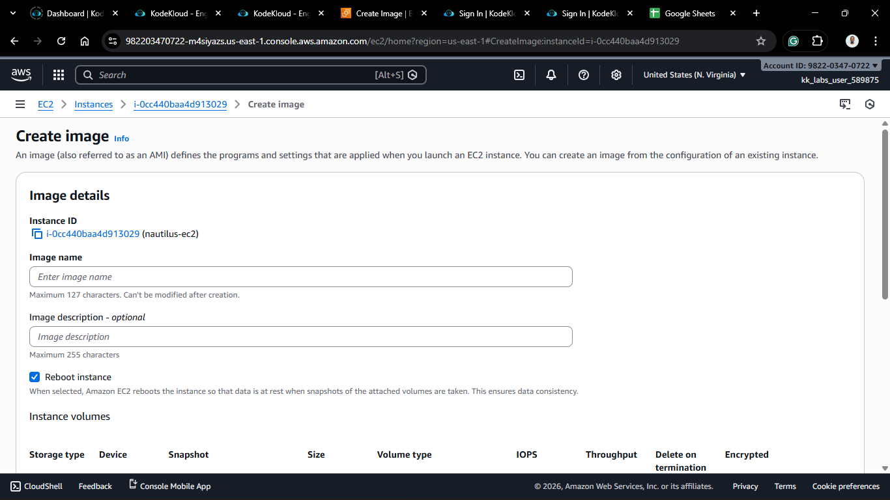
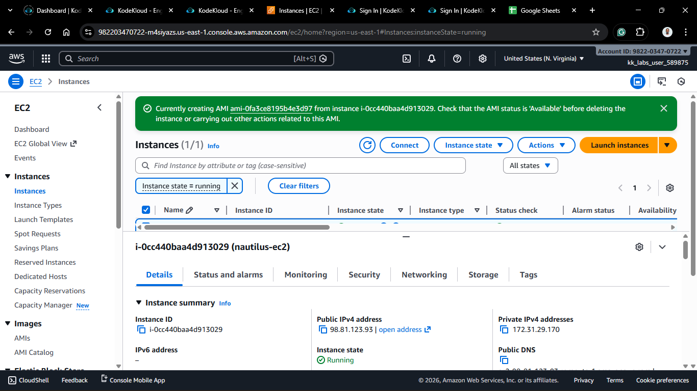
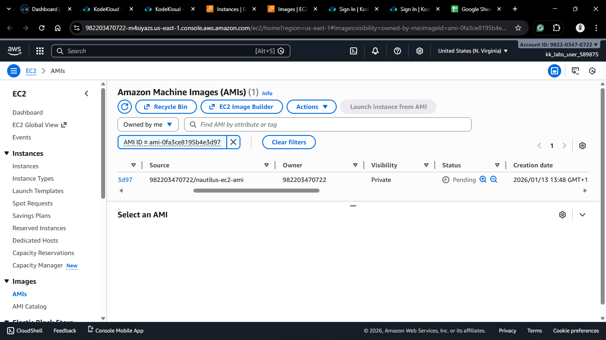

# Day 13: Create AMI from EC2 Instance

## Project Description

Today's task for the Nautilus DevOps team involved preserving the state of our infrastructure. I created an **Amazon Machine Image (AMI)** from an existing EC2 instance.

**The Scenario**

We have a configured server (`nautilus-ec2`). Instead of manually setting up a new server from scratch every time we need to scale or migrate, we capture the current state of this server into an image (`nautilus-ec2-ami`).

**What is an AMI?**

An AMI is a template that contains the software configuration (operating system, application server, and applications) required to launch your instance. It effectively allows you to "clone" your server.

## Steps & Configuration

### Method: Using AWS Management Console

1. **Log in:** Access the [AWS Management Console](https://aws.amazon.com/console/) and navigate to the **EC2 Dashboard**.
2. **Select the Instance:**
   - Locate the instance named `nautilus-ec2`.
  

3. **Create Image:**
   - Select the instance.
   - Click **Actions** > **Image and templates** > **Create image**.
  

4. **Configure Image Details:**
   - **Image name:** `nautilus-ec2-ami` (Strictly required by the task).
   - **Reboot:** *Checked* (Default).
     * *Note: By default, AWS stops the instance, takes the snapshot, and restarts it to ensure data consistency.*
  

1. **Create:**
   - Click **Create image**.
2. **Verification:**
   - Navigate to **AMIs** in the left sidebar (under **Images**).
   - Search for `nautilus-ec2-ami`.
   - Wait for the **Status** to change from `pending` to `available`.
  
  

## 🧠 Theory: "Golden Images"
In DevOps, this practice is often called creating a "Golden Image."
Instead of installing software on a generic Linux server every time it boots (which takes time), you install everything once, create an AMI, and then launch new instances *using* that AMI. This dramatically reduces boot time and configuration drift.   

