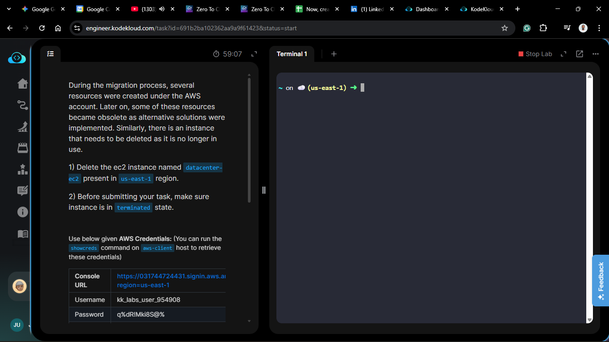
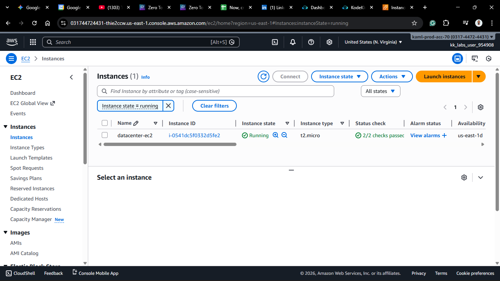
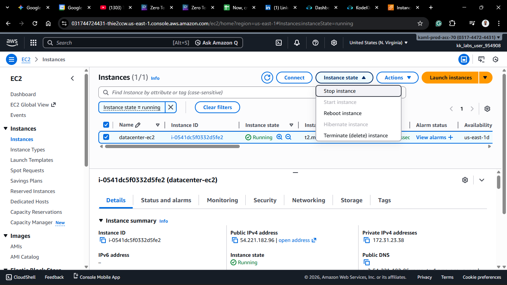
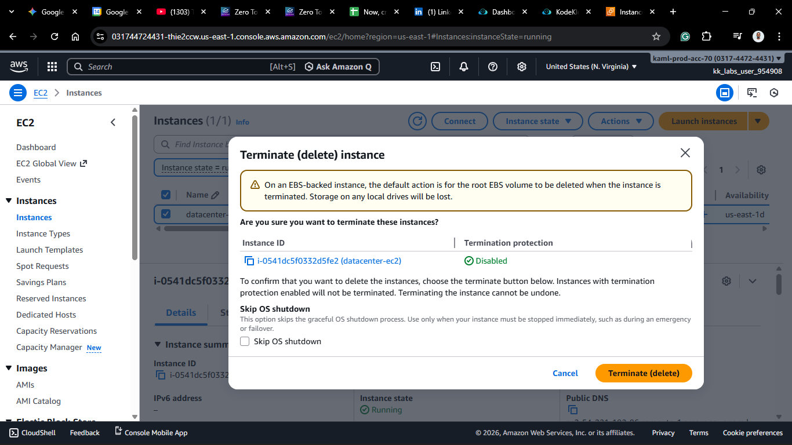
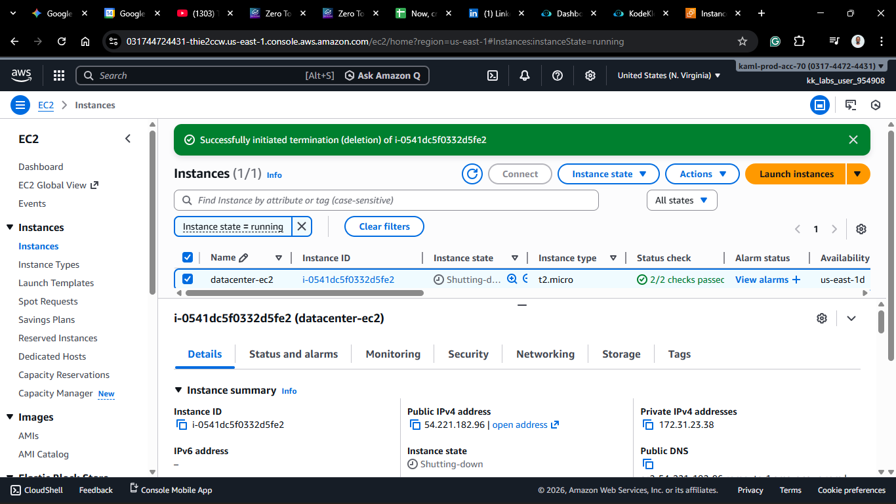
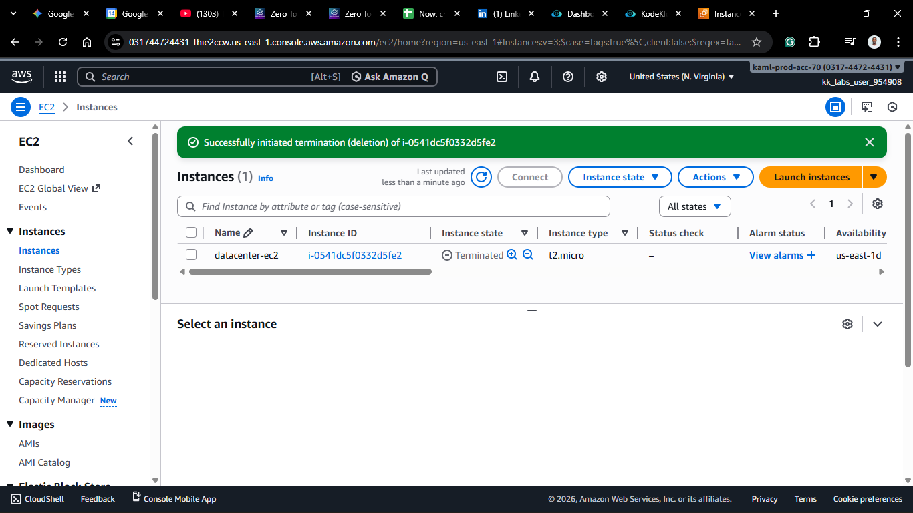

# Day 14: Terminate EC2 Instance

## Project Description

Today's task for the Nautilus DevOps team was a cleanup operation. As part of the migration process, certain resources became obsolete. Specifically, an EC2 instance named `datacenter-ec2` in the `us-east-1` region was identified as no longer needed.

**The Task:**

Permanently delete (terminate) the `datacenter-ec2` instance to stop billing and declutter the environment.

**What happens during Termination?**

When you terminate an instance:

1.  The virtual machine is shut down and deleted.
2.  Any data on the instance store (ephemeral storage) is lost.
3.  By default, the attached EBS root volume is also deleted (unless configured otherwise).
4.  You stop paying for the compute hours immediately.

## Steps & Configuration

### Method: Using AWS Management Console

1. **Log in:** Access the [AWS Management Console](https://aws.amazon.com/console/) and navigate to the **EC2 Dashboard**.
   

2. **Identify the Instance:**
   - Locate the instance named `datacenter-ec2` in the `us-east-1` region.
   - _Tip: Double-check the Instance ID to ensure you are selecting the correct server!_
3. **Terminate:**

   - Select the instance checkbox.
   - Click **Instance State** > **Terminate instance**.
     

4. **Confirm:**

   - AWS will show a warning popup: _"On an EBS-backed instance, the default action is for the root EBS volume to be deleted when the instance is terminated."_
   - Click **Terminate** to confirm.
     

5. **Verification:**
   - The instance state will change to `Shutting-down` and eventually to `Terminated`.
   - _Note: Terminated instances may remain visible in the console for a short period (usually <1 hour) before disappearing completely._
     
     

## 🧠 Theory: Instance Lifecycle

Understanding the lifecycle is key:

- **Pending:** Booting up.
- **Running:** Active and billable.
- **Shutting down:** In the process of powering down.
- **Stopped:** Powered down but persistent (you still pay for EBS storage).
- **Terminated:** Permanently deleted (you pay for nothing).

**Cleanup is part of the job.** Leaving unused instances running ("Zombie Servers") is one of the biggest sources of wasted cloud spend.
