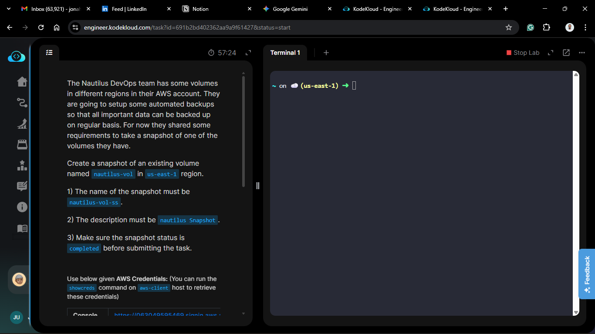
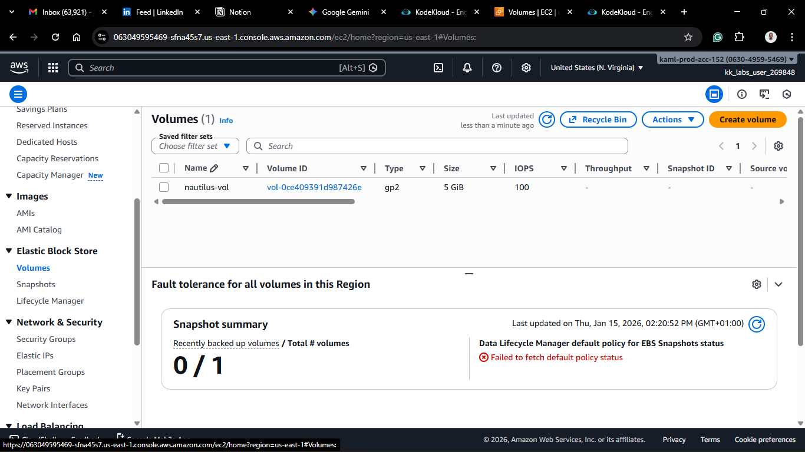
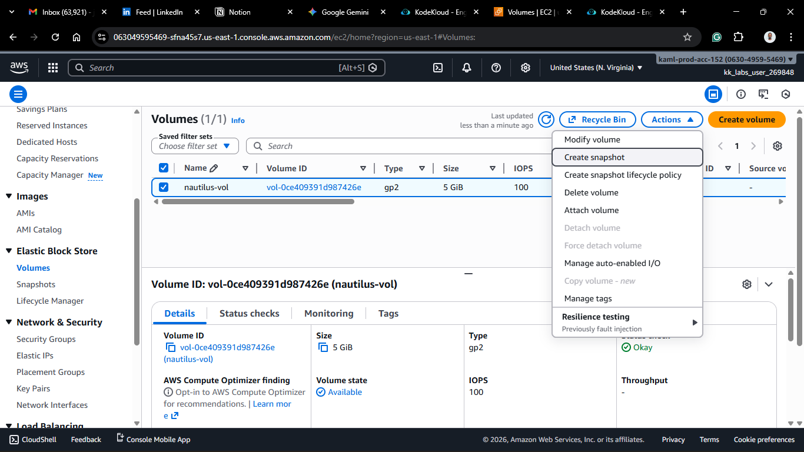
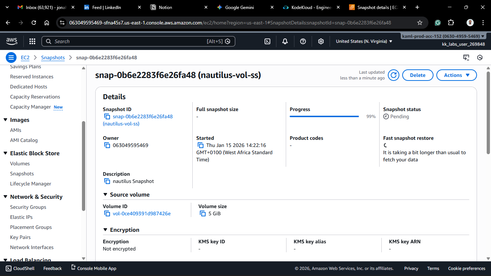
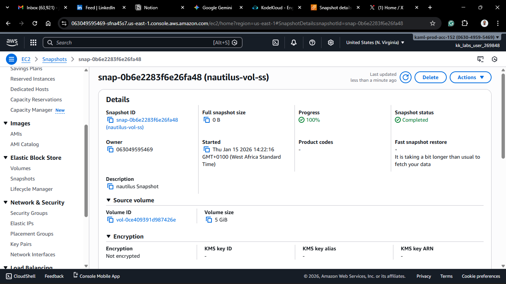

# Day 15: Create Volume Snapshot

## Project Description

Today's task for the Nautilus DevOps team focused on **Disaster Recovery (DR)**.
I created a manual backup of a specific EBS volume (`nautilus-vol`) by taking a **Snapshot**.

**What is a Snapshot?**
An EBS Snapshot is a point-in-time copy of your data.

- They are **incremental**: The first snapshot copies all data. Subsequent snapshots only copy the blocks that have changed since the last one. This saves storage costs and speeds up backup time.
- They are stored in **Amazon S3** (managed by AWS, so you don't see the bucket directly), making them highly durable.

## Steps & Configuration

### Method: Using AWS Management Console

1. **Log in:** Access the [AWS Management Console](https://aws.amazon.com/console/) and navigate to the **EC2 Dashboard**.
   
2. **Navigate to Volumes:**
   - Under **Elastic Block Store** in the left sidebar, click **Volumes**.
3. **Select the Target:**

   - Find the volume named `nautilus-vol` in the `us-east-1` region.
   - Select the checkbox next to it.

4. **Create Snapshot:**

   - Click **Actions** > **Create snapshot**.
     

5. **Configure Details:**
   - **Description:** `nautilus Snapshot` (Strict requirement).
   - **Tags:**
     - Key: `Name`
     - Value: `nautilus-vol-ss` (Strict requirement).
6. **Execute:**

   - Click **Create snapshot**.
     

7. **Verification:**
   - Navigate to **Snapshots** (under Elastic Block Store in the sidebar).
   - Search for `nautilus-vol-ss`.
   - Wait for the **Status** to change from `pending` to `completed`.
     

## 🧠 Theory: Snapshot Consistency

While you can take a snapshot of a running instance, it is best practice to stop the instance (or unmount the volume) first. This ensures **Application Consistency**—meaning no data is stuck in the RAM buffer waiting to be written to the disk when the snapshot is taken.
