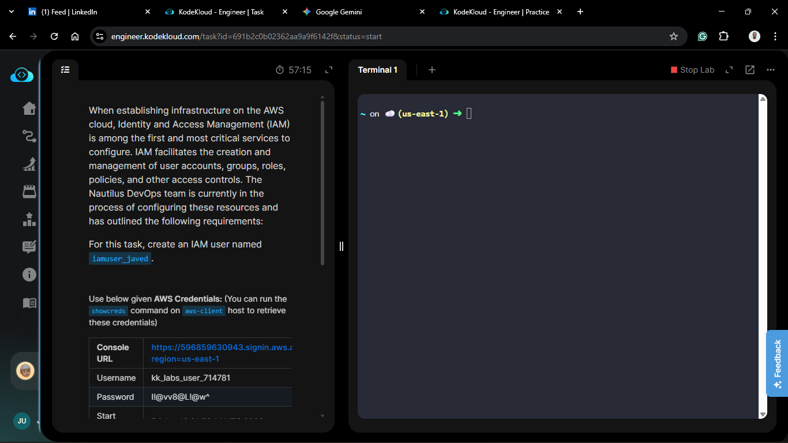
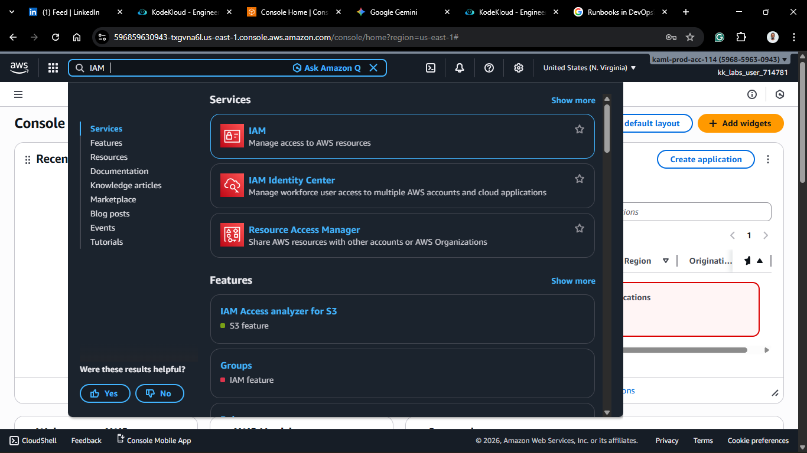
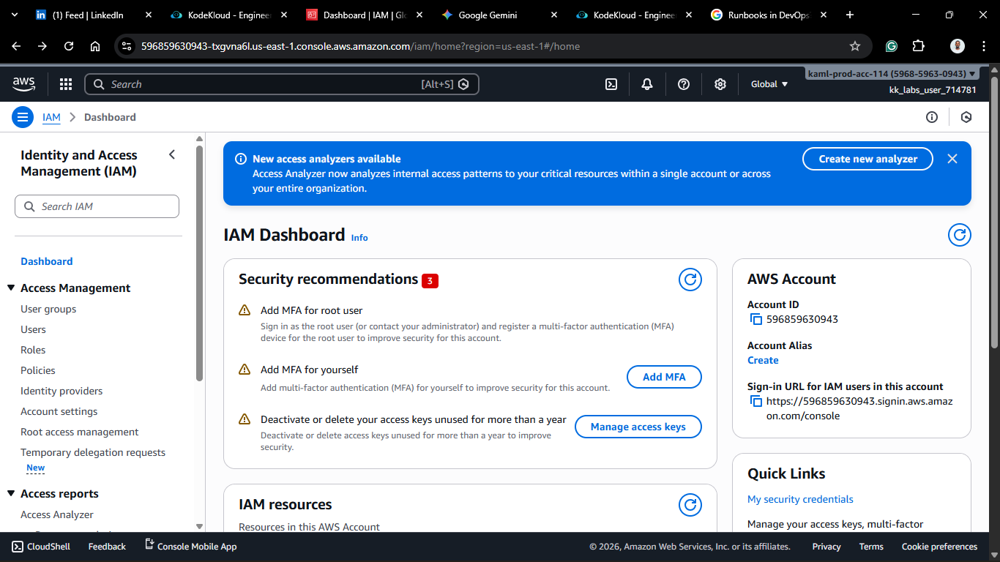
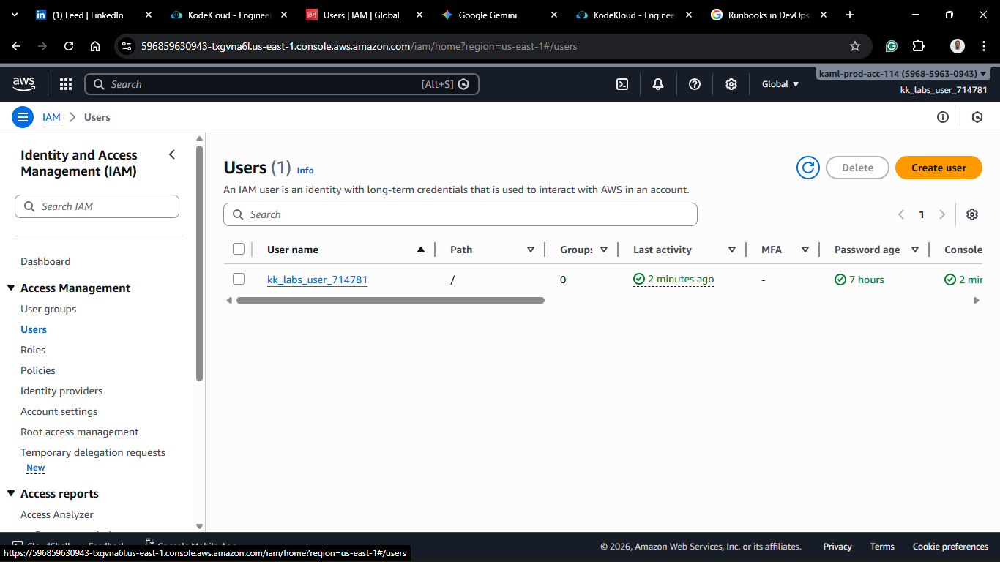
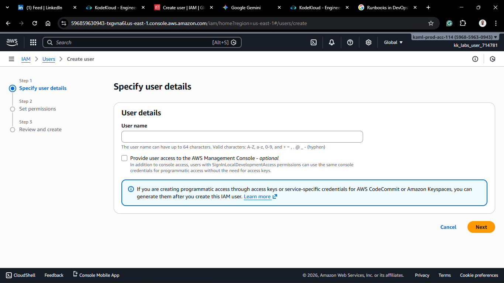
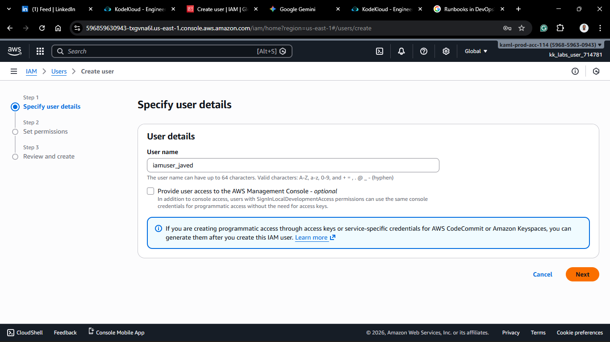
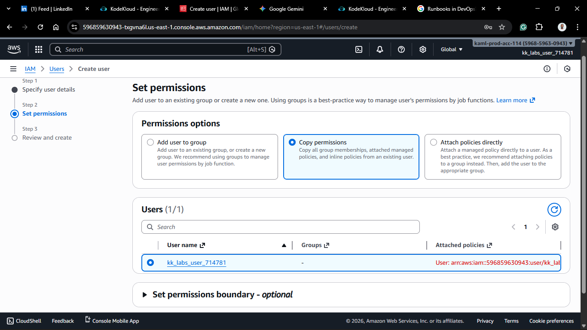
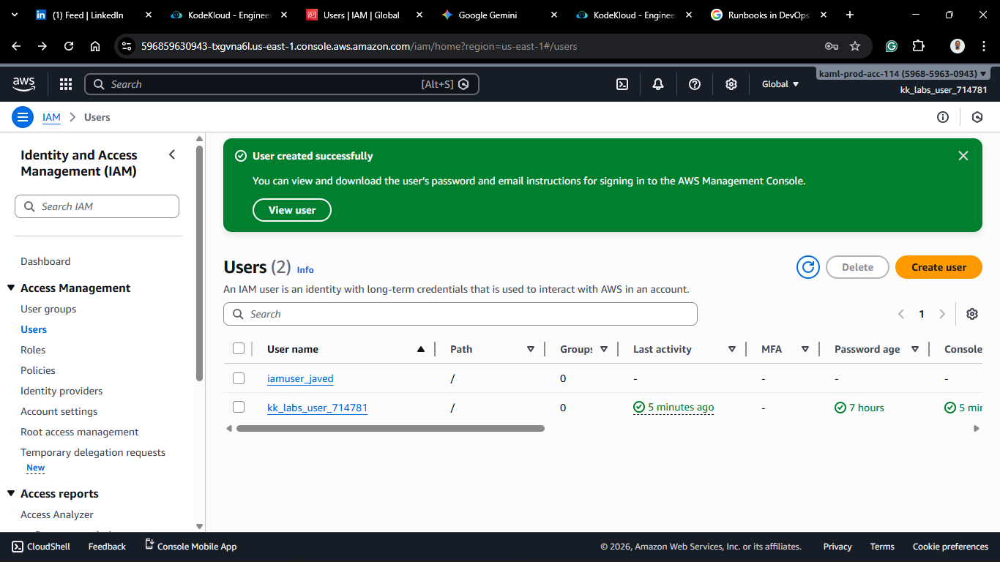

# Day 16: Create IAM User

## Project Description

Today's task for the Nautilus DevOps team focused on **Identity and Access Management (IAM)**. As we begin to onboard more team members to the cloud environment, we need to move away from using the root account and establish individual identities.

**The Task:**

Create a new IAM user named `iamuser_javed` to facilitate granular access control.

**What is an IAM User?**

An IAM user is an entity that you create in AWS to represent the person or application that uses it to interact with AWS. A user in AWS consists of a name and credentials (password or access keys).

## Steps & Configuration

### Method: Using AWS Management Console

1. **Log in:** Access the [AWS Management Console](https://aws.amazon.com/console/) and navigate to the **IAM Dashboard**.

2. **Navigate to Users:**
   - In the left navigation pane, select **Users**.
   - Click **Create user**.

3. **User Details:**
   - **User name:** `iamuser_javed` (Strict requirement).
   - **Provide user access to the AWS Management Console:**
     - Select this if the user needs to log in via the browser.
     - _Note: For this task, unless specified, you can leave it unchecked if only programmatic access is needed, or check it to set a password._
  
  

4. **Set Permissions:**
   - You have three options:
     1. Add user to group (Best Practice).
     2. Copy permissions from existing user.
     3. Attach policies directly.
   - _For this specific task, no permissions were explicitly requested, so we can proceed without attaching a policy, or attach `ReadOnlyAccess` for safety._
  
5. **Review and Create:**
   - Review the details.
   - Click **Create user**.
6. **Retrieve Credentials:**
   - If you generated a password or access keys, download the `.csv` file immediately. You cannot view the Secret Access Key again later.
  

## 🧠 Theory

### The Root Account vs. IAM Users

The "Root Account" is the email address you used to sign up for AWS. It has unlimited power.

**Best Practice:** Lock away the root credentials and never use them for daily tasks. Instead, create an IAM Admin user for yourself and specific IAM users for your team members like `iamuser_javed`.

