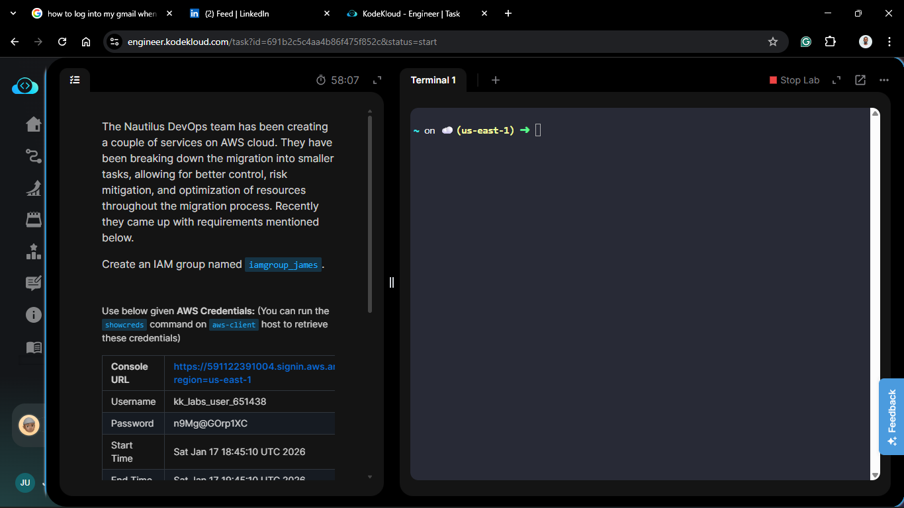
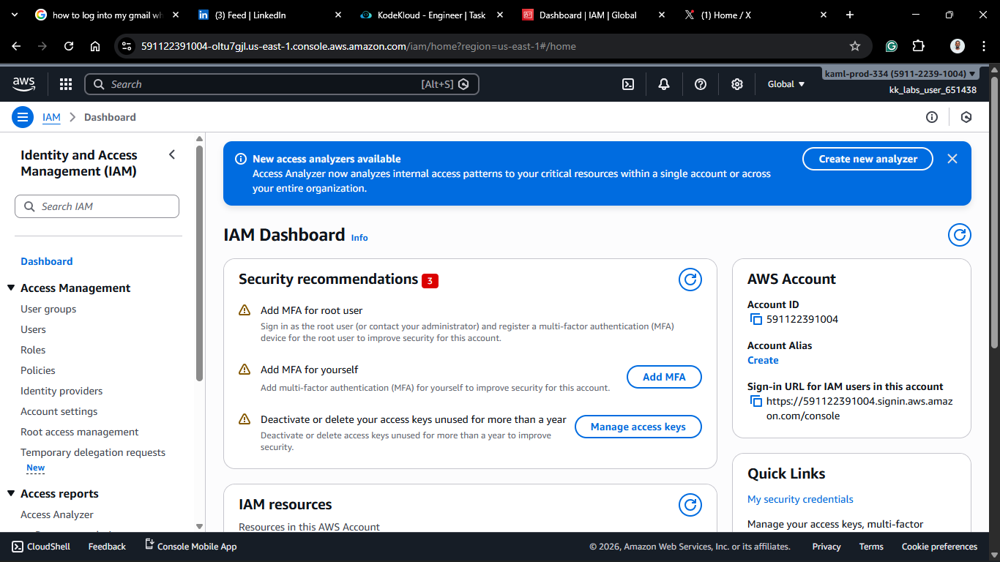
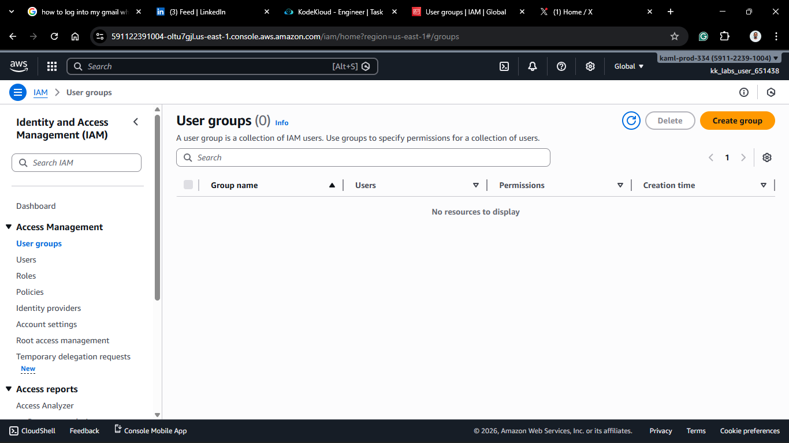
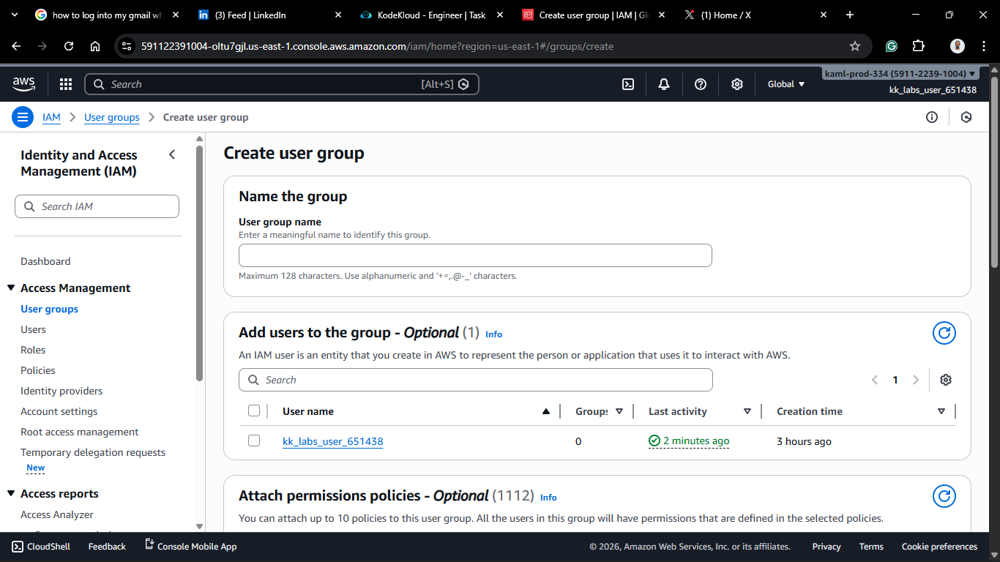
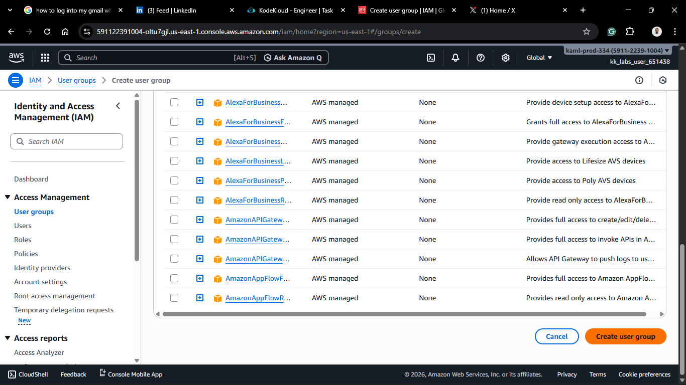
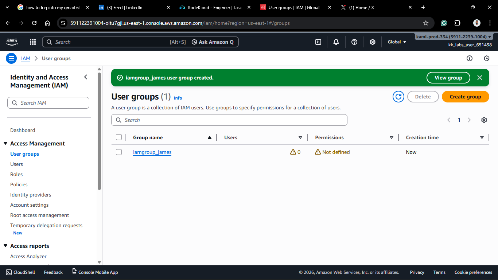

# Day 17: Create IAM Group

## Project Description

Today's task for the Nautilus DevOps team involved optimizing access management. Following the creation of individual users yesterday, the next logical step was to create an **IAM Group**.

**The Task:**
Create an IAM group named `iamgroup_james`.

**Why use IAM Groups?**

Managing permissions for every single user individually is a nightmare. If you have 50 developers, and you need to grant them all access to S3, you don't want to attach the policy 50 times.
Instead, you create a "Developers" group, attach the policy _once_ to the group, and simply add the users to that group. It is the implementation of the **DRY (Don't Repeat Yourself)** principle for security.

## Steps & Configuration

### Method: Using AWS Management Console

1. **Log in:** Access the [AWS Management Console](https://aws.amazon.com/console/) and navigate to the **IAM Dashboard**.
   

2. **Navigate to User Groups:**
   - In the left navigation pane, select **User groups**.
   - Click **Create group**.
     

3. **Group Details:**
   - **User group name:** `iamgroup_james` (Strict requirement).
     
4. **Add Users (Optional):**
   - You can add users (like `iamuser_javed` from yesterday) to this group immediately, but the task didn't strictly require it.
5. **Attach Permissions (Optional):**
   - You can attach policies (e.g., `AmazonEC2FullAccess`) to the group here.
   - _Note: Any user added to this group will automatically inherit these permissions._
     
     
6. **Create:**
   - Click **Create group**.

## 🧠 Theory: Scalable Permission Management

**Best Practice:**

1. Create Policies (The Rules).

2. Attach Policies to Groups (The Job Functions).

3. Add Users to Groups (The People).

Avoid attaching policies directly to users ("Inline Policies") whenever possible. It makes auditing and updating permissions much harder as your team grows.
