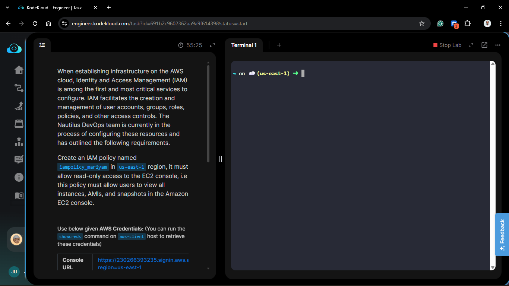
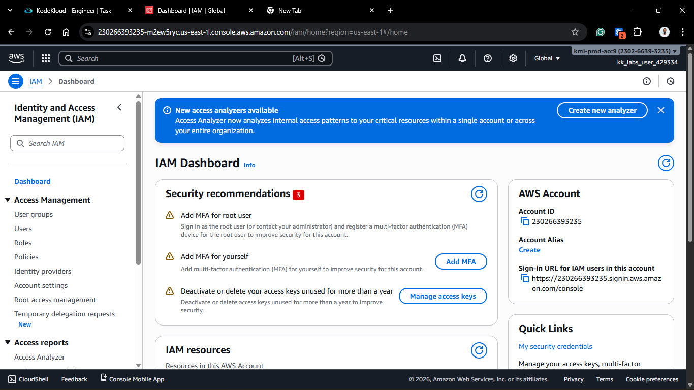
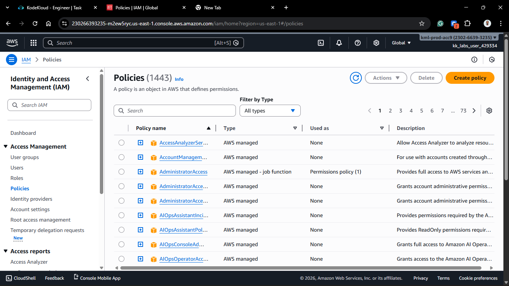
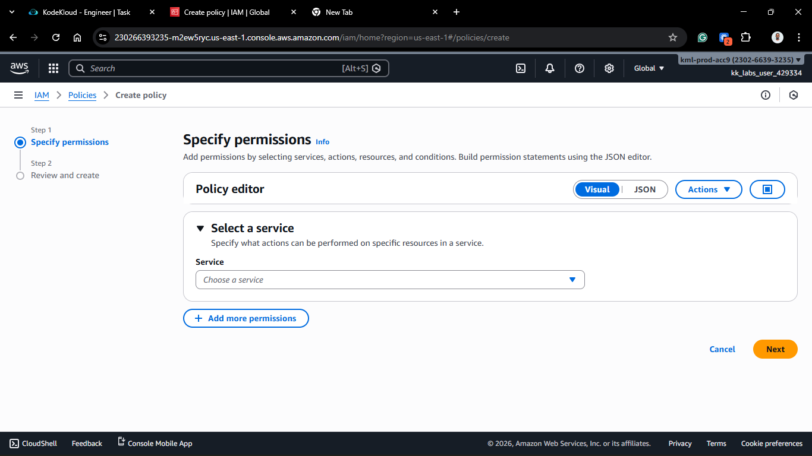
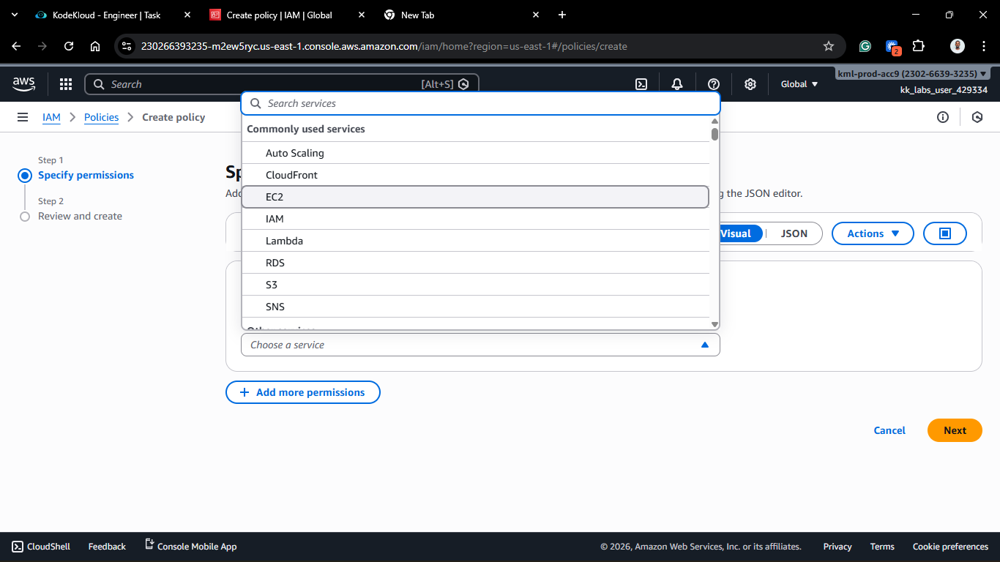
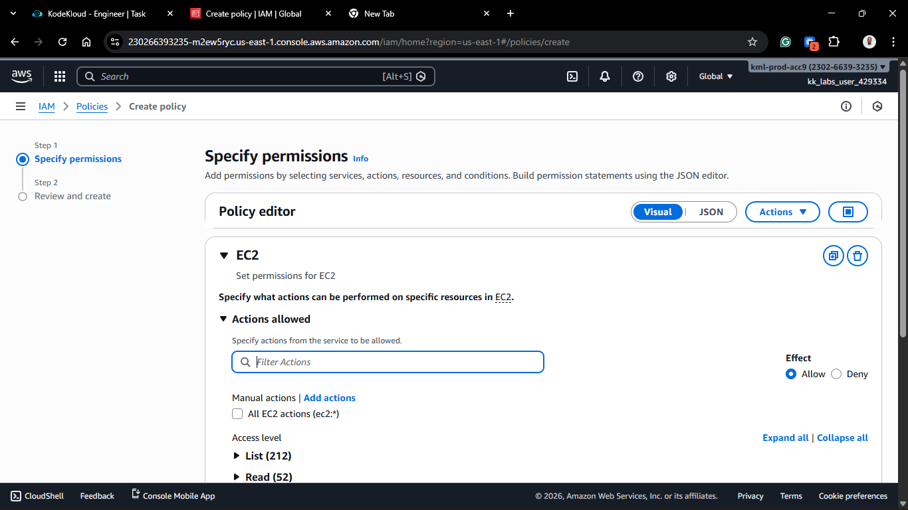
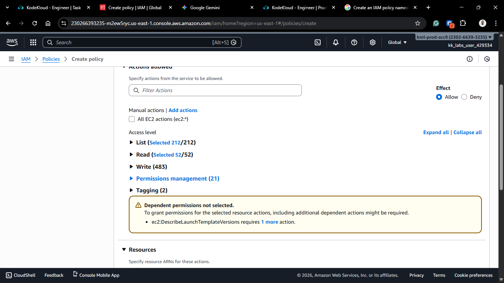
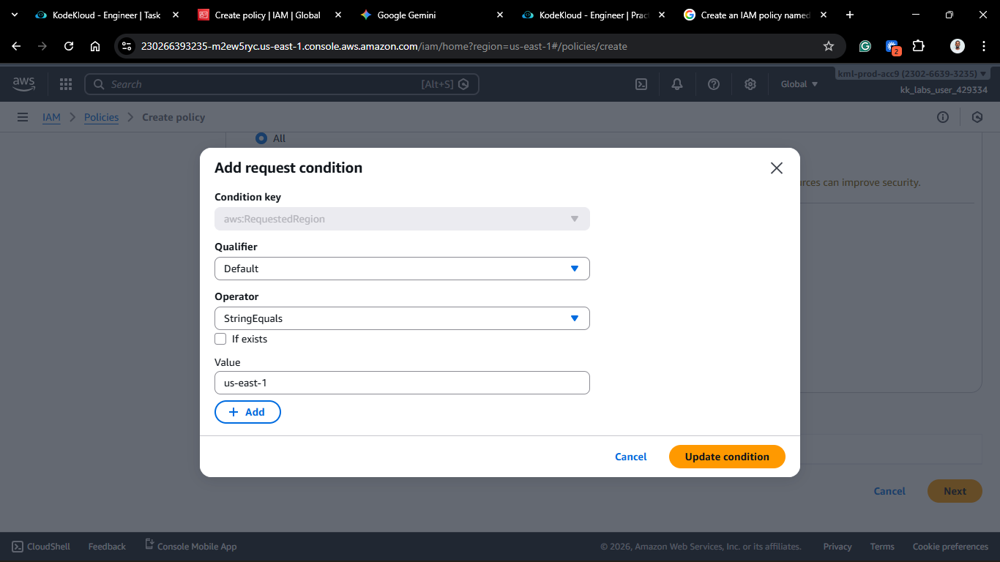
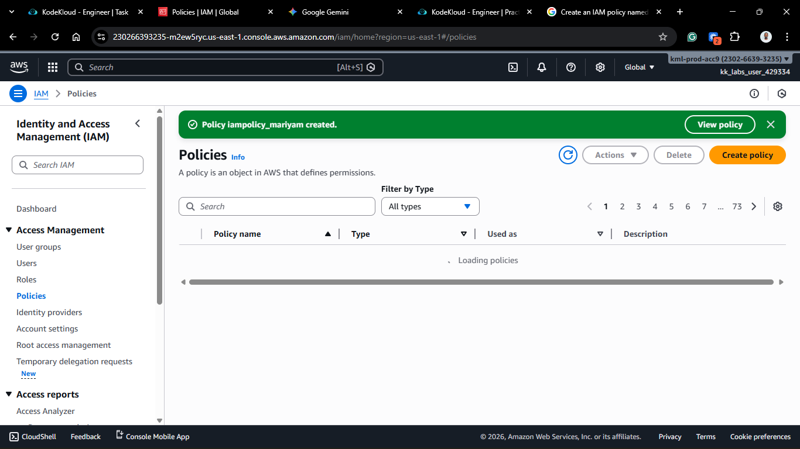

## Project Description

Today's task for the Nautilus DevOps team involved fine-tuning permissions. I created a **Customer Managed Policy** named `iampolicy_mariyam`.



**The Requirement:**
Allow users to view all EC2 instances, AMIs, and snapshots in the console, but restrict them from making any changes (like launching, stopping, or terminating instances).

**What is an IAM Policy?**
A policy is a JSON document that defines permissions. It is the "rulebook" of AWS.

- **AWS Managed Policies:** Pre-written by AWS (e.g., `AdministratorAccess`).
- **Customer Managed Policies:** Written by you to fit specific needs.

## Steps & Configuration

### Method: Using AWS Management Console

1. **Log in:** Access the [AWS Management Console](https://aws.amazon.com/console/) and navigate to the **IAM Dashboard**.
   

2. **Navigate to Policies:**
   - In the left navigation pane, select **Policies**.
   - Click **Create policy**.
     

3. **Define Permissions (Visual Editor):**
   - **Service:** Choose **EC2**.
   - **Actions:**
     - Expand **List** and check `Describe*` (or Select All List actions).
     - Expand **Read** and check `Describe*` (or Select All Read actions).
       _Tip: The specific action `ec2:Describe_` allows viewing of all EC2 resources.\*
   - **Resources:** Select **All resources**.
     
     
     
     

4. **Define Permissions (JSON Option):**
   - Alternatively, click the **JSON** tab and paste the following:

   ```json
   {
     "Version": "2012-10-17",
     "Statement": [
       {
         "Sid": "VisualEditor0",
         "Effect": "Allow",
         "Action": "ec2:Describe*",
         "Resource": "*"
       }
     ]
   }
   ```

5. **Create a Condtional Statement for Region for us-east-1**
   - To restrict the policy to a specific region (e.g., `us-east-1`), add a condition block to the JSON:

   ```json
   {
     "Version": "2012-10-17",
     "Statement": [
       {
         "Sid": "VisualEditor0",
         "Effect": "Allow",
         "Action": "ec2:Describe*",
         "Resource": "*",
         "Condition": {
           "StringEquals": {
             "aws:RequestedRegion": "us-east-1"
           }
         }
       }
     ]
   }
   ```

   Or use the Visual Editor to add the condition:

   

6. Review and Create:
   - Click Next: Tags (optional), then Next: Review.
   - Name: iampolicy_mariyam (Strict requirement).
   - Description: "Read-only access to EC2 Console".
   - Click Create policy.
     

### 🧠 Theory: Effect, Action, Resource

Every IAM statement has three core parts:

1. **Effect:** `Allow` or `Deny`.
2. **Action:** What are they trying to do? (e.g., `ec2:StartInstances` vs `ec2:DescribeInstances`).
3. **Resource:** Which specific object? (e.g., `*` for all, or a specific ARN).

By using `ec2:Describe*` with Effect `Allow`, we create a "Museum Pass"—you can look at everything, but you can't touch anything.
