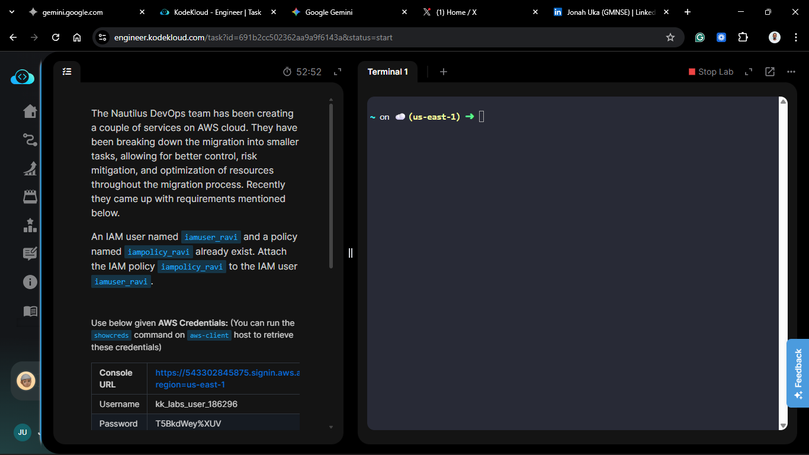
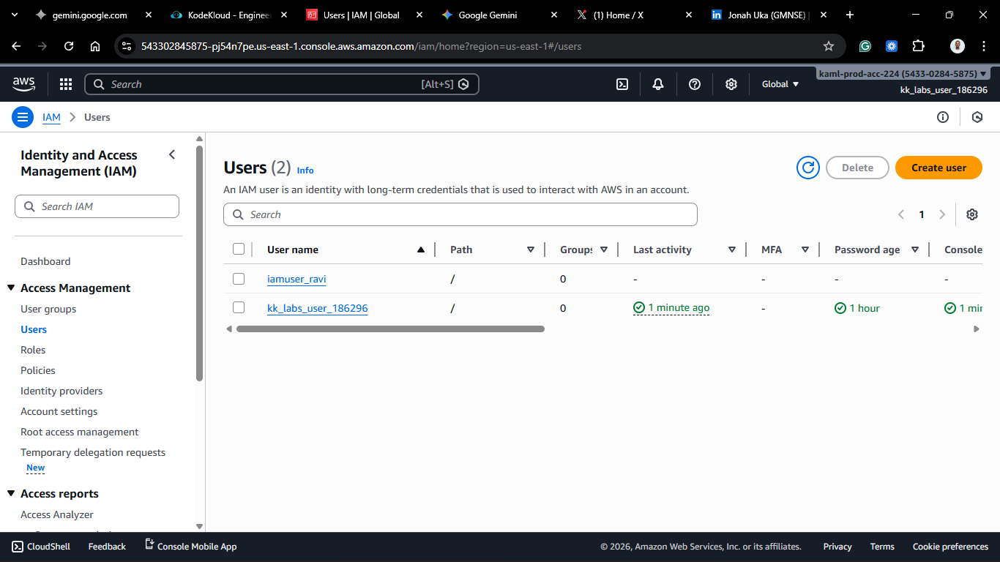
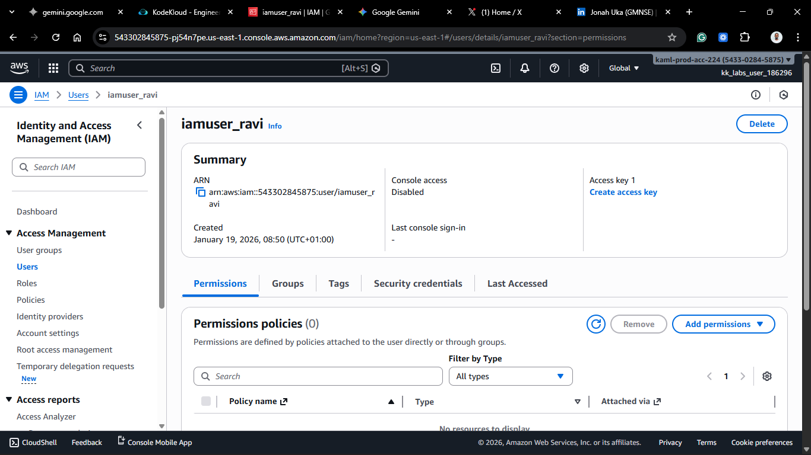
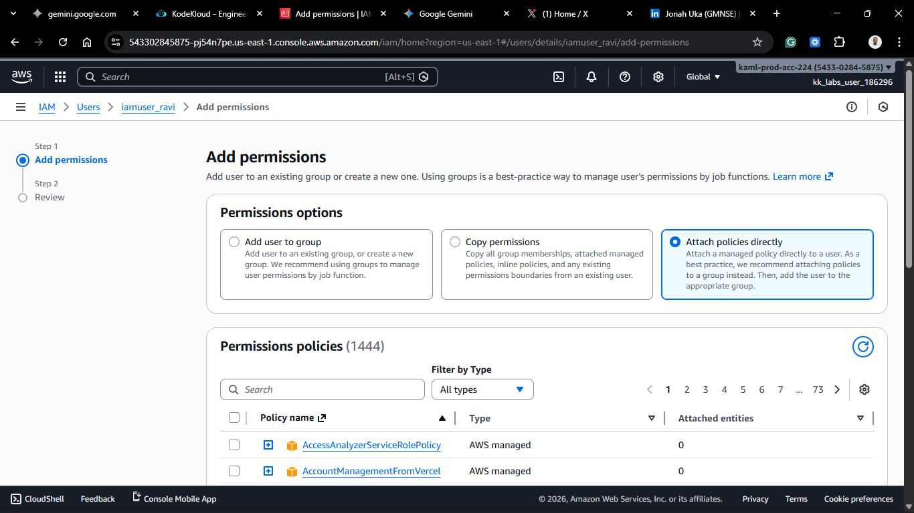
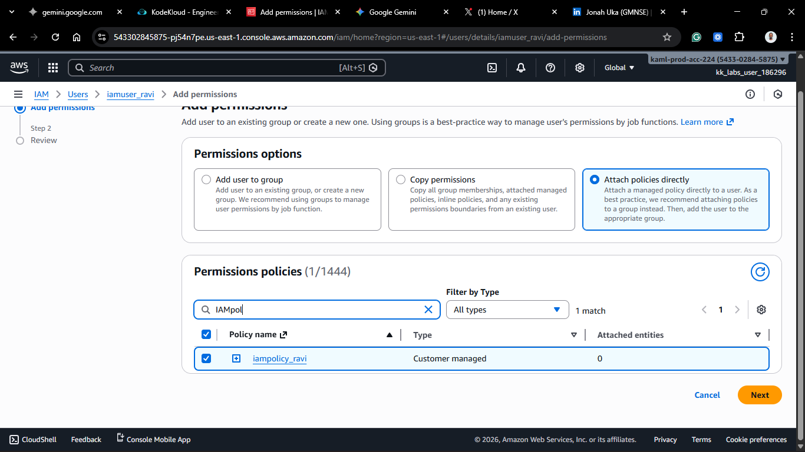
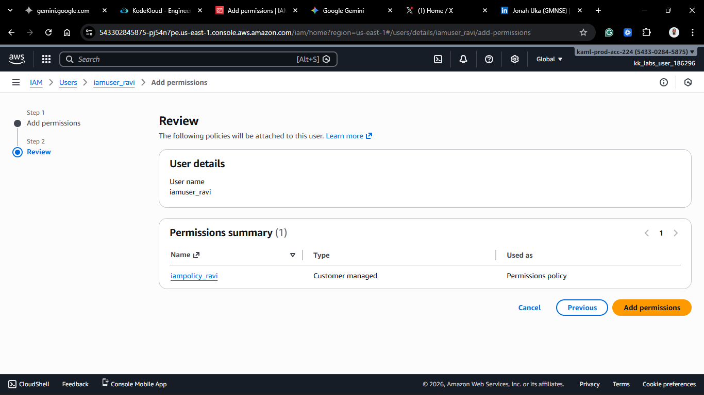
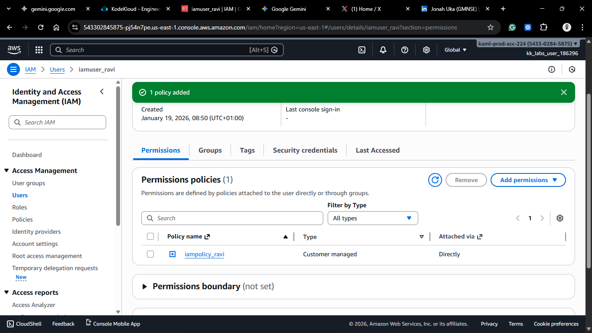
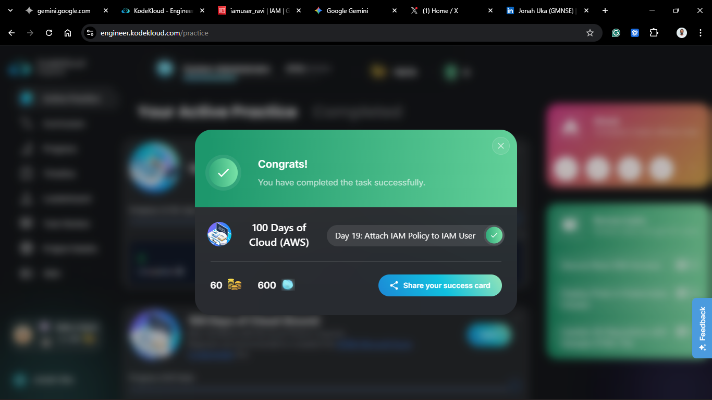

# Day 19: Attach IAM Policy to IAM User

## Project Description

Today's task for the Nautilus DevOps team was to finalize access for a specific user. We have a user (`iamuser_ravi`) and a pre-defined set of rules (`iampolicy_ravi`). The goal was to connect the two.

**The Task:**

Attach the existing IAM policy `iampolicy_ravi` to the user `iamuser_ravi`.

**Why is this step necessary?**

By default, a new IAM user has **zero permissions**. They can log in (if they have a password), but they cannot see, start, or stop anything. A policy is just a document sitting on a shelf. The user only gains power when you explicitly _attach_ that document to them.

## Steps & Configuration

### Method: Using AWS Management Console

1. **Log in:** Access the [AWS Management Console](https://aws.amazon.com/console/) and navigate to the **IAM Dashboard**.
2. **Navigate to Users:**
   - In the left navigation pane, select **Users**.
     

3. **Select the User:**
   - Click on the name of the user: `iamuser_ravi`.
     

4. **Add Permissions:**
   - In the **Permissions** tab, click the **Add permissions** dropdown button.
   - Select **Add permissions**.

5. **Select Permission Type:**
   - Choose **Attach policies directly**.
   - _Note: In a best-practice scenario, we would add the user to a Group (Day 17). However, for specific one-off requirements, direct attachment is supported._
     

6. **Find and Attach:**
   - In the search bar, type `iampolicy_ravi`.
   - Select the checkbox next to the policy.
     

7. **Finalize:**
   - Click **Next**.
   - Review the selection and click **Add permissions**.
     
     

**Verification:**
The policy `iampolicy_ravi` should now appear listed under the **Permissions policies** section of the user's dashboard.

## 🧠 Theory: Identity-Based Policies

What we did today is attach an **Identity-Based Policy**.
It controls what the _Identity_ (Ravi) is allowed to do.
This is distinct from **Resource-Based Policies** (like an S3 Bucket Policy), which are attached to the _Resource_ (the bucket) and control who can access _it_.

