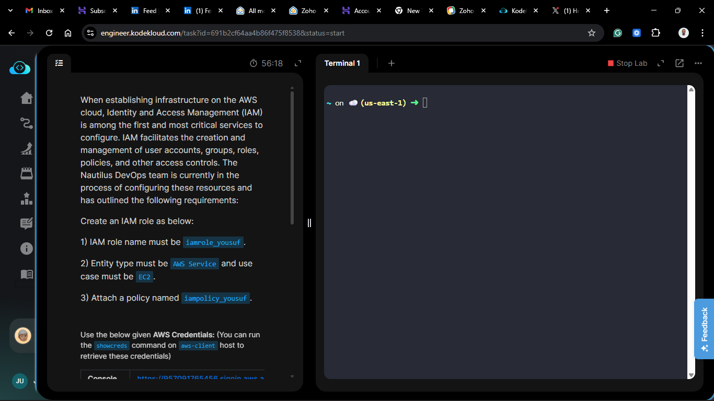
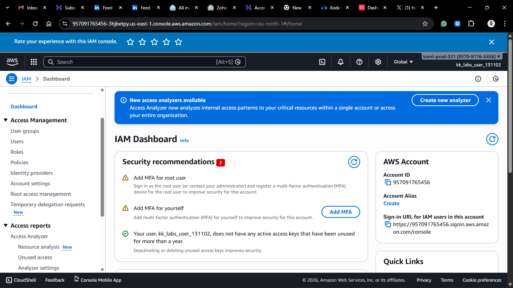
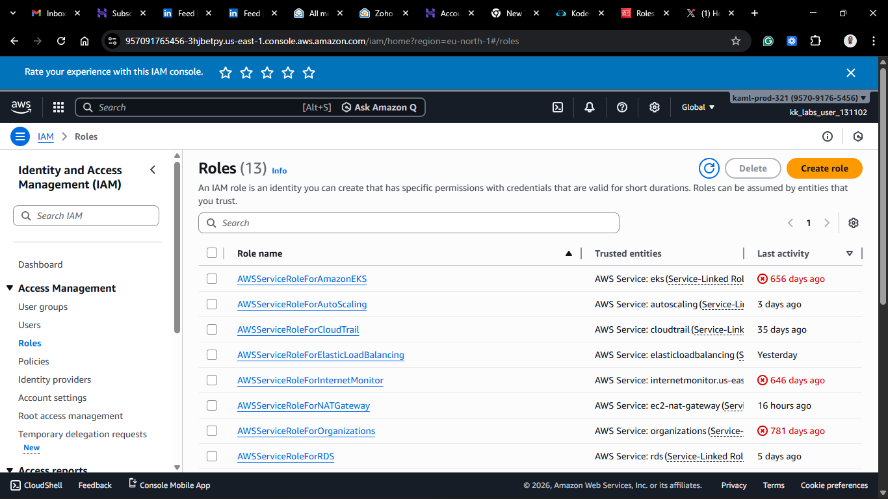
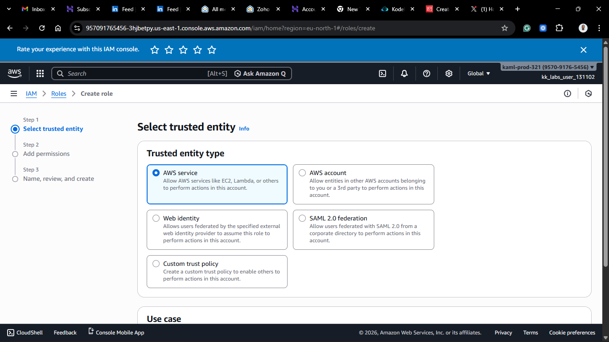
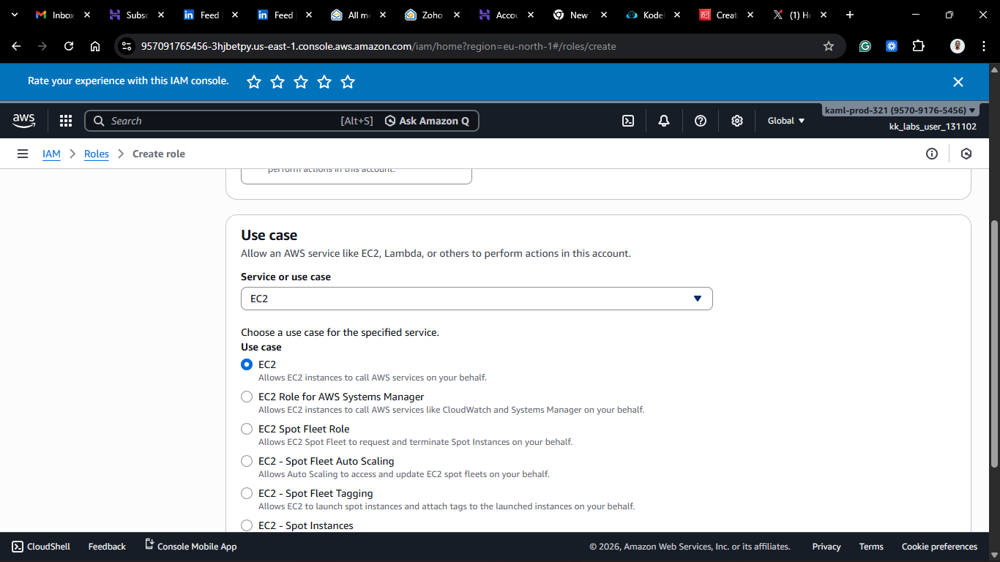
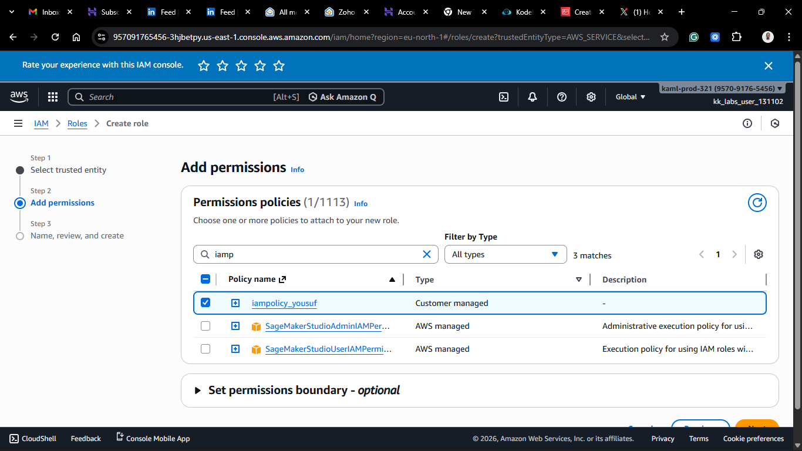
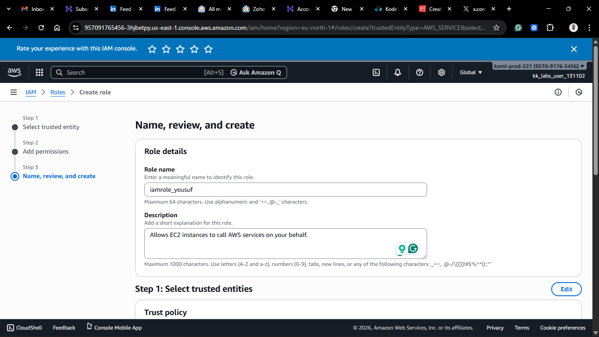
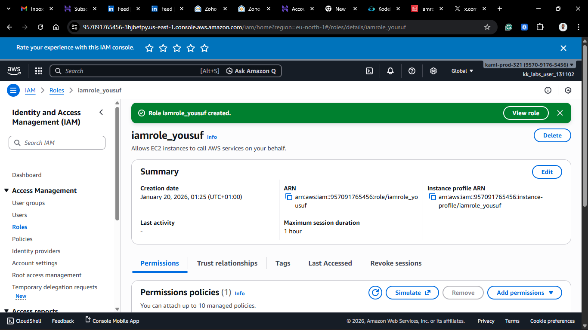
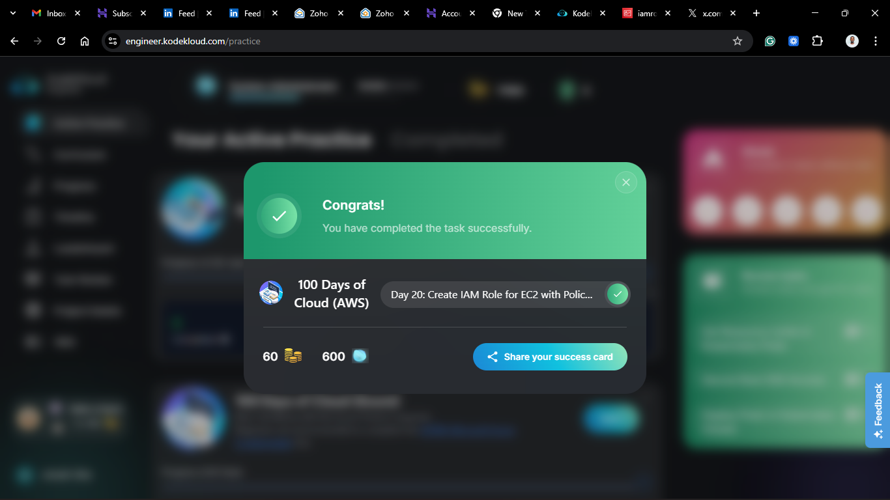

# Day 20: Create IAM Role for EC2

## Project Description

Today's task for the Nautilus DevOps team involved configuring **IAM Roles**.
I created a role named `iamrole_yousuf` specifically designed for an **EC2 Instance**.

**The Task:**

1. Create a Role: `iamrole_yousuf`.
2. Trusted Entity: **EC2** (The role is for a server, not a person).
3. Permissions: Attach the policy `iampolicy_yousuf`.

**What is an IAM Role?**

Unlike an IAM User (which represents a person), an IAM Role is an identity that you can assume to gain temporary access to permissions.
In this context, we are creating a role that an **EC2 server** can "wear." This allows the server to access other AWS services (like S3 or DynamoDB) without us having to save hard-coded passwords or access keys on the server itself.

## Steps & Configuration

### Method: Using AWS Management Console

1. **Log in:** Access the [AWS Management Console](https://aws.amazon.com/console/) and navigate to the **IAM Dashboard**.
2. **Navigate to Roles:**
   - In the left navigation pane, select **Roles**.
   - Click **Create role**.
     
     

3. **Select Trusted Entity:**
   - **Trusted entity type:** Select **AWS service**.
   - **Service or use case:** Choose **EC2**.
     _(This establishes the "Trust Relationship" allowing EC2 to assume this role.)_
   - Click **Next**.
     
     

4. **Add Permissions:**
   - In the search bar, type `iampolicy_yousuf`.
   - Select the checkbox next to the policy.
   - Click **Next**.
     

5. **Name and Review:**
   - **Role name:** `iamrole_yousuf` (Strict requirement).
   - Review the Trust Policy (it should show `"Service": "ec2.amazonaws.com"`).
   - Click **Create role**.
   - 

## 🧠 Theory:

Think of an IAM Role as a **Hat** or a Uniform.

- An **IAM User** is a person (Yousuf).
- An **IAM Role** is a Security Guard Uniform.
- The Uniform has keys (permissions) in the pocket.
- When the EC2 instance puts on the uniform (assumes the role), it can open the doors that the keys fit. When it takes off the uniform, it loses that access.
- Crucially, the keys are temporary. AWS rotates them automatically behind the scenes.

