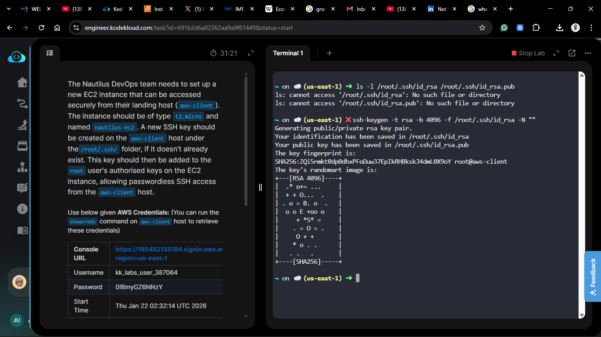
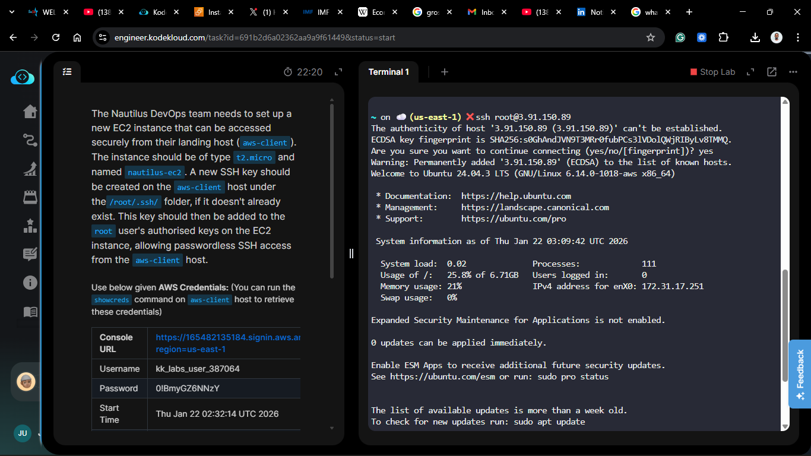
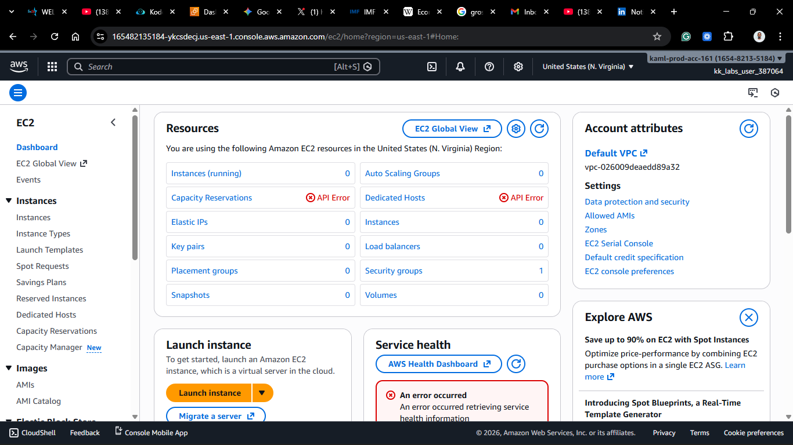
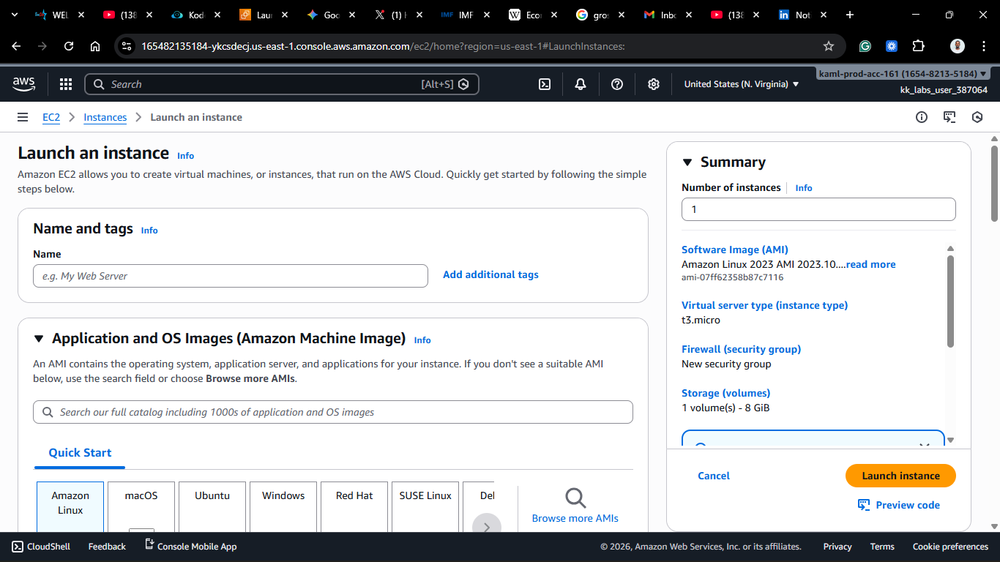
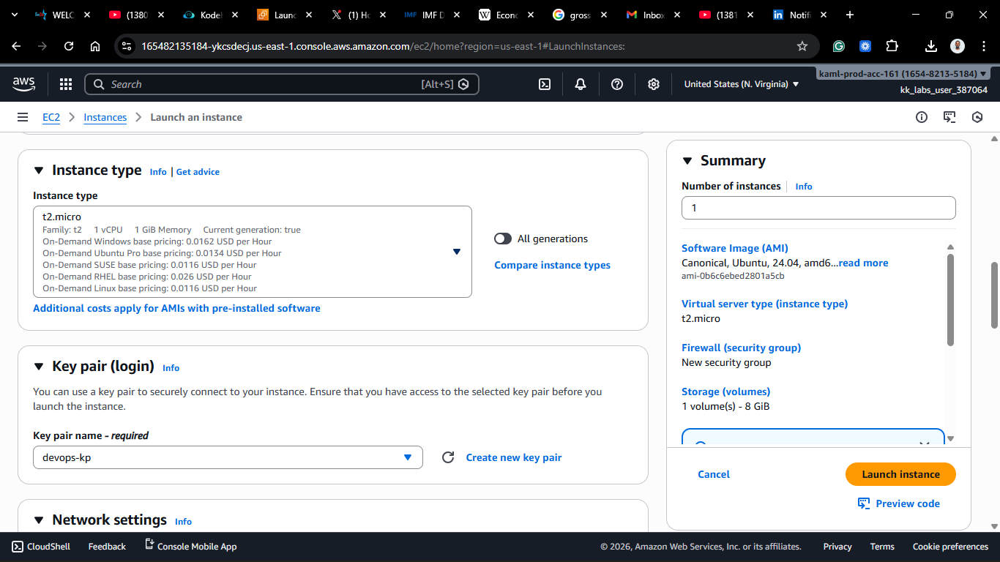
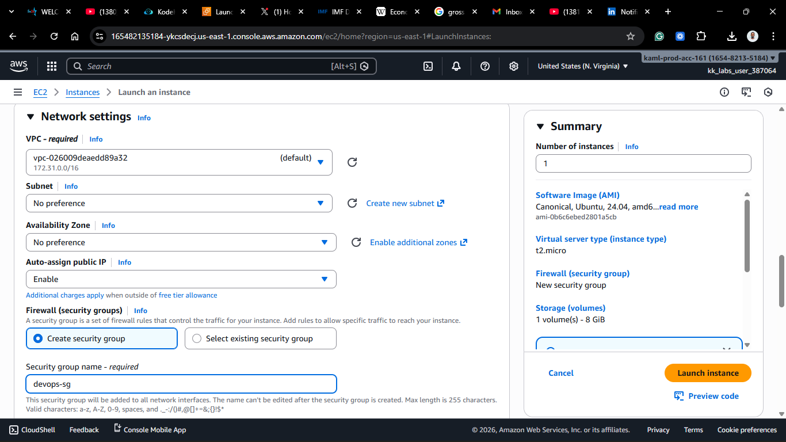
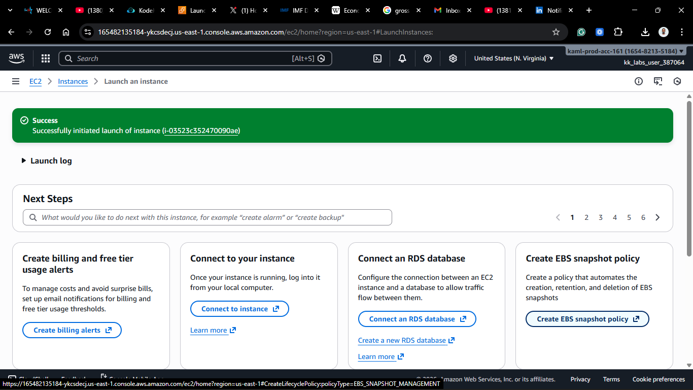
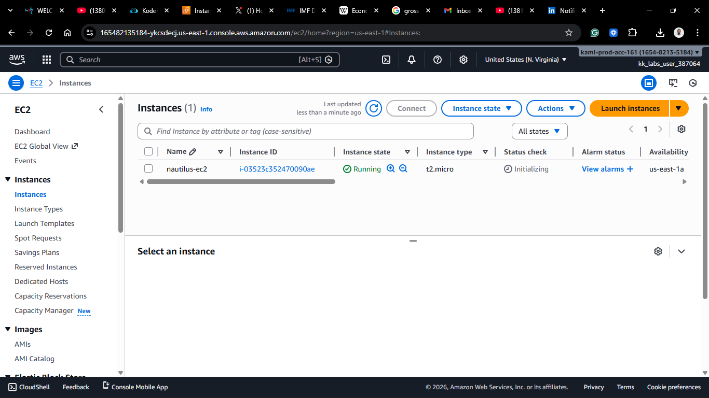
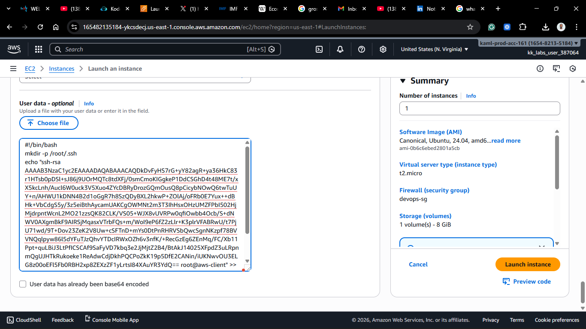
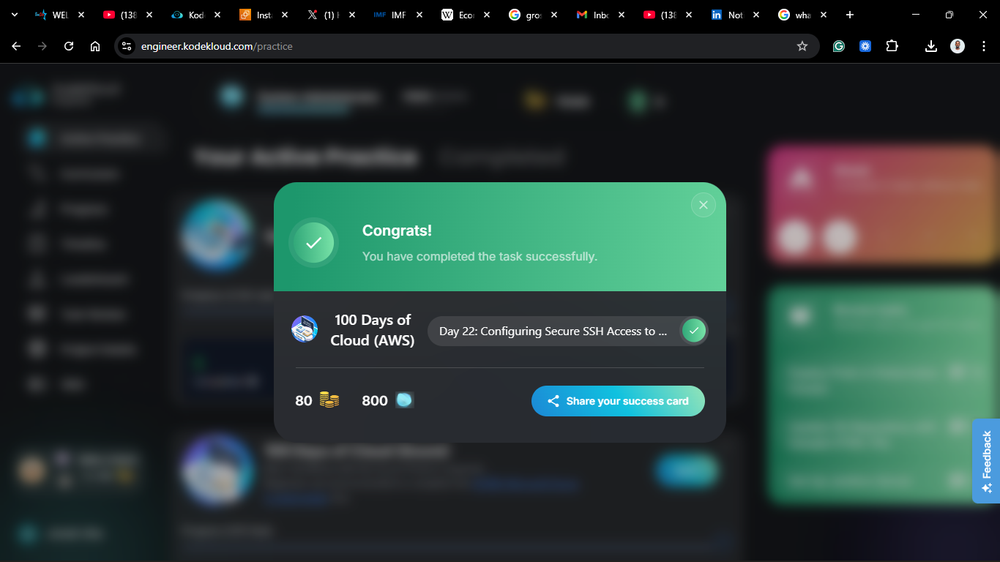

# Day 22: Configuring Secure SSH Access (Automated via User Data)

## Project Description

Today's task for the Nautilus DevOps team focused on **Secure Access Management**.
I needed to set up a new EC2 instance (`nautilus-ec2`) and configure it so that our landing host (`aws-client`) can SSH into it as the **root** user without a password.

Instead of manually logging in to configure keys, I used **EC2 User Data** to bootstrap the instance with the authorized keys immediately upon launch.

**The Workflow:**

1.  **Key Generation:** Create a specific SSH key pair on the `aws-client` (KodeKloud terminal).
2.  **Infrastructure:** Launch the EC2 instance, injecting the public key via a User Data script.
3.  **Verification:** Confirm passwordless access immediately after boot.

## Steps & Configuration

### Part 1: Key Generation (on `aws-client`)

1.  Log in to the aws-client host and check if an SSH key already exists.

```bash
ls -l /root/.ssh/id_rsa /root/.ssh/id_rsa.pub
```

2.  **Generate SSH Key:**
    On the `aws-client` terminal, I checked for an existing key and created a new one:

```bash
# Generate 4096-bit RSA key (No passphrase)
ssh-keygen -t rsa -b 4096 -f /root/.ssh/id_rsa -N ""
```

This created:

- Private Key: `/root/.ssh/id_rsa`
- Public Key: `/root/.ssh/id_rsa.pub`

3.  **Set Permissions:**
    Secure the local key files:

```bash
chmod 700 /root/.ssh
chmod 600 /root/.ssh/id_rsa
chmod 644 /root/.ssh/id_rsa.pub
```

4.  **Copy Public Key:**
    I displayed the public key to use in the next step:

```bash
cat /root/.ssh/id_rsa.pub
```




### Part 2: Infrastructure with User Data (AWS Console)

1.  **Launch Instance:**

- **Name:** `nautilus-ec2`
- **AMI:** Ubunutu Server 24.04 LTS
- **Instance Type:** `t2.micro`
- **Network:** Allow SSH (Port 22) from anywhere.
  
  
  
  
  
  

2.  **Configure User Data:**
    Under **Advanced Details**, I added the following bash script to automatically configure the root user's authorized keys:

```bash
#!/bin/bash
mkdir -p /root/.ssh
echo "ssh-rsa AAAAB3NzaC...[PASTE_PUBLIC_KEY_HERE]... root@aws-client" >> /root/.ssh/authorized_keys
chmod 700 /root/.ssh
chmod 600 /root/.ssh/authorized_keys
```



3.  **Launch:**
    I launched the instance and waited for it to initialize.

### Part 3: Verification

Once the instance was running, I verified I could connect from `aws-client` without a password:

```bash
ssh root@<EC2_PUBLIC_IP>
```

### 🧠 Theory: User Data Bootstrapping

By using User Data, we treat infrastructure as code. We didn't have to log in with a temporary password to set up the permanent key. The server "woke up" already trusting our client. This is essential for scaling—you can't manually paste keys into 100 servers!


