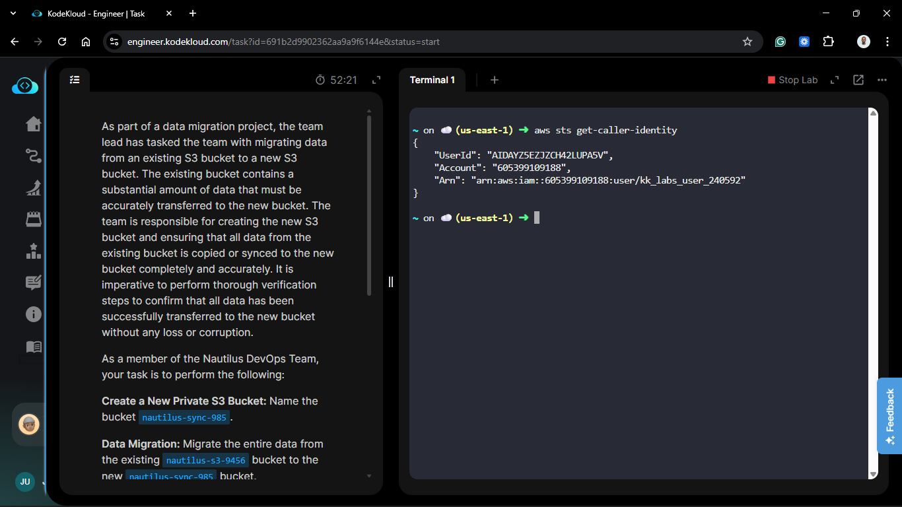
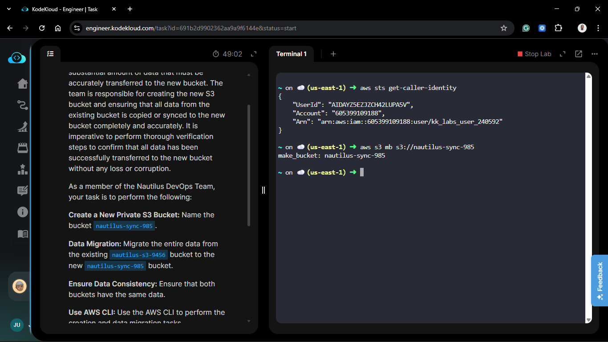
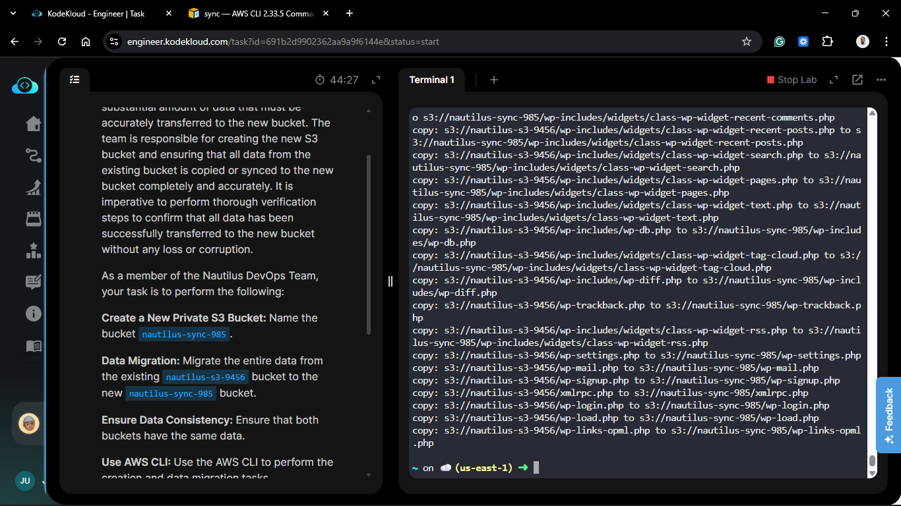
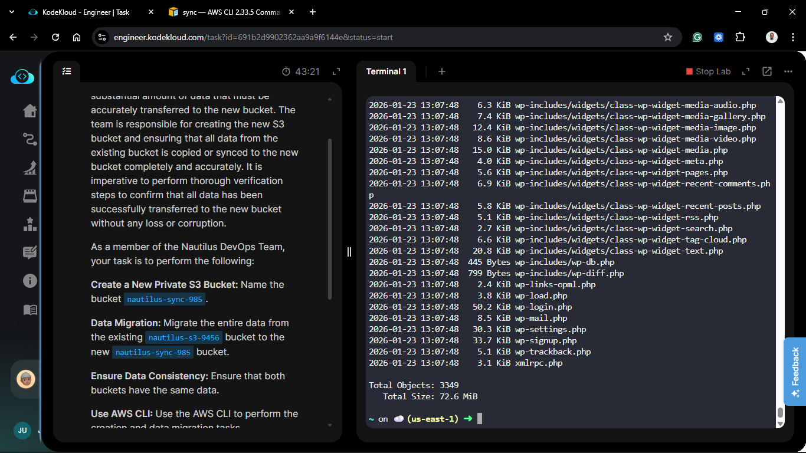
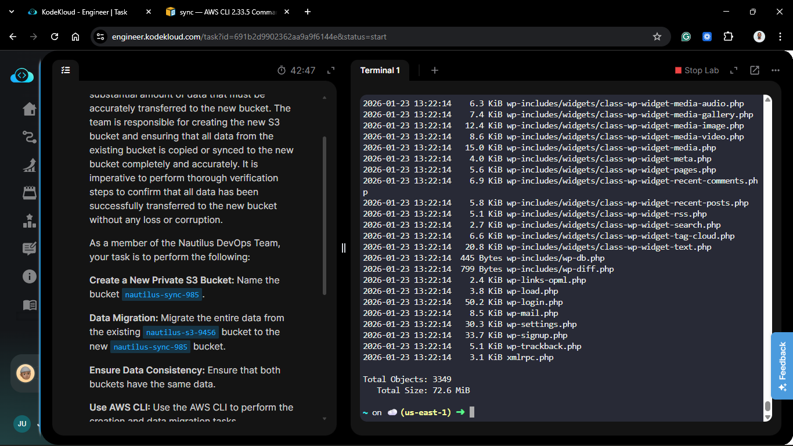

# Day 23: Data Migration Between S3 Buckets (AWS CLI)

## Project Description

Today's task for the Nautilus DevOps team was a classic data migration scenario. We needed to move a substantial dataset from a legacy bucket (`nautilus-s3-9456`) to a new destination bucket (`nautilus-sync-985`).

**The Constraint:**

Use the **AWS CLI** to perform the creation and migration.

**The Tool:** `aws s3 sync`

Instead of copying files one by one, I utilized the `sync` command. This is effectively the "rsync" of the cloud. It recursively copies new and updated files from the source to the destination. Ideally, it handles retries and checks efficiently, making it superior to a simple copy loop for migrations.

## Steps & Configuration

### Part 1: Create the New Bucket

1.  **Verify Credentials:**
    Ensure the CLI is configured with the correct permissions.

    ```bash
    aws sts get-caller-identity
    ```

    

2.  **Create Bucket:**
    Use the `mb` (Make Bucket) command to create the destination bucket.
    ```bash
    aws s3 mb s3://nautilus-sync-985
    ```
    _Note: By default, new buckets are private._
    

### Part 2: Migrate Data (The Sync)

1.  **Run Sync:**
    Execute the sync command to transfer data from Source -> Destination.
    ```bash
    aws s3 sync s3://nautilus-s3-9456 s3://nautilus-sync-985
    ```
    _Output:_ You will see a list of operations (upload/copy) as the CLI iterates through the objects.
    

### Part 3: Verification (Consistency Check)

To ensure zero data loss, I compared the object count and total size of both buckets.

1.  **Summarize Source:**

    ```bash
    aws s3 ls s3://nautilus-s3-9456 --recursive --human-readable --summarize
    ```

    

2.  **Summarize Destination:**

    ```bash
    aws s3 ls s3://nautilus-sync-985 --recursive --human-readable --summarize
    ```

    

3.  **Compare:**
    Check that the `Total Objects` and `Total Size` match exactly between the two outputs.

## 🧠 Theory: `cp` vs `sync`

- **`aws s3 cp`**: Copies a file (or recursively copies a directory). It is "dumb"—it will overwrite files even if they haven't changed.
- **`aws s3 sync`**: Intelligent. It checks the source and destination. It only copies files that are new or have a different size/timestamp. If the transfer is interrupted, you can run `sync` again, and it will pick up where it left off.


