# Day 24: Setting Up an Application Load Balancer (ALB)

## Project Description

Today's task for the Nautilus DevOps team was to introduce a layer of abstraction and scalability. I set up an **Application Load Balancer (ALB)** in front of our web server.

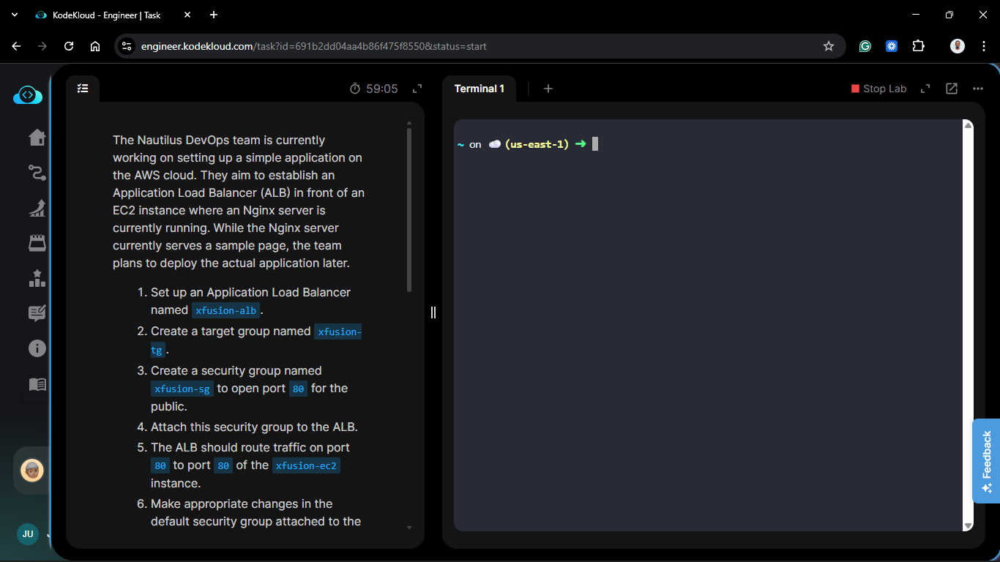

**The Architecture:**

Instead of users connecting directly to the EC2 instance (which exposes the server to the world and makes it hard to scale), they connect to the ALB. The ALB then routes the traffic to the backend instances.

**Components:**

- **Load Balancer (`xfusion-alb`):** The entry point.
- **Target Group (`xfusion-tg`):** The list of servers that receive traffic.
- **Security Group (`xfusion-sg`):** The firewall allowing public access to the ALB.

## Steps & Configuration

### Method: Using AWS Management Console

#### Part 1: Security Group Setup

_First, we need to define who is allowed to talk to whom._

1.  **Create ALB Security Group (`xfusion-sg`):**
    - Navigate to **EC2** > **Security Groups** > **Create security group**.
    - **Name:** `xfusion-sg`.
    - **Inbound Rules:** Allow **HTTP** (Port 80) from **Anywhere-IPv4** (`0.0.0.0/0`).
    - _This allows the public to talk to the Load Balancer._
      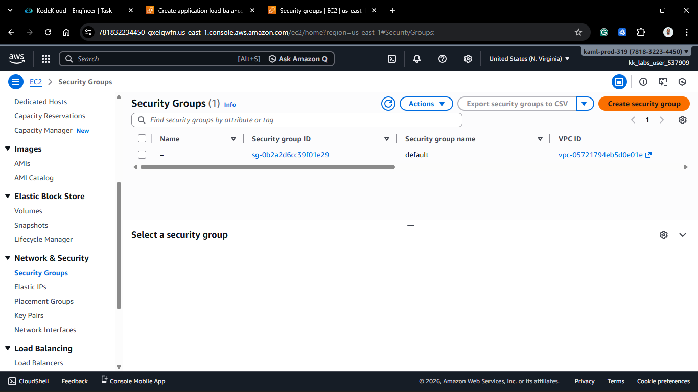
      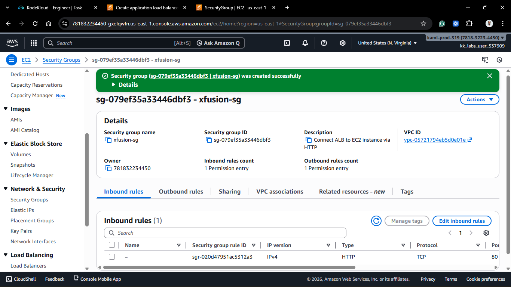

2.  **Update EC2 Security Group:**
    - Find the Security Group attached to the `xfusion-ec2` instance.
    - Edit **Inbound rules**.
    - **Rule:** Allow **HTTP** (Port 80).
    - **Source:** Instead of `0.0.0.0/0`, select the **Security Group ID** of `xfusion-sg` (created in the previous step).
    - _This is "Security Group Chaining." It ensures the EC2 instance ONLY accepts traffic from the Load Balancer, not directly from the internet._
      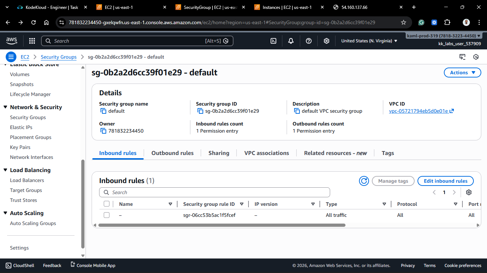
      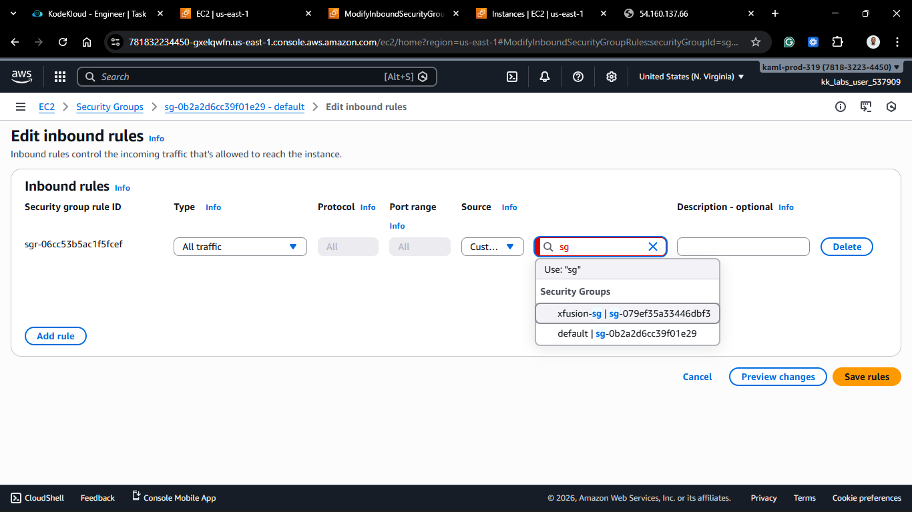

#### Part 2: Create Target Group

_Next, we define where the traffic should go._

1.  Navigate to **EC2** > **Load Balancing** > **Target Groups**.
    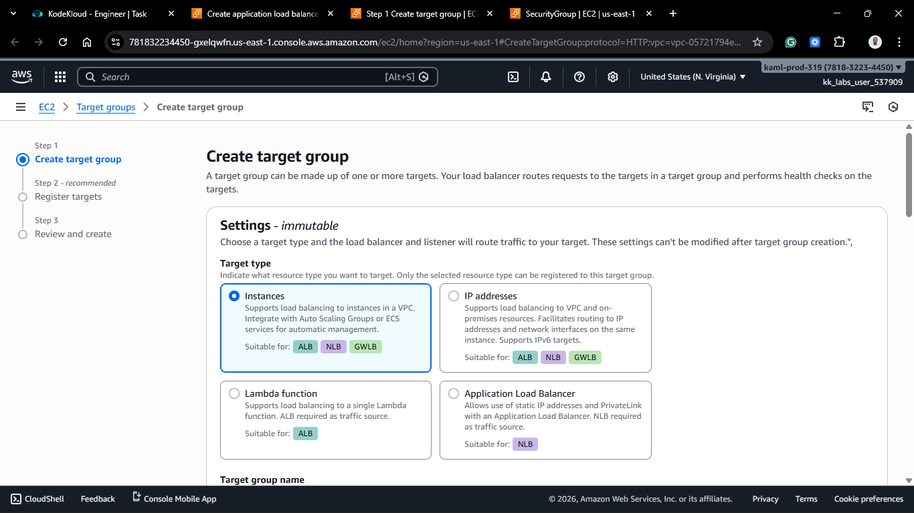

2.  Click **Create target group**.
3.  **Basic Configuration:**
    - **Target type:** Instances.
    - **Target group name:** `xfusion-tg` (Strict requirement).
    - **Protocol/Port:** HTTP : 80.
4.  **Register Targets:** - On the next screen, select the `xfusion-ec2` instance. - Click **Include as pending below**. - Click **Create target group**.
    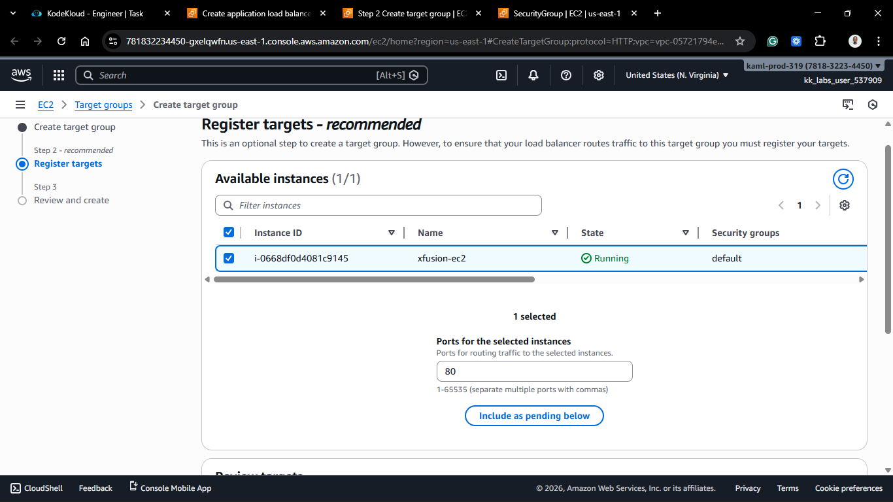
    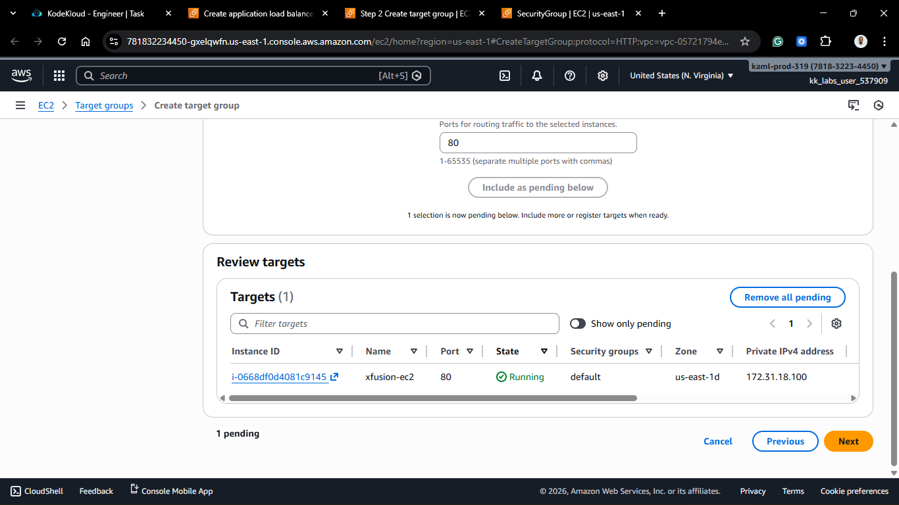
    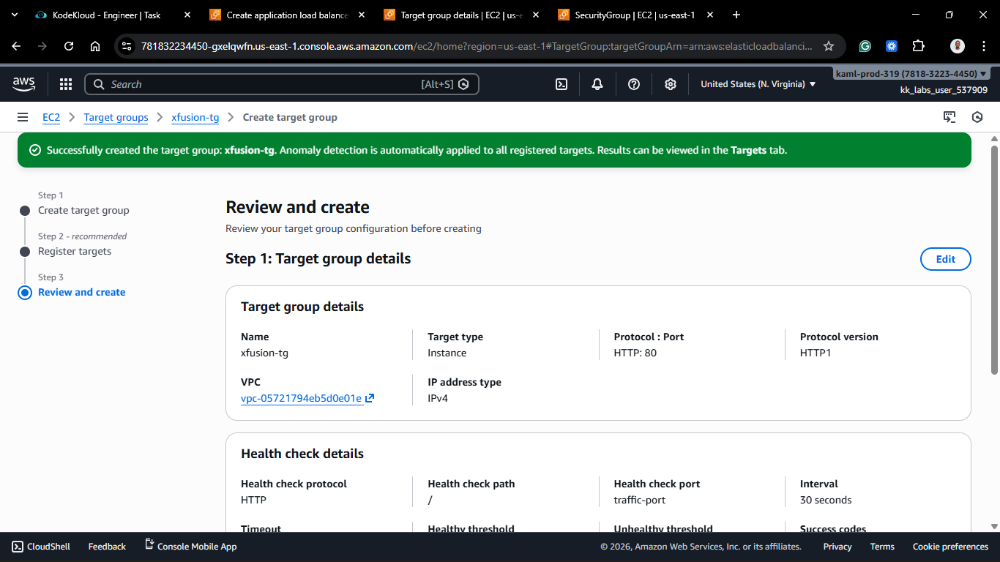

#### Part 3: Create Load Balancer

_Finally, we build the ALB._

1.  Navigate to **EC2** > **Load Balancing** > **Load Balancers**.
2.  Click **Create load balancer** > **Application Load Balancer**.
    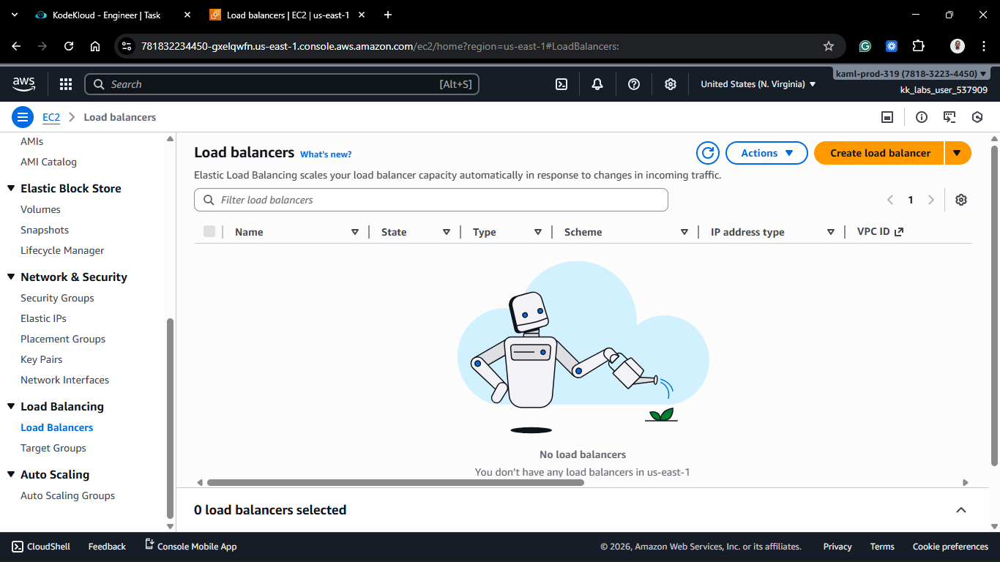
    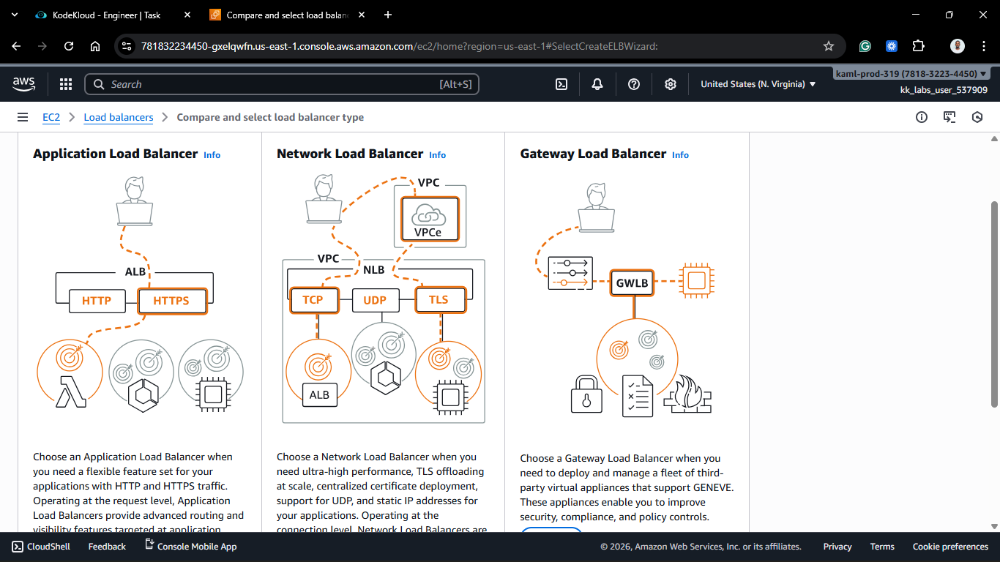

3.  **Basic Config:**
    - **Name:** `xfusion-alb` (Strict requirement).
    - **Scheme:** Internet-facing.
      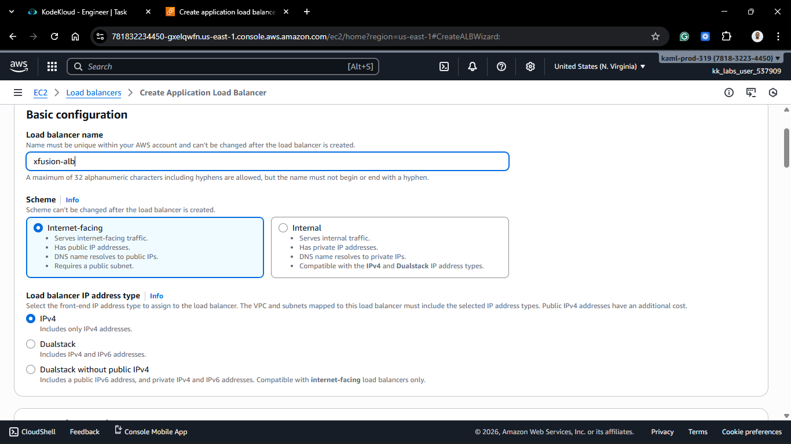

4.  **Network Mapping:**
    - Select the correct VPC.
    - Select at least two Availability Zones (Subnets).
5.  **Security Groups:**
    - Select `xfusion-sg` (created in Part 1).
      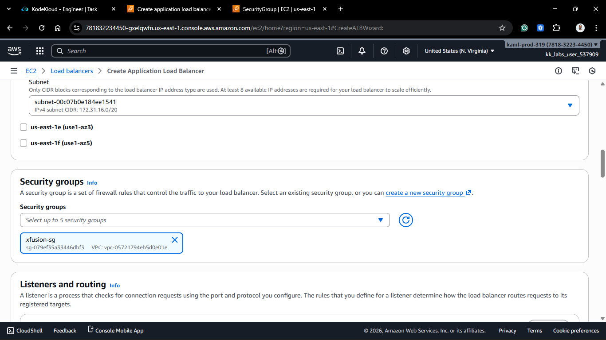

6.  **Listeners and Routing:** - **Protocol:** HTTP. - **Port:** 80. - **Default action:** Forward to `xfusion-tg`.
    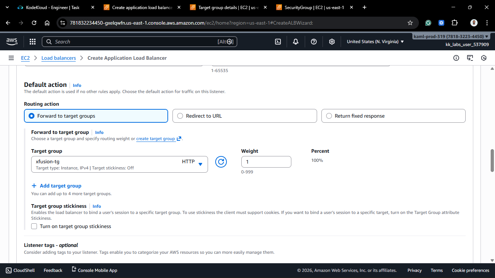
    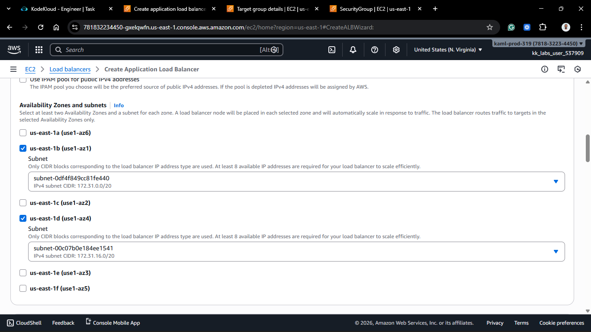
    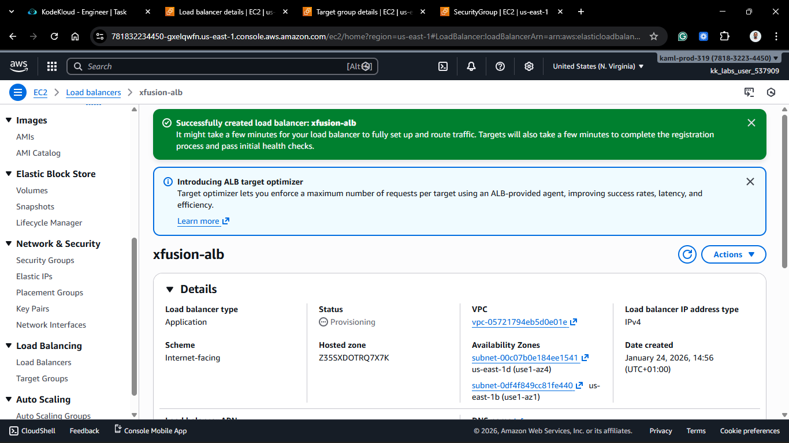

7.  Click **Create load balancer**.

#### Verification

1.  Copy the **DNS name** of the Load Balancer (e.g., `xfusion-alb-1234.us-east-1.elb.amazonaws.com`).
2.  Paste it into a web browser.
3.  You should see the Nginx welcome page served by `xfusion-ec2`.
    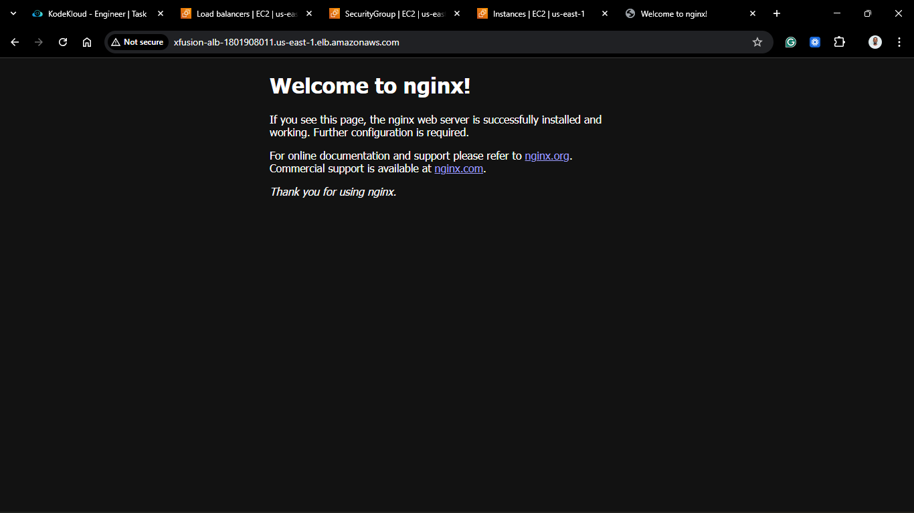

## 🧠 Theory: Why use an ALB for one instance?

Even with a single instance, an ALB offers benefits:

1.  **Security:** It hides the backend instance's IP and allows you to block direct internet access to the server.
2.  **Flexibility:** You can add a second instance to the Target Group later, and the ALB will automatically start balancing traffic without the users knowing.
3.  **SSL Termination:** You can attach an HTTPS certificate to the ALB, offloading the encryption work from the Nginx server.

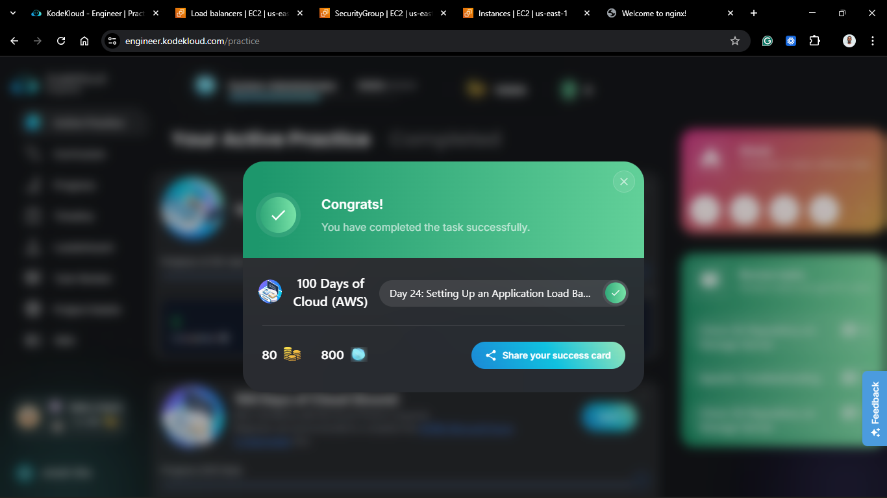
