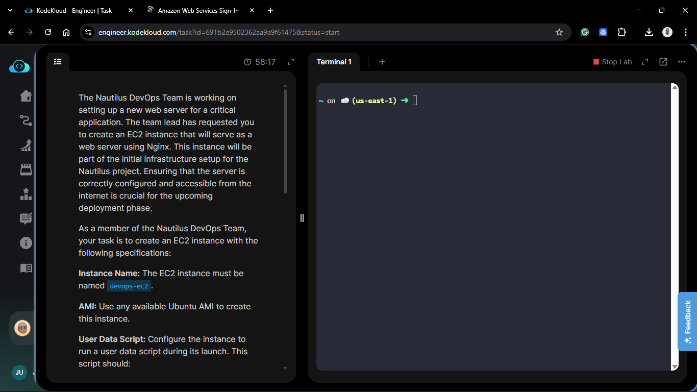
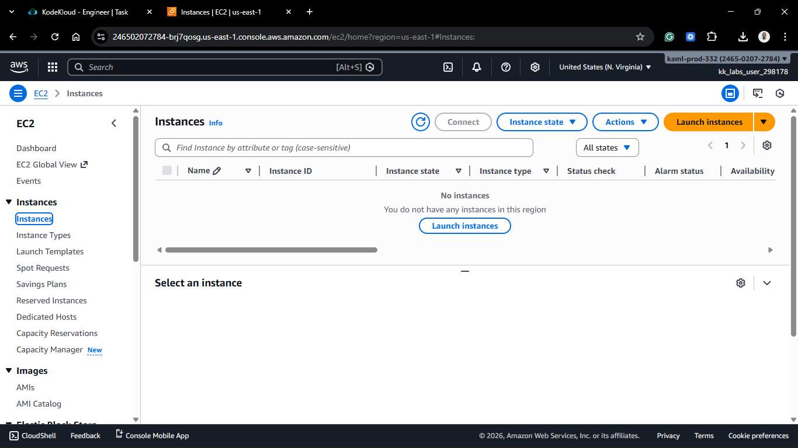
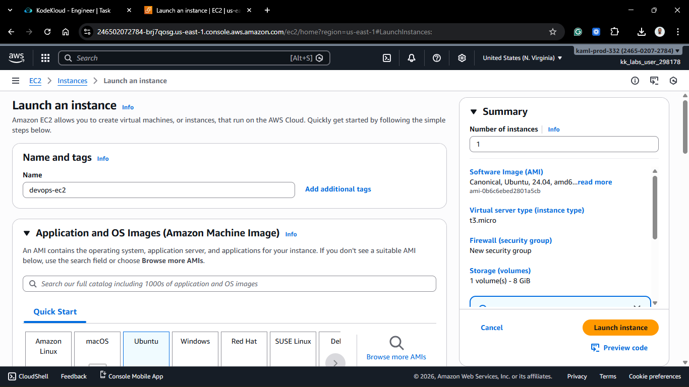
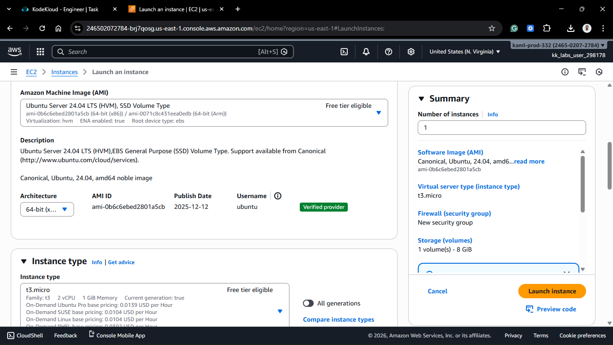
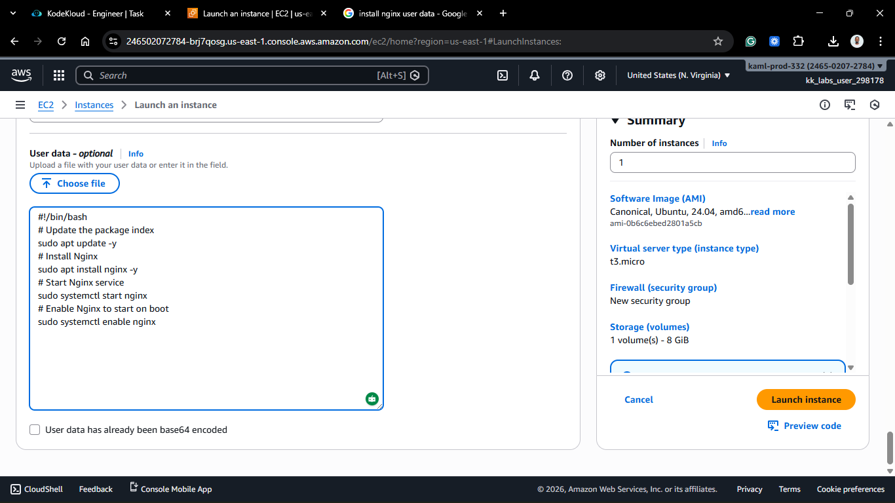
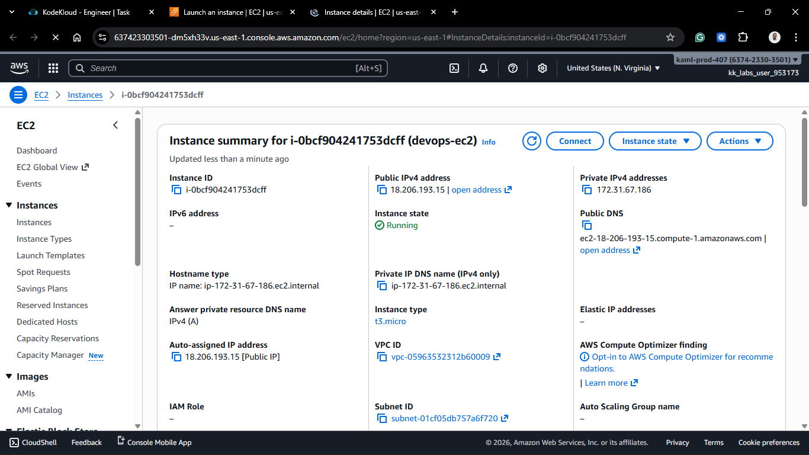
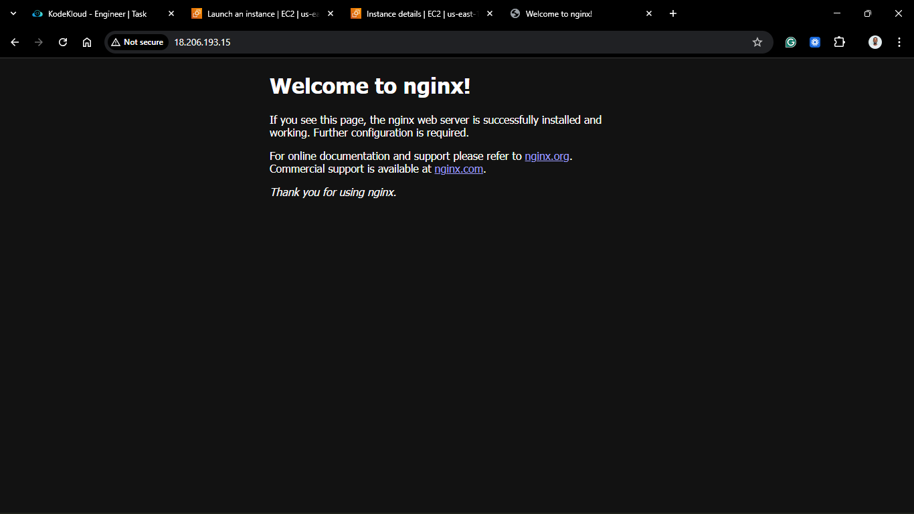
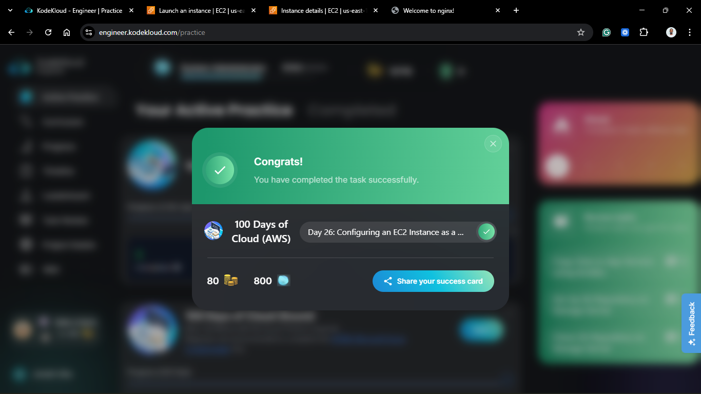

# Day 26: Configuring an EC2 Web Server with Nginx (Bootstrapping)

## Project Description

Today's task for the Nautilus DevOps team was to provision a web server. However, instead of launching a server, logging in via SSH, and manually installing software, I used **User Data** to bootstrap the configuration.



**The Goal:**

Launch an Ubuntu EC2 instance (`devops-ec2`) that automatically installs and starts **Nginx** upon its very first boot. This ensures the server is ready to accept HTTP traffic the moment it enters the "Running" state.

## Steps & Configuration

### Part 1: Prepare the User Data Script

The "magic" happens in the script we pass to the instance during launch.
Here is the Bash script to automate the Nginx setup:

```bash
#!/bin/bash
# Update the package index
sudo apt update -y
# Install Nginx
sudo apt install nginx -y
# Start Nginx service
sudo systemctl start nginx
# Enable Nginx to start on boot
sudo systemctl enable nginx
```

_You can get this simple script from the internet or write it yourself based on Nginx installation instructions for Ubuntu._

### Part 2: Launch the Instance

1. **Log in:** Access the AWS Management Console and navigate to the EC2 Dashboard.
   

2. **Launch Instance:**
   - **Name:** `devops-ec2`.
   - **AMI:** Ubuntu Server 24.04 LTS (or similar).
   - **Instance Type:** t3.micro.
     
     

3. **Configure Network (Security Group):**
   - Create a new Security Group (or select an existing one).
   - **Inbound Rules:** Allow **HTTP** (Port 80) from **Anywhere** (`0.0.0.0/0`).
   - _Without this, the internet cannot reach the Nginx server._
4. **Add User Data:**
   - Scroll down to **Advanced Details**.
   - Paste the bash script (from Part 1) into the **User data** field.
     

5. **Launch:**
   - Click Launch instance.

### Part 3: Verification

1. Wait for the instance status to change to **Running**.
   

2. Copy the **Public IPv4 address**.
3. Paste the IP into your browser (`http://<PUBLIC-IP>`).
4. You should see the "Welcome to nginx!" default page.
   

## 🧠 Theory: Bootstrapping vs. Golden AMIs

There are two main ways to launch pre-configured servers:

1. **Bootstrapping (User Data)**: You take a generic AMI (like Ubuntu) and run a script at startup to install what you need.
   - _Pros_: Flexible, easy to change the script.

   - _Cons_: Boot time is slower (has to install software every time).

2. **Golden AMIs (Baked)**: You install software once, save it as an AMI, and launch from that (like we did on Day 13).
   - _Pros_: Fast boot time.

   - _Cons_: harder to maintain (must create a new AMI for every software update).


