# Day 27: Public VPC & EC2 Setup (Networking Basics)

## Project Description

Today's task for the Nautilus DevOps team was foundational networking. I built a custom **Virtual Private Cloud (VPC)** from scratch to host public-facing services.

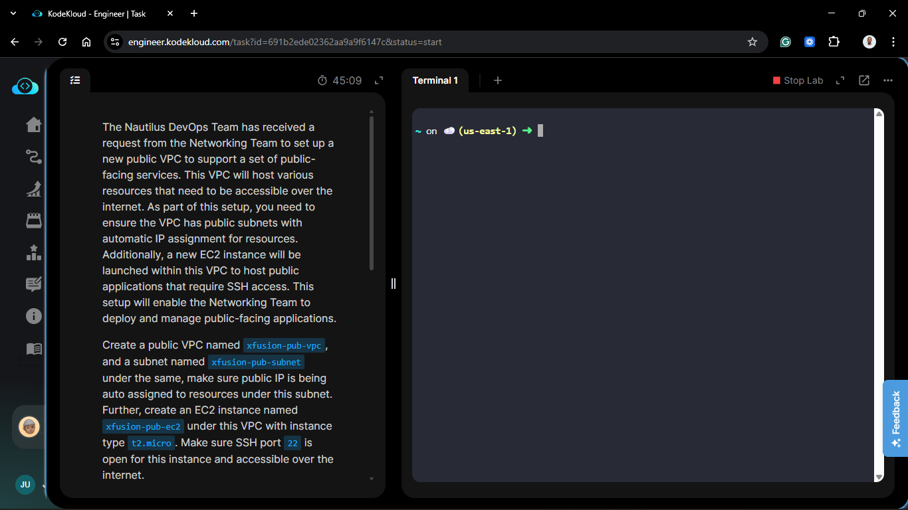

**The Goal:**

Instead of using the "Default VPC" (which comes pre-configured), I created a new network (`xfusion-pub-vpc`), configured a public subnet, and launched an instance (`xfusion-pub-ec2`) inside it that is accessible from the internet.

**Components:**

- **VPC:** The isolated network container.
- **Subnet:** The specific segment of the network.
- **Internet Gateway (IGW):** The door to the internet.
- **Route Table:** The map that tells traffic how to get to the door.

## Steps & Configuration

### Part 1: Networking Setup

1.  **Create VPC:** - **Name:** `xfusion-pub-vpc`. - **CIDR Block:** `10.0.0.0/24` (Standard practice). - **Tenancy:** Default.
    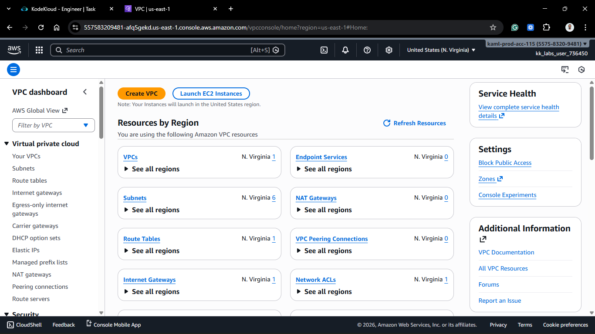
    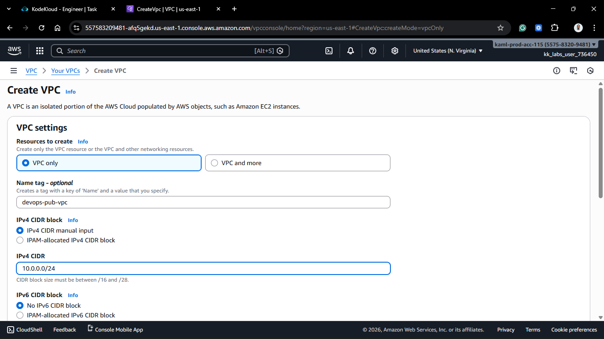
    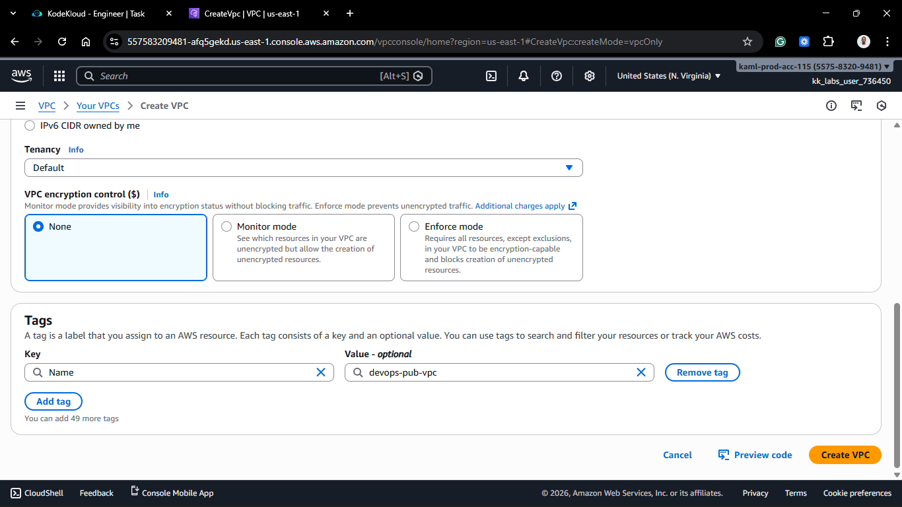
    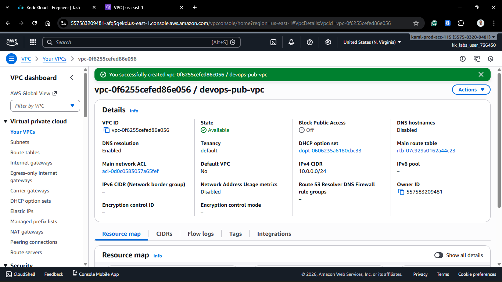

2.  **Create Subnet:**
    - **Name:** `xfusion-pub-subnet`.
    - **VPC:** Select `xfusion-pub-vpc`.
    - **Availability Zone:** Pick one (e.g., `us-east-1a`).
    - **CIDR Block:** `10.0.1.0/24`.

3.  **Enable Auto-Assign Public IP:** - Select the new subnet (`xfusion-pub-subnet`). - Click **Actions** > **Edit subnet settings**. - Check **Enable auto-assign public IPv4 address**. - _Without this, instances launched here won't get a public IP by default._
    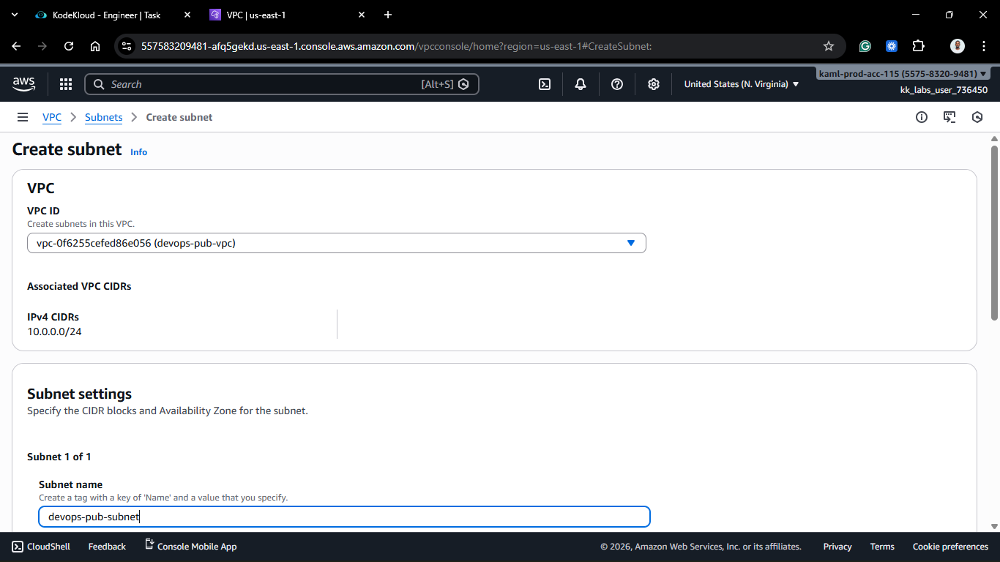
    
    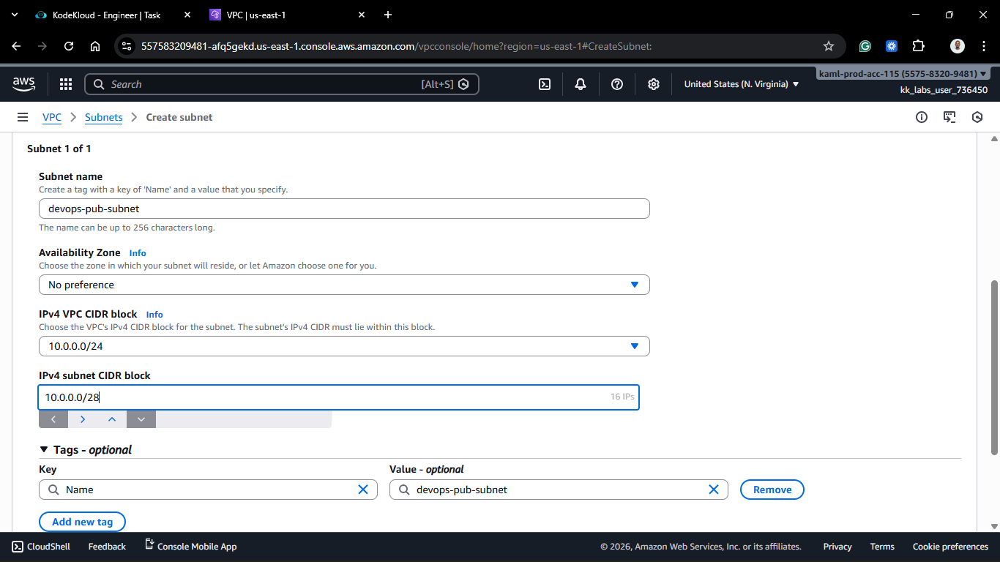
    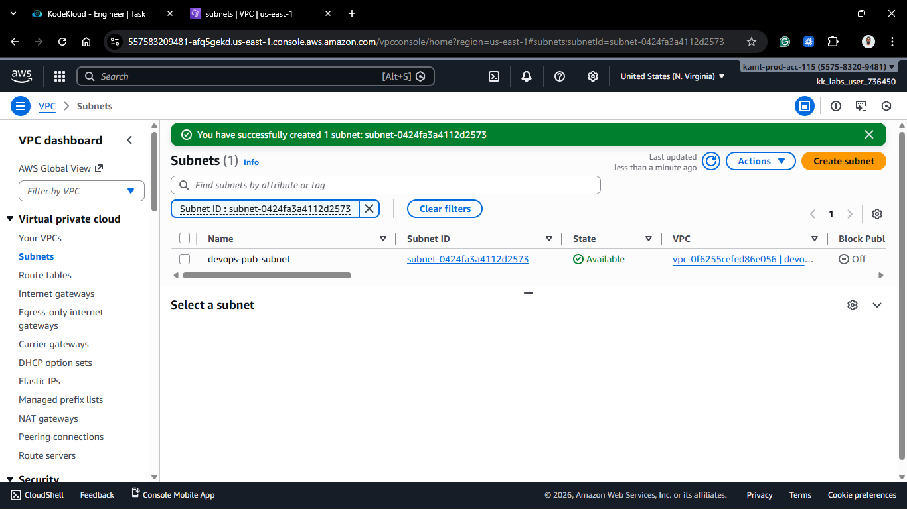
    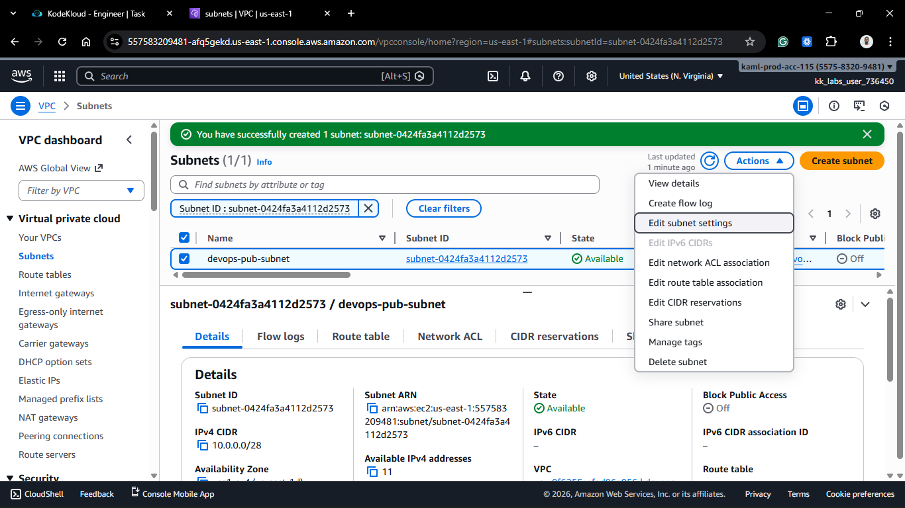
    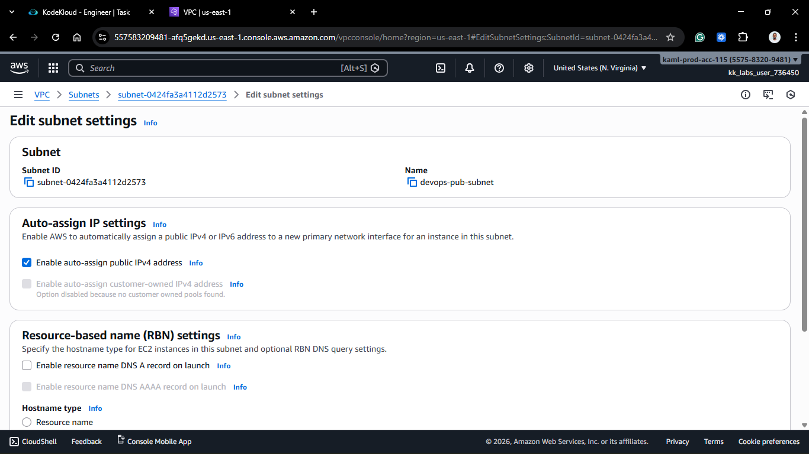
    
    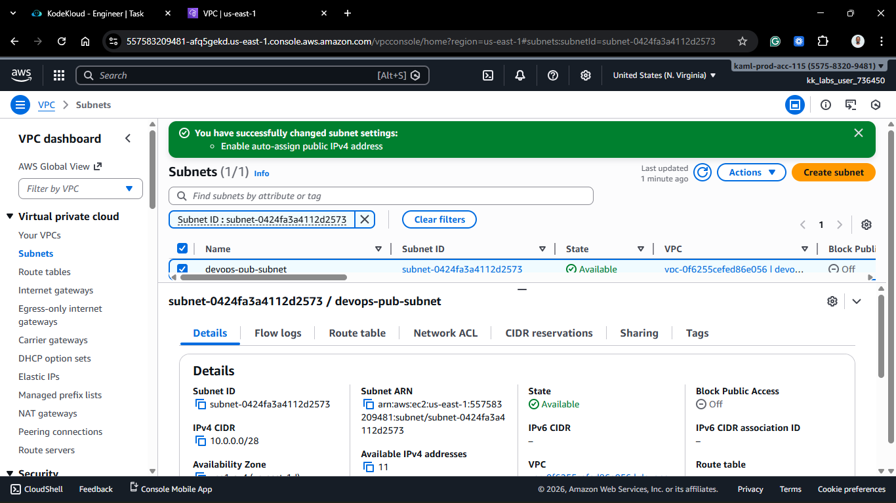

[Optional] For this task we were not required to set up IGW and Route Tables, but to make the subnet truly public, we need to do the following: 4. **Create Internet Gateway (IGW):** - **Name:** `xfusion-igw`. - Click **Create**. - **Attach:** Select the IGW > Actions > **Attach to VPC** > Select `xfusion-pub-vpc`.

5.  **Configure Route Table:**
    - Find the Main Route Table for `xfusion-pub-vpc` (or create a custom one).
    - **Edit Routes:**
      - Destination: `0.0.0.0/0` (The Internet).
      - Target: `xfusion-igw` (The Internet Gateway).
    - **Subnet Associations:**
      - Edit associations and select `xfusion-pub-subnet`.
    - _This step actually makes the subnet "Public."_

### Part 2: Launch EC2 Instance

1.  **Launch Instance:** - **Name:** `xfusion-pub-ec2`. - **AMI:** Ubuntu or Amazon Linux. - **Instance Type:** `t2.micro`. - **Key Pair:** Select your existing key.
    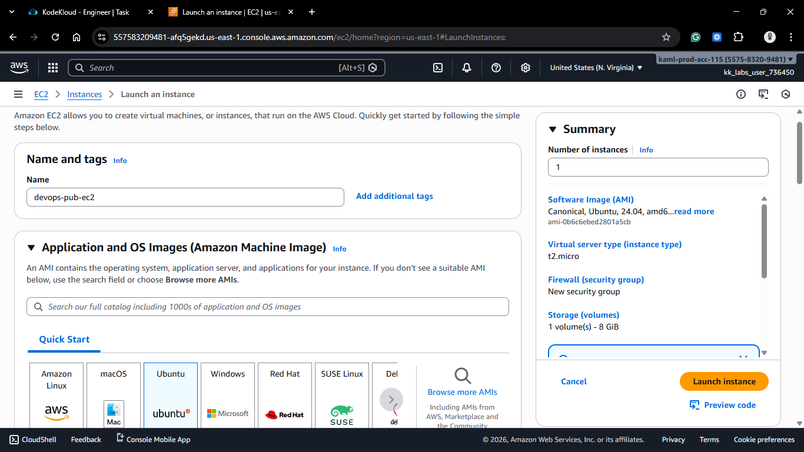
    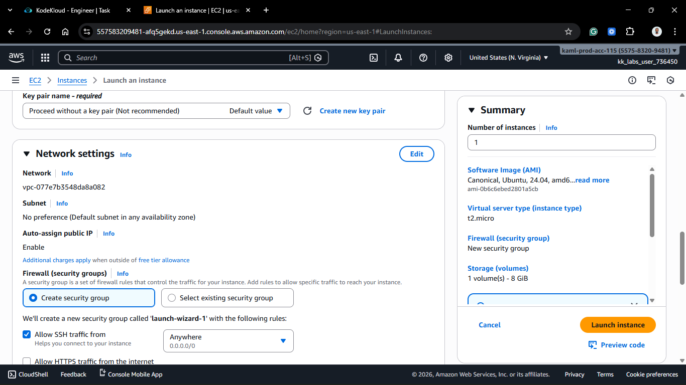
    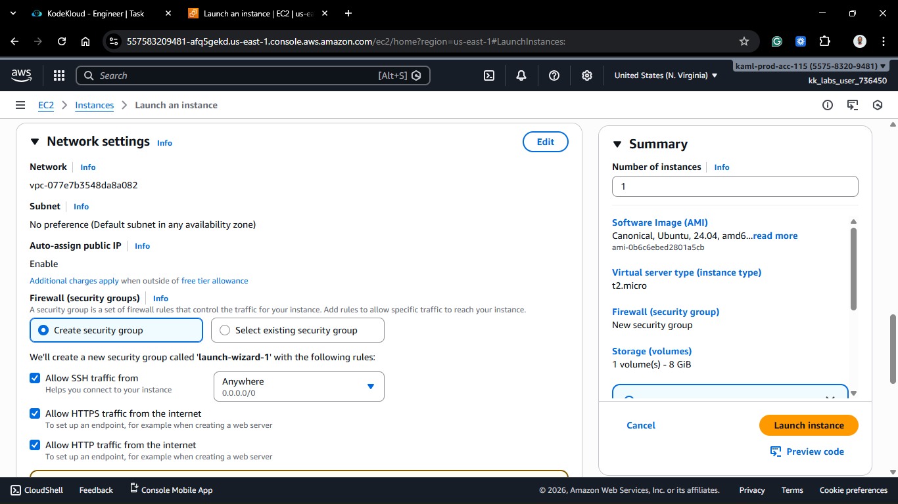
    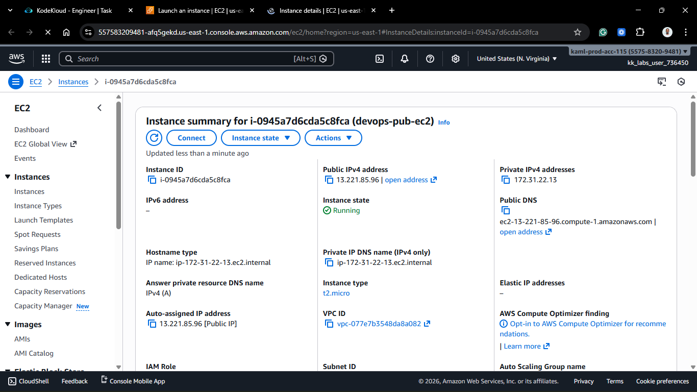

2.  **Network Settings (Crucial):**
    - **VPC:** Select `xfusion-pub-vpc` (NOT the default).
    - **Subnet:** Select `xfusion-pub-subnet`.
    - **Auto-assign Public IP:** Should show "Enable" (inherited from subnet).
    - **Security Group:** Create new.
      - Allow **SSH** (Port 22) from **Anywhere** (`0.0.0.0/0`).

3.  **Launch & Verify:**
    - Once running, try to SSH into the instance using its Public IP.

## 🧠 Theory: What makes a Subnet "Public"?

A subnet is only "Public" if it has a **Route Table** that points `0.0.0.0/0` to an **Internet Gateway**.
If you create a subnet and an IGW but forget to update the Route Table, the instance will have a public IP but won't be able to talk to the internet. It’s like having a house with a mailbox but no road leading to it.

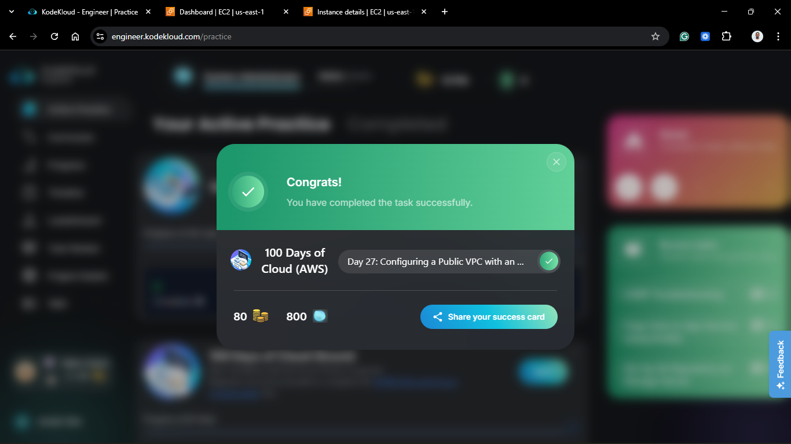
