# Day 28: Creating a Private ECR Repository

## Project Description

Today's task for the Nautilus DevOps team was to establish a secure home for our container artifacts. We moved from simply running code on servers to **Containerization**.

I created a private **Amazon Elastic Container Registry (ECR)** repository (`xfusion-ecr`) and pushed a custom application image to it.

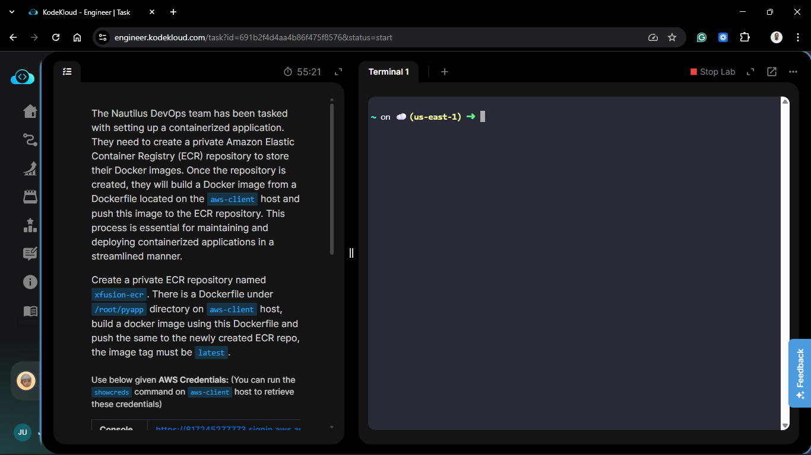

**What is ECR?**

ECR is AWS's managed Docker Registry. It is effectively "Docker Hub" but private and integrated with AWS IAM. It allows you to store, scan, and deploy container images securely.

## Steps & Configuration

### Part 1: Create the Repository

1.  **Create Repo:**
    Use the AWS CLI to create the repository where the images will live.
    ```bash
    aws ecr create-repository --repository-name xfusion-ecr --region us-east-1
    ```
    _Note the `repositoryUri` in the output (e.g., `123456789012.dkr.ecr.us-east-1.amazonaws.com/xfusion-ecr`). You will need this later._
    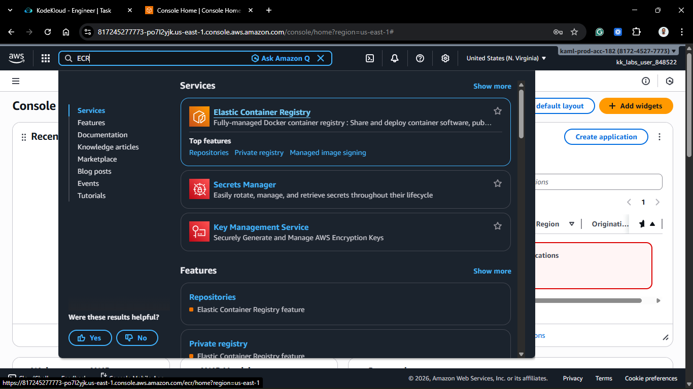
    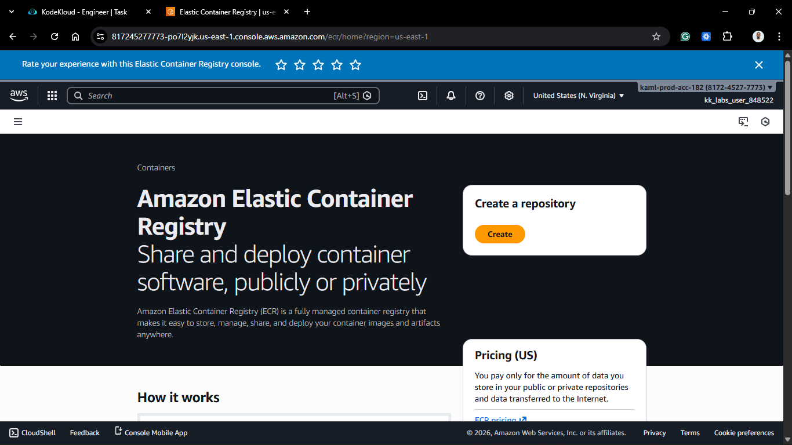
    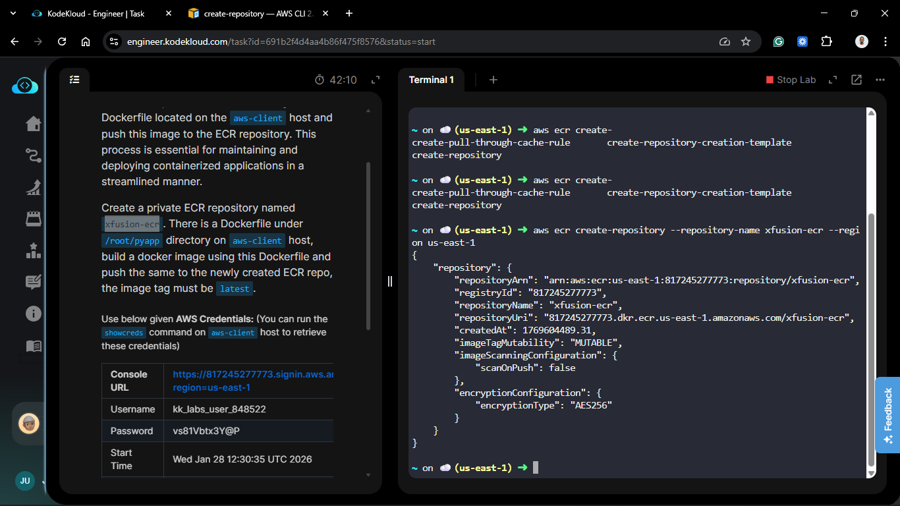
    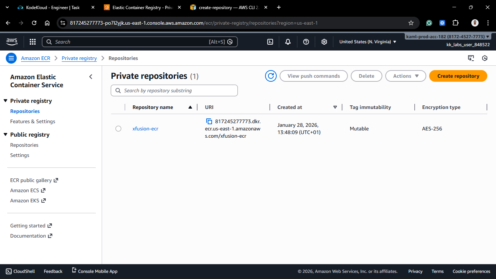

### Part 2: Build, Tag, and Push

1.  **Navigate to Code:**
    Move to the directory containing the Dockerfile.

    ```bash
    cd /root/pyapp
    ```

    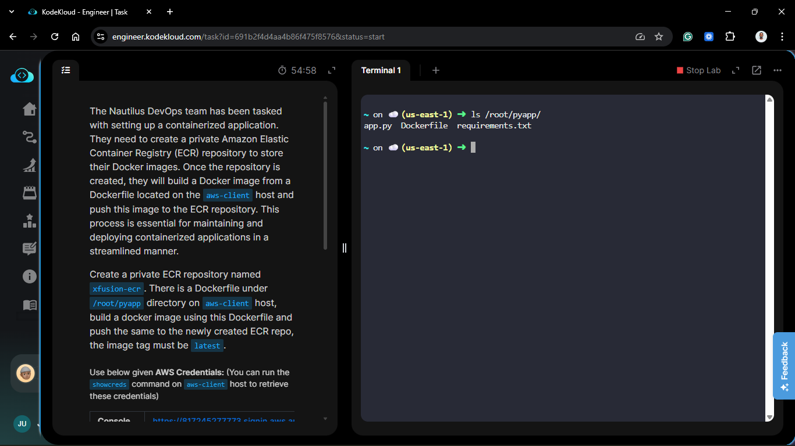

2.  **Authenticate Docker:**
    Before you can push to ECR, your local Docker client needs permission. We use the CLI to generate a temporary login token and pipe it to Docker.

    ```bash
    aws ecr get-login-password --region us-east-1 | docker login --username AWS --password-stdin <YOUR_ACCOUNT_ID>.dkr.ecr.us-east-1.amazonaws.com
    ```

    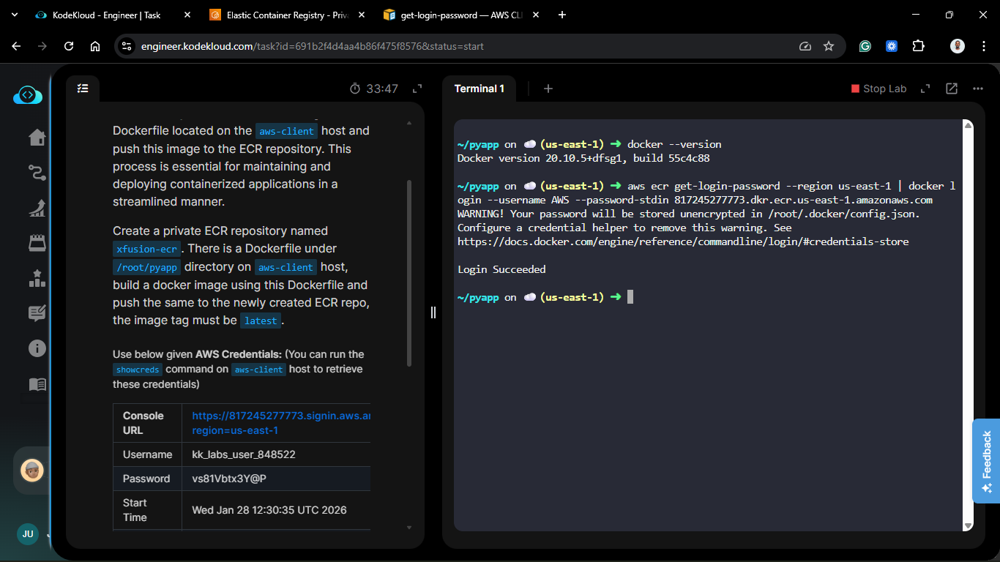

    _Success Message: `Login Succeeded`_

3.  **Build the Image:**
    Build the Docker image locally from the Dockerfile.

    ```bash
    docker build -t pyapp .
    ```

    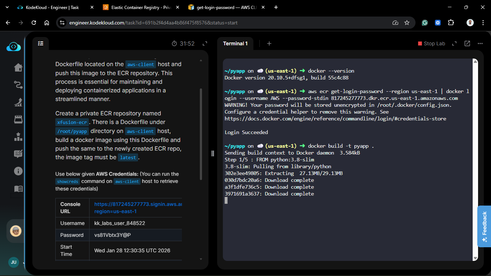
    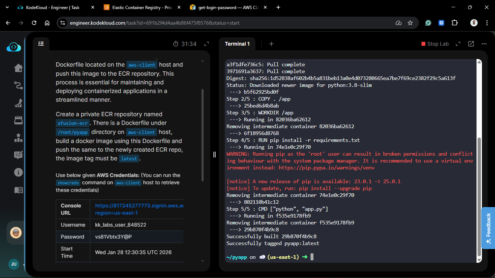
    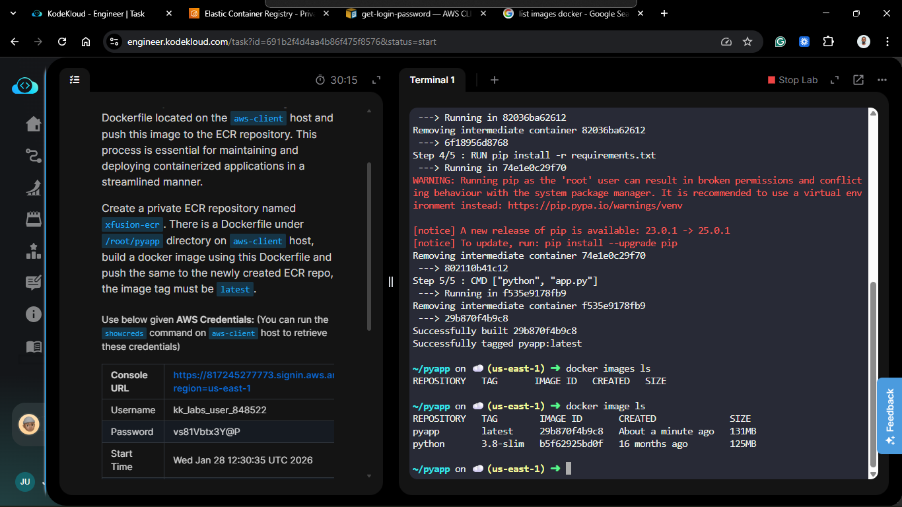

4.  **Tag the Image:**
    This is the most critical step. Docker needs to know _where_ to push the image. We do this by tagging the local image with the full ECR URI.

    ```bash
    docker tag pyapp <YOUR_ACCOUNT_ID>.dkr.ecr.us-east-1.amazonaws.com/xfusion-ecr:latest
    ```

    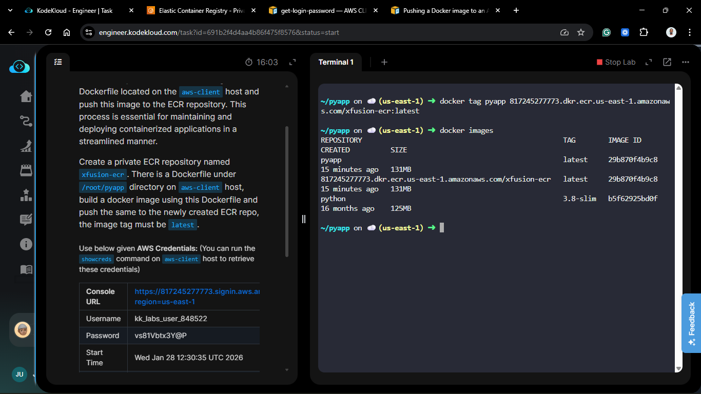

5.  **Push to ECR:**
    Upload the image to the cloud.
    ```bash
    docker push <YOUR_ACCOUNT_ID>.dkr.ecr.us-east-1.amazonaws.com/xfusion-ecr:latest
    ```
    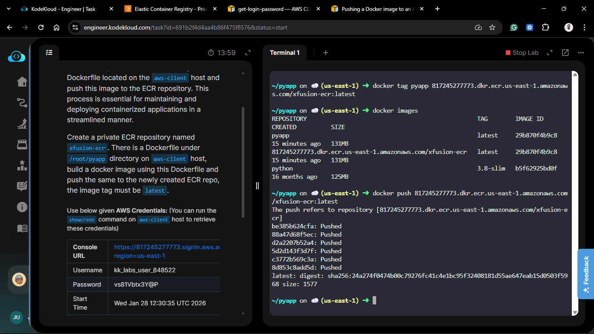

## 🧠 Theory: Using The "docker tag" Command

Beginners often confuse the `docker tag` command.
Think of it like putting an address label on a package.

- `pyapp:latest` is just the contents of the box.
- `<URI>/xfusion-ecr:latest` is the shipping label that tells Docker exactly which server (ECR) and which folder (Repo) to deliver it to.

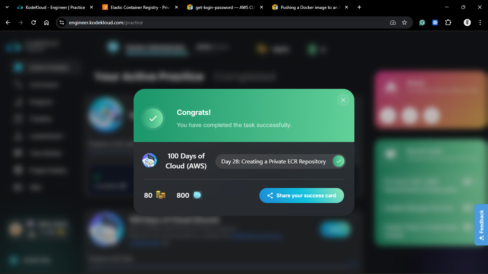
