# Day 31: Configuring a Private RDS Instance (MySQL)

## Project Description

Today's task for the Nautilus DevOps team was to provision a reliable database backend for a new application feature.
I set up a **Private Amazon RDS (Relational Database Service)** instance (`xfusion-rds`) running MySQL.

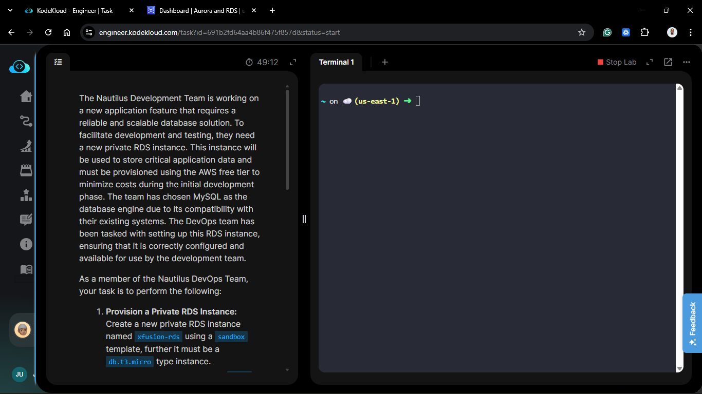

**The Goal:**
Provide a stable SQL database for the development team while keeping costs low (using `db.t3.micro`) and ensuring the database storage can grow automatically if the data exceeds the initial allocation.

## Steps & Configuration

### Step 1: Create Database

1.  Navigate to the **RDS Dashboard** > **Databases**.
2.  Click **Create database**.
3.  **Choose a database creation method:** Full Configuration.
    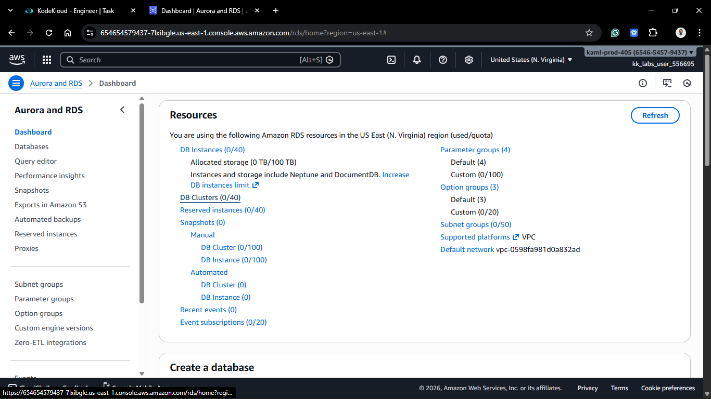
    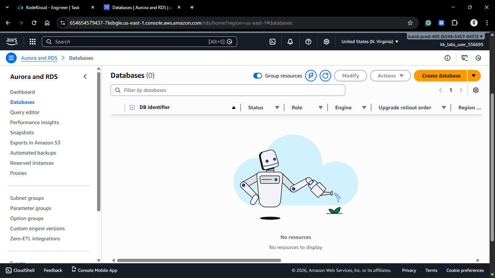
    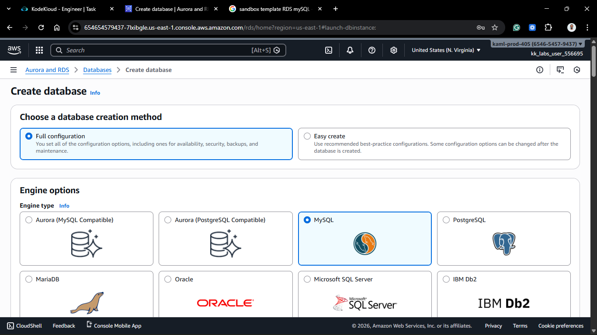

### Step 2: Engine Options

1.  **Engine options:** MySQL.
2.  **Engine Version:** Select **MySQL 8.4.x** (Strict requirement).
3.  **Templates:** Select **Free Tier**
    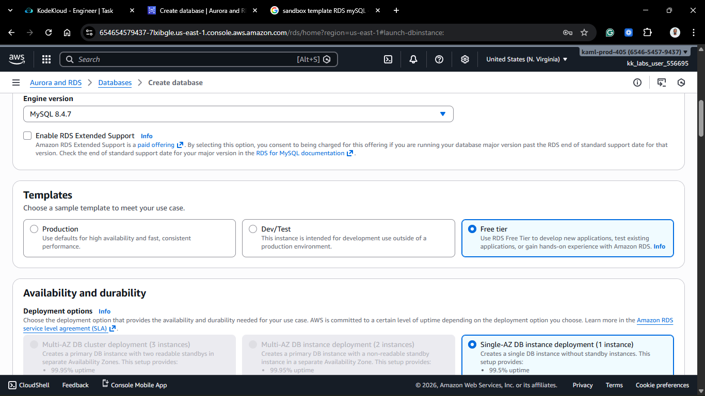
    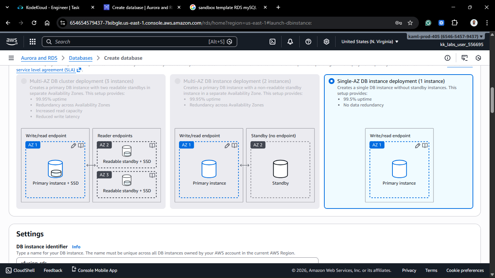

### Step 3: Settings

1.  **DB instance identifier:** `xfusion-rds`.
2.  **Credentials Settings:**
    _ **Master username:** `admin` (or `root`).
    _ **Master password:** Auto generate a password
    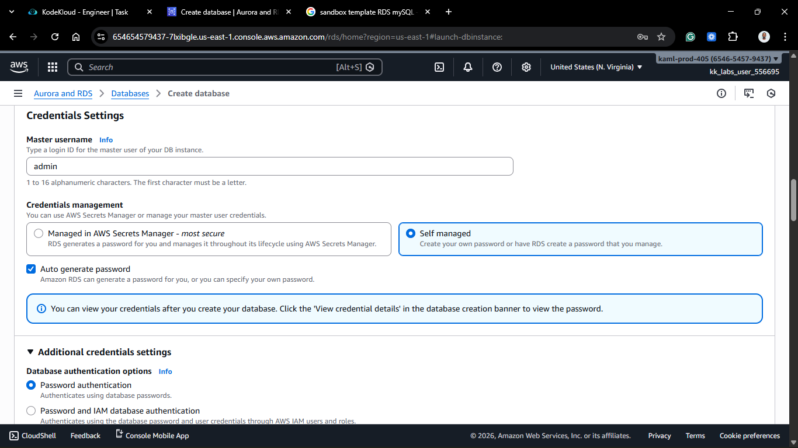

### Step 4: Instance Configuration

1.  **DB instance class:** Burstable classes > `db.t3.micro` (Strict requirement).
    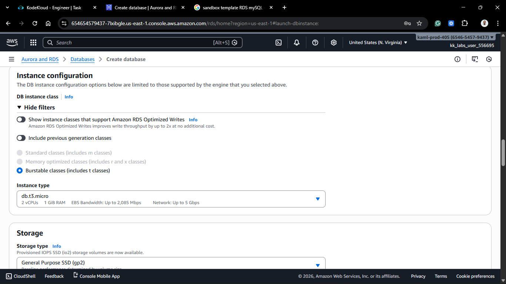

### Step 5: Storage (The Critical Part)

1.  **Storage type:** General Purpose SSD (gp2 or gp3).
2.  **Allocated storage:** 20 GiB (Default).
3.  **Storage Autoscaling:**
    _ **Enable storage autoscaling:** Checked.
    _ **Maximum storage threshold:** `50 GiB` (Strict requirement). \* _Why?_ This ensures that if the developers fill up the initial 20GB, the database will automatically expand up to 50GB without crashing.
    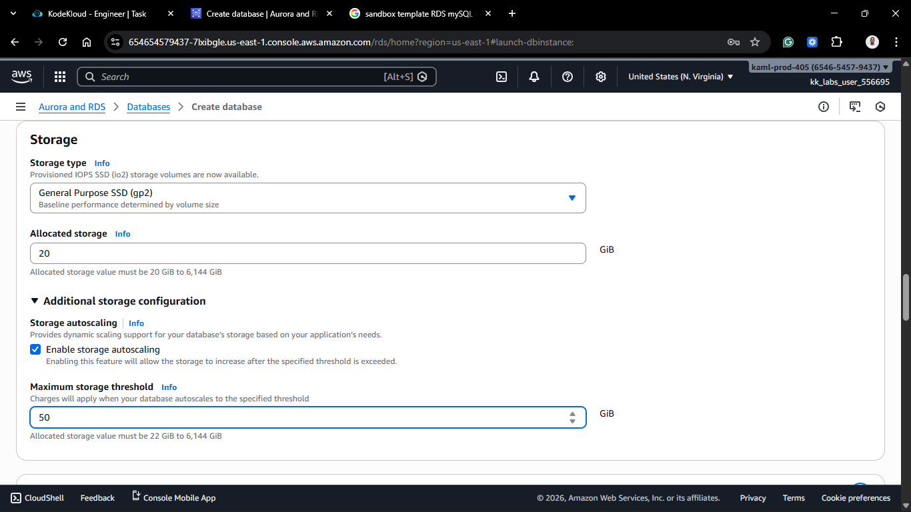

### Step 6: Check Connectivity

1.  **Compute resource:** Don't connect to an EC2 compute resource.
2.  **VPC:** Select the default or specific project VPC.
3.  **Public access:** **No** (Strict requirement for "Private" instance).
4.  **VPC Security Group:** Create new or select existing.

### Step 7: Finalize

1.  Keep the rest of the settings as default.
2.  Click **Create database**.
3.  **Wait:** RDS instances take 5-10 minutes to provision. Wait until the status is **Available**.
    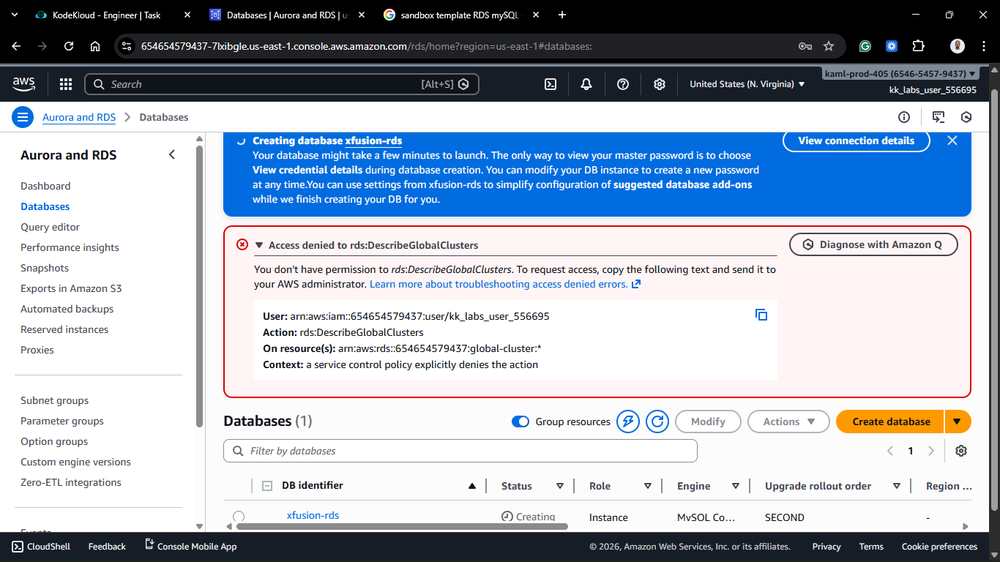
    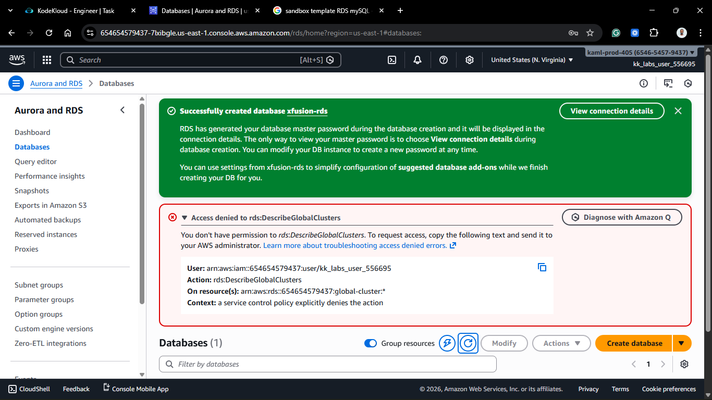
    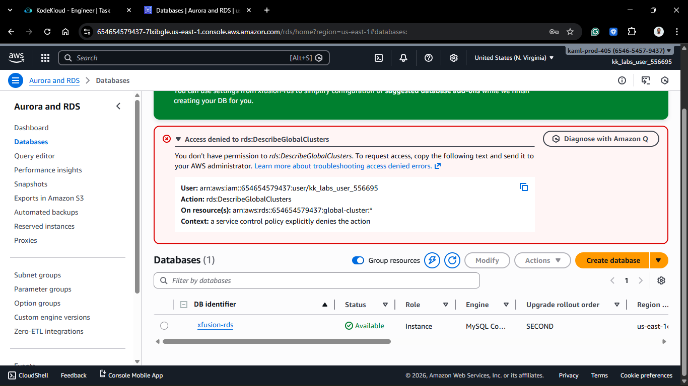

## 🧠 Theory: RDS Storage Autoscaling

One of the biggest fears in DB management is "Running out of disk space." In the old days, this meant downtime while you migrated to a bigger server.

With **Storage Autoscaling**, AWS monitors your free space. If it drops below 10%, AWS seamlessly adds more storage (up to your defined limit) without restarting the database.
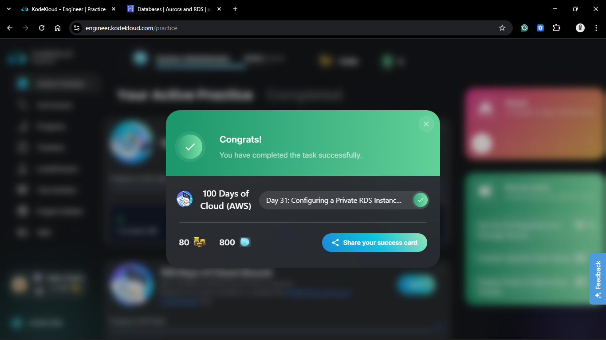
