# Day 32: RDS Snapshot and Restoration

## Project Description

Today's task for the Nautilus DevOps team was **Disaster Recovery Testing**.
Before a major update, we needed to verify our backup strategy. I manually triggered a snapshot of our production database (`datacenter-rds`) and restored it to a new, separate instance (`datacenter-snapshot-restore`).

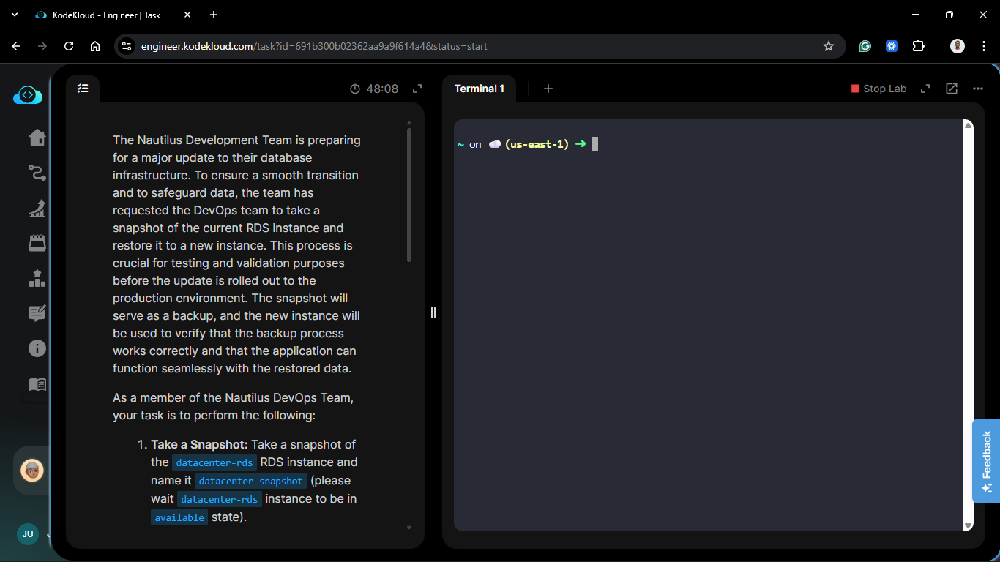

**The Goal:**

Prove that our backups are valid and that we can spin up a clone of the database for testing without affecting the live environment.

## Steps & Configuration

### Step 1: Create Snapshot

1.  Navigate to the **RDS Dashboard** > **Databases**.
    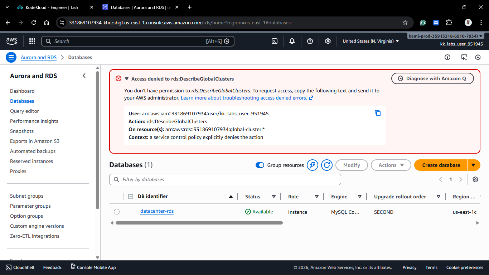
2.  Wait for the source instance `datacenter-rds` to be in the **Available** state.
3.  Select `datacenter-rds` and click **Actions** > **Take snapshot**.
    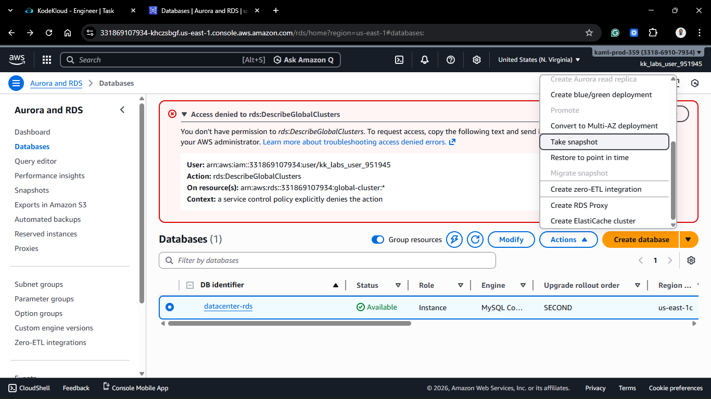

4.  **Snapshot Name:** `datacenter-snapshot` (Strict requirement).
    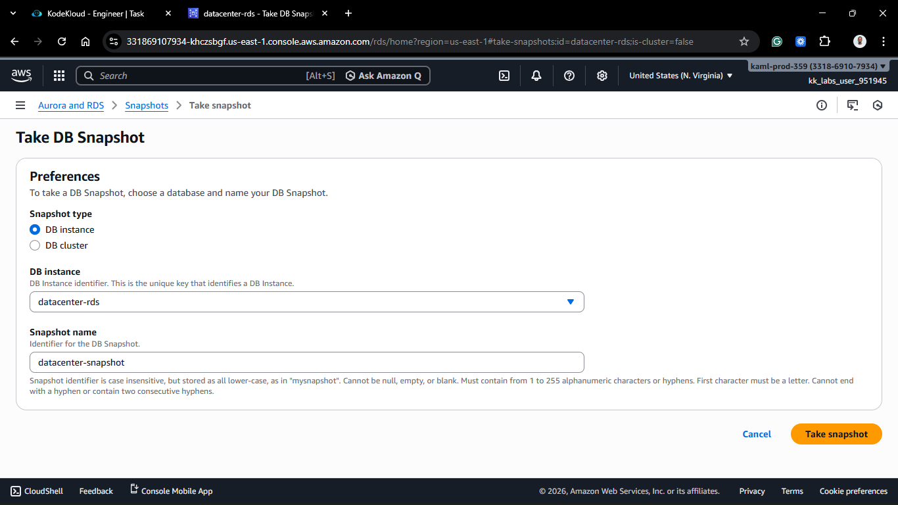

5.  Click **Take snapshot**.
    - _Wait:_ The snapshot status will move from "Creating" to "Available".
      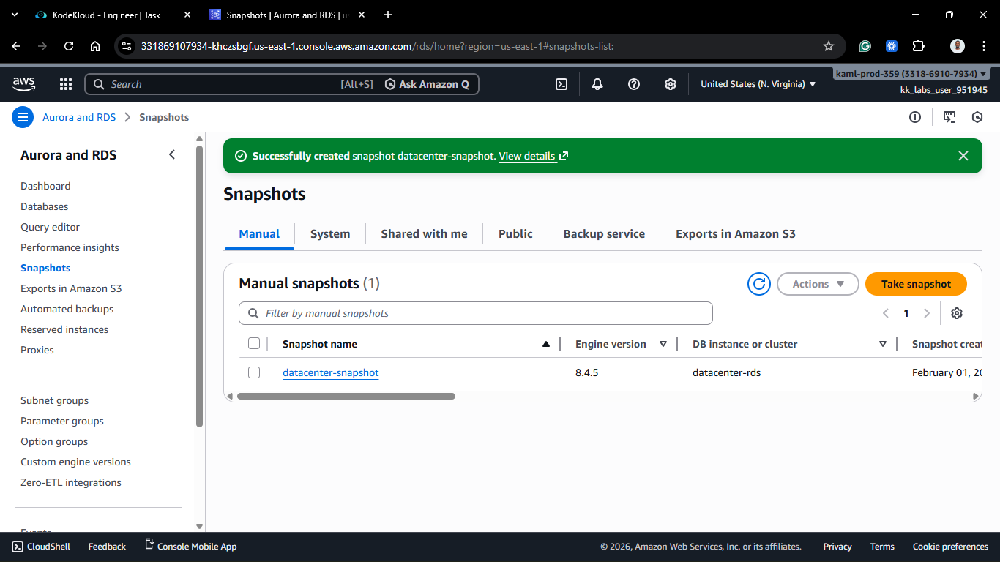
      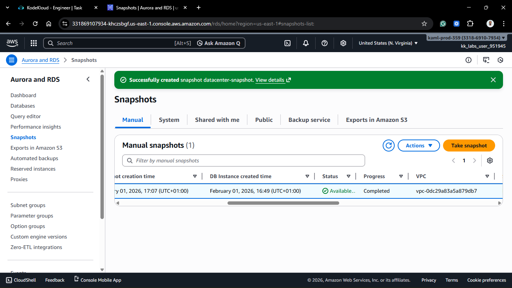

### Step 2: Restore from Snapshot

1.  Navigate to **Snapshots** in the left sidebar.
2.  Select the newly created `datacenter-snapshot`.
    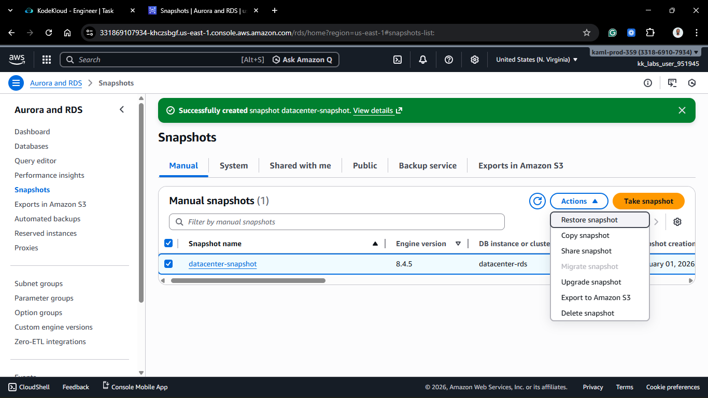

3.  Click **Actions** > **Restore snapshot**.

### Step 3: Configure New Instance

1.  **DB instance identifier:** `datacenter-snapshot-restore` (Strict requirement).
2.  **Instance configuration:**
    - The wizard defaults to the original instance size.
    - **Change this to:** `db.t3.micro` (Strict requirement).
3.  **Network/VPC:** Ensure it is deployed in the correct VPC (usually the same as the original for connectivity testing).
4.  **Public access:** No (unless specified otherwise).
    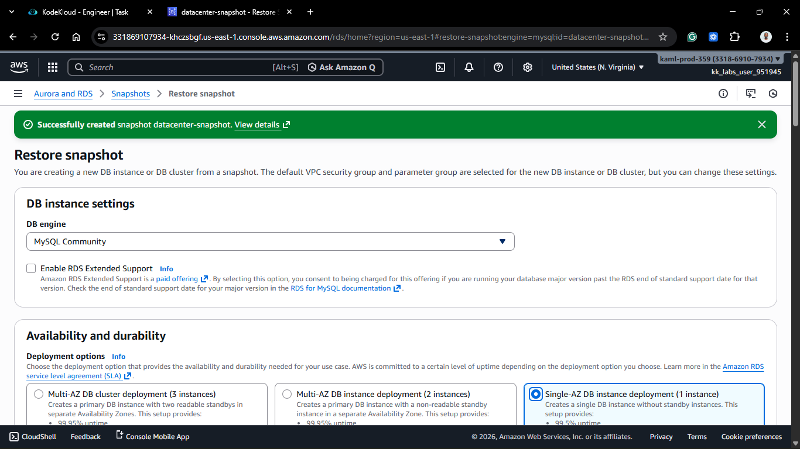
    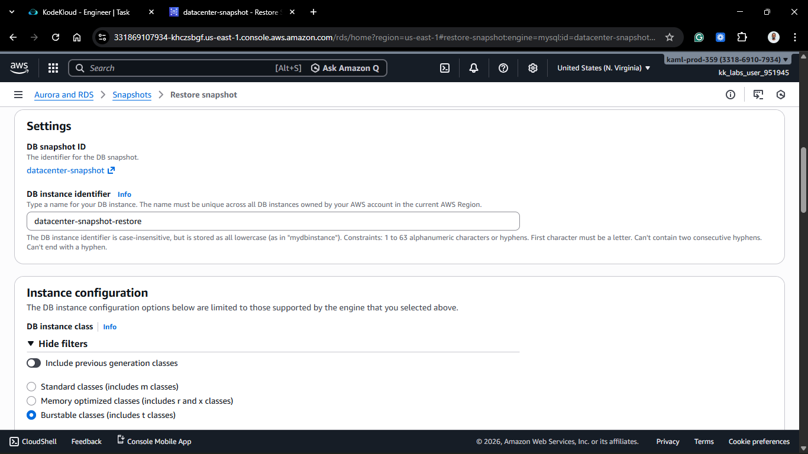
    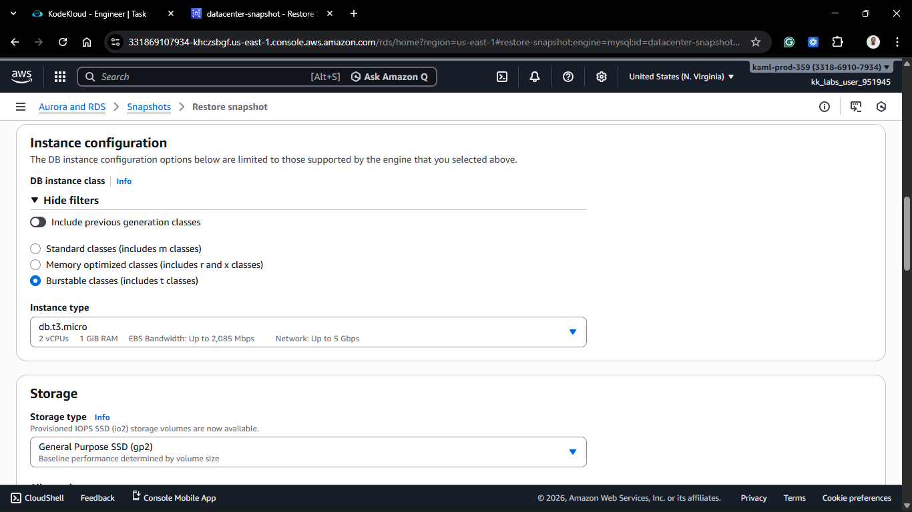
    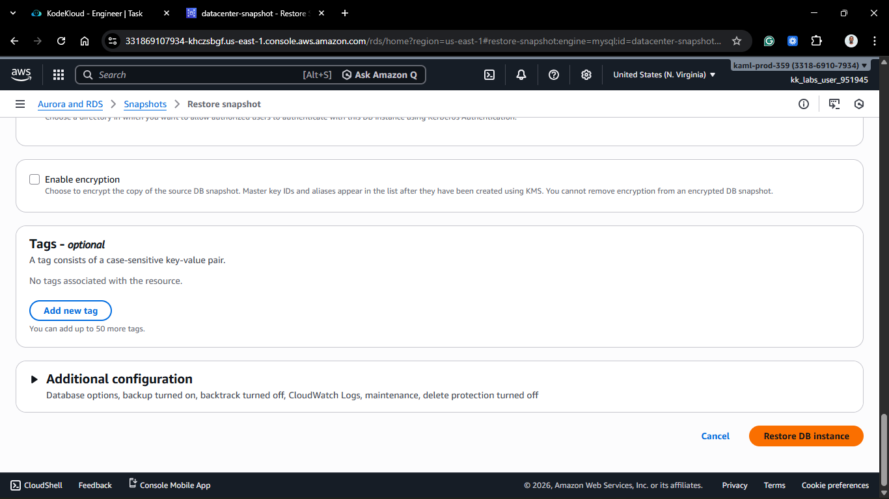

### Step 4: Verification

1.  Click **Restore DB instance**.
2.  **Wait:** Restoration takes longer than creation (often 10-15 minutes).
3.  The task is complete only when `datacenter-snapshot-restore` shows **Available**.
    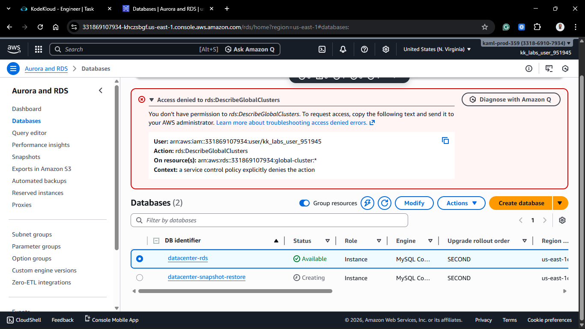
    

## 🧠 Theory: Snapshot vs. Read Replica

- **Snapshot:** A static point-in-time backup. Good for disaster recovery or creating test environments (like we did today). The new instance is completely independent of the original.
- **Read Replica:** A live, real-time copy. Good for scaling read traffic. The replica stays connected to the primary DB.
  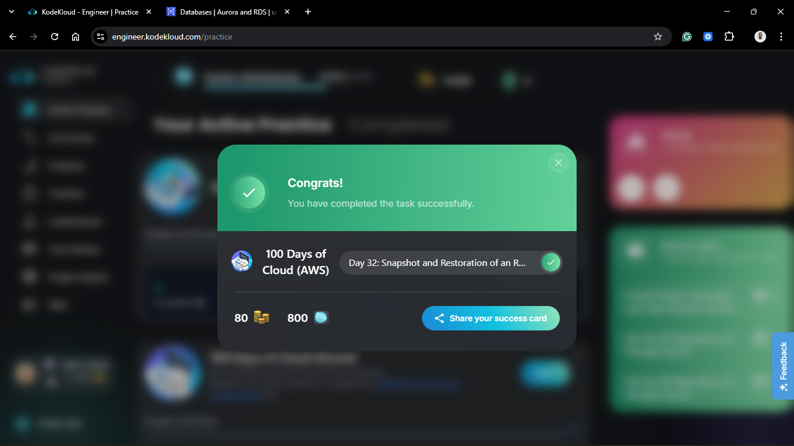
