# Day 33: Create a Lambda Function (Serverless "Hello World")

## Project Description

Today's task for the Nautilus DevOps team was to break the ice with **Serverless Computing**.
I created a simple **AWS Lambda** function (`devops-lambda`) to demonstrate how we can run code without provisioning or managing servers.
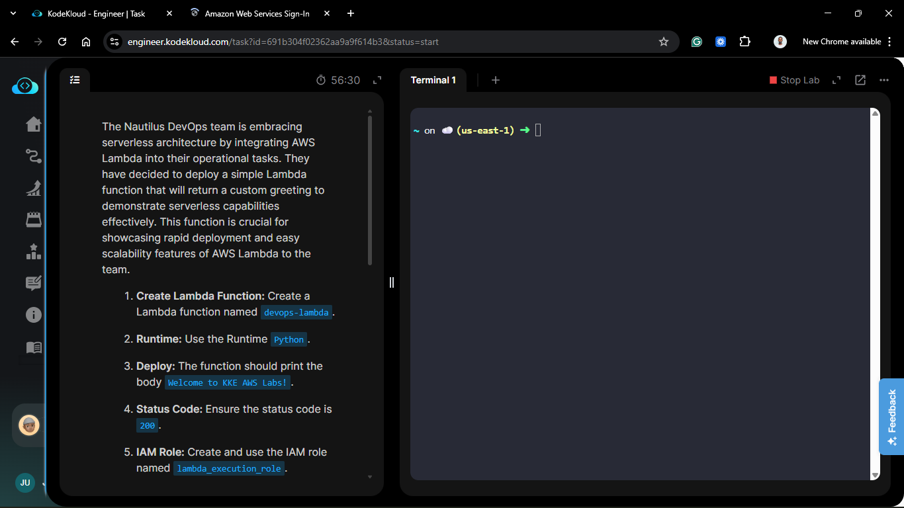

**The Goal:**
Deploy a Python function that returns a specific message ("Welcome to KKE AWS Labs!") and a 200 Status Code.

## Steps & Configuration

### Step 1: Create IAM Execution Role

Before creating the function, I needed an IAM role that gives Lambda permission to run (and log to CloudWatch).

1.  Navigate to **IAM** > **Roles** > **Create role**.
    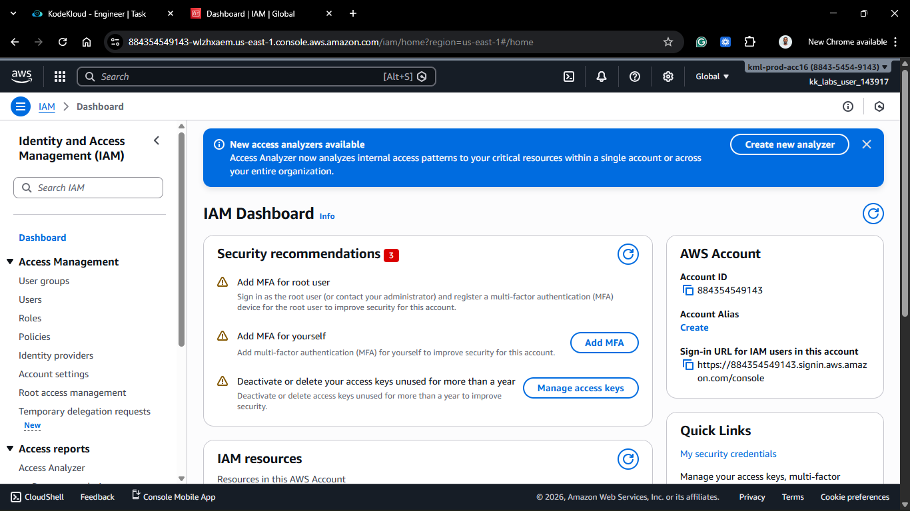
    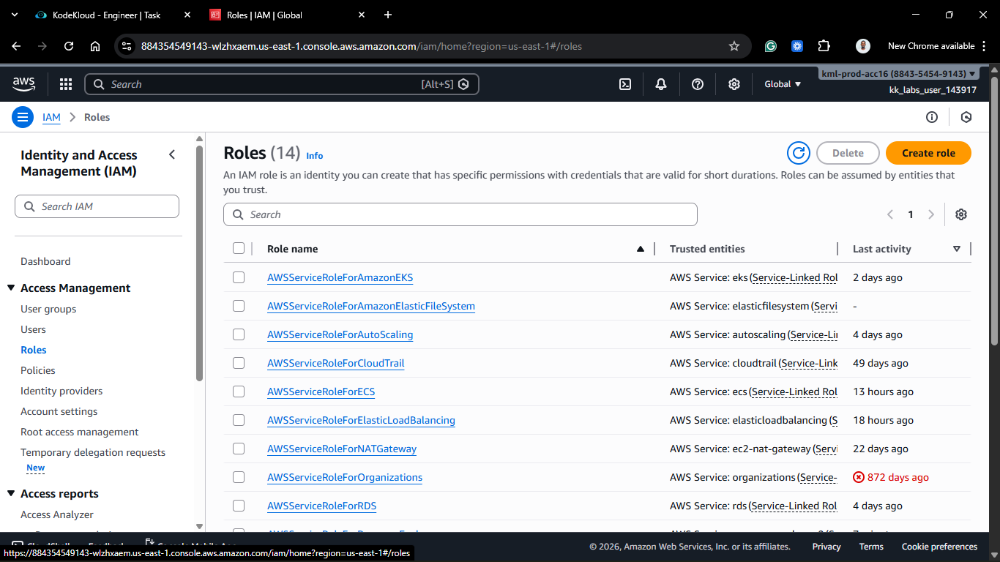

2.  **Trusted Entity Type:** AWS Service.
    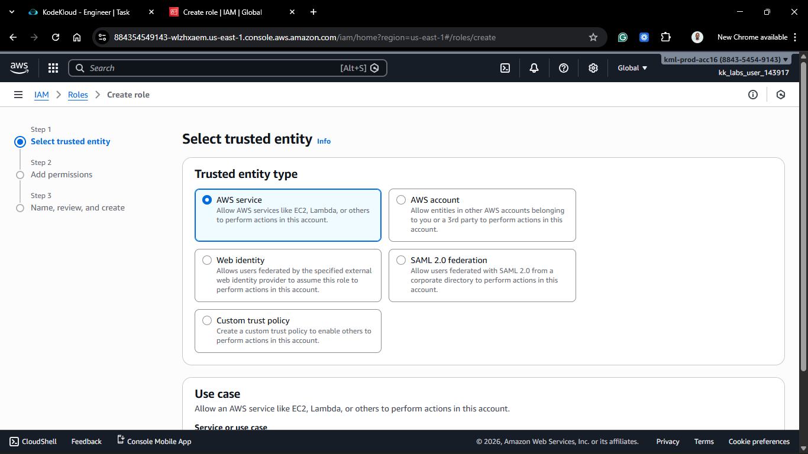

3.  **Service or use case:** Lambda.
    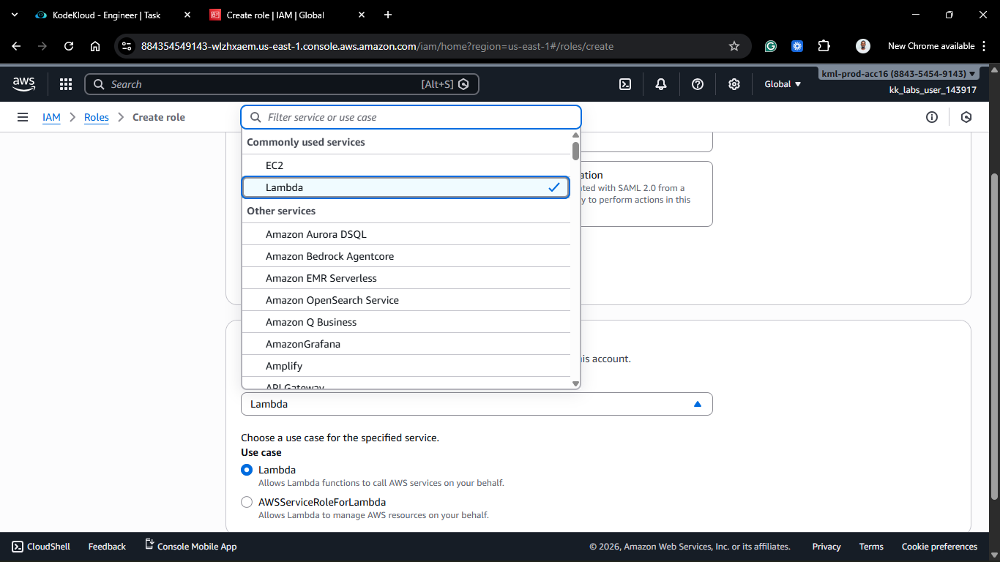

4.  **Permissions:** Search for and attach `AWSLambdaBasicExecutionRole` (allows writing to CloudWatch Logs).
    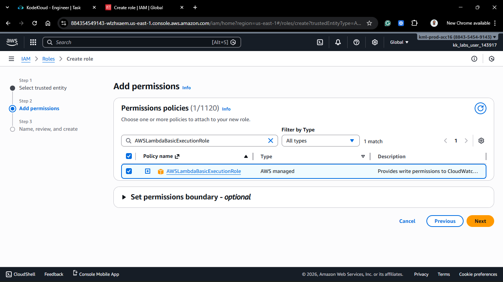

5.  **Role Name:** `lambda_execution_role` (Strict requirement).
    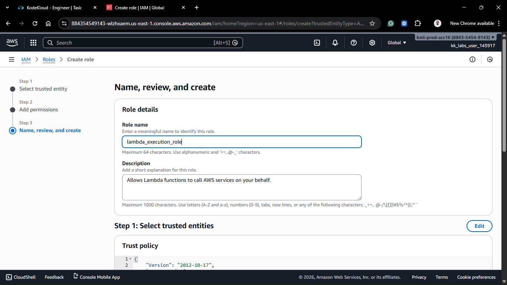
    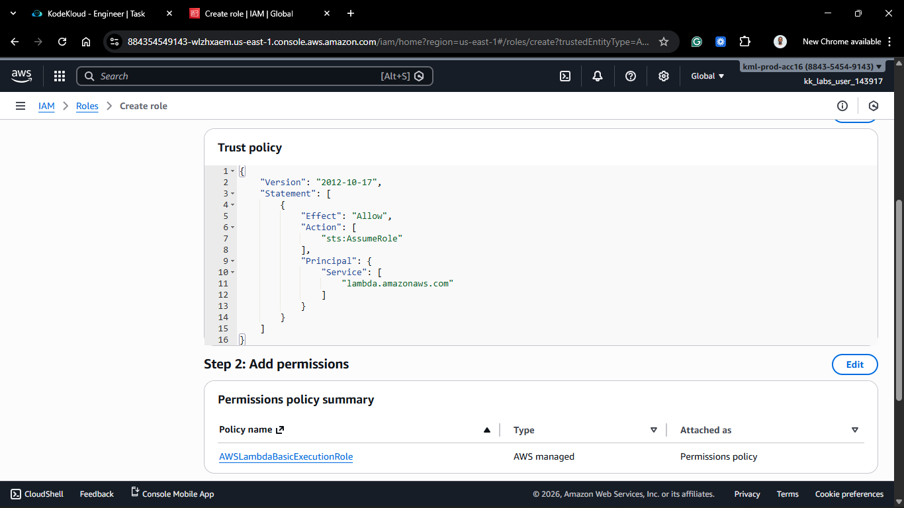

6.  Click **Create role**.
    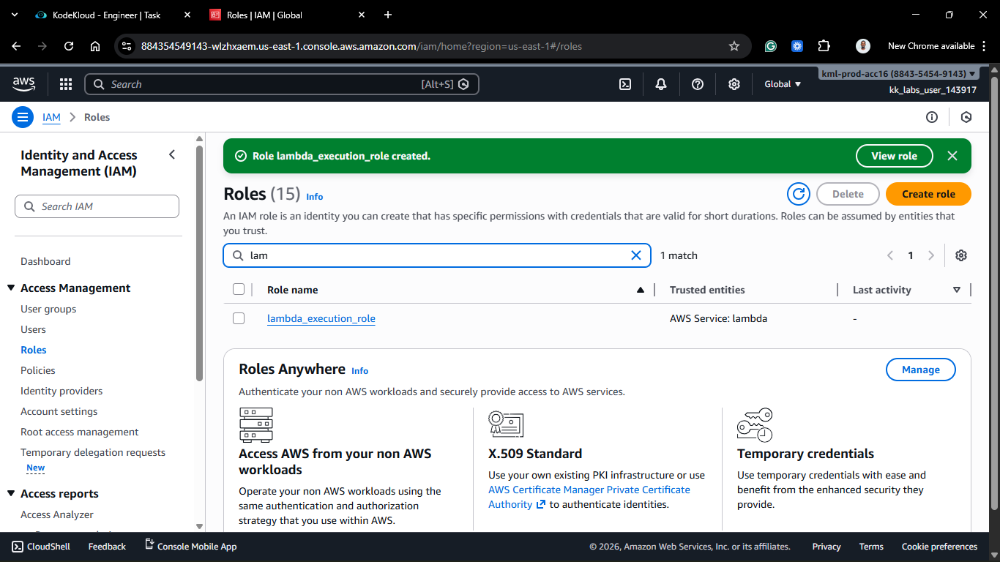

### Step 2: Create the Lambda Function

1.  Navigate to the **Lambda** service.
    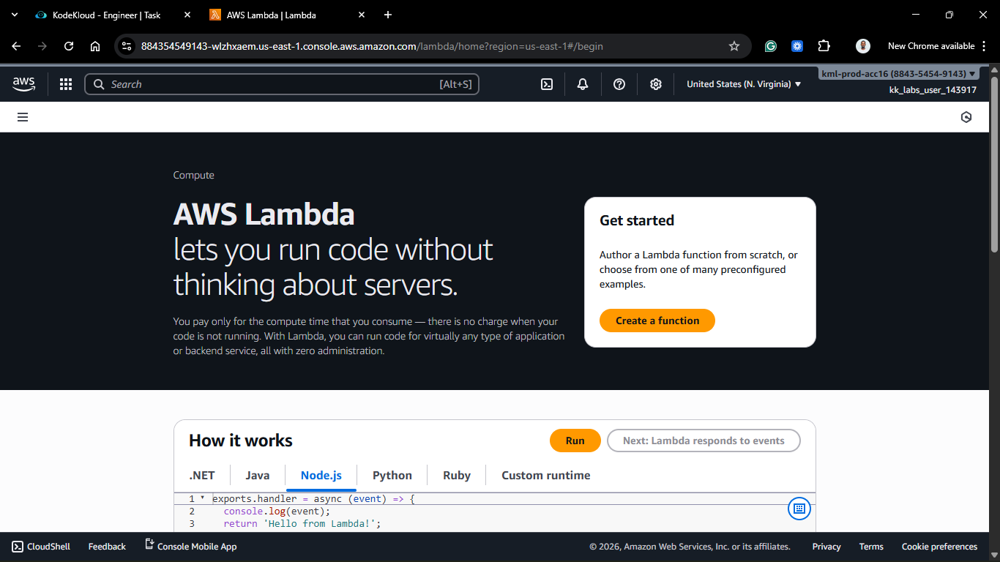

2.  Click **Create function**.

3.  **Author from scratch**.
    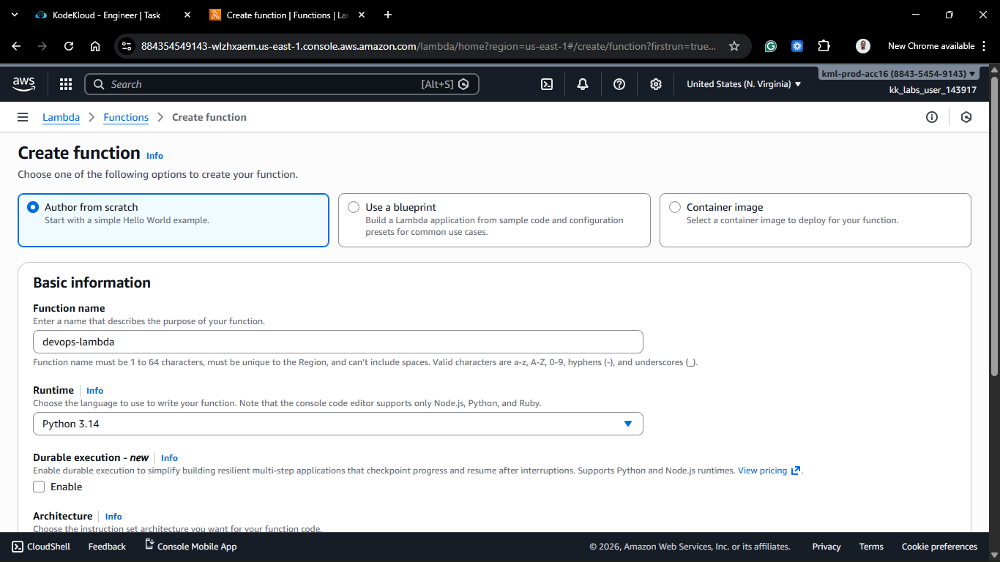
    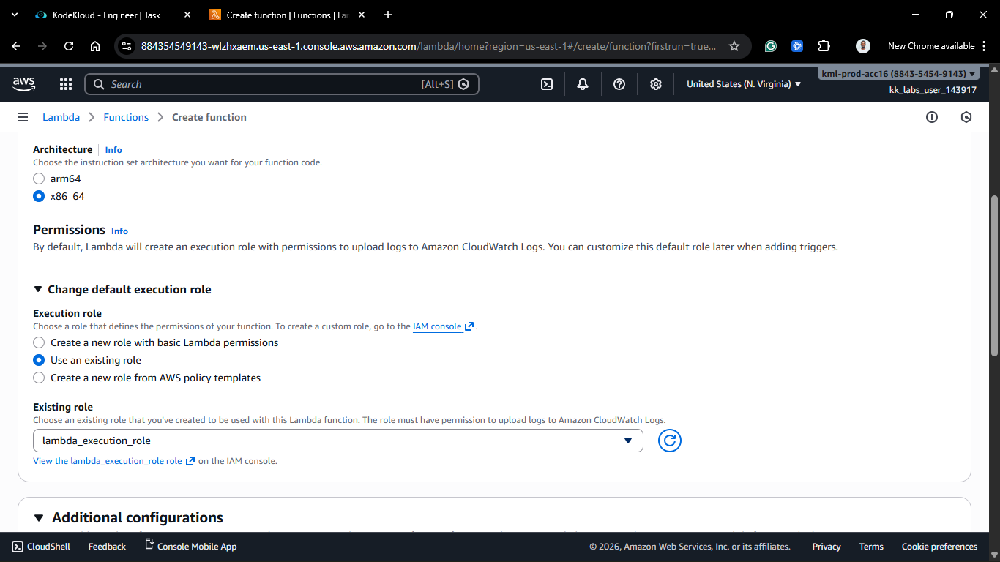

4.  **Function name:** `devops-lambda` (Strict requirement).
5.  **Runtime:** Python 3.x (e.g., Python 3.12).
6.  **Permissions:**
    - Expand **Change default execution role**.
    - Select **Use an existing role**.
    - Choose `lambda_execution_role` (created in Step 1).
      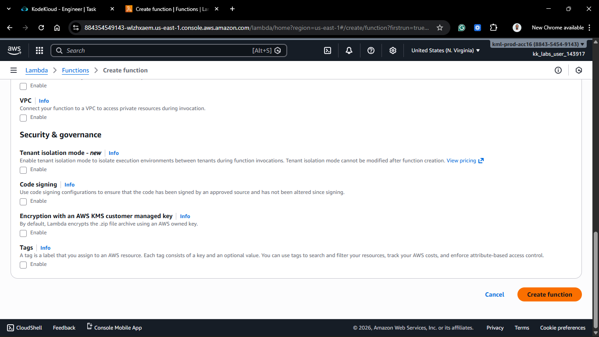

7.  Click **Create function**.
    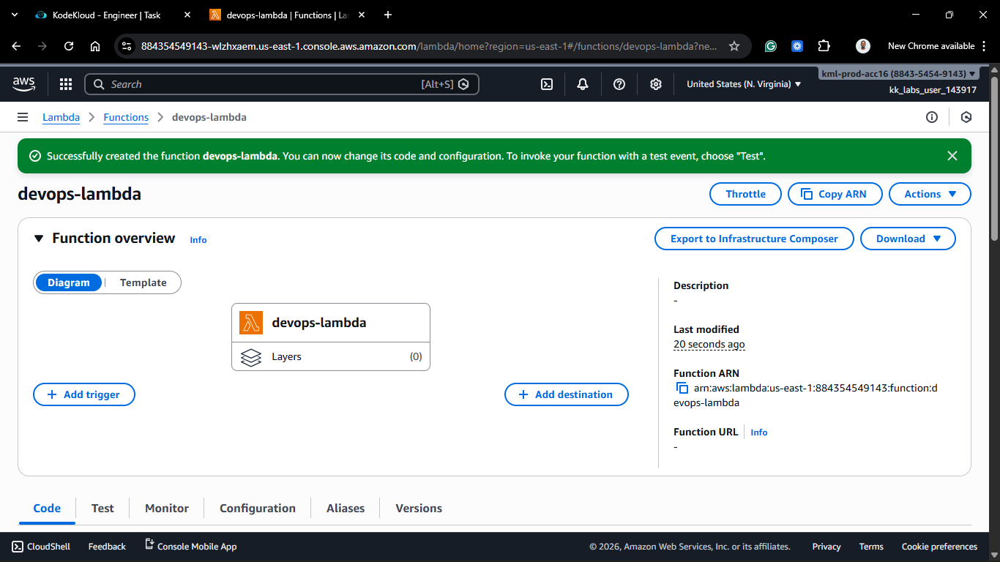
    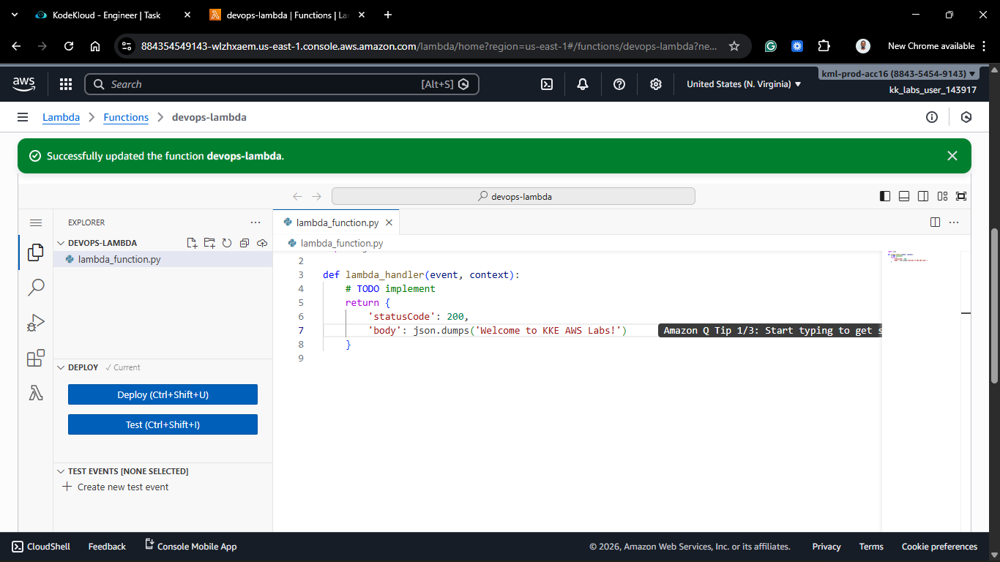

### Step 3: Deploy Code

1.  Scroll down to the **Code source** editor.
2.  Replace the default `lambda_function.py` code with the following:

```python
import json

def lambda_handler(event, context):
    # Requirement: Return status code 200 and specific body
    return {
        'statusCode': 200,
        'body': json.dumps('Welcome to KKE AWS Labs!')
    }
```

3. **Crucial**: Click Deploy to save the changes.

### Step 4: Test the Function

1. Click the **Test** tab.

2. Create a new test event (Name: TestEvent, Template: Hello World).

3. Click **Test**.

4. **Verify** **Results**:
   - Status: Succeeded.
   - Response:
     ```JSON
     {
     "statusCode": 200,
     "body": "\"Welcome to KKE AWS Labs!\""
     }
     ```
     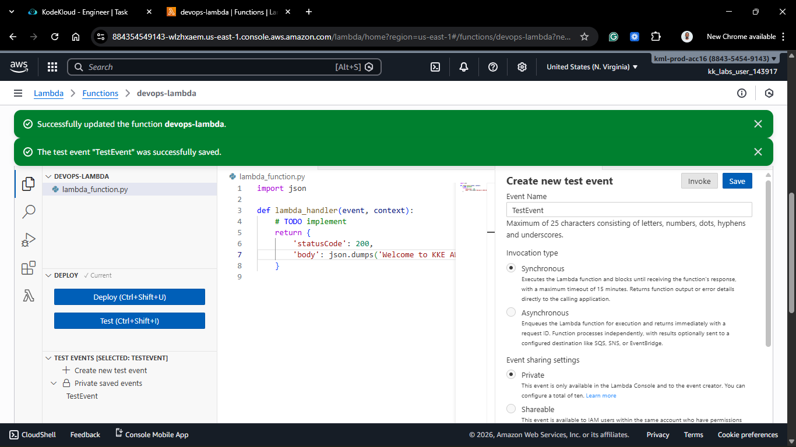
     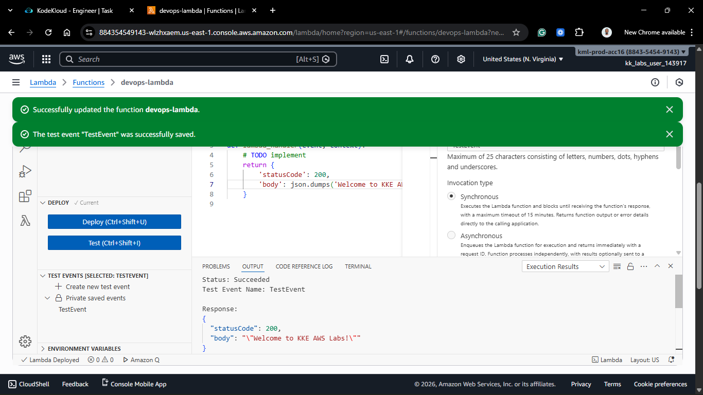

## 🧠 Theory: Why Serverless?

With EC2, you pay for the server running 24/7, even if no one uses it. With Lambda, you pay only for the milliseconds your code runs. If this function is triggered once a day, it costs effectively $0. This is the paradigm shift of Event-Driven Architecture.
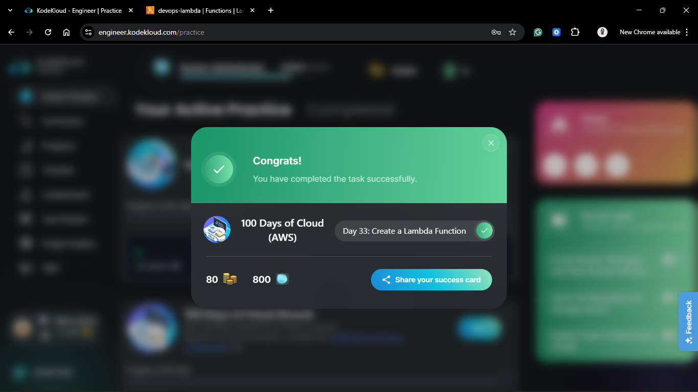
