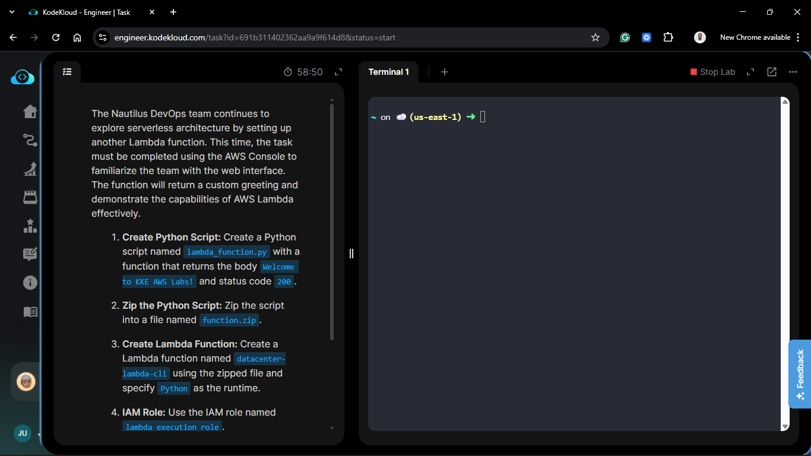
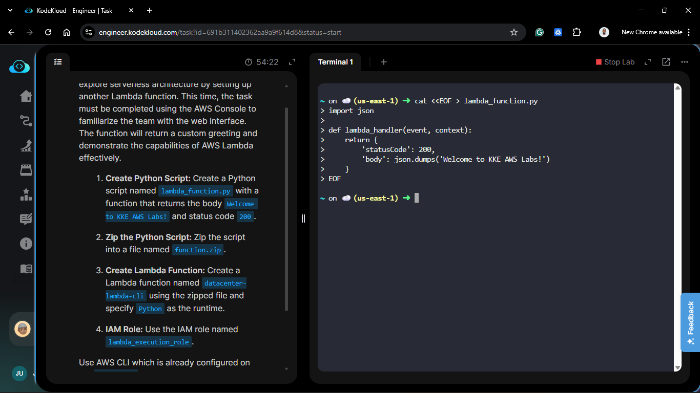
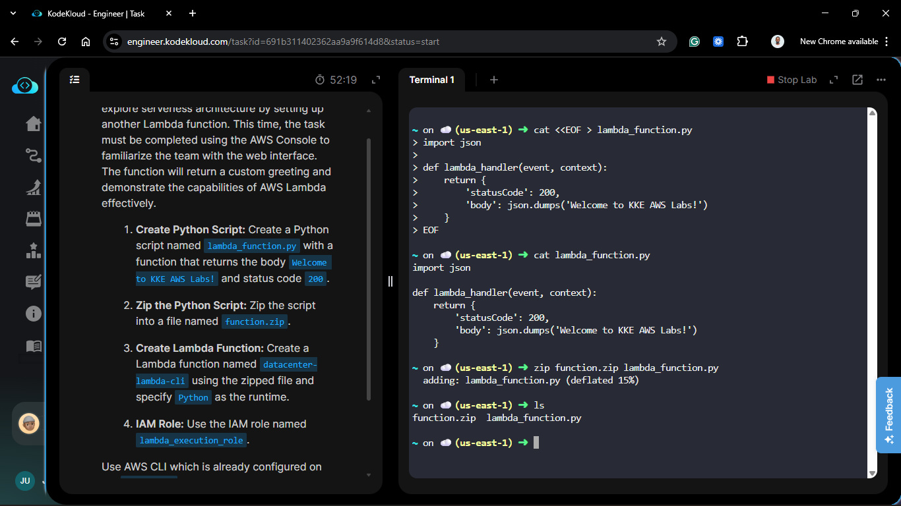
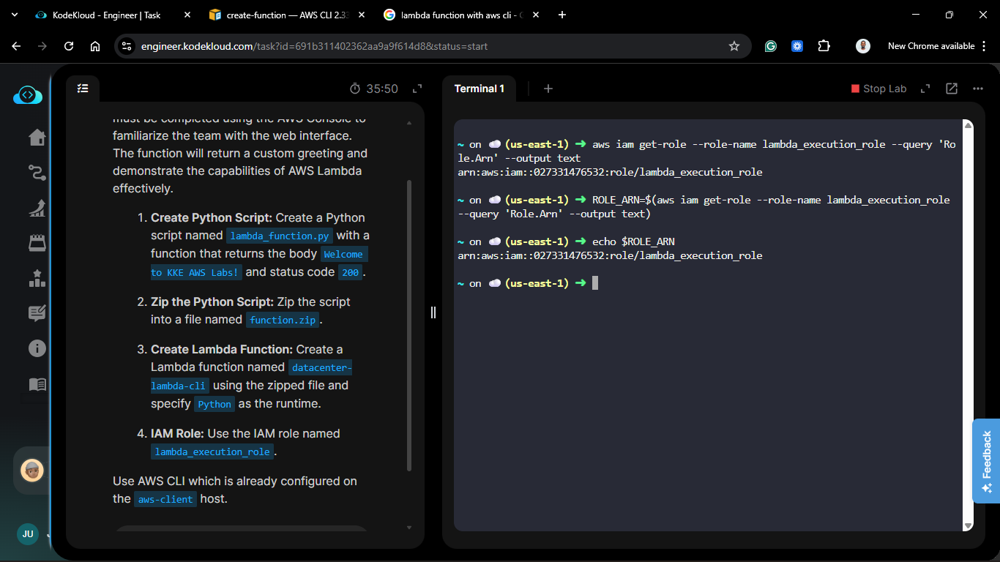
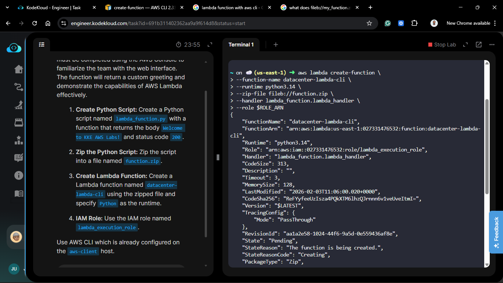
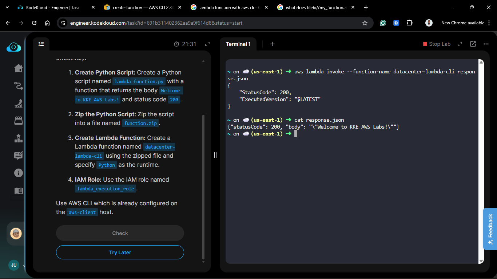
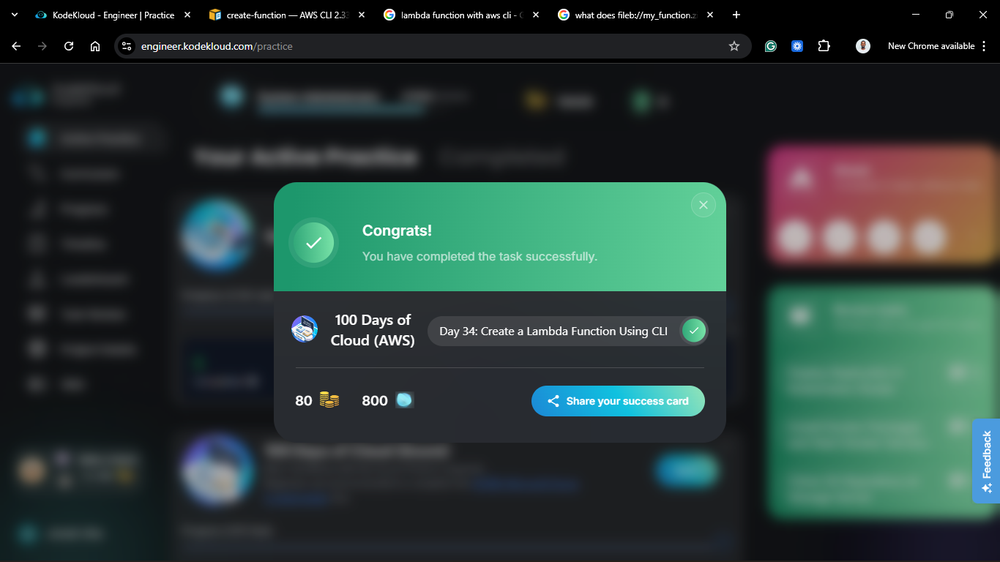

# Day 34: Create a Lambda Function (AWS CLI)

## Project Description

Today's task for the Nautilus DevOps team was to move away from the "ClickOps" of the Console and automate Serverless deployment using the **AWS CLI**.
I created and deployed a Python Lambda function (`datacenter-lambda-cli`) entirely from the command line on the `aws-client` host.



**The Goal:**
Package a local Python script into a zip file and upload it to AWS Lambda using a single CLI command.

## Steps & Configuration

### Step 1: Create the Python Script

On the `aws-client` host, I created the handler file:

```bash
cat <<EOF > lambda_function.py
import json

def lambda_handler(event, context):
    return {
        'statusCode': 200,
        'body': json.dumps('Welcome to KKE AWS Labs!')
    }
EOF
```



### Step 2: Zip the Code

Lambda requires the deployment package to be a `.zip` file.

```bash
zip function.zip lambda_function.py
```



### Step 3: Retrieve the IAM Role ARN

The CLI command requires the Role ARN (Amazon Resource Name), not just the name. I retrieved it programmatically:

```bash
ROLE_ARN=$(aws iam get-role --role-name lambda_execution_role --query 'Role.Arn' --output text)
echo $ROLE_ARN
```



### Step 4: Create the Function

I used the `aws lambda create-function` command to deploy the artifact.

- **Runtime**: `python3.14` (AWS CLI requires a specific version string).

- **Handler**: `lambda_function.lambda_handler` (FileName.FunctionName).

- **Zip** **File**: Note the `fileb://` prefix, which is required for binary file uploads in the CLI.

```bash
aws lambda create-function \
--function-name datacenter-lambda-cli \
--runtime python3.14 \
--zip-file fileb://function.zip \
--handler lambda_function.lambda_handler \
--role $ROLE_ARN
```



### Step 5: Verification (Optional)

To confirm it works without leaving the terminal:

```bash
aws lambda invoke --function-name datacenter-lambda-cli response.json
cat response.json
```



## 🧠 Theory: fileb:// Protocol

When using the AWS CLI, if you pass a binary file (like a zip) to a parameter, you must prefix it with `fileb://`. If you use `file://`, the CLI might try to encode it as text, corrupting the zip file.


