# Day 40: Troubleshooting Internet Accessibility for an EC2-Hosted Application

## Project Description

Today's task for the Nautilus DevOps team involved a deep dive into VPC networking. A web application running Nginx on `datacenter-ec2` was inaccessible from the internet, despite having the correct Security Group rules. I used the VPC Resource Map to identify a disconnected Internet Gateway (IGW) and restored the edge connectivity.

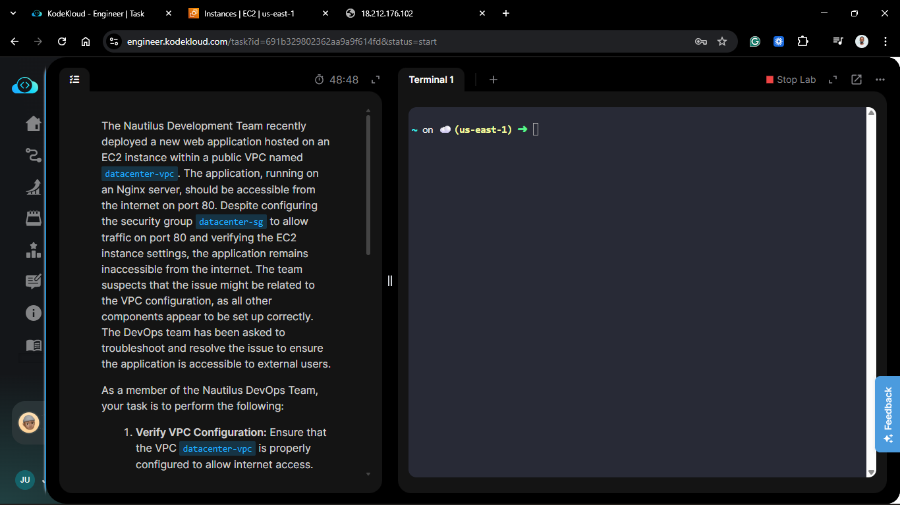

**The Goal:**
Identify why a public EC2 instance in a public VPC cannot be reached and resolve the underlying network configuration issue using AWS visual diagnostic tools.

## Steps & Configuration

### Step 1: Initial Assessment

1. **Instance Check:** I confirmed that `datacenter-ec2` was running and had a Public IPv4 address assigned.
2. **Security Group Review:** I verified that the Security Group attached to the instance allowed inbound HTTP traffic (port 80) from `0.0.0.0/0`.
   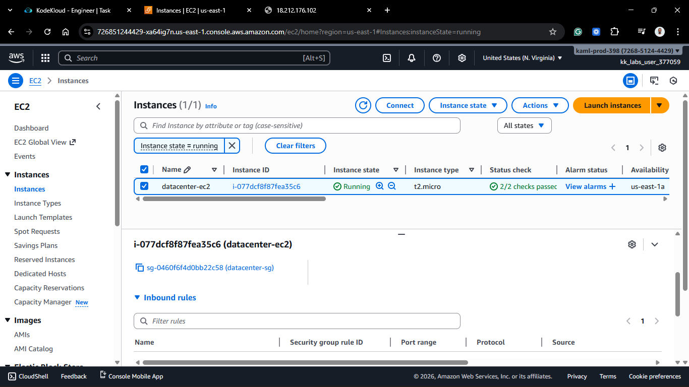
   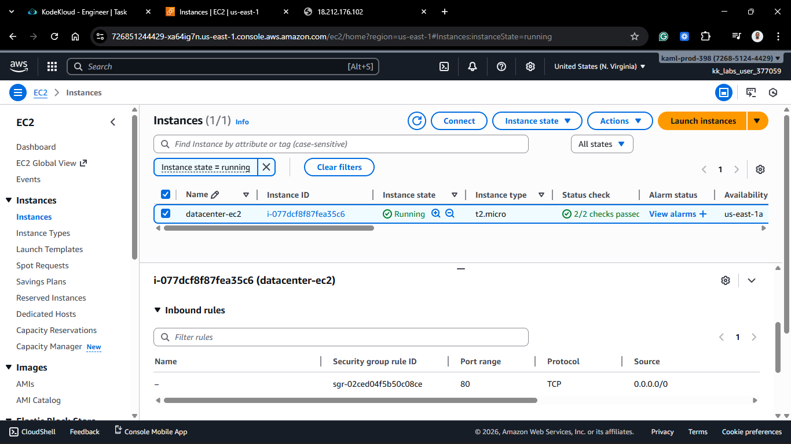

> Security Group rules were correctly configured, but the website was timing out.
> 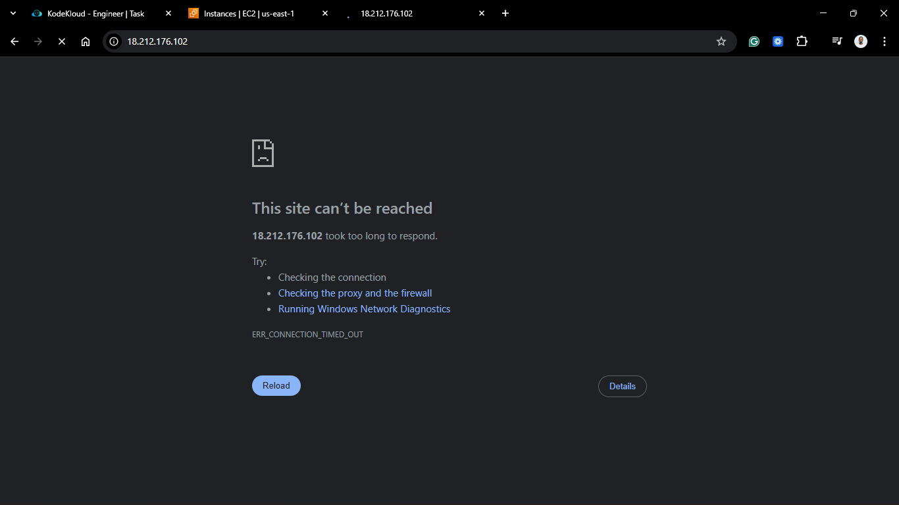

### Step 2: Visual Diagnosis

1.  **VPC Resource Map:** I navigated to the **VPC Dashboard** and selected `datacenter-vpc`.
2.  **Observation:** Looking at the **Resource Map**, I visually confirmed that while subnets and route tables were present, there was no line connecting the VPC to an **Internet Gateway**.
3.  **Conclusion:** The VPC was "orphaned" from the internet, meaning no traffic could enter or exit the network.
    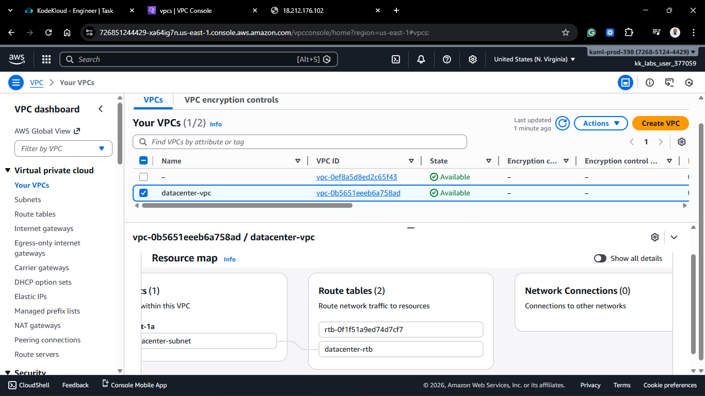

### Step 3: Locating the Detached Gateway

1.  Navigated to **VPC** > **Internet Gateways**.
2.  Found an IGW named `datacenter-ig`.
3.  **Status Check:** The gateway was in a `detached` state, confirm it wasn't providing internet access to any VPC.
    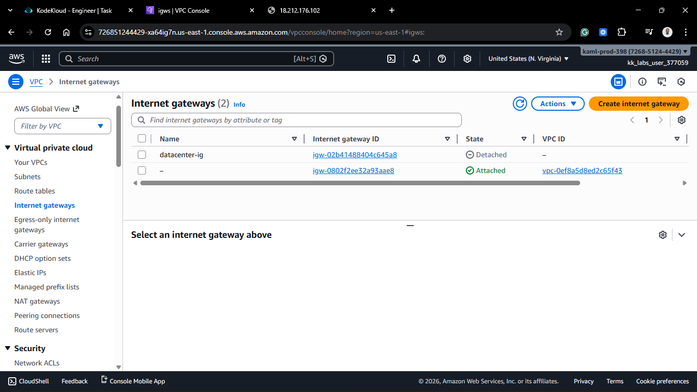

### Step 4: Attaching the Gateway

1.  Selected `datacenter-ig`.
2.  Click **Actions** > **Attach to VPC**.
3.  Selected `datacenter-vpc` from the list and clicked **Attach internet gateway**.
    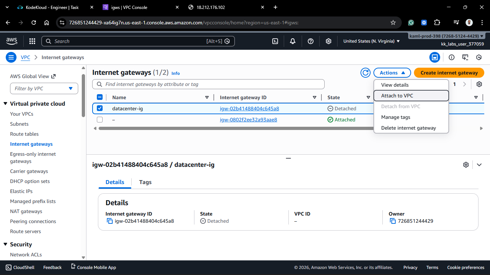
    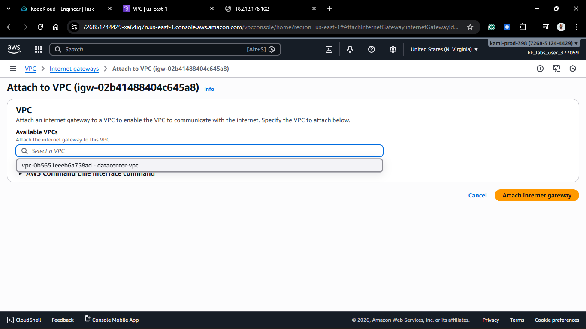
    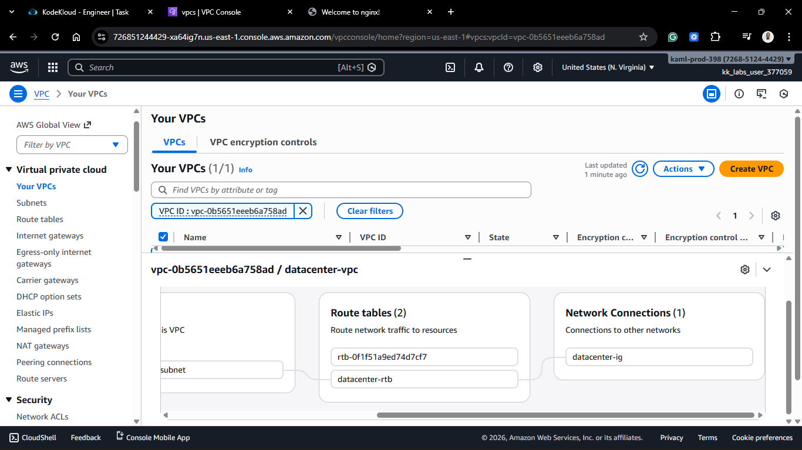

### Step 5: Route Table Update

1.  By attaching the IGW to the VPC and ensuring the association, the route table associated with the VPC established the necessary path for `0.0.0.0/0`.
2.  This automatically completed the network path from the Public Subnet to the Internet.
    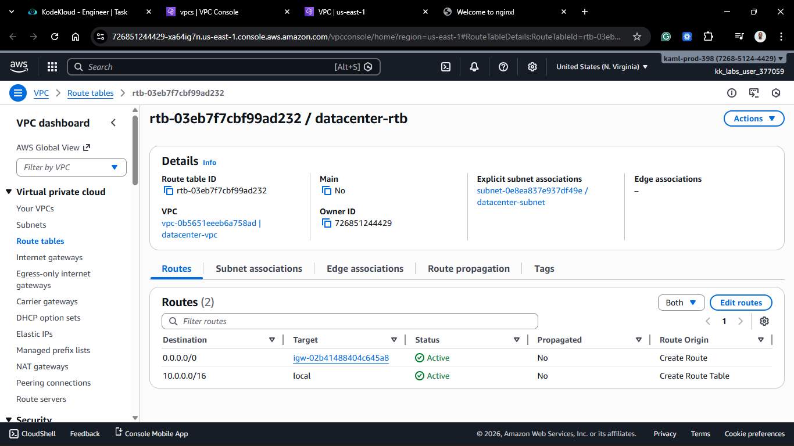

### Step 6: Final Verification

1.  Obtained the Public IPv4 address of `datacenter-ec2`.
2.  Accessed the IP in a web browser.
3.  **Result:** **200 OK**. The "Welcome to nginx!" default page appeared immediately. No further configuration was required.
    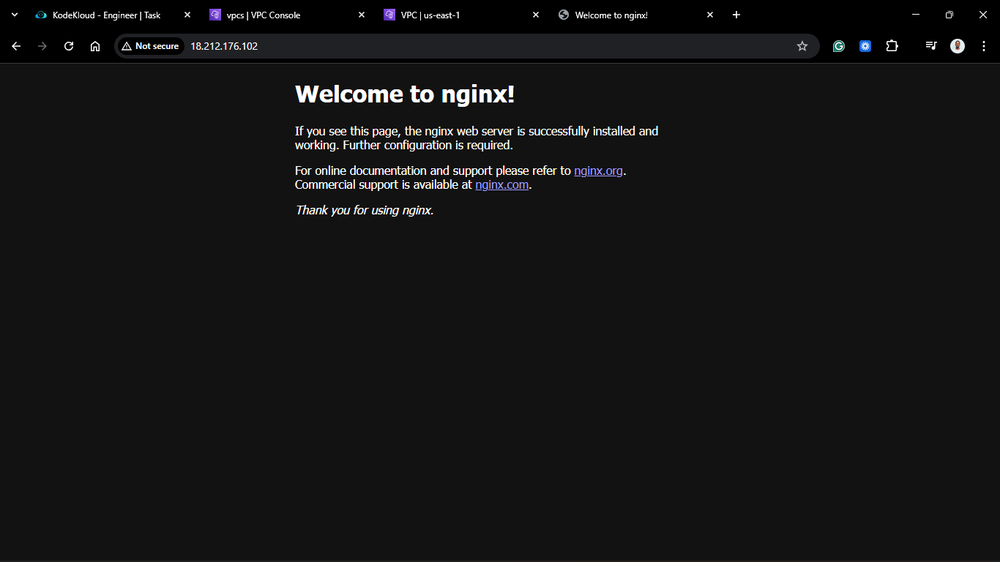

## 🧠 Theory: The VPC Resource Map

The **VPC Resource Map** is a powerful visual tool for DevOps engineers. Instead of clicking through multiple tabs to check Subnets, Route Tables, and Gateways, the map shows the relationships in a single diagram. If the line doesn't reach the "Internet" icon on the far right, your instances are effectively in a private island, regardless of their Public IP settings.

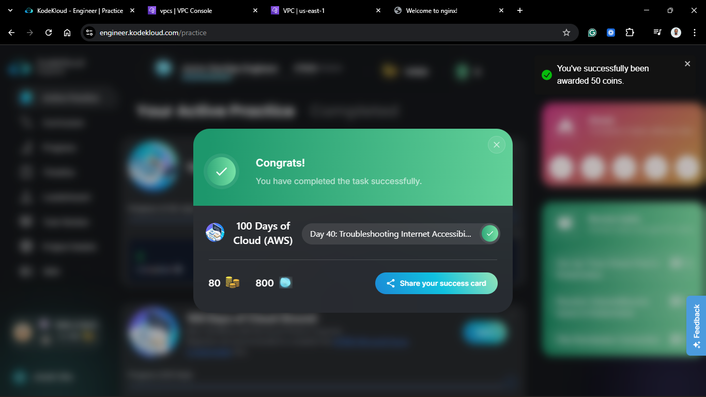
