# Day 41: Securing Data with AWS KMS

## Project Description

Today's task for the Nautilus DevOps team was focused on data security at rest. I utilized **AWS Key Management Service (KMS)** to perform envelope encryption on a sensitive local file. By creating a customer-managed key, we ensured that the encryption process is audited and the keys are stored securely within AWS.

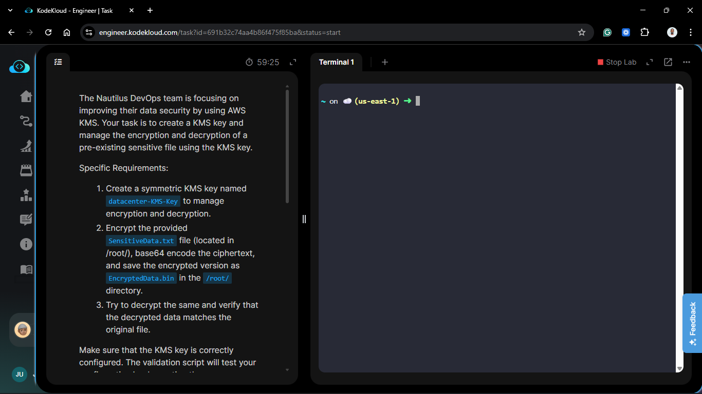

**The Goal:**
Create a symmetric KMS key, use the AWS CLI to encrypt a sensitive file, and verify the integrity of the process by decrypting it back to its original state.

## Steps & Configuration

### Step 1: Create the Symmetric KMS Key

1.  Navigate to **KMS** > **Customer managed keys** > **Create key**.
    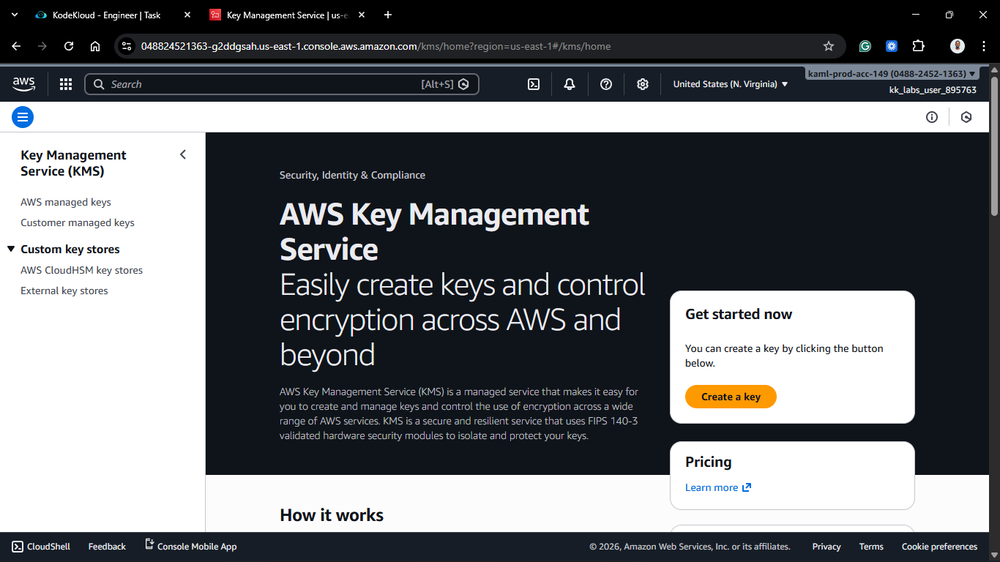
    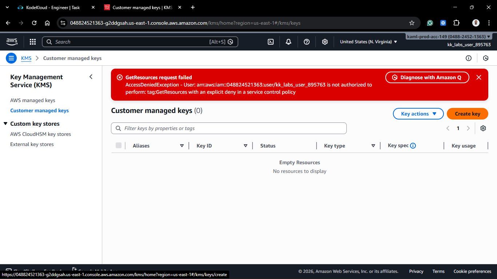

2.  **Key type:** Symmetric.
3.  **Key usage:** Encrypt and decrypt.
    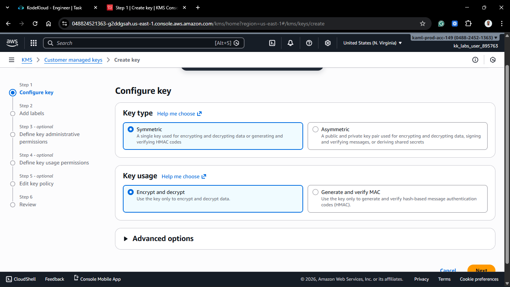

4.  **Alias:** `datacenter-KMS-Key` (Strict requirement).
    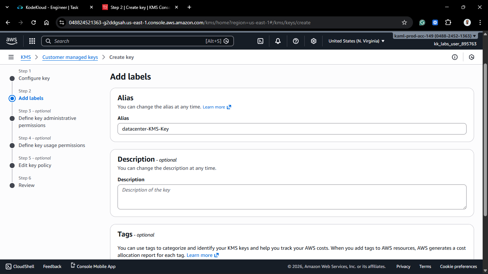

5.  **Key Administrators/Users:** Assigned the current IAM user/role to ensure permission to use the key.
    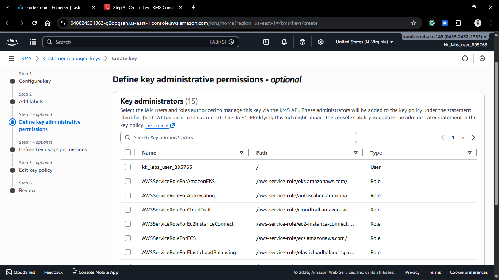
    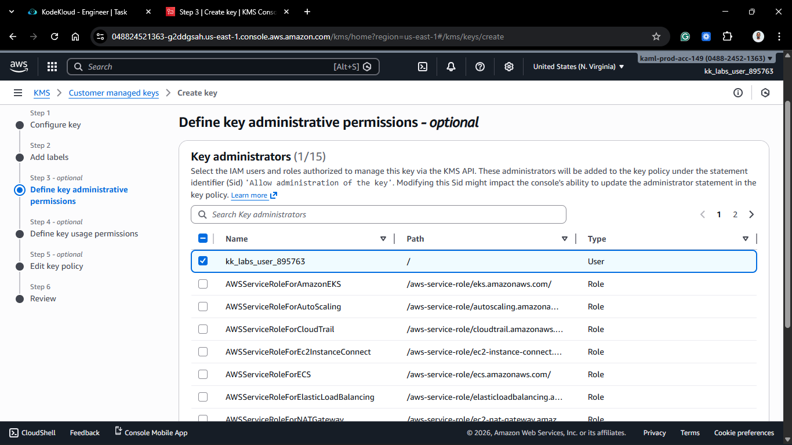
    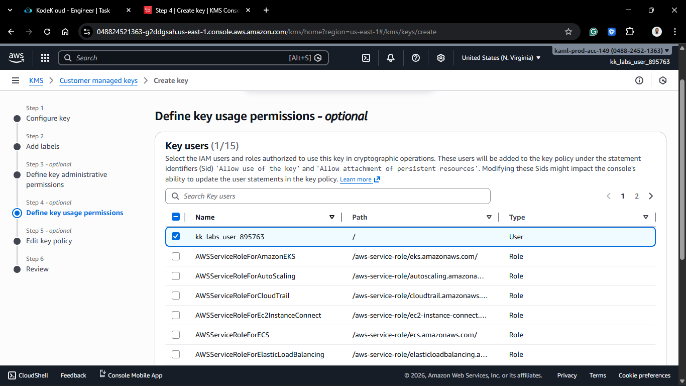

6.  Captured the **Key ID** or **ARN** for use in the CLI.
    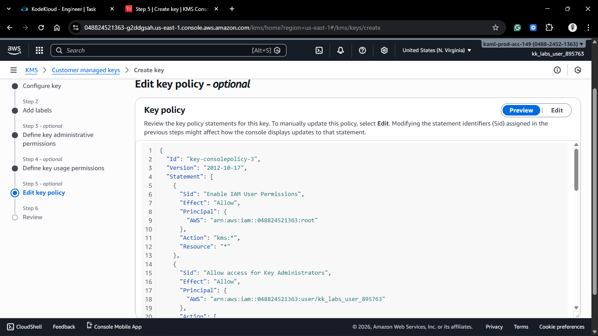
    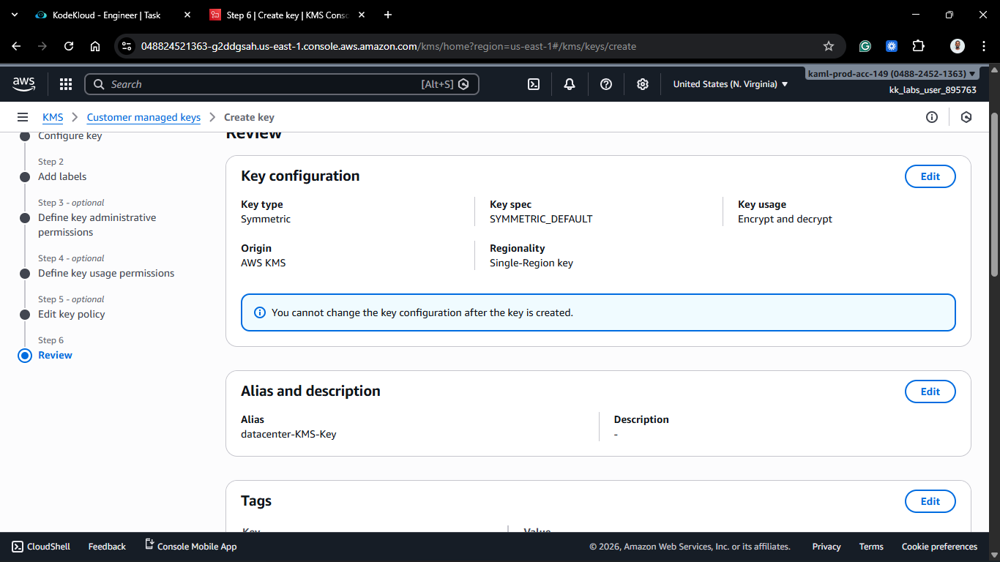
    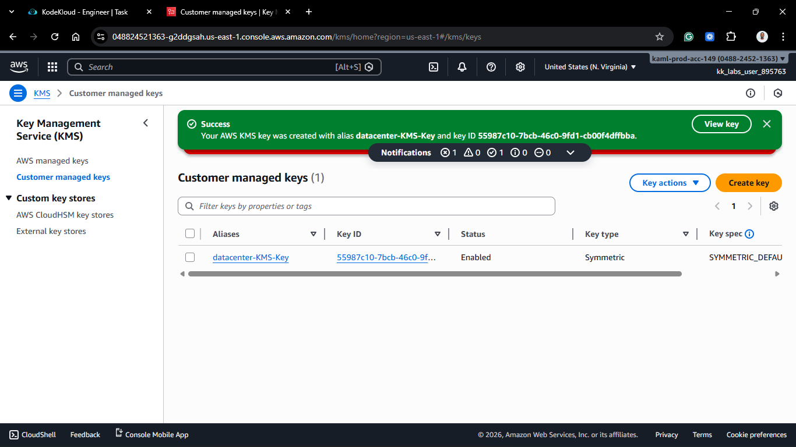

### Step 2: Encrypt the Sensitive Data

On the `aws-client` host, I executed the encryption command.
_Note: AWS KMS `encrypt` output is binary. The requirement was to Base64 encode it for storage._

1.  **Encrypt and Encode:**

    ```bash
    aws kms encrypt \
        --key-id alias/datacenter-KMS-Key \
        --plaintext fileb:///root/SensitiveData.txt \
        --output text \
        --query CiphertextBlob | base64 \
        --decode > /root/EncryptedData.bin
    ```

    - `fileb://` is used to read the file as a binary blob.
    - `--query CiphertextBlob` combined with `--output text` automatically provides the Base64 encoded string as requested.
      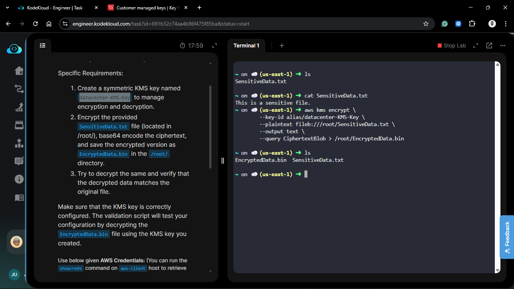

### Step 3: Decrypt and Verify

To ensure the encryption worked and the validation script would pass, I performed a test decryption.

1.  **Decrypting the file:**
    ```bash
    aws kms decrypt \
        --ciphertext-blob fileb:///root/EncryptedData.bin \
        --key-id alias/datacenter-KMS-Key \
        --output text \
        --query Plaintext | base64 --decode > /root/DecryptedData.txt
    ```
    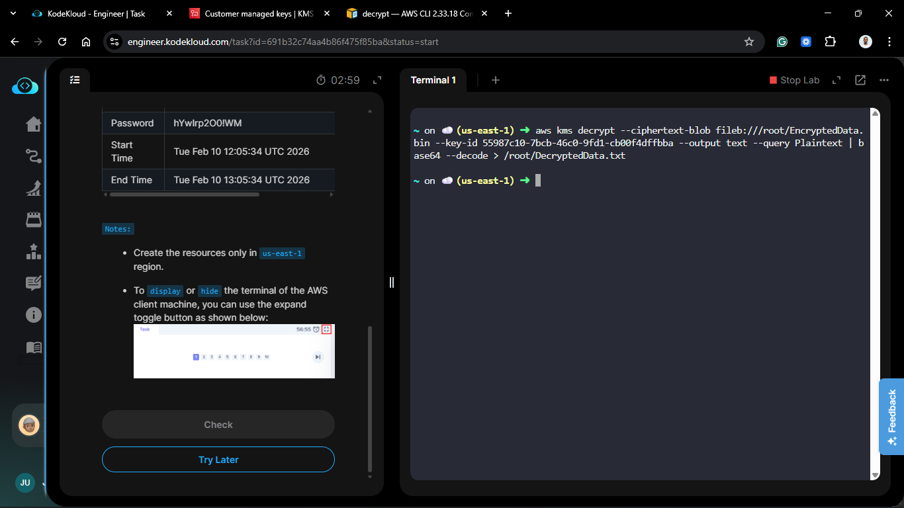

## 🧠 Theory: Symmetric Encryption in KMS

In **Symmetric encryption**, the same 256-bit key is used for both encryption and decryption. This is the industry standard for most data-at-rest scenarios because it is faster than asymmetric encryption. By using KMS, we never actually "see" the key; the data is sent to the KMS API, encrypted inside the AWS Hardware Security Modules (HSMs), and returned to us.

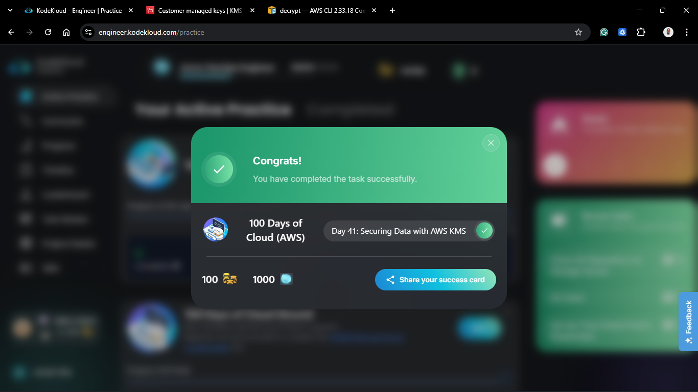
