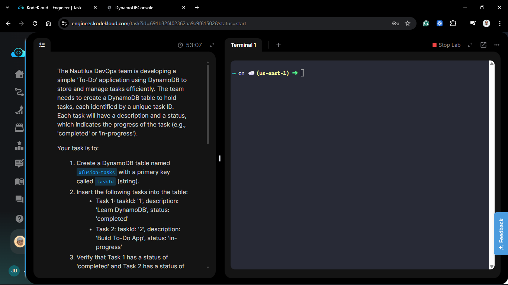
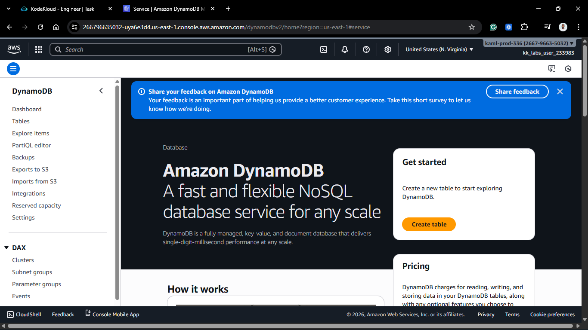
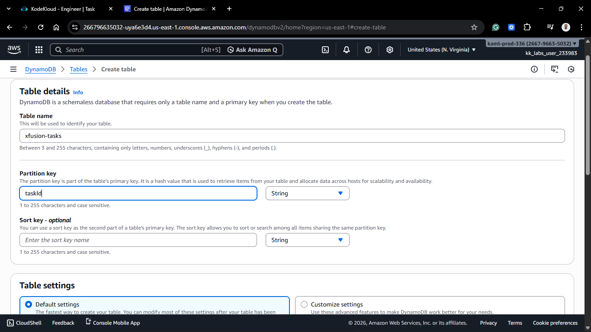
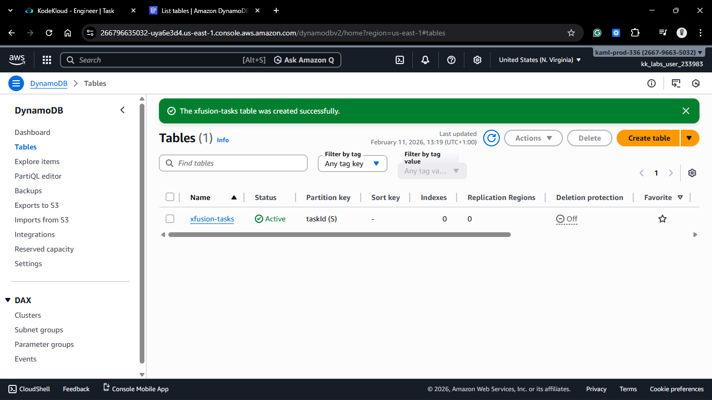
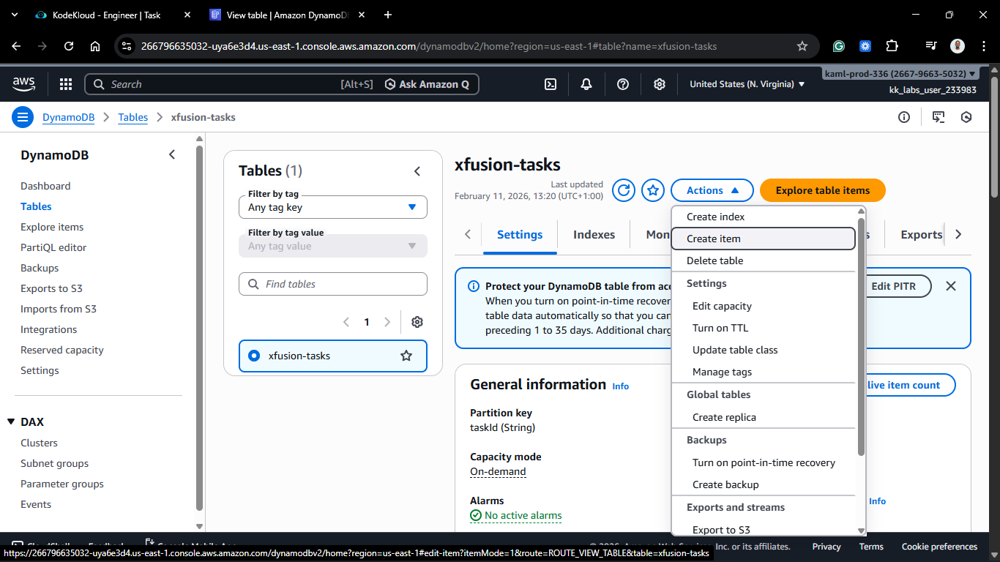
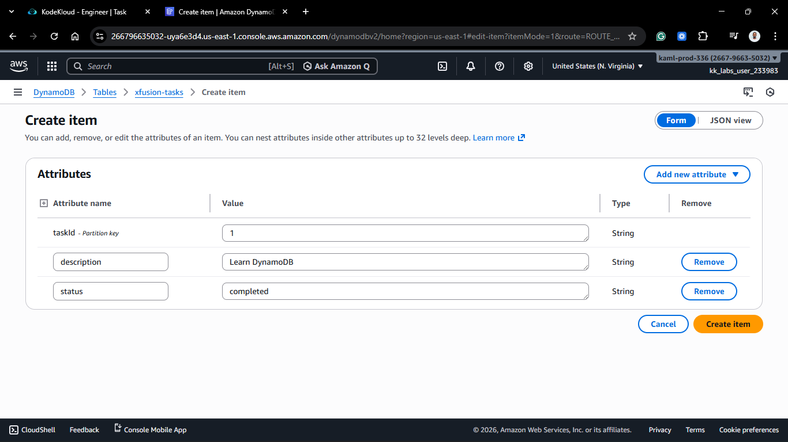
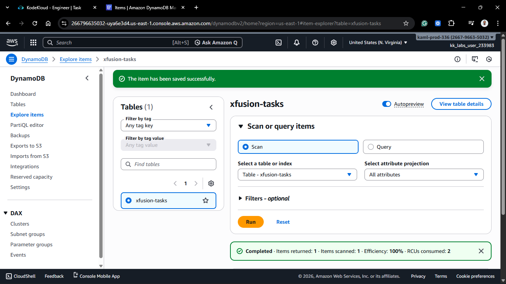
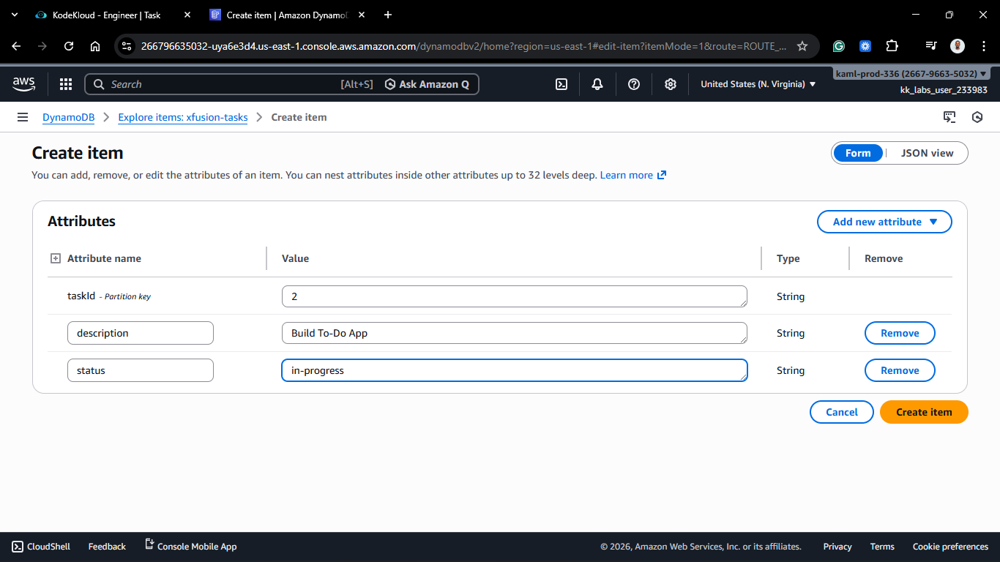
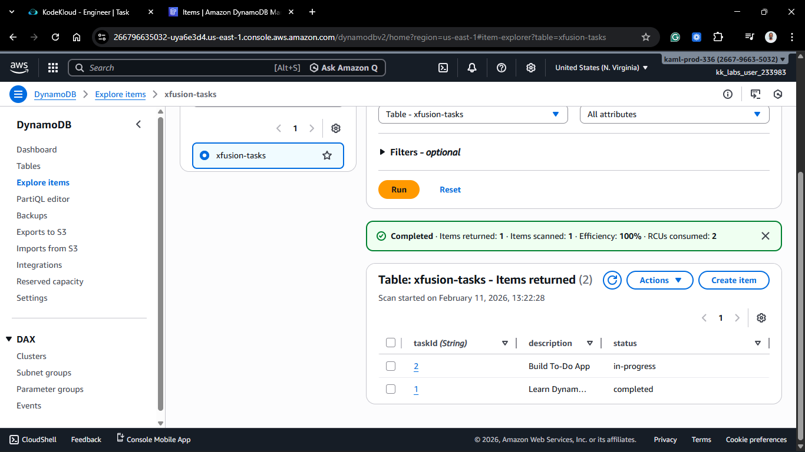
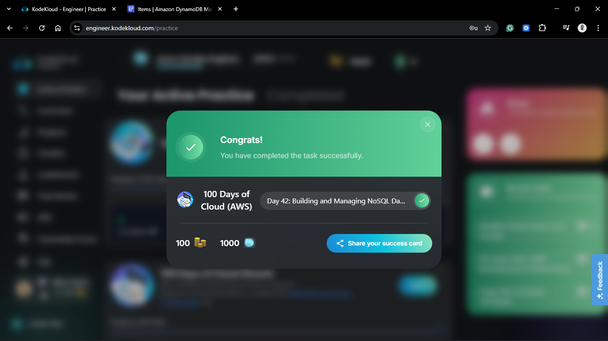

# Day 42: Building and Managing NoSQL Databases with AWS DynamoDB

## Project Description

Today's task for the Nautilus DevOps team was to transition from relational databases to NoSQL. I provisioned an **Amazon DynamoDB** table (`xfusion-tasks`) to serve as the backend for a serverless "To-Do" application. Unlike RDS, DynamoDB is a key-value and document database that delivers single-digit millisecond performance at any scale.

**The Goal:**

Create a schema-less table, define a Partition Key, and perform CRUD operations to populate the database with initial task data.

## Steps & Configuration

### Step 1: Create the DynamoDB Table

1.  Navigate to **DynamoDB** > **Tables** > **Create table**.
    

2.  **Table name:** `xfusion-tasks`.
3.  **Partition key:** `taskId` (String).
    

4.  **Table settings:** Left as **Default settings**.
5.  Clicked **Create table** and waited for status to become **Active**.
    

### Step 2: Insert Items into the Table

1.  **Task 1:**
    - Clicked **Create item**.
      

    - `taskId`: `1`
    - Added String Attribute `description`: `Learn DynamoDB`
    - Added String Attribute `status`: `completed`
      
      

2.  **Task 2:**
    - Clicked **Create item**.
    - `taskId`: `2`
    - Added String Attribute `description`: `Build To-Do App`
    - Added String Attribute `status`: `in-progress`
      

### Step 3: Verification

1.  Navigated to the **Items returned** view for the `xfusion-tasks` table.
2.  Ran a **Scan** operation to list all entries.
3.  **Validation:** Verified Task 1 is `completed` and Task 2 is `in-progress`.
    

## 🧠 Theory: NoSQL Data Modeling & Partitioning

The activities today highlight the core principles of NoSQL architecture:

- **Schema-on-Write vs. Schema-on-Read:** In RDS, we define columns (schema) before data exists. In DynamoDB, we only define the **Primary Key**. This allows us to add attributes like `description` or `status` to an item during insertion without altering the table structure.
- **The Partition Key:** The `taskId` acts as the Partition Key (Hash Key). DynamoDB uses this value as input to an internal hash function to determine the physical storage location (partition) of the data. This is why DynamoDB can retrieve items in millisecond time regardless of whether the table has 10 items or 10 billion.
- **Items and Attributes:** In NoSQL terminology, a "row" is an **Item** and a "column" is an **Attribute**. Items are independent, meaning Task 1 could have 5 attributes while Task 2 only has 3, providing the flexibility needed for fast-paced application development.

