# Day 43: Scaling and Managing Kubernetes Clusters with Amazon EKS

## Project Description

Today's task for the Nautilus DevOps team was to provision the foundational infrastructure for a containerized microservices architecture. I deployed an **Amazon EKS (Elastic Kubernetes Service)** cluster (`datacenter-eks`) designed for high availability and strict network security.

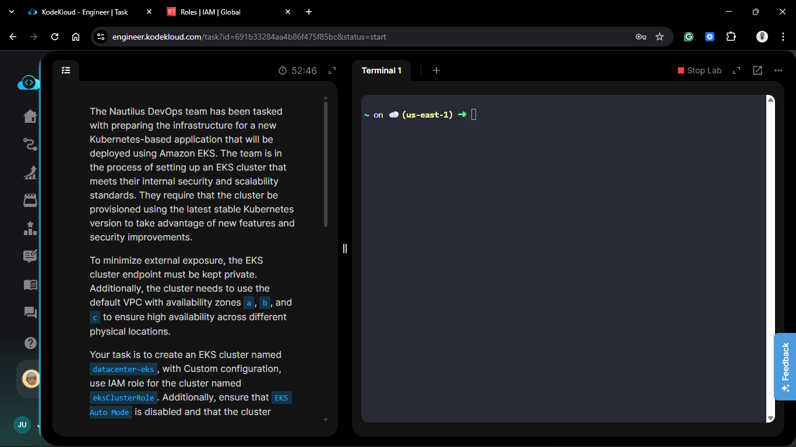

**The Goal:**

Set up a production-ready Kubernetes control plane that remains completely isolated from the public internet while spanning multiple availability zones for fault tolerance.

## Steps & Configuration

### Step 1: IAM Role Configuration

1.  Navigate to **IAM** > **Roles** > **Create role**.
2.  **Trusted Entity:** AWS Service > **EKS - Cluster**.
3.  **Permissions:** Attached the `AmazonEKSClusterPolicy`.
4.  **Role Name:** `eksClusterRole` (Strict requirement).
    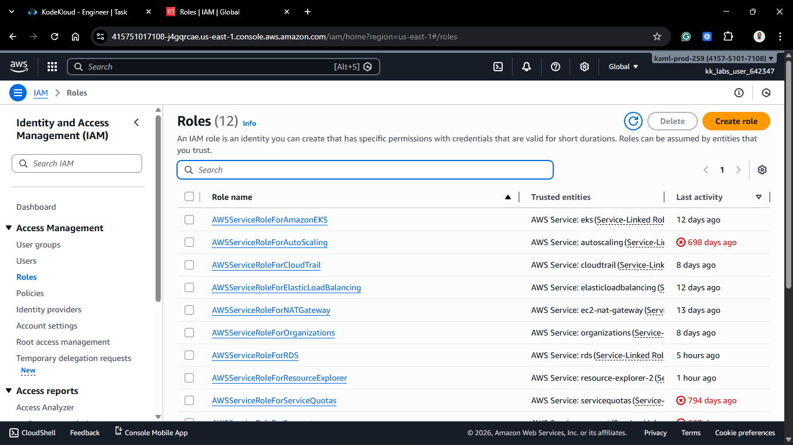
    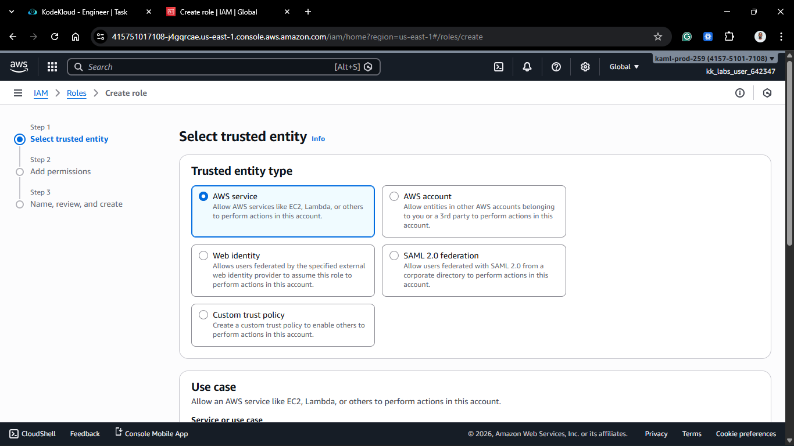
    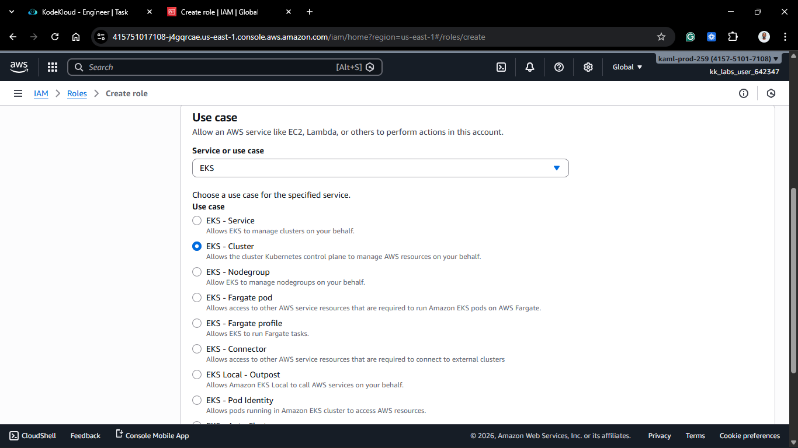
    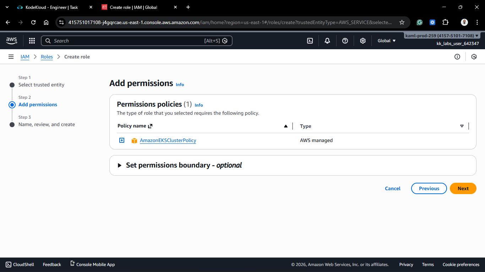
    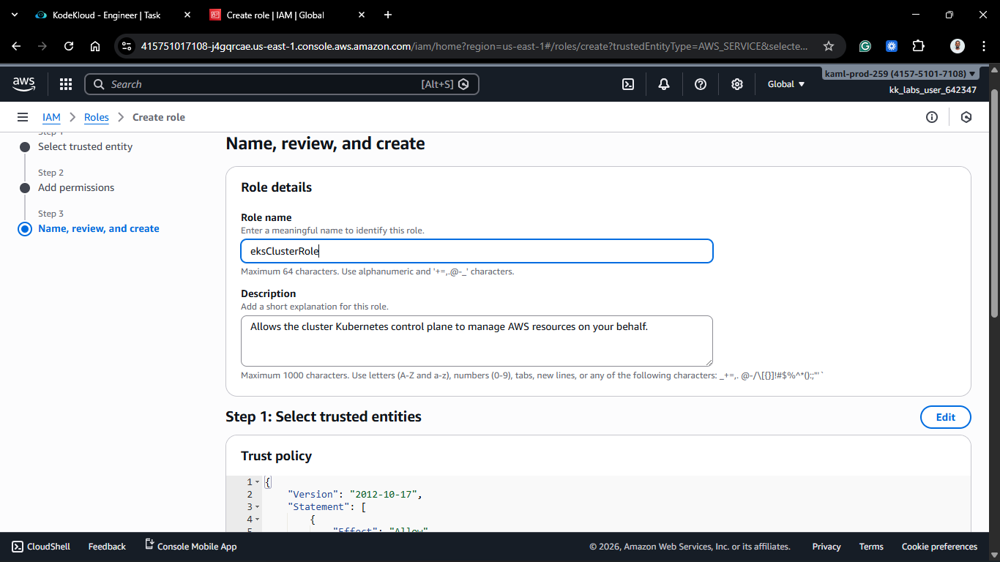
    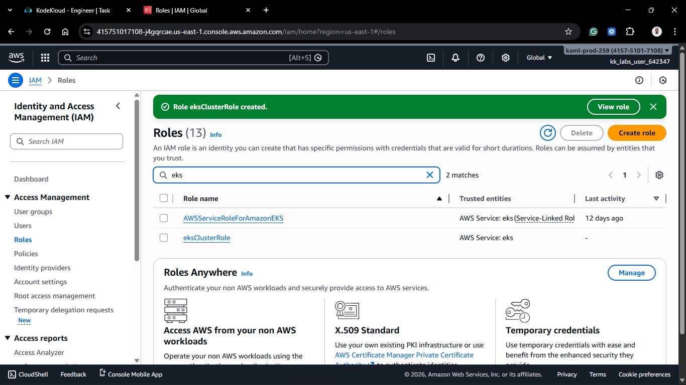

### Step 2: Create the EKS Cluster

1.  Navigate to **Amazon EKS** > **Clusters** > **Create**.
    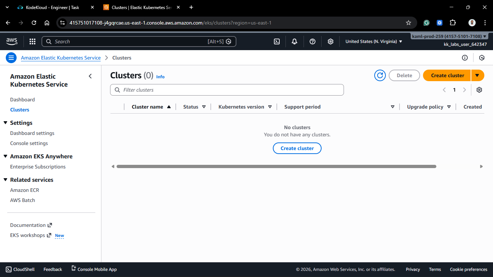

2.  **Cluster Configuration:**
    - **Name:** `datacenter-eks` (Strict requirement).
    - **Kubernetes Version:** Selected the latest stable version (e.g., 1.31).
    - **Cluster Service Role:** Selected `eksClusterRole`.
    - **EKS Auto Mode:** Set to **Disabled** (Strict requirement).
      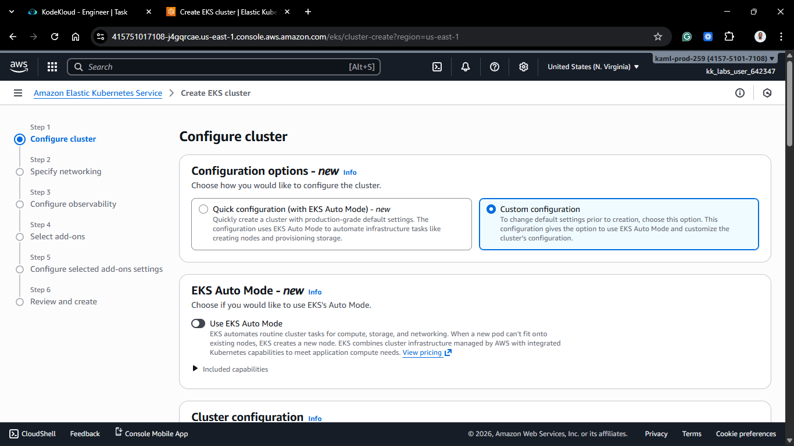
      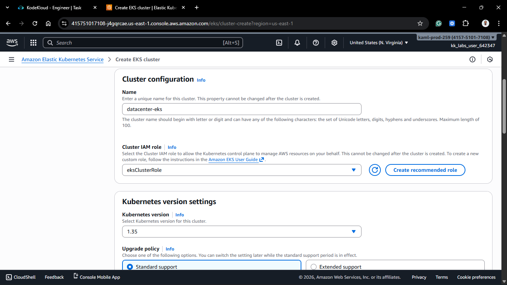

3.  **Specify Networking:**
    - **VPC:** Selected the **Default VPC**.
    - **Subnets:** Selected subnets in Availability Zones **a, b, and c** (e.g., us-east-1a, 1b, 1c).
    - **Security Groups:** Selected the default VPC security group.
      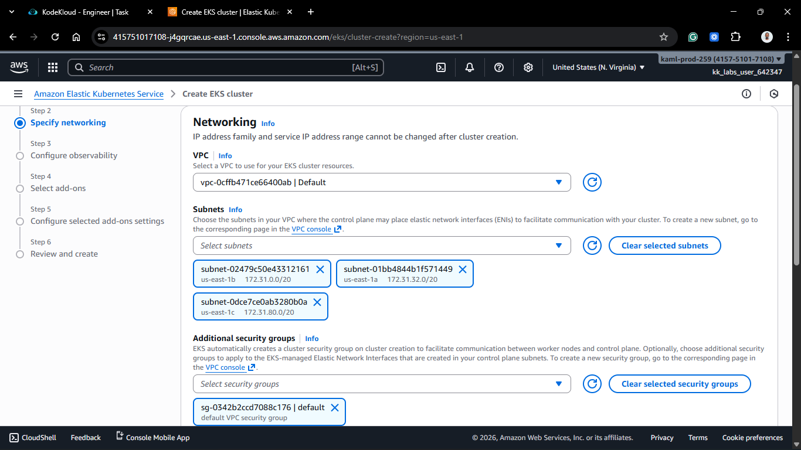

### Step 3: Configure Access

1.  **Cluster Endpoint Access:** Set to **Private** (Strict requirement).
    - _Note: This ensures the Kubernetes API server is only reachable from within the VPC or via a VPN/Direct Connect, blocking all public internet access._
      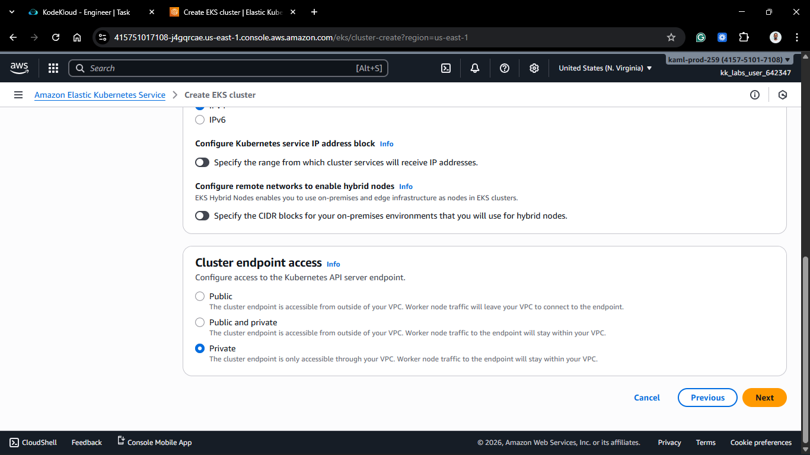

### Step 4: Finalize and Create

1.  Reviewed all settings and clicked **Create**.
2.  **Wait:** EKS control plane provisioning typically takes 10–15 minutes.

### Step 5: Verification

1.  Monitored the cluster status until it reached the **Active** state.
    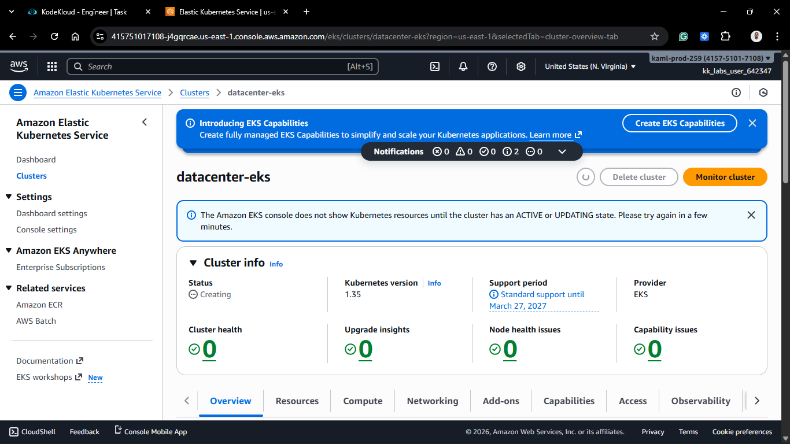
    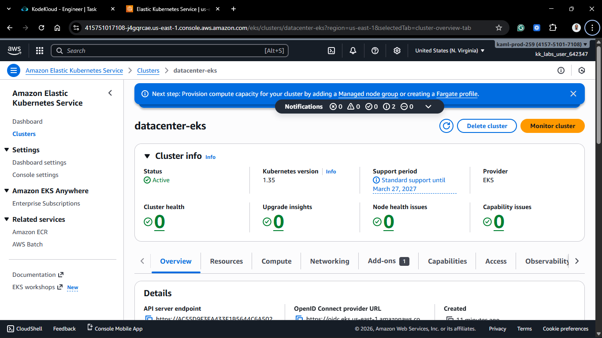

2.  Verified that the **Networking** tab reflected the private endpoint and the three designated availability zones.
    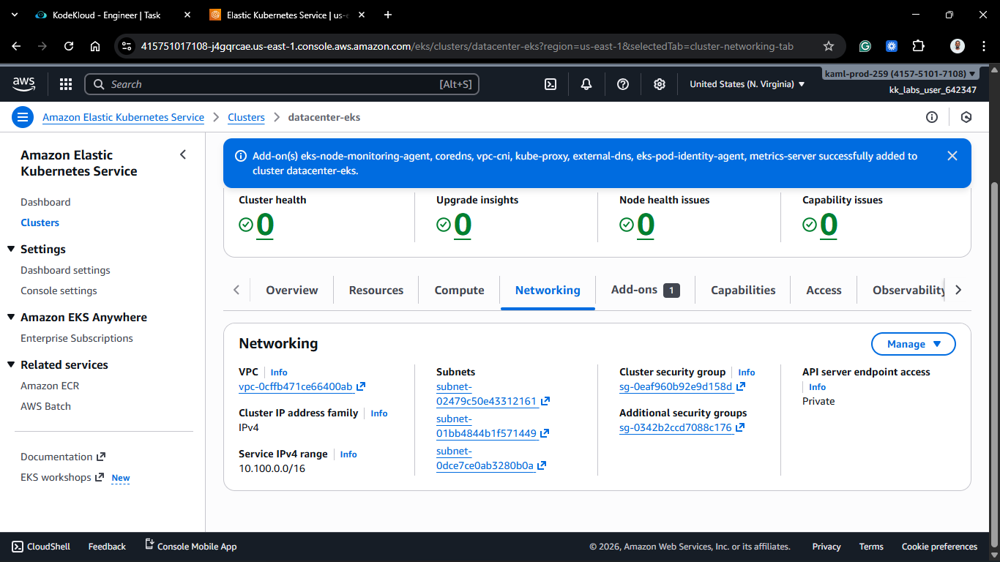

## 🧠 Theory: EKS Control Plane & Endpoint Security

Today’s activities are based on the core architecture of managed Kubernetes:

- **Managed Control Plane:** AWS manages the Kubernetes API server, etcd, and controller manager across multiple AZs. By using **eksClusterRole**, we give AWS permission to manage these resources on our behalf.
- **Private Endpoint Access:** By setting the endpoint to **Private**, we disable the public DNS name for the API server. Traffic between the worker nodes (data plane) and the API server (control plane) stays entirely within the AWS network, significantly reducing the attack surface.
- **High Availability (Multi-AZ):** Selecting zones **a, b, and c** ensures that the cluster's networking layer is prepared to support worker nodes in three distinct physical locations. If one data center fails, the application remains operational in the others.
- **EKS Auto Mode vs. Manual:** Disabling Auto Mode gives the DevOps team granular control over the data plane (Node Groups or Fargate) and networking (CNI), rather than letting AWS manage the scaling logic automatically.

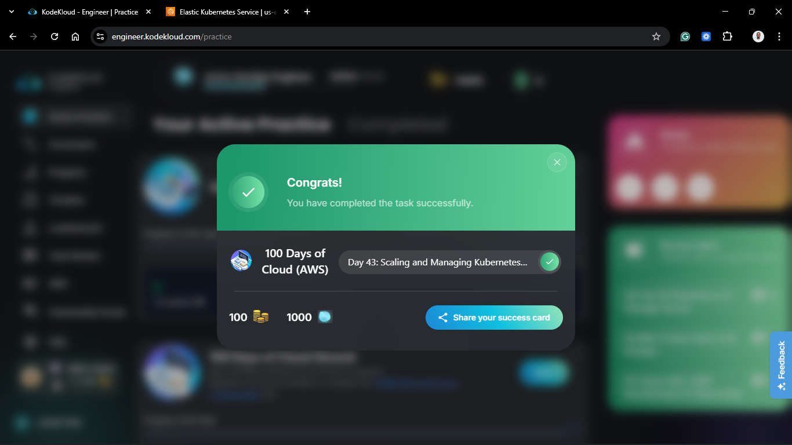
