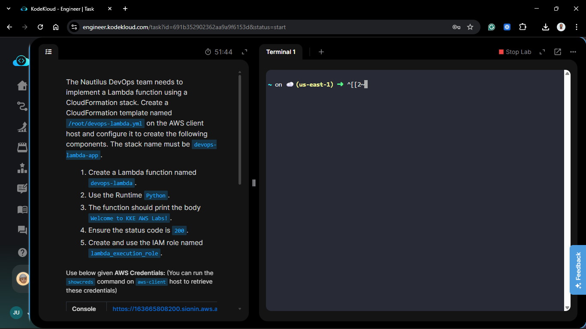
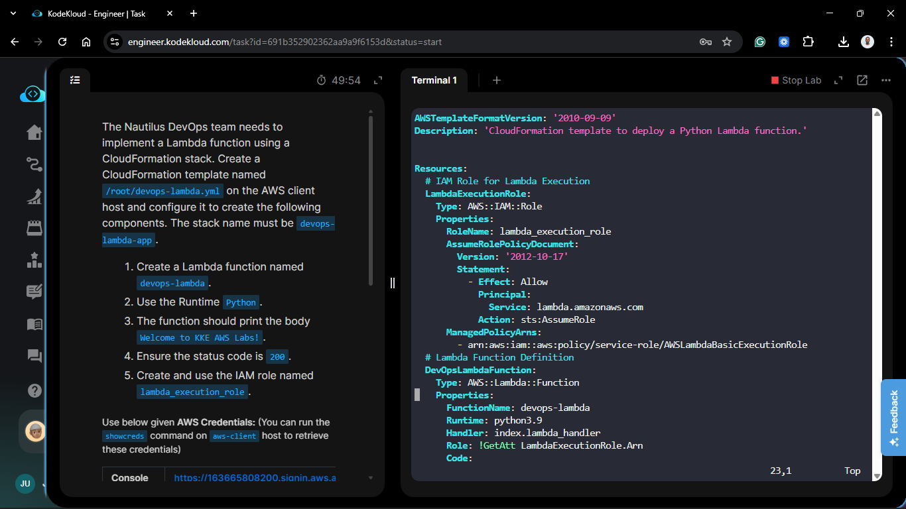
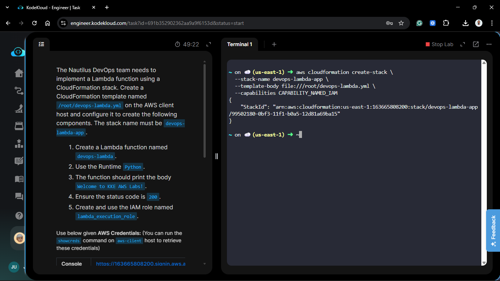
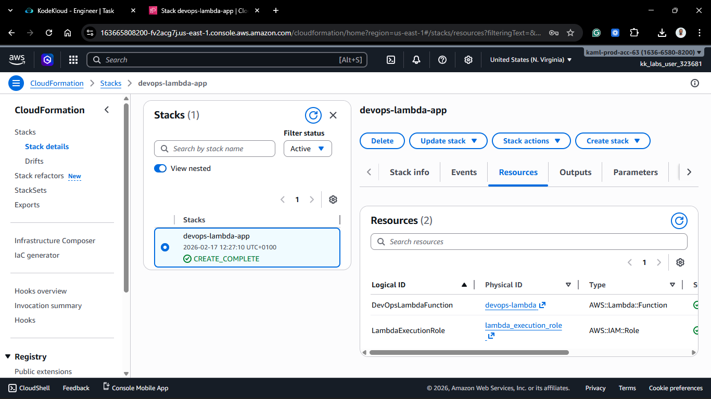

# Day 48: Automating Infrastructure Deployment with AWS CloudFormation

## Project Description

Today's task for the Nautilus DevOps team was to automate the deployment of a serverless compute resource. I authored a **CloudFormation** template to provision an **AWS Lambda** function and its associated security identity. This approach ensures that our infrastructure is version-controlled, repeatable, and consistent across environments.



**The Goal:**
Deploy a Python-based Lambda function named `devops-lambda` using Infrastructure as Code (IaC) while managing the execution role permissions.

## Steps & Configuration

### Step 1: Create the CloudFormation Template

I created the template file at `/root/devops-lambda.yml` on the AWS client host. The template defines the function code inline for simplicity and specifies the execution role.



```yaml
AWSTemplateFormatVersion: '2010-09-09'
Description: 'CloudFormation template to deploy a Python Lambda function.'

Resources:
  # IAM Role for Lambda Execution
  LambdaExecutionRole:
    Type: AWS::IAM::Role
    Properties:
      RoleName: lambda_execution_role
      AssumeRolePolicyDocument:
        Version: '2012-10-17'
        Statement:
          - Effect: Allow
            Principal:
              Service: lambda.amazonaws.com
            Action: sts:AssumeRole
      ManagedPolicyArns:
        - arn:aws:iam::aws:policy/service-role/AWSLambdaBasicExecutionRole

  # Lambda Function Definition
  DevOpsLambdaFunction:
    Type: AWS::Lambda::Function
    Properties:
      FunctionName: devops-lambda
      Runtime: python3.9
      Handler: index.lambda_handler
      Role: !GetAtt LambdaExecutionRole.Arn
      Code:
        ZipFile: |
          import json
          def lambda_handler(event, context):
              return {
                  'statusCode': 200,
                  'body': json.dumps('Welcome to KKE AWS Labs!')
              }
```

### Step 2: Deploy the Stack

I used the AWS CLI to deploy the stack. I included the `--capabilities CAPABILITY_NAMED_IAM` flag because the template creates a custom-named IAM role.



```bash
aws cloudformation create-stack \
  --stack-name devops-lambda-app \
  --template-body file:///root/devops-lambda.yml \
  --capabilities CAPABILITY_NAMED_IAM
```

### Step 3: Verification

1. **Stack Status:** Monitored the deployment until it reached CREATE_COMPLETE.

   

2. **Function Execution:**

```bash
aws lambda invoke --function-name devops-lambda out.txt
cat out.txt
Result: Confirmed the output contains {"statusCode": 200, "body": "\"Welcome to KKE AWS Labs!\""}.
```

## 🧠 Theory: Infrastructure as Code (IaC) and Inline Lambda Functions

- **Infrastructure as Code (IaC):** By using CloudFormation, we treat our infrastructure like software code. This eliminates "configuration drift" and allows us to recreate the entire `devops-lambda-app` stack in any AWS region with a single command.

- **ZipFile Property:** In this template, I used the `ZipFile` property under the `Code` attribute. This is ideal for small, single-file functions. It allows the Python code to be embedded directly in the YAML, removing the need to upload a separate `.zip` file to S3 for simple logic.

- **Trust Policy:** The `lambda_execution_role` includes a **Trust Relationship**. This is a specific IAM policy that tells AWS: "The Lambda service is allowed to assume this role." Without this, the function would not have the permissions required to run or upload logs to CloudWatch.
