# Day 50: Expanding EC2 Instance Storage for Development Needs

## Project Description

Today marks the halfway point of the challenge! For Day 50, I addressed a common infrastructure scaling requirement: **Dynamic Storage Expansion**. The Nautilus Development team reported that the `xfusion-ec2` instance was nearing its storage limit. I performed a zero-downtime expansion of the root EBS volume, increasing it from **8 GiB** to **12 GiB** and extending the filesystem to recognize the new capacity.

**Technical Objectives:**

* Identify and modify the Elastic Block Store (EBS) volume via the AWS Console/CLI.
* Utilize `growpart` and `resize2fs` (or `xfs_growfs`) to expand the partition and filesystem.
* Maintain instance uptime during the storage modification.

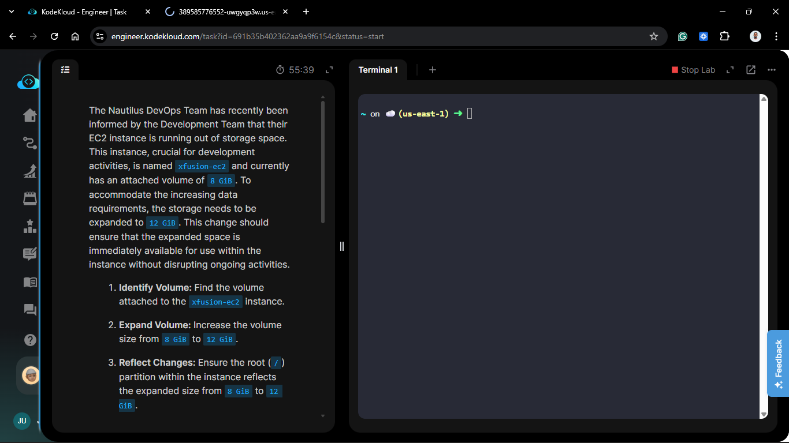

## Technical Specifications

| Component | Specification |
| :--- | :--- |
| **Instance Name** | `xfusion-ec2` |
| **Original Size** | 8 GiB |
| **New Size** | 12 GiB |
| **Key Pair** | `/root/xfusion-keypair.pem` |
| **Filesystem Type** | ext4 / xfs |

---

## Steps & Configuration

### 1. Identify and Modify the EBS Volume

1. Located the volume attached to `xfusion-ec2` in the **EC2 > Volumes** dashboard.
   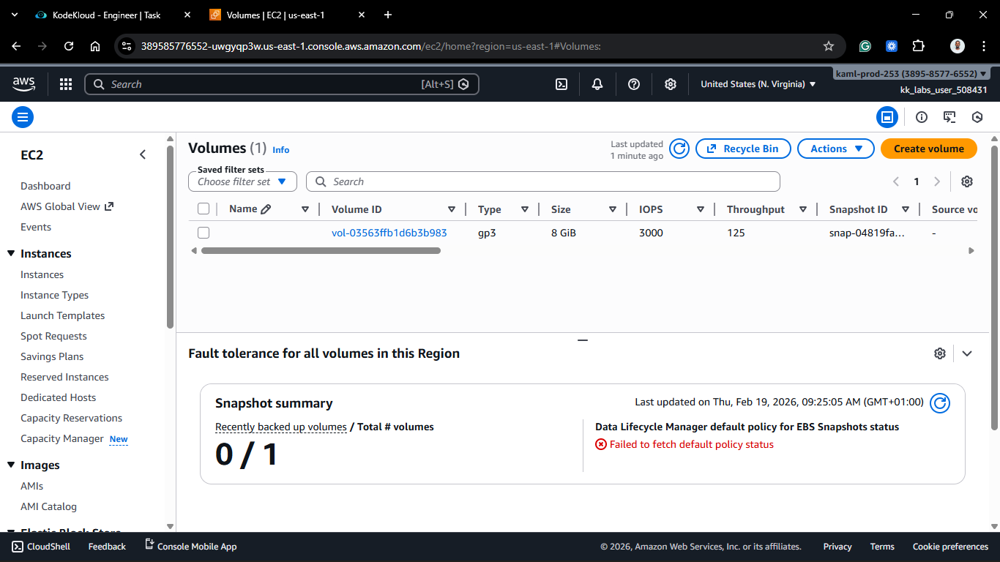
   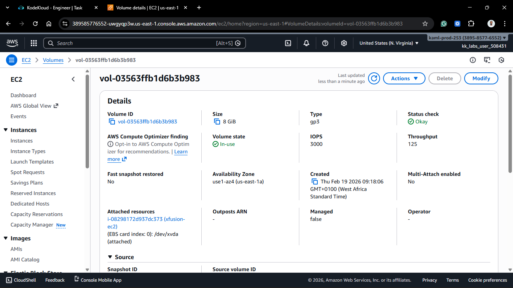

2. Selected **Modify Volume**.
3. Changed the size from **8 GiB** to **12 GiB**.
   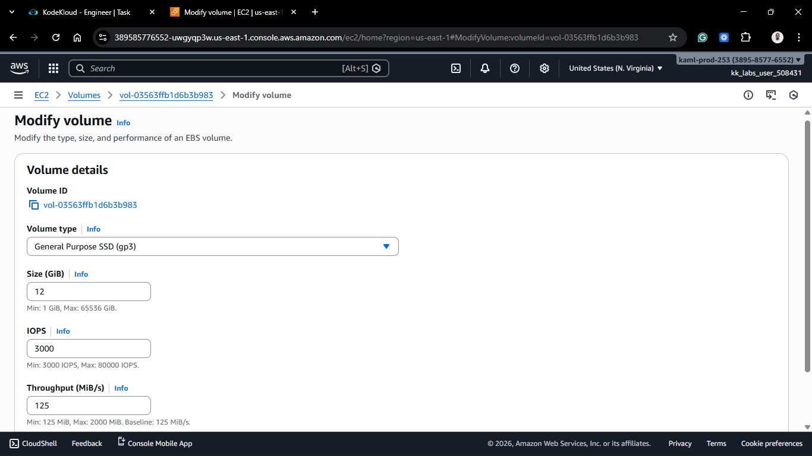

4. Waited for the volume state to transition from `in-use - modifying` to `in-use - optimizing`.
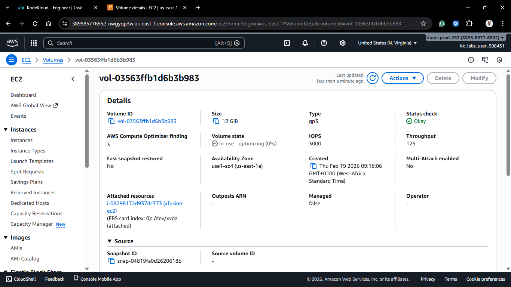

### 2. Access the Instance

From the `aws-client` host, I established an SSH connection to the development instance:

```bash
ssh -i /root/xfusion-keypair.pem ubuntu@<xfusion-ec2-public-ip>
```

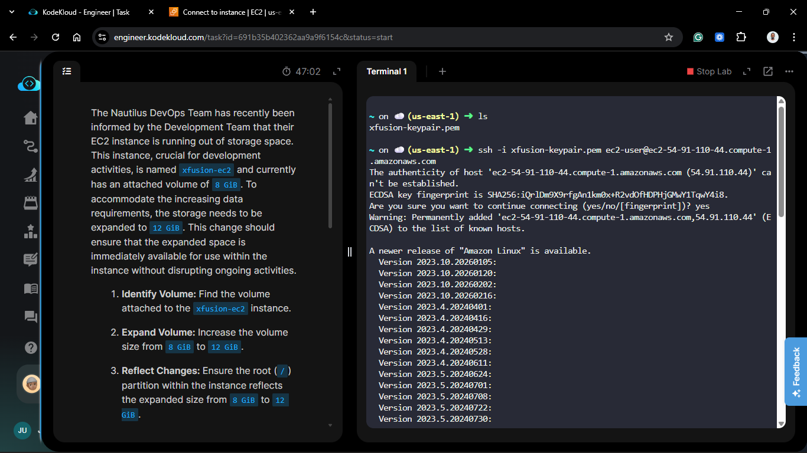

> [!Note]
> After you increase the EBS volume size, you must manually extend the partition and filesystem to utilize the additional storage. You can do this as soon as the volume is in the `in-use - optimizing` state.

**AWS Docs Reference: [Extend the file system after resizing an Amazon EBS volume](https://docs.aws.amazon.com/ebs/latest/userguide/recognize-expanded-volume-linux.html)**

### 3. Verify Hardware-Level Expansion

I used the `lsblk` and `df -Th` command to confirm the OS recognized the 12 GiB block device even if the partition and filesystem was still 8 GiB.

```bash
sudo lsblk
```

```bash
NAME      MAJ:MIN RM SIZE RO TYPE MOUNTPOINTS
xvda      202:0    0  12G  0 disk
├─xvda1   202:1    0   8G  0 part /
├─xvda127 259:0    0   1M  0 part
└─xvda128 259:1    0  10M  0 part /boot/efi
```

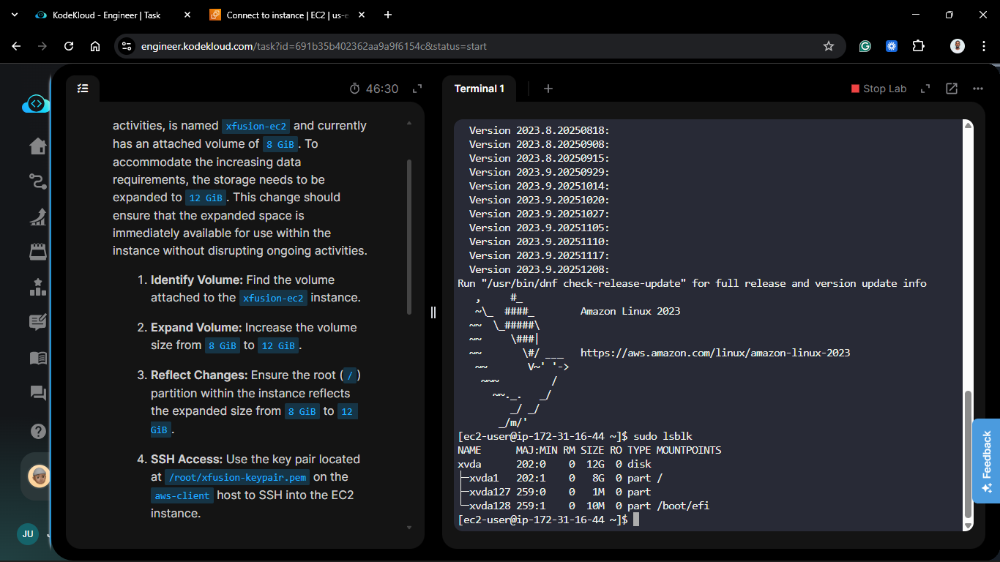

```bash
df -Th
```

The output  for the `df -Th` command shows that the `/dev/xda1` file system is still 8 GiB in size, its filesystem type is `xfs`, and it is mounted on the root directory (`/`).

```bash
Filesystem     Type      Size  Used Avail Use% Mounted on
devtmpfs       devtmpfs  4.0M     0  4.0M   0% /dev
tmpfs          tmpfs     475M     0  475M   0% /dev/shm
tmpfs          tmpfs     190M  2.9M  188M   2% /run
/dev/xvda1     xfs       8.0G  1.6G  6.5G  19% /
tmpfs          tmpfs     475M     0  475M   0% /tmp
/dev/xvda128   vfat       10M  1.3M  8.7M  13% /boot/efi
tmpfs          tmpfs      95M     0   95M   0% /run/user/1000
```

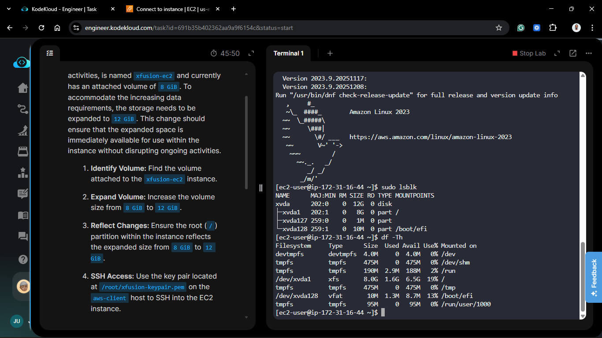

### 4. Expand the Partition

Using the cloud-guest-utils package (if not present), I grew the specific partition:

```bash
sudo growpart /dev/xvda 1
```

```bash
CHANGED: partition=1 start=24576 old: size=16752607 end=16777183 new: size=25141215 end=25165791
```

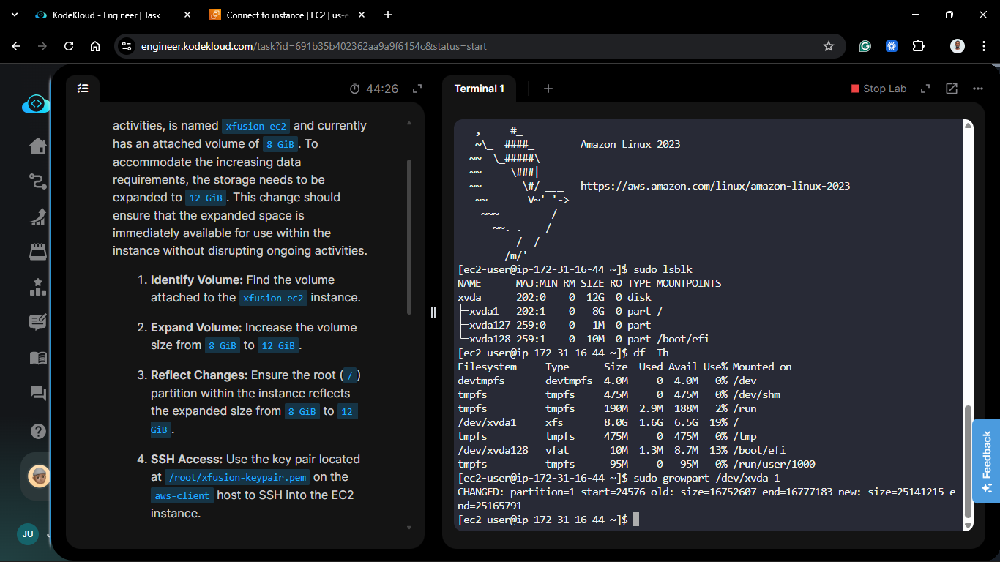

```bash
sudo lsblk
```

```bash
NAME      MAJ:MIN RM SIZE RO TYPE MOUNTPOINTS
xvda      202:0    0  12G  0 disk
├─xvda1   202:1    0  12G  0 part /
├─xvda127 259:0    0   1M  0 part
└─xvda128 259:1    0  10M  0 part /boot/efi
```

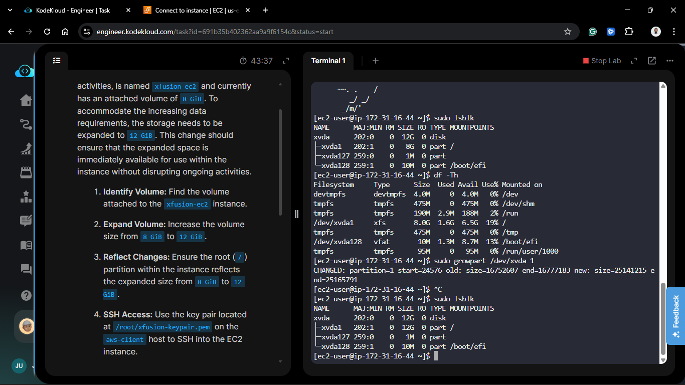

```bash
df -Th
```

```bash
Filesystem     Type      Size  Used Avail Use% Mounted on
devtmpfs       devtmpfs  4.0M     0  4.0M   0% /dev
tmpfs          tmpfs     475M     0  475M   0% /dev/shm
tmpfs          tmpfs     190M  2.9M  188M   2% /run
/dev/xvda1     xfs       8.0G  1.6G  6.5G  19% /
tmpfs          tmpfs     475M     0  475M   0% /tmp
/dev/xvda128   vfat       10M  1.3M  8.7M  13% /boot/efi
tmpfs          tmpfs      95M     0   95M   0% /run/user/1000
```

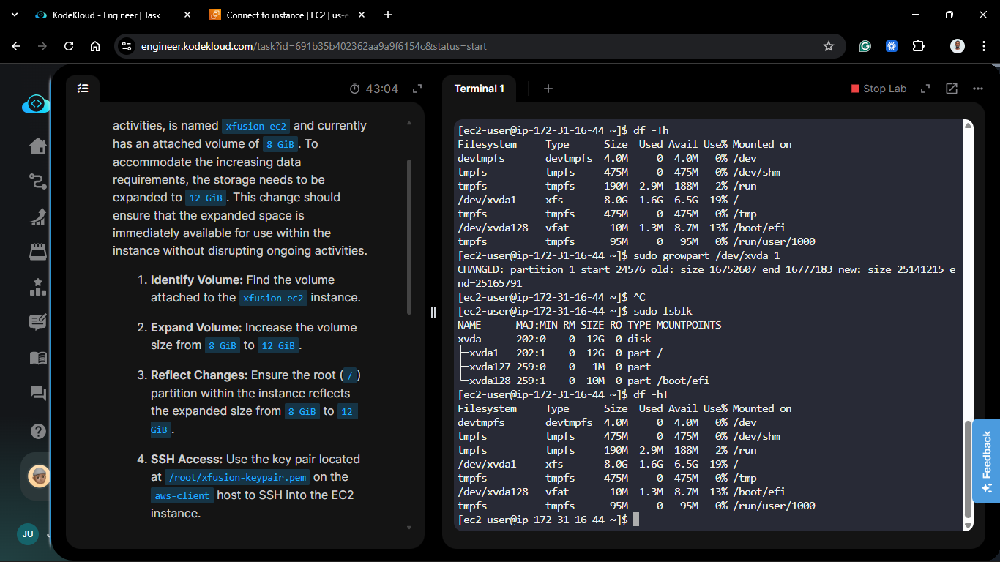

### 5. Extend the Filesystem

Finally, I extended the filesystem to occupy the newly available space.

**For EXT4 Filesystems:**

```bash
sudo resize2fs /dev/nvme0n1p1
```

**For XFS filesystems:**

```bash
sudo xfs_growfs -d /
```

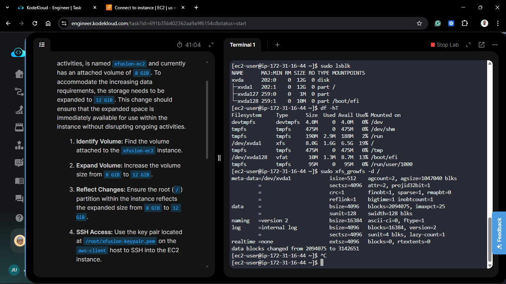

```bash
meta-data=/dev/xvda1             isize=512    agcount=2, agsize=1047040 blks
         =                       sectsz=4096  attr=2, projid32bit=1
         =                       crc=1        finobt=1, sparse=1, rmapbt=0
         =                       reflink=1    bigtime=1 inobtcount=1
data     =                       bsize=4096   blocks=2094075, imaxpct=25
         =                       sunit=128    swidth=128 blks
naming   =version 2              bsize=16384  ascii-ci=0, ftype=1
log      =internal log           bsize=4096   blocks=16384, version=2
         =                       sectsz=4096  sunit=4 blks, lazy-count=1
realtime =none                   extsz=4096   blocks=0, rtextents=0
data blocks changed from 2094075 to 3142651
```

```bash
df -Th
```

```bash
Filesystem     Type      Size  Used Avail Use% Mounted on
devtmpfs       devtmpfs  4.0M     0  4.0M   0% /dev
tmpfs          tmpfs     475M     0  475M   0% /dev/shm
tmpfs          tmpfs     190M  2.9M  188M   2% /run
/dev/xvda1     xfs        12G  1.6G   11G  13% /
tmpfs          tmpfs     475M     0  475M   0% /tmp
/dev/xvda128   vfat       10M  1.3M  8.7M  13% /boot/efi
tmpfs          tmpfs      95M     0   95M   0% /run/user/1000
```

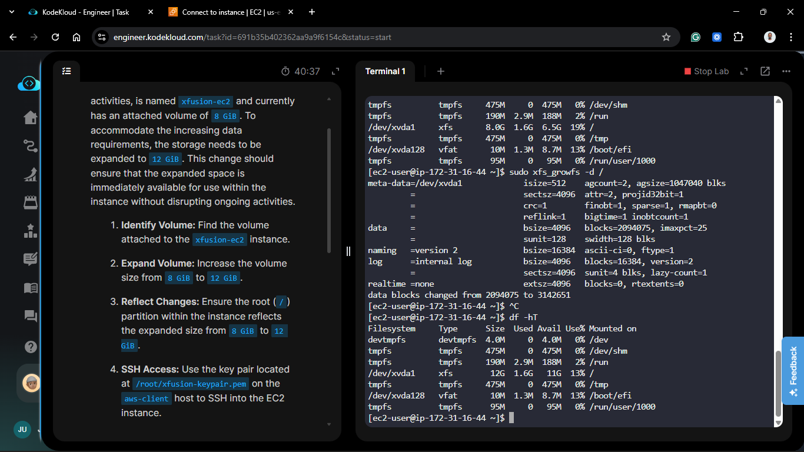

## 🧠 Theory: Elastic Block Store (EBS) Elasticity

* **Elasticity vs. Scalability:** This task demonstrates the elastic nature of EBS. Unlike physical hardware, AWS allows us to change the geometry of a disk while it is mounted and actively performing I/O.

* **The Layered Approach:**
  
  Expanding storage in Linux is a three-layer process:
  1. **Physical/Virtual Layer:** Modify the EBS volume size.
  2. **Partition Layer:** Inform the partition table (GPT/MBR) that the boundary has changed via `growpart`.
  3. **Filesystem Layer:** Expand the actual data structures (inodes/blocks) via `resize2fs` or `xfs_growfs`.

* **Zero Downtime:** Because modern Linux kernels and filesystems support online resizing, the development team could continue their work uninterrupted throughout the process.

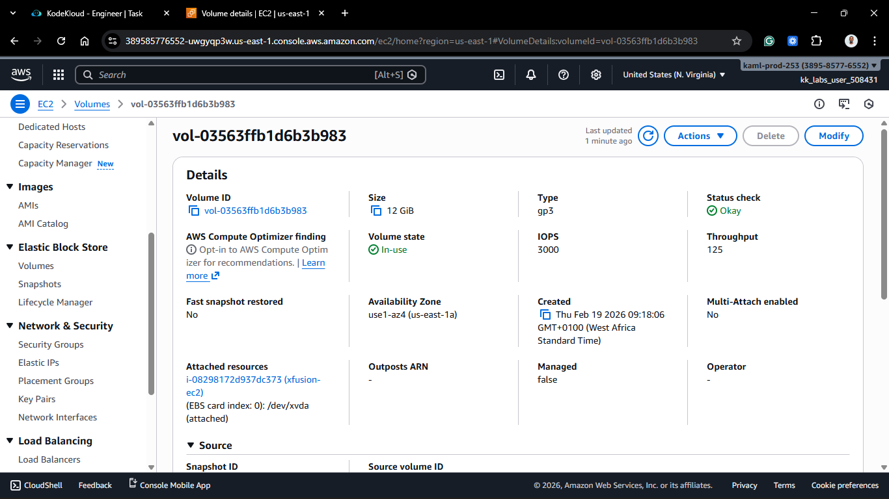
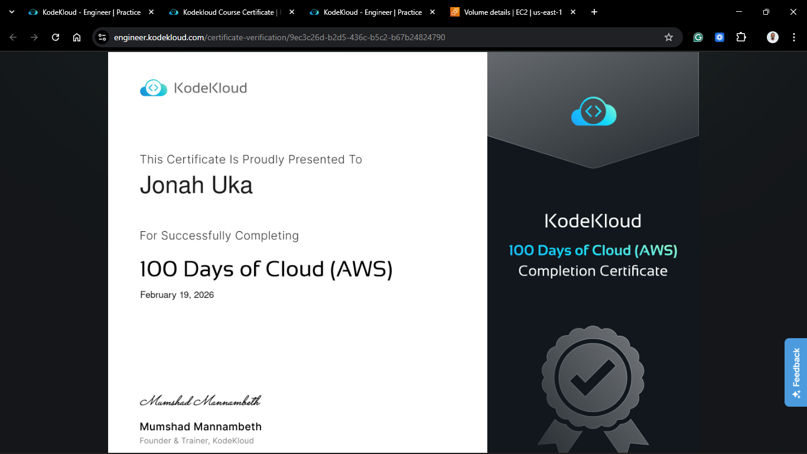
