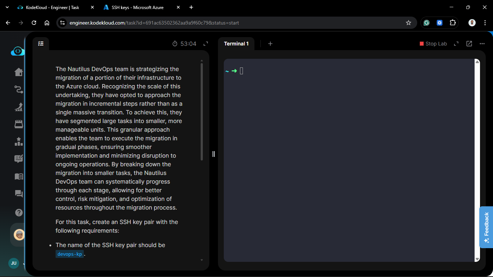
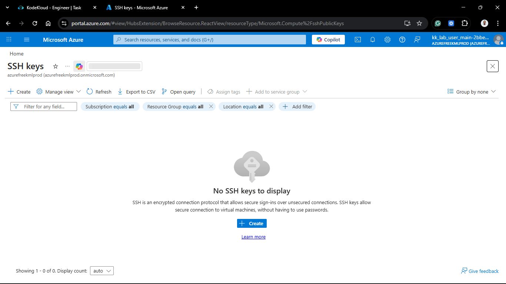
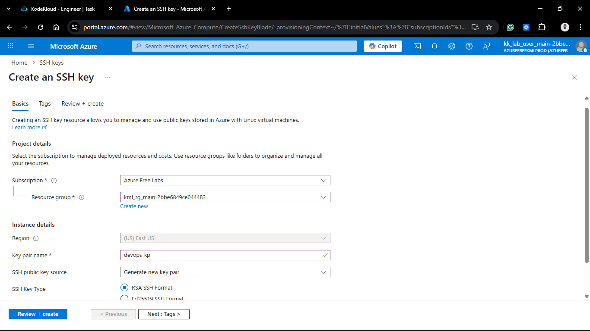
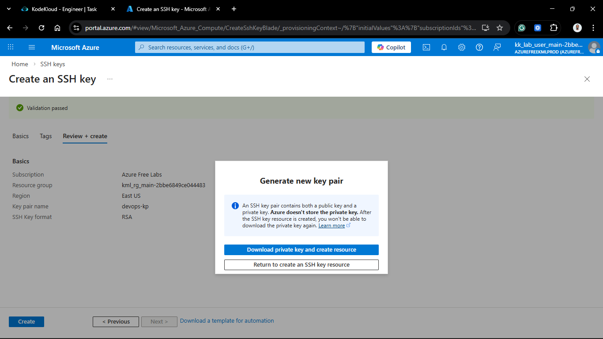
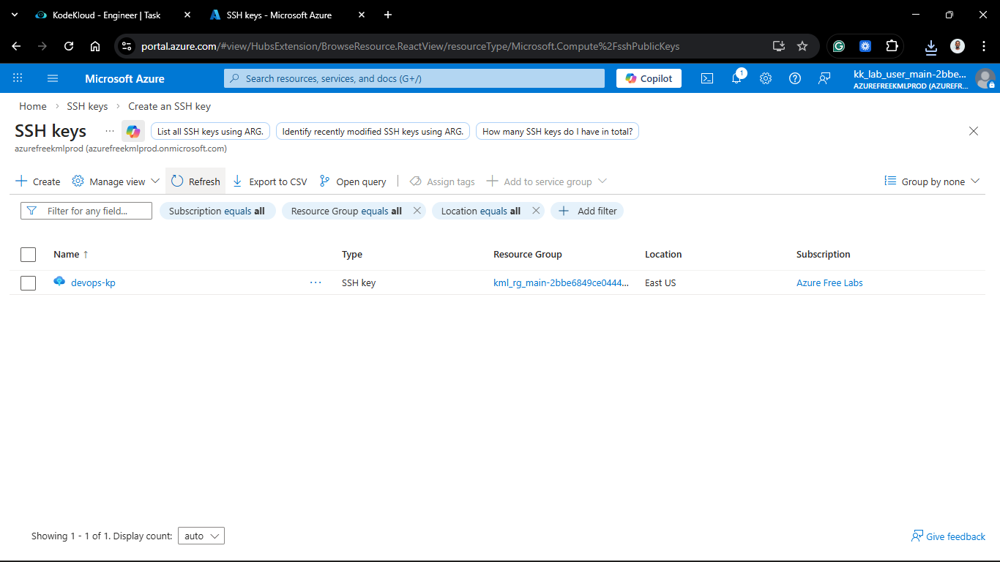
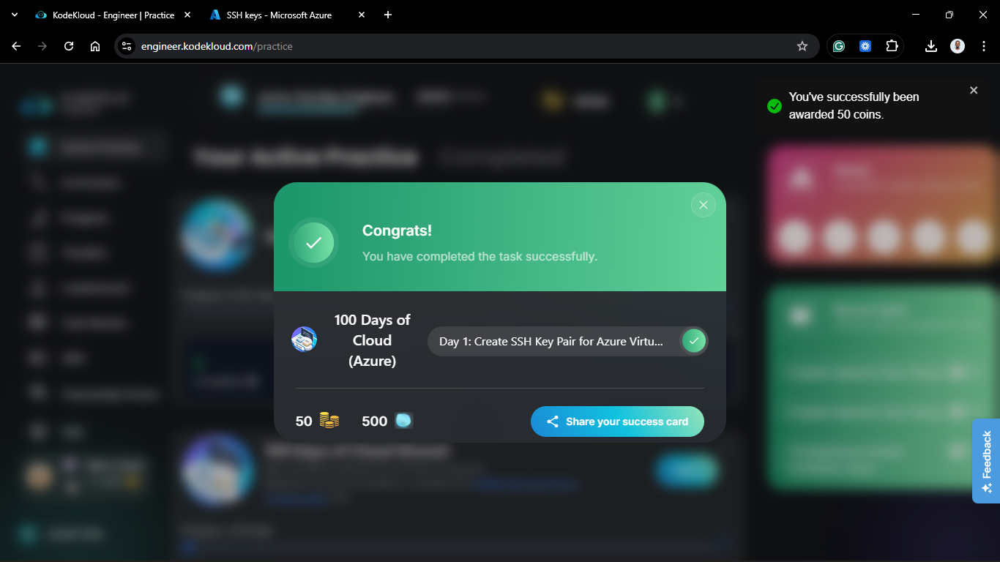

# Day 51: Create SSH Key Pair for Azure Virtual Machine

## Project Description

The Nautilus DevOps team has initiated a multi-phase migration strategy to transition infrastructure to the **Azure Cloud**. Recognizing the complexity of cloud migrations, the team is following an incremental approach. The foundational step for this migration is ensuring secure, key-based access for all future Linux-based Virtual Machines.



**The Goal:**

Generate a cloud-managed RSA SSH Key resource named `devops-kp` to serve as the primary authentication credential for the Azure environment.

## Technical Specifications

| Requirement           | Specification        |
| :-------------------- | :------------------- |
| **Resource Name**     | `devops-kp`          |
| **Key Type**          | **RSA**              |
| **Public Key Source** | Generated by Azure   |
| **Resource Group**    | Managed Migration RG |

---

## Steps & Configuration

### 1. Initialize SSH Key Resource

1. Navigate to the **Azure Portal**.
2. In the global search, type **"SSH Keys"** and select the service.
   
3. Click **Create**.

4. **Project Details:**
   - **Subscription:** Selected the active lab subscription.
   - **Resource Group:** Used the pre-assigned group for the migration project.
5. **Key Pair Details:**
   - **Name:** `devops-kp`.
   - **Region:** Standardized to the project's primary region (e.g., `East US`).
   - **SSH public key source:** Selected **Generate new key pair**.
     

### 2. Configure Key Parameters

1. **Key Type:** Explicitly selected **RSA** as per requirements.
2. Selected **Review + create** to run the final validation.

### 3. Key Generation and Secure Storage

1. Once validation passed, clicked **Create**.
2. **Private Key Download:** Azure prompted to download the private key. I saved the `devops-kp.pem` file immediately.
   

   > [!Note]
   > The step below should be the next step, however for today's task it is not required. In a real-world scenario, you would want to securely store the private key and ensure it has the correct permissions to prevent unauthorized access.

3. **Local Permissions:**
   Moved the key to the `~/.ssh/` directory and applied strict permissions:

   ```bash
   chmod 400 devops-kp.pem
   ```

---

## Verification

1. **Portal Check:** Verified the `devops-kp` resource appears in the SSH Keys list with a "Succeeded" provisioning state.

   

## 🧠 Theory: RSA in Azure Infrastructure

- **RSA Encryption:** RSA remains the standard for Azure Linux VM access. By choosing RSA, we ensure compatibility across various Azure-managed services and legacy SSH clients.
- **Managed Public Keys:** By creating an Azure "Resource," we aren't just making a file; we are creating a metadata object in the Azure Resource Manager (ARM). This allows us to inject the public key into any new VM by simply referencing the resource ID, rather than managing raw strings.
- **Zero-Knowledge Private Keys:** Azure does not store the private key. If the `.pem` file is not downloaded during the initial creation, it cannot be recovered, requiring the creation of a new resource.


