# Day 52: Create an Azure Virtual Machine

## Project Description

As the second phase of the incremental migration, the Nautilus DevOps team is deploying its first compute resource in the Azure environment. This task involves provisioning a Linux-based Virtual Machine (VM) configured with specific hardware constraints and security rules to serve as a baseline for future application hosting.

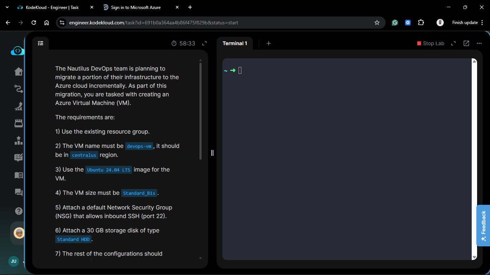

**The Goal:**

Deploy a `Standard_B1s` Ubuntu instance named `devops-vm` in the `centralus` region, ensuring secure SSH access via the previously created managed key pair.

## Technical Specifications

| Requirement    | Specification                      |
| :------------- | :--------------------------------- |
| **VM Name**    | `devops-vm`                        |
| **Region**     | `centralus`                        |
| **Image**      | `Ubuntu 24.04 LTS`                 |
| **Size**       | `Standard_B1s` (1 vCPU, 1 GiB RAM) |
| **Storage**    | 30 GB Standard HDD                 |
| **Networking** | NSG allowing Inbound Port 22 (SSH) |

---

## Steps & Configuration

### 1. Initialize VM Creation

1. Navigate to the **Azure Portal** > **Virtual Machines** > **Create** > **Azure virtual machine**.
   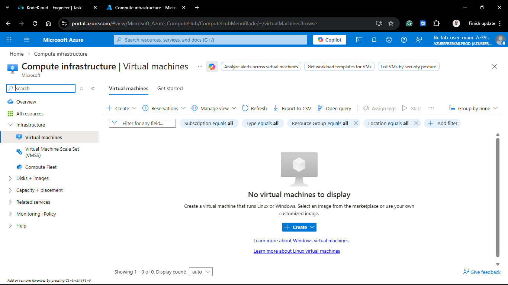

2. **Project Details:**
   - **Resource Group:** Selected the existing migration resource group.
3. **Instance Details:**
   - **Virtual machine name:** `devops-vm`.
   - **Region:** `(US) Central US`.
     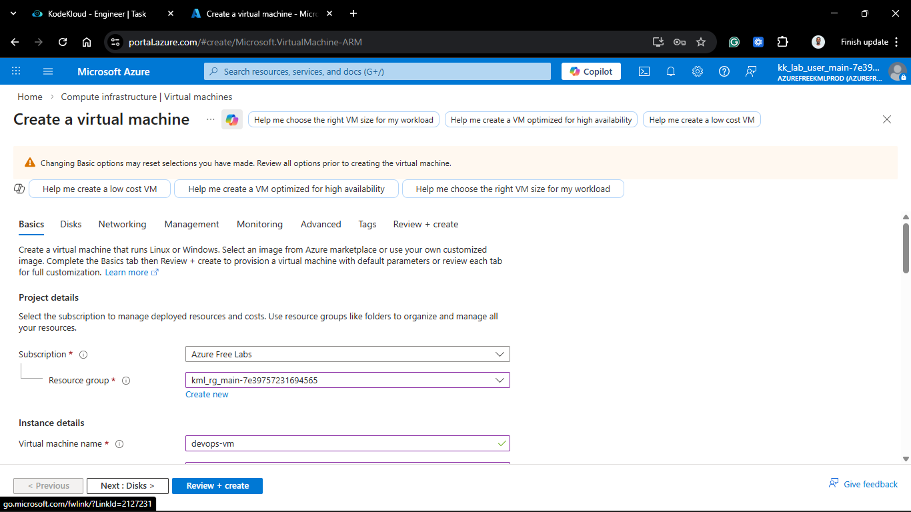
     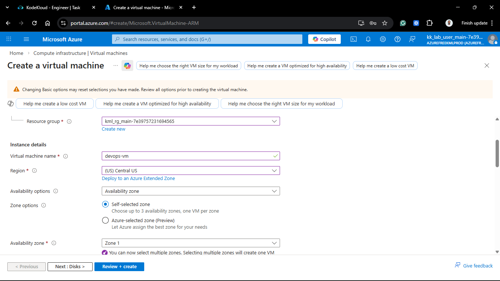

   - **Availability options:** No infrastructure redundancy required (Default).

   - **Image:** `Ubuntu Server 24.04 LTS - x64 Gen2`.
   - **Size:** `Standard_B1s`.
     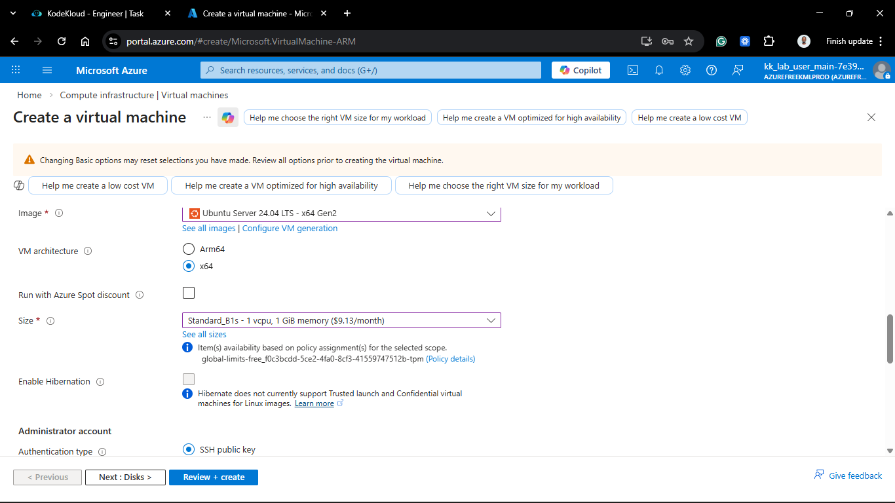

### 2. Administrator Account

1. **Authentication type:** SSH public key.
2. **Username:** `azureuser` (Default).
3. **SSH public key source:** Use existing key stored in Azure.
4. **Stored Key:** Selected `devops-vm_key` or Create a new one if it does not exist.
   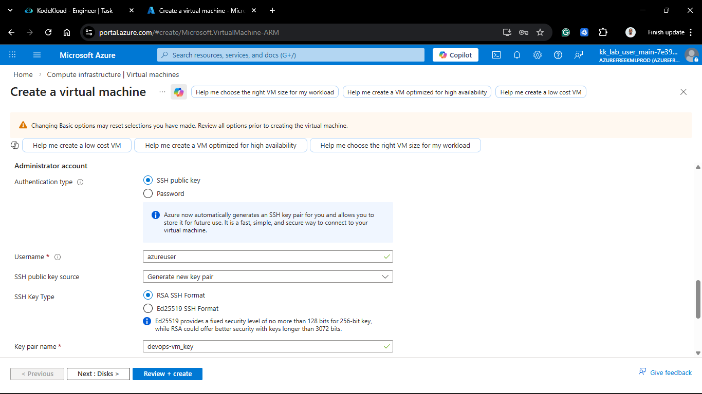

### 3. Disks Configuration

1. Navigated to the **Disks** tab.
2. **OS disk size:** Manually adjusted/confirmed to **30 GiB**.
3. **OS disk type:** Selected **Standard HDD (locally redundant storage)**.
   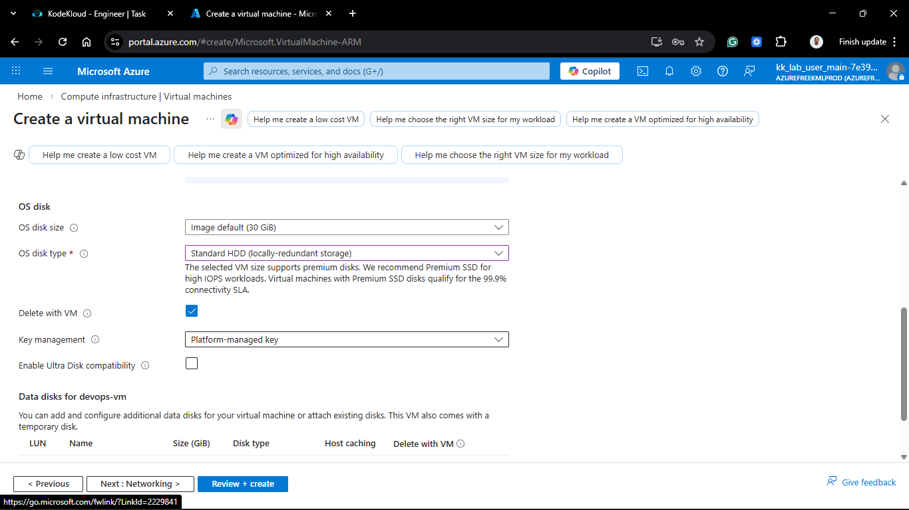

### 4. Networking & Security

1. Navigated to the **Networking** tab.
2. **NIC network security group:** Basic.
3. **Public inbound ports:** Allow selected ports.
4. **Select inbound ports:** **SSH (22)**.
   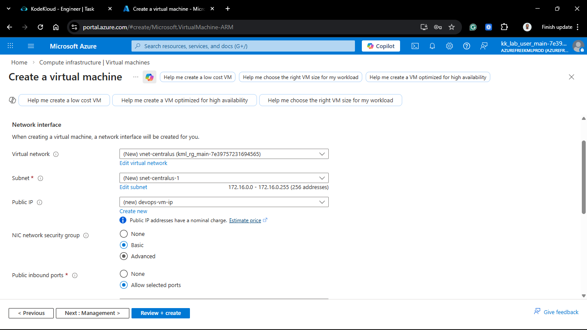

### 5. Finalize and Launch

1. Clicked **Review + create**.
2. Once validation passed, clicked **Create**.
   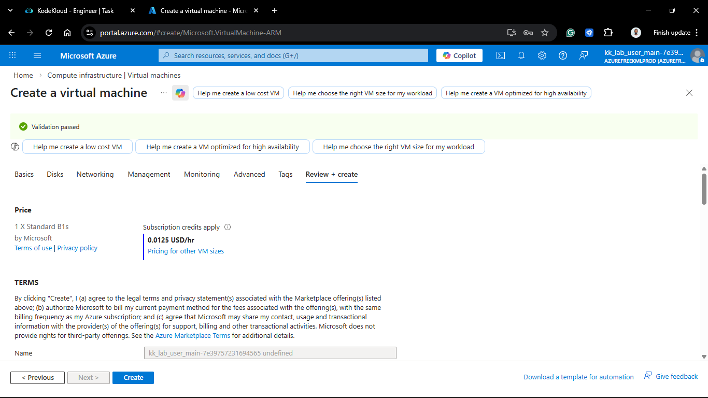
   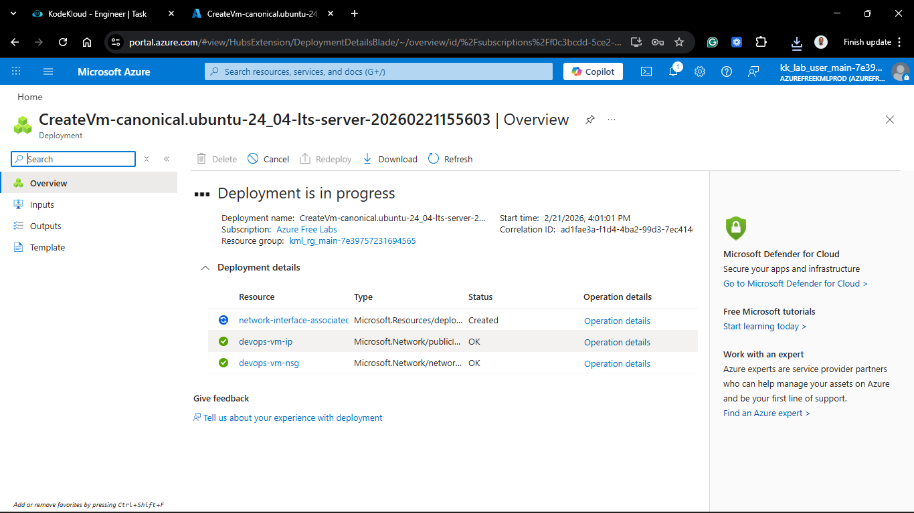
   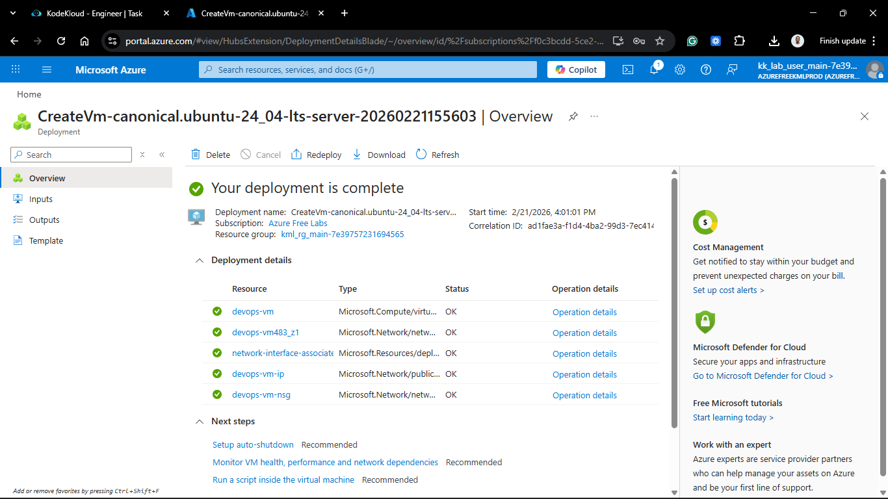

---

## Verification & SSH Access

1. **Deployment Check:** Verified the resource status is "Your deployment is complete."
2. **IP Retrieval:** Copied the **Public IP address** from the VM Overview page.
   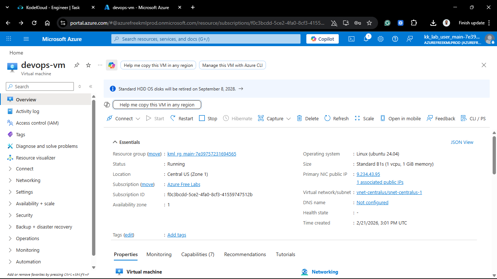

3. **SSH Connection:**
   From your terminal, used the following command to connect to the VM:

   ```bash
   chmod 400 devops-vm_key.pem
   ssh -i devops-vm_key.pem azureuser@<VM_PUBLIC_IP>
   ```

   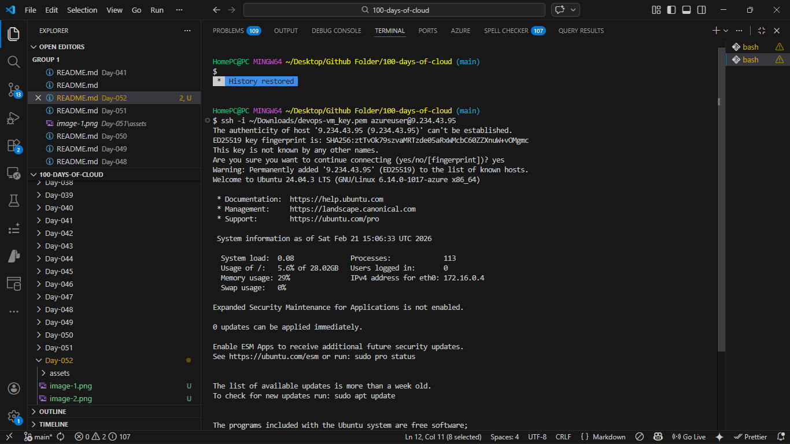

4. **Result:** Successfully authenticated into the Ubuntu 24.04 shell.

## 🧠 Theory: B-Series Burstable Instances and NSGs

- **Standard_B1s (Burstable):** The B-series is ideal for workloads that don't need full CPU performance continuously. These instances accumulate "CPU credits" during quiet periods, which they can "burst" when the load increases. This makes them highly cost-effective for development and small migration pilots.
- **Network Security Groups (NSG):** In Azure, the NSG acts as a stateful firewall. By allowing Port 22, we create an Inbound Security Rule. Just thinks about Security Groups in AWS. They are one and same. In a production environment, we would restrict the "Source" of this rule to a specific IP address rather than `Any` to prevent brute-force attempts.
- **Standard HDD:** While slower than SSDs, Standard HDDs (magnetic) are suitable for non-critical development tasks where cost optimization is prioritized over high-speed I/O.
  
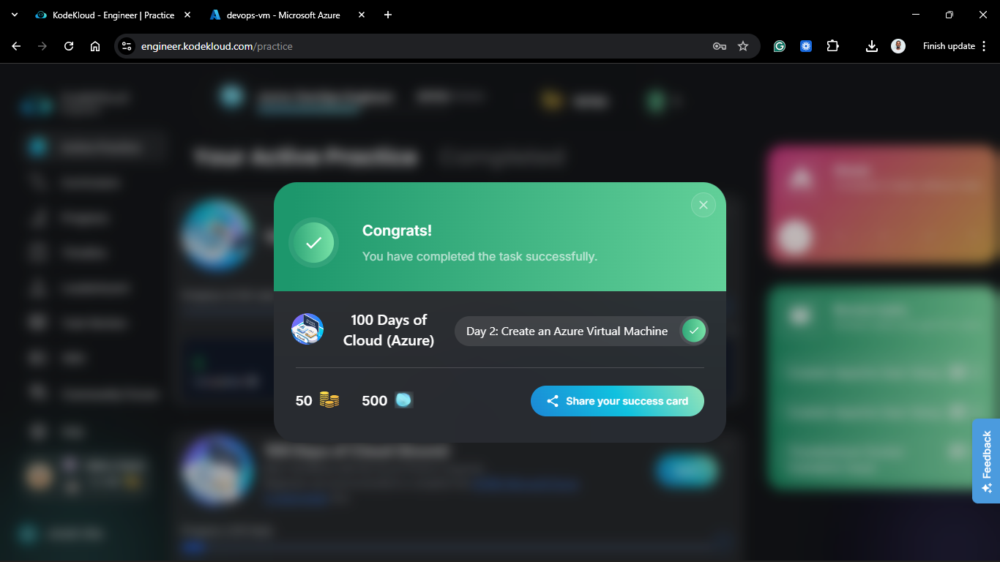
