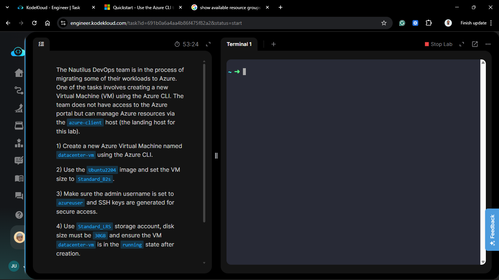
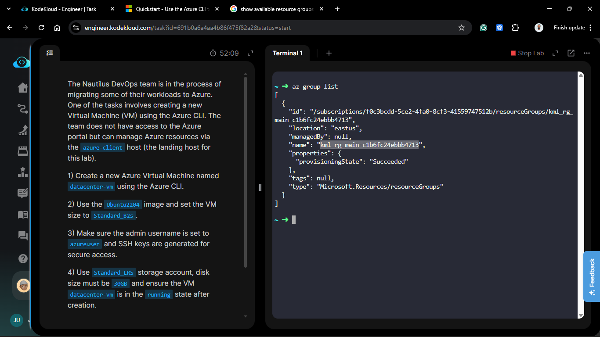
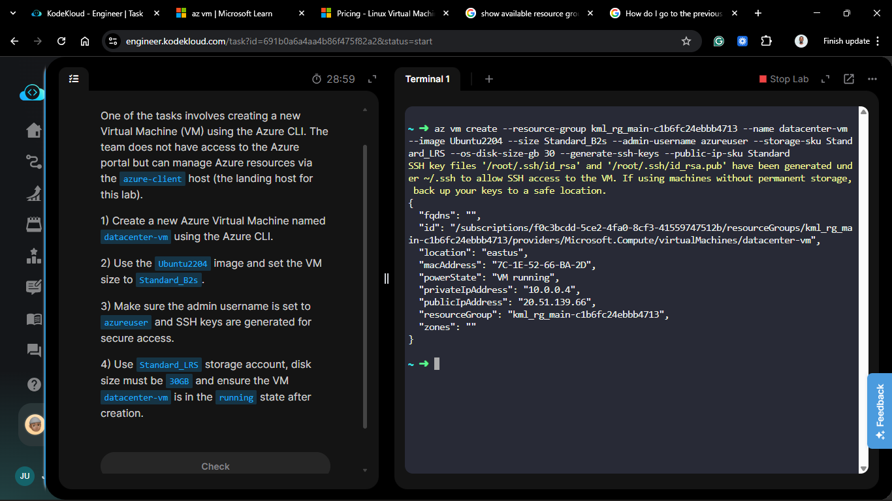
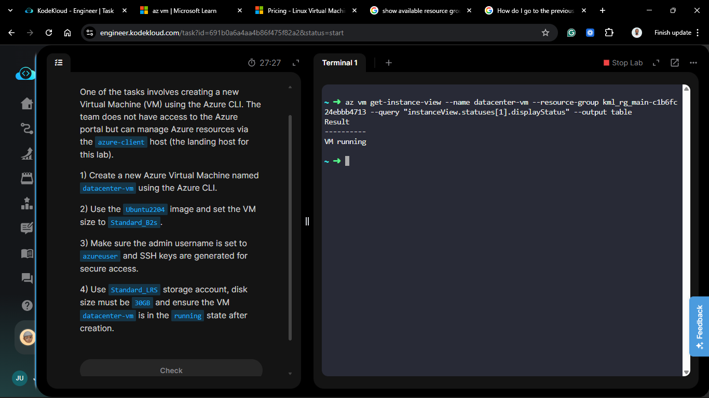
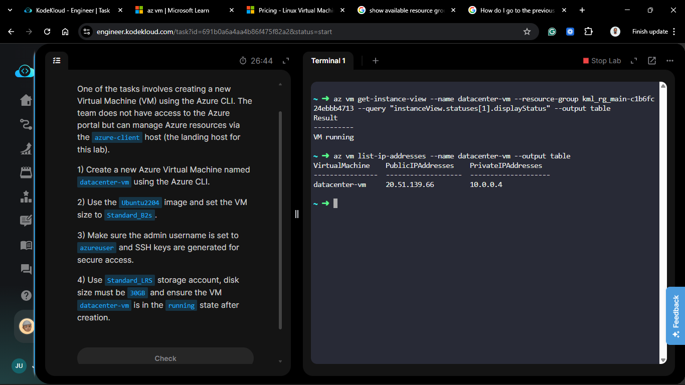
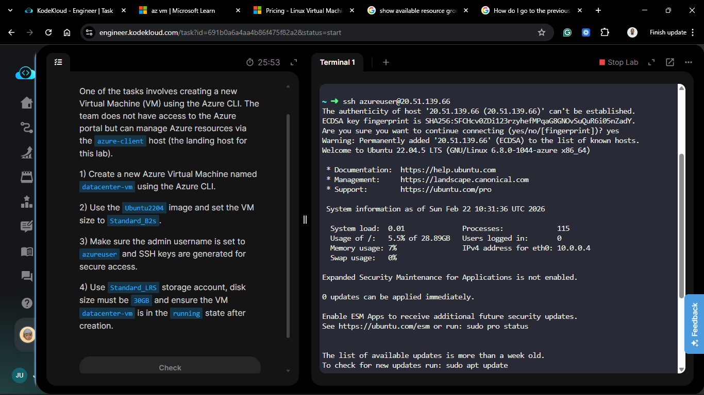
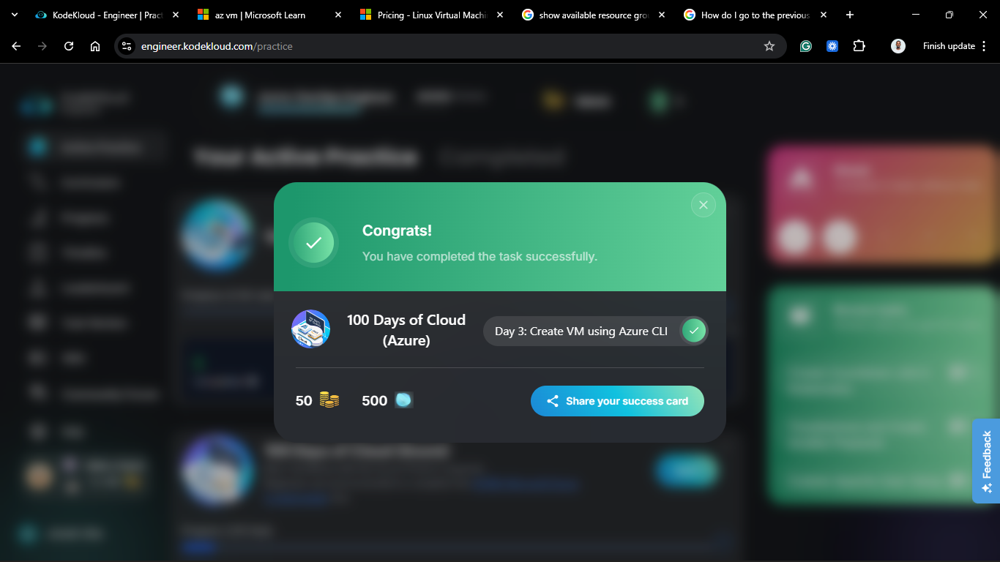

# Day 53 (Azure Day 3): Create VM using Azure CLI

## Project Description

As part of the incremental migration, the Nautilus DevOps team is transitioning from GUI-based management to **Command Line Interface (CLI)** automation. Today's task involves provisioning a Virtual Machine (`datacenter-vm`) directly from the `azure-client` host. This approach is essential for future CI/CD integration and infrastructure-as-code workflows.



**The Goal:**
Deploy a `Standard_B2s` Ubuntu instance named `datacenter-vm` using the `az vm create` command, ensuring specific disk sizing and storage types are met.

## Technical Specifications

| Requirement      | Specification   |
| :--------------- | :-------------- |
| **VM Name**      | `datacenter-vm` |
| **Image**        | `Ubuntu2204`    |
| **Size**         | `Standard_B2s`  |
| **Admin User**   | `azureuser`     |
| **Storage SKU**  | `Standard_LRS`  |
| **OS Disk Size** | 30 GB           |

---

## Steps & Configuration

### 1. Check for Existing Resource Group

Before creating the VM, I verified that a resource group already exists to host the VM.

```bash
az group list --output table
```



### 2. Execute VM Creation via CLI

I executed the following command to provision the VM with all required parameters. Note the use of `--generate-ssh-keys` to automate credential creation and `--os-disk-size-gb` to meet the storage requirement.

```bash
az vm create \
  --resource-group <EXISTING_RESOURCE_GROUP_NAME> \
  --name datacenter-vm \
  --image Ubuntu2204 \
  --size Standard_B2s \
  --admin-username azureuser \
  --storage-sku Standard_LRS \
  --os-disk-size-gb 30 \
  --generate-ssh-keys \
  --public-ip-sku Standard
```



### 3. Verify VM State

Once the JSON output is returned from the command above, verify that the `powerState` is `VM running`.

```bash
az vm get-instance-view \
  --name datacenter-vm \
  --resource-group <RESOURCE_GROUP_NAME> \
  --query "instanceView.statuses[1].displayStatus" \
  --output table
```



### Verification & SSH Access

1. **IP Identification:**

   ```bash
   az vm list-ip-addresses --name datacenter-vm --output table
   ```

   

2. **SSH Connection:**

   ```bash
   ssh azureuser@<VM_PUBLIC_IP>
   ```

   

## 🧠 Theory: CLI Orchestration and LRS Storage

- **Standard_B2s (2 vCPUs, 4 GiB RAM):** A step up from the B1s, the B2s provides more memory and higher burstable CPU credits, making it suitable for small database servers or build agents in our migration pipeline.

- **Standard_LRS (Locally Redundant Storage):** LRS replicates your data three times within a single data center in the selected region. It provides 99.999999999% (11 nines) durability over a given year and is the most cost-effective redundancy option Azure offers.

- **Idempotency in CLI:** One of the strengths of the Azure CLI is its ability to be used in scripts. If the command is run again with the same parameters, Azure ARM (Azure Resource Manager) ensures the current state matches the desired state.


