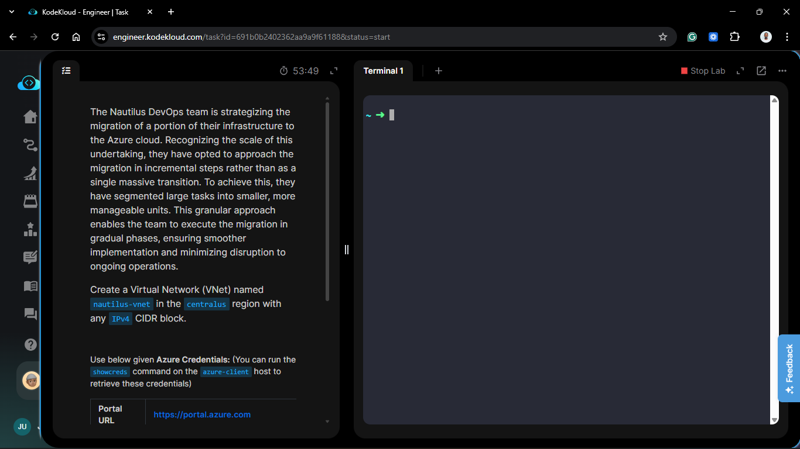
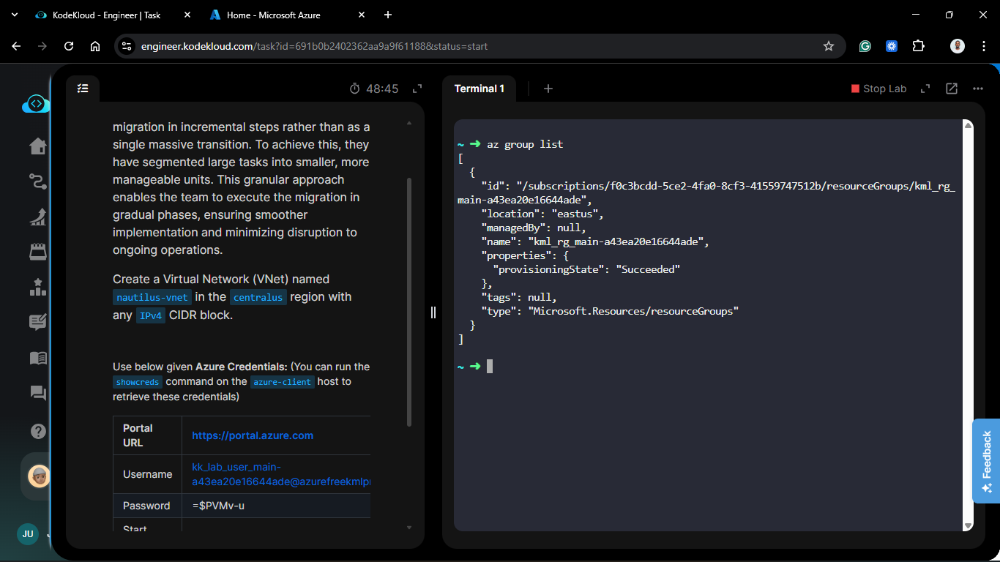
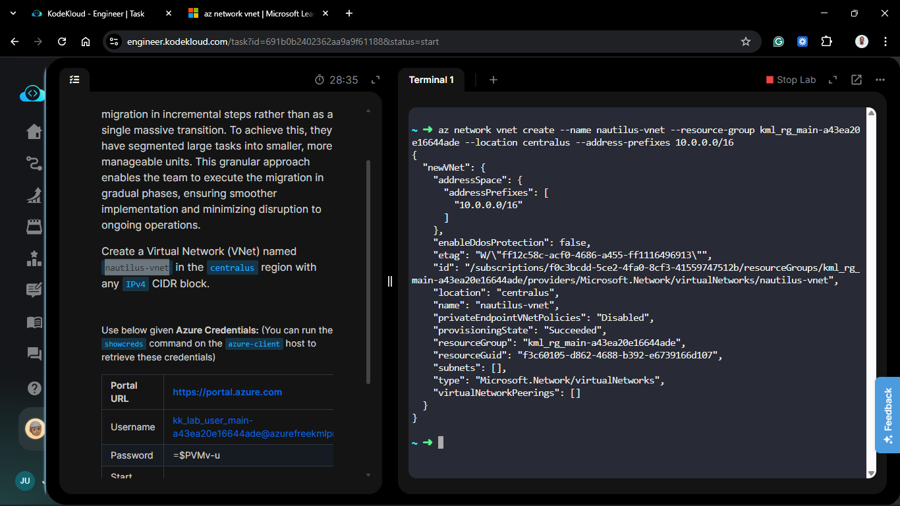
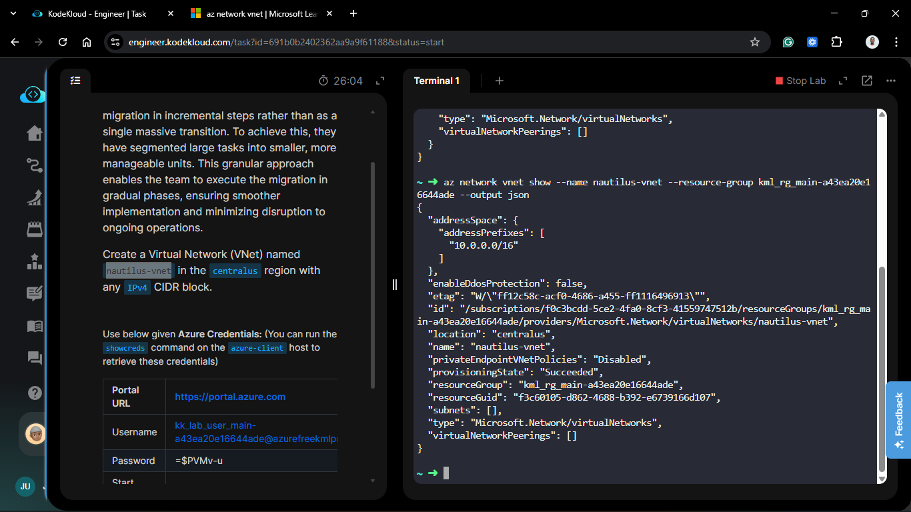
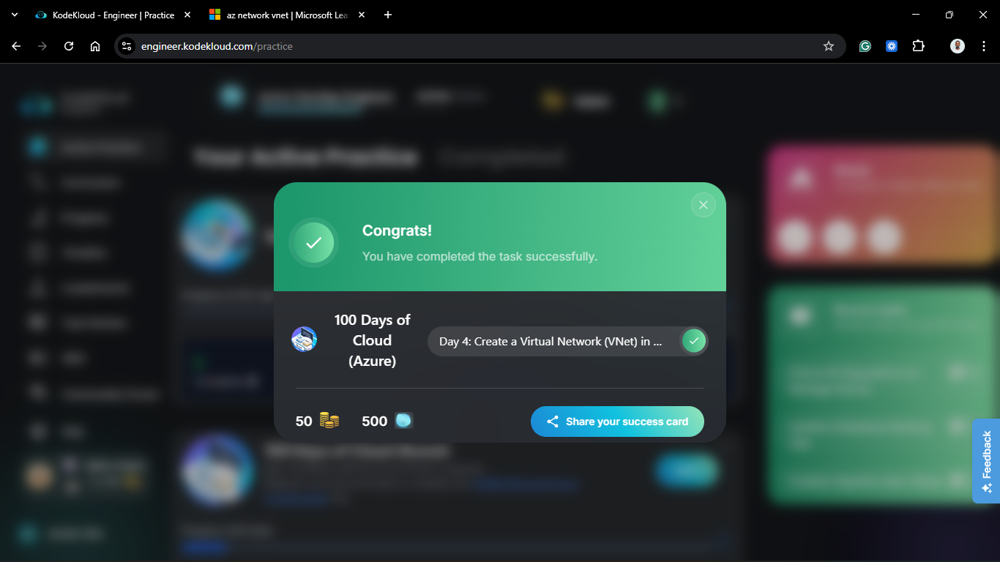

# Day 54: Create a Virtual Network (VNet) in Azure

## Project Description

As the Nautilus DevOps team progresses with their incremental migration, the focus has shifted from standalone compute resources to networking infrastructure. Today's task involves establishing the foundational network environment—the **Virtual Network (VNet)**. This VNet will act as the isolated boundary for all future resources in the `centralus` region.



**The Goal:**

Provision a Virtual Network named `nautilus-vnet` to provide a secure and scalable networking environment for the migrated workloads.

## Technical Specifications

| Requirement | Specification |
| :--- | :--- |
| **VNet Name** | `nautilus-vnet` |
| **Region** | `centralus` |
| **Address Space** | `10.0.0.0/16` (Standard IPv4 CIDR) |
| **Resource Group** | Existing Migration RG |

---

## Steps & Configuration

### 1. Identify Resource Scope

Before creation, ensure the existing resource group is identified.

```bash
az group list
```



### 2. Create Virtual Network via Azure CLI

Using the `azure-client` host, I executed the command to provision the VNet. I selected `10.0.0.0/16` as the CIDR block to allow for significant future subnetting.

```bash
az network vnet create \
  --name nautilus-vnet \
  --resource-group <EXISTING_RESOURCE_GROUP> \
  --location centralus \
  --address-prefixes 10.0.0.0/16
```



### 3. Verify VNet Properties

I verified the successful creation and address space allocation using the show command:

```bash
az network vnet show \
  --name nautilus-vnet \
  --resource-group <RESOURCE_GROUP_NAME> \
  --output json
```



## Verification

1. **State Check:** Confirmed `provisioningState` is `Succeeded`.

2. **Region Check:** Confirmed location is set to `centralus`.

3. **Connectivity Ready:** The VNet is now ready to host subnets, network security groups, and virtual machines.

## 🧠 Theory: The Role of VNets in Cloud Architecture

- **Isolation and Trust:** A VNet is a representation of your own network in the cloud. It is a logical isolation of the Azure cloud dedicated to your subscription.

- **Address Space (CIDR):** By defining 10.0.0.0/16, we have allocated 65,536 private IP addresses. This provides ample room to segment the network into public subnets (for web servers) and private subnets (for databases) in future tasks.

- **Regional Scope:** VNets are regional resources. While they cannot span multiple regions, they can be connected to other VNets in different regions using VNet Peering, similar to the AWS VPC Peering we implemented on Day 49.


