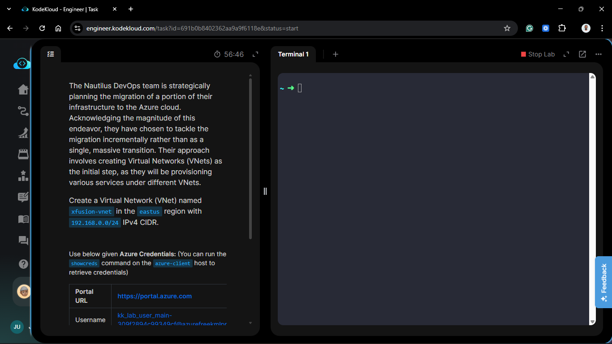
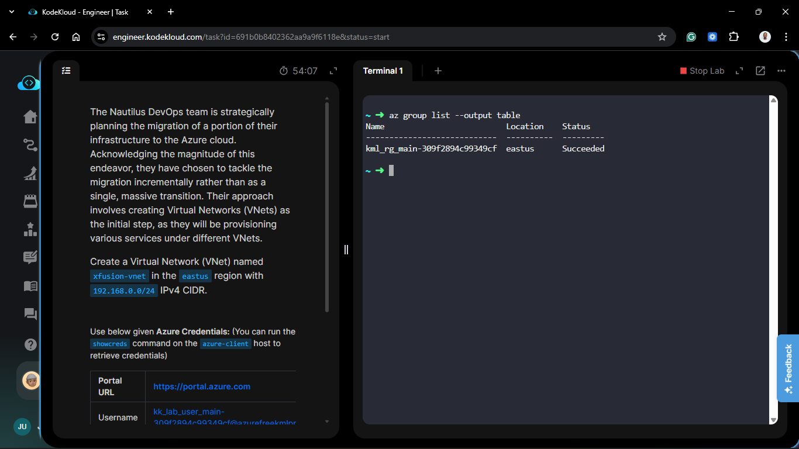
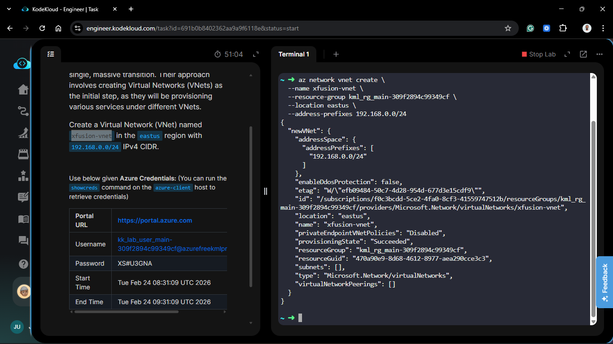
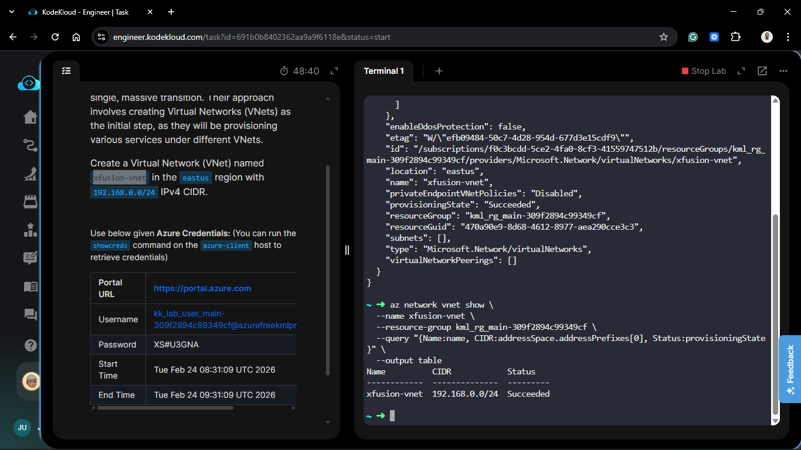

# Day 55: Create a Virtual Network (IPv4) in Azure

## Project Description

As the Nautilus DevOps team deepens its Azure migration, the strategy has shifted toward multi-network isolation. To accommodate specific service requirements, we are provisioning a dedicated Virtual Network (VNet) designed for a compact, high-efficiency workload. This VNet will serve as a specialized segment of our cloud footprint in the **East US** region.



**The Goal:**
Provision a Virtual Network named `xfusion-vnet` using a specific Class C private address space to support upcoming microservices.

## Technical Specifications

| Requirement | Specification |
| :--- | :--- |
| **VNet Name** | `xfusion-vnet` |
| **Region** | `eastus` |
| **Address Space** | `192.168.0.0/24` |
| **Available IPs** | 251 (256 total - 5 Azure reserved) |

---

## Steps & Configuration

### 1. Identify Resource Scope

Ensure the migration resource group is targeted to maintain logical grouping of all Azure assets.


### 2. Create Virtual Network via Azure CLI

I executed the following command to provision the network. Unlike previous broad networks, this one uses a `/24` prefix, providing 256 total addresses, which is ideal for a dedicated service tier.

```bash
az network vnet create \
  --name xfusion-vnet \
  --resource-group <EXISTING_RESOURCE_GROUP> \
  --location eastus \
  --address-prefixes 192.168.0.0/24
```



### 3. Verify Network Integrity

I confirmed the provisioning state and CIDR allocation:

```bash
az network vnet show \
  --name xfusion-vnet \
  --resource-group <RESOURCE_GROUP_NAME> \
  --query "{Name:name, CIDR:addressSpace.addressPrefixes[0], Status:provisioningState}" \
  --output table
```



## Verification

1. **Region:** Confirmed the resource is deployed in `eastus`.
2. **Capacity:** Verified the address space is exactly `192.168.0.0/24`.
3. **Readiness:** The VNet is now prepared for subnetting and service injection.

## 🧠 Theory: CIDR Sizing and Azure Reserved IPs

- **Compact Address Spaces:** While a `/16` (65k IPs) is common for a backbone network, a `/24` (256 IPs) is perfect for isolated application environments or "Landing Zones" for specific departments. It prevents IP wastage in multi-VNet architectures.

- **The "Azure 5" Reservation:** In every Azure VNet/Subnet, 5 IP addresses are reserved for internal management:
  - `x.x.x.0`: Network address.
  - `x.x.x.1`: Default gateway.
  - `x.x.x.2/3`: DNS mapping and internal Azure services.
  - `x.x.x.255`: Network broadcast address.

- **Regional Strategy:** By deploying in `eastus`, we are expanding the Nautilus team's geographic redundancy, allowing for future cross-region peering with the `centralus` network created on Day 54.


