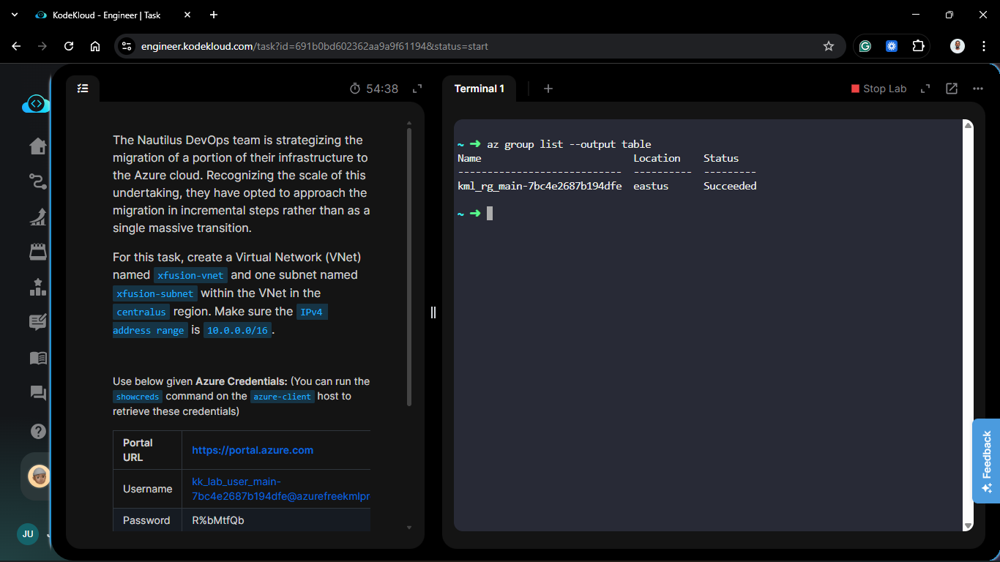
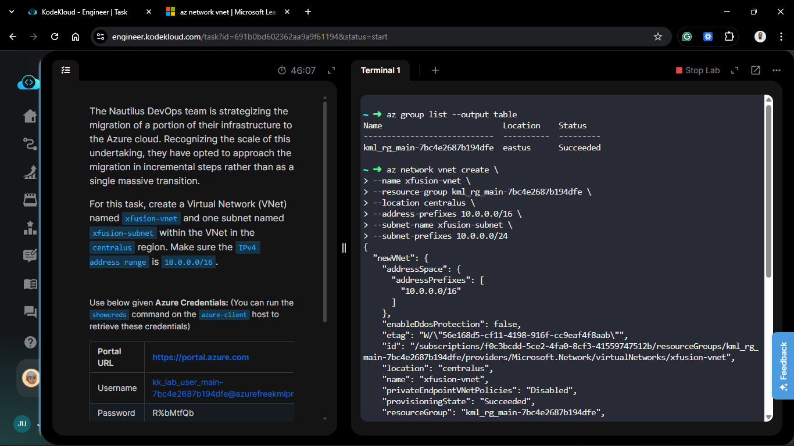
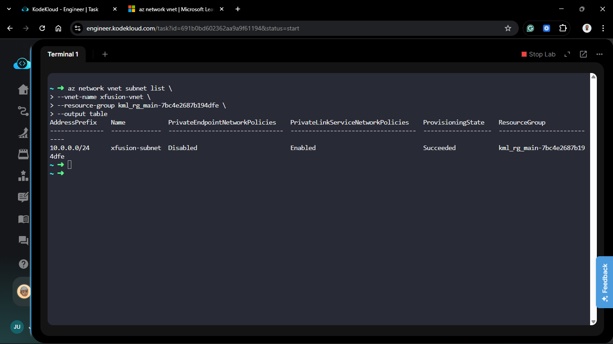
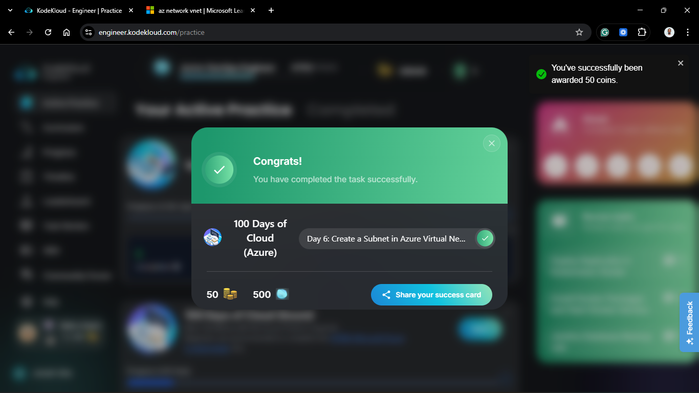

# Day 56: Create a Subnet in Azure Virtual Network

## Project Description

The Nautilus DevOps team continues its incremental migration by refining the network architecture. Establishing a **Virtual Network (VNet)** is the first step, but resources cannot be deployed into a VNet directly—they require a **Subnet**. Today's task involves provisioning the `xfusion-vnet` backbone and carving out the first logical segment, `xfusion-subnet`, to host upcoming cloud resources.


**The Goal:**

Provision a foundational network environment in the `centralus` region with a broad IPv4 address space and an initial functional subnet.

## Technical Specifications

| Requirement     | Specification                                |
| :-------------- | :------------------------------------------- |
| **VNet Name**   | `xfusion-vnet`                               |
| **Subnet Name** | `xfusion-subnet`                             |
| **Region**      | `centralus`                                  |
| **VNet CIDR**   | `10.0.0.0/16` (65,536 IPs)                   |
| **Subnet CIDR** | `10.0.1.0/24` (Defaulting to 251 usable IPs) |

---

## Steps & Configuration

### 1. Create the Virtual Network and Subnet via Azure CLI

Using the `azure-client` host, I initialized the VNet. I defined the address prefix to allow for significant future expansion and segmentation, then created the first subnet within that VNet with a single command.

```bash
az network vnet create \
  --name xfusion-vnet \
  --resource-group <EXISTING_RESOURCE_GROUP> \
  --location centralus \
  --address-prefixes 10.0.0.0/16 \
  --subnet-name xfusion-subnet \
  --address-prefix 10.0.0.0/24
```



You should expect a JSON output confirming the creation of both the VNet and the subnet, with the `provisioningState` showing as `Succeeded`.

```bash
{
  "newVNet": {
    "addressSpace": {
      "addressPrefixes": [
        "10.0.0.0/16"
      ]
    },
    "enableDdosProtection": false,
    "etag": "W/\"56e168d5-cf11-4198-916f-cc9eaf4f8aab\"",
    "id": "/subscriptions/f0c3bcdd-5ce2-4fa0-8cf3-41559747512b/resourceGroups/kml_rg_main-7bc4e2687b194dfe/providers/Microsoft.Network/virtualNetworks/xfusion-vnet",
    "location": "centralus",
    "name": "xfusion-vnet",
    "privateEndpointVNetPolicies": "Disabled",
    "provisioningState": "Succeeded",
    "resourceGroup": "kml_rg_main-7bc4e2687b194dfe",
    "resourceGuid": "4f485574-bb70-458f-b8b6-ecd1a3b1604d",
    "subnets": [
      {
        "addressPrefix": "10.0.0.0/24",
        "delegations": [],
        "etag": "W/\"56e168d5-cf11-4198-916f-cc9eaf4f8aab\"",
        "id": "/subscriptions/f0c3bcdd-5ce2-4fa0-8cf3-41559747512b/resourceGroups/kml_rg_main-7bc4e2687b194dfe/providers/Microsoft.Network/virtualNetworks/xfusion-vnet/subnets/xfusion-subnet",
        "name": "xfusion-subnet",
        "privateEndpointNetworkPolicies": "Disabled",
        "privateLinkServiceNetworkPolicies": "Enabled",
        "provisioningState": "Succeeded",
        "resourceGroup": "kml_rg_main-7bc4e2687b194dfe",
        "type": "Microsoft.Network/virtualNetworks/subnets"
      }
    ],
    "type": "Microsoft.Network/virtualNetworks",
    "virtualNetworkPeerings": []
  }
}
```

### 3. Verify Network Hierarchy

I verified that the subnet was correctly associated with the parent VNet and inherited the regional settings.

```bash
az network vnet subnet list \
  --vnet-name xfusion-vnet \
  --resource-group <RESOURCE_GROUP_NAME> \
  --output table
```



## 🧠 Theory: Subnetting and Azure Networking

- **VNets vs. Subnets:** Think of the VNet as the entire building (the boundary) and the **Subnet** as an individual room (the functional space). You can apply different security policies (NSGs) to different subnets within the same VNet.
- **Address Calculation:** By using a `/24` for the subnet within a `/16` VNet, we have consumed only a small fraction of our available space. This allows us to create up to 256 similar subnets in the future for different tiers (Web, App, DB).
- **Azure Reserved IPs:** Even in `xfusion-subnet`, Azure reserves the first three and the last IP addresses for infrastructure management (Gateway, DNS, and DHCP), leaving 251 addresses for our resources.


