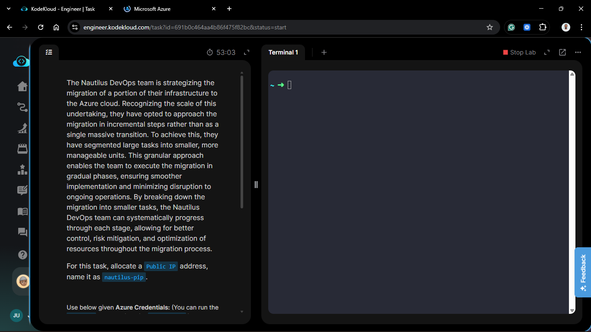
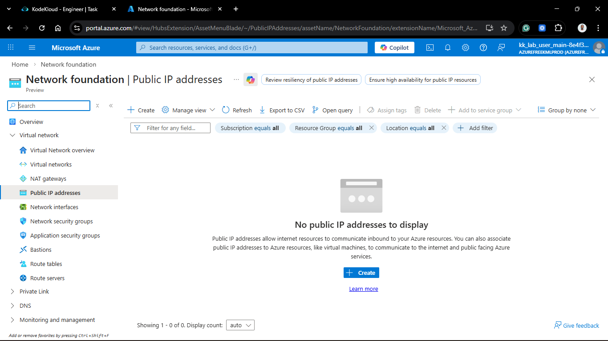
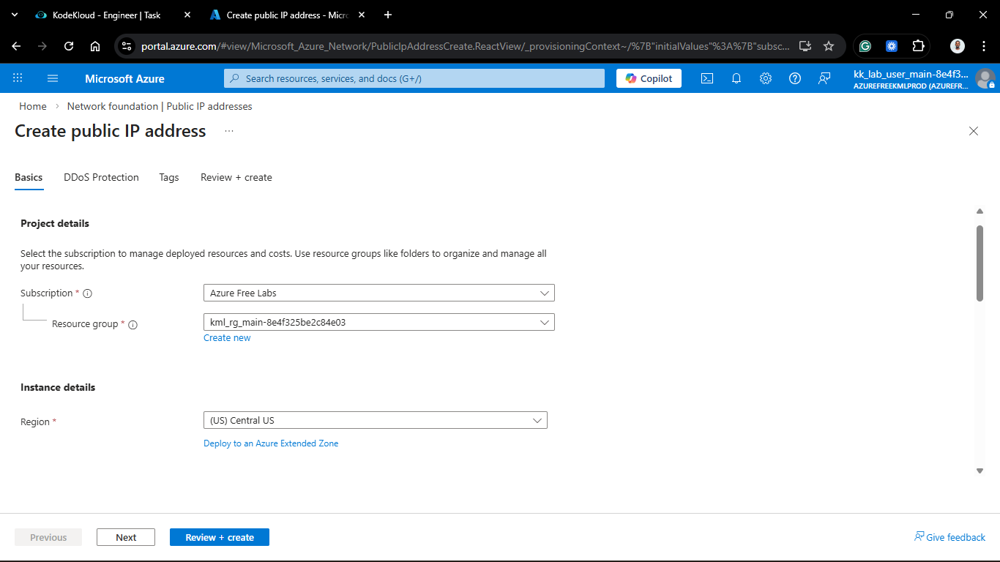
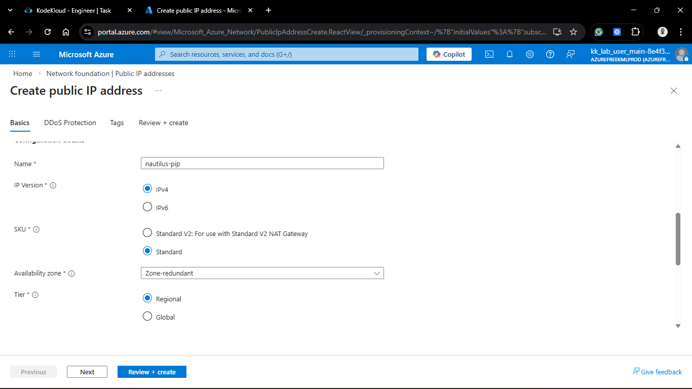
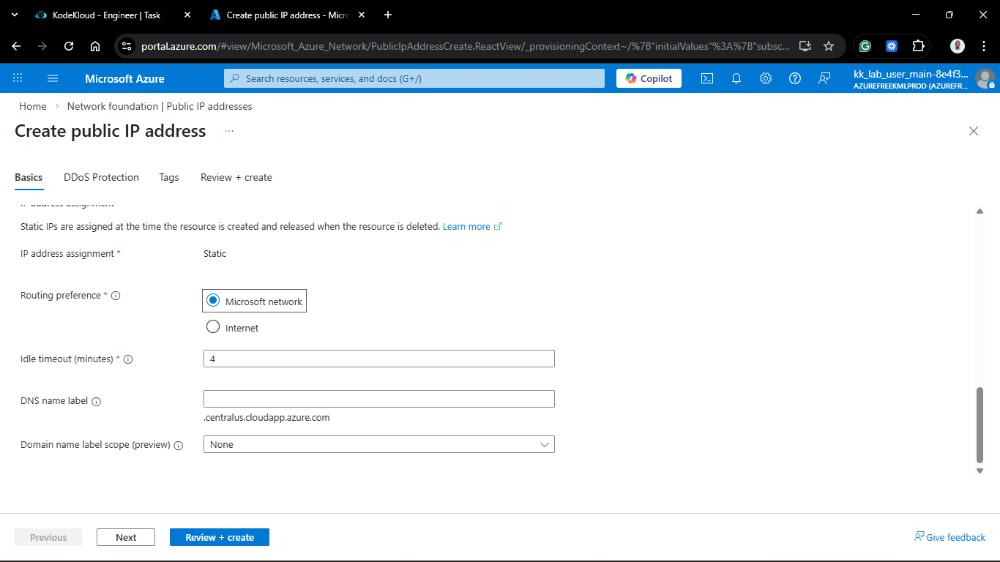
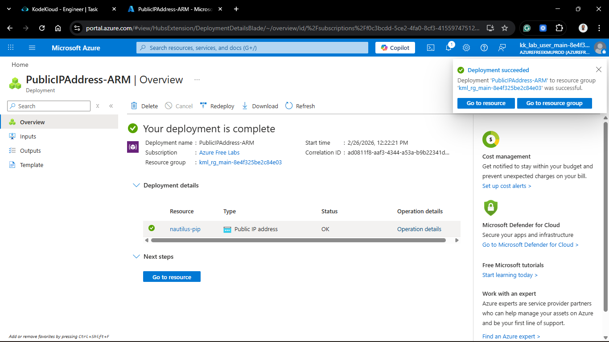
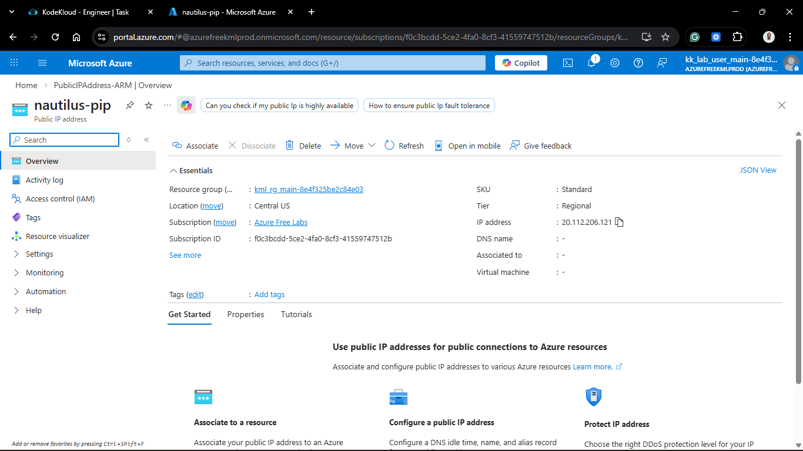
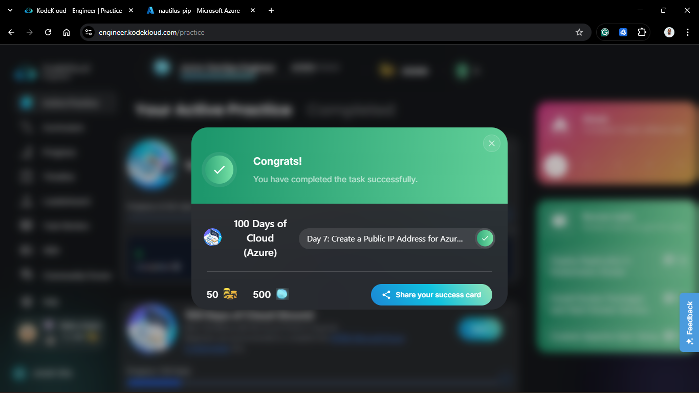

# Day 57: Create a Public IP Address for Azure VM

## Project Description

As the Nautilus DevOps team continues the incremental migration to Azure, the focus has shifted toward external connectivity. While our Virtual Networks and Subnets provide internal structure, a **Public IP (PIP)** is required to make our resources reachable from the internet. Today's task involves allocating a static entry point that will eventually be associated with a Virtual Machine's Network Interface (NIC).

**The Goal:**

Provision a dedicated Public IP address resource named `nautilus-pip` using the Azure Portal, ensuring a consistent endpoint for external management.

## Technical Specifications

| Requirement       | Specification                           |
| :---------------- | :-------------------------------------- |
| **Resource Name** | `nautilus-pip`                          |
| **IP Version**    | IPv4                                    |
| **SKU**           | Standard (Default for modern workloads) |
| **Tier**          | Regional                                |
| **Assignment**    | Static                                  |

---

## Steps & Configuration (Console/Portal)

### 1. Initialize Public IP Creation

1. Log in to the **Azure Portal**.
2. In the top search bar, type **"Public IP addresses"** and select the service.
   

3. Click **+ Create**.

### 2. Configure Resource Details

1. **Project Details:**
   - **Subscription:** Selected the active migration subscription.
   - **Resource Group:** Selected the existing migration resource group.
     

2. **Instance Details:**
   - **Name:** `nautilus-pip`.
   - **Region:** `Central US` (to match our existing VNet/VM location).
   - **IP Version:** IPv4.
   - **SKU:** **Standard**.
   - **Tier:** Regional.
     

3. **IP Address Assignment:**
   - **Assignment:** Set to **Static**. This ensures the IP does not change if the associated resource is stopped or deallocated.
     

4. **Idle Timeout:** Kept at the default 4 minutes.

### 3. Review and Create

1. Clicked **Review + create**.
2. Once validation passed, clicked **Create**.

---

## Verification

1. **Deployment Status:** Confirmed "Your deployment is complete."
   

2. **Resource Overview:** Navigated to the `nautilus-pip` resource page.
   

3. **IP Assignment:** Verified that an actual IPv4 address (e.g., `20.x.x.x`) has been reserved and the status is **"Succeeded"**.

## 🧠 Theory: Public IP SKUs and Assignment

- **Basic vs. Standard SKU:** Azure is phasing out Basic SKUs. **Standard SKU** Public IPs are secure by default (requiring an NSG to allow traffic), support Availability Zones, and use "Static" assignment by default.
- **Static vs. Dynamic:** A **Dynamic** IP can change when a resource is restarted. A **Static** IP is reserved in the Azure infrastructure until the resource is deleted, making it ideal for DNS records and firewall allow-lists.
- **Association Logic:** Currently, `nautilus-pip` is a standalone resource. It acts as a "floating" address that can be mapped to a Load Balancer or a specific VM's Network Interface (NIC) in subsequent migration steps.

