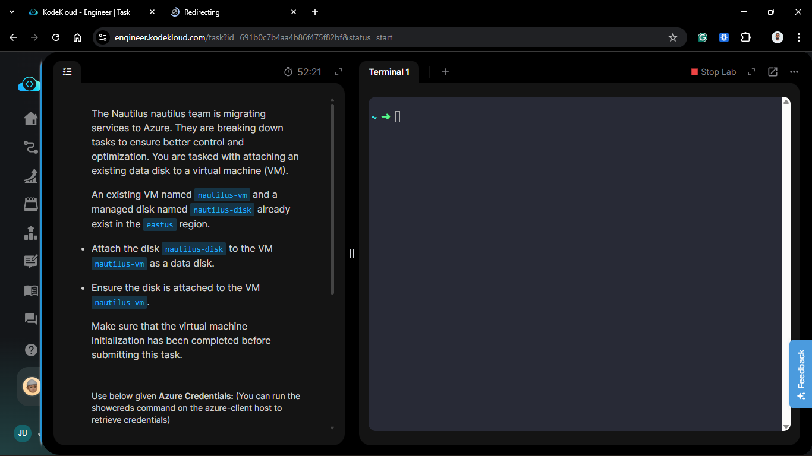
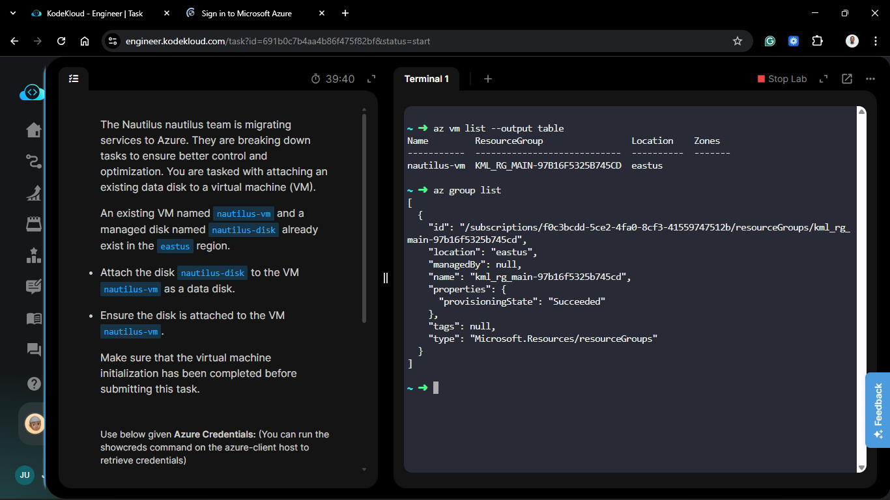
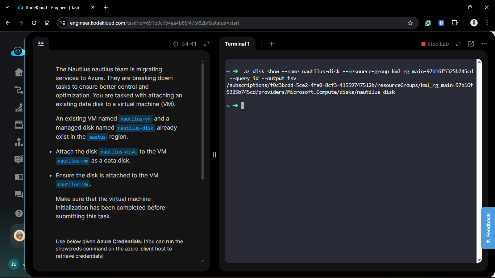
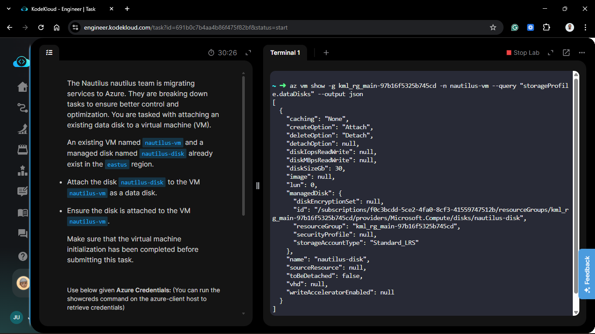
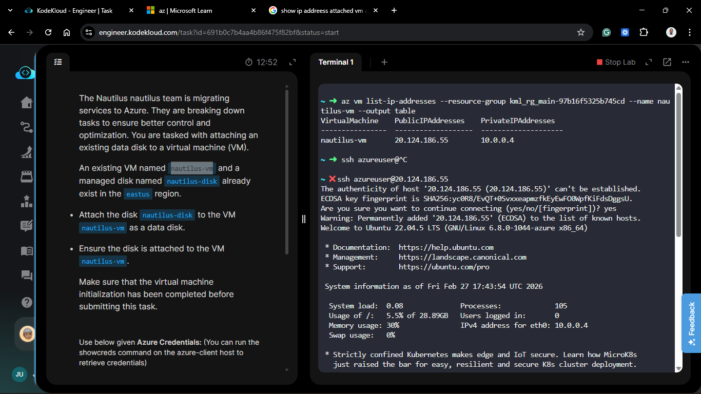
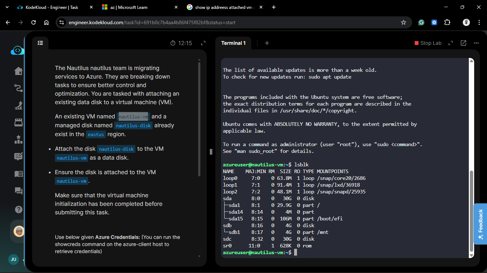
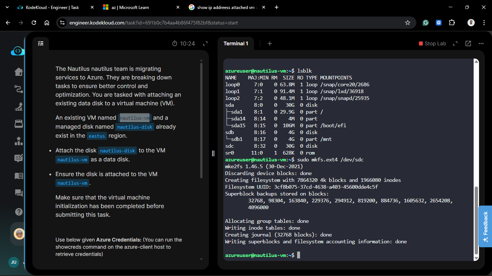
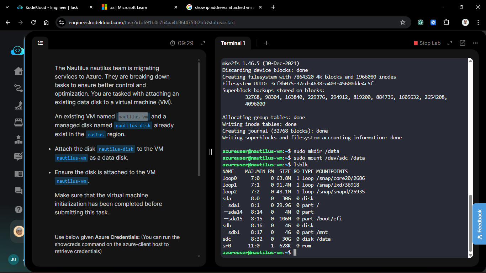
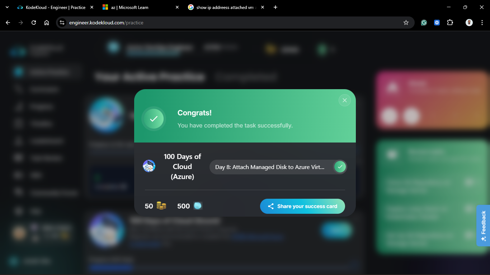

# Day 58: Attach Managed Disk to Azure Virtual Machine

## Project Description

As the Nautilus migration progresses, the team is now focusing on **Stateful Workloads**. While the OS disk handles the system files, application data and databases require dedicated storage for better performance and management. Today's task involves attaching an existing managed data disk (`nautilus-disk`) to a running virtual machine (`nautilus-vm`) to expand its storage capacity..



**The Goal:**

Hot-swap/Attach a managed disk to an existing Ubuntu VM in the `eastus` region without disrupting the primary OS operations.

## Technical Specifications

| Requirement | Specification |
| :--- | :--- |
| **VM Name** | `nautilus-vm` |
| **Disk Name** | `nautilus-disk` |
| **Region** | `eastus` |
| **LUN** | 0 (Logical Unit Number) |
| **Resource Group** | kml_rg_main-97b16f5325b745cd |

---

## Steps & Configuration (Azure CLI)

### 0. Check If VM exists and for available RG

```bash
az vm list --output table

az group list
```



### 1. Identify Disk Resource ID

Before attaching, we need the unique identifier of the managed disk.

```bash
DISK_ID=$(az disk show --name nautilus-disk --resource-group <RG_NAME> --query id --output tsv)
```

 

### 2. Attach the Disk to the VM

Using the `az vm disk attach` command, we link the disk to the VM. We use the `--new` flag only if creating a disk; since ours exists, we simply reference the name or ID.

```bash
 az vm disk attach \
  --resource-group kml_rg_main-97b16f5325b745cd \
  --vm-name nautilus-vm \
  --name nautilus-disk \
  --lun 0
```

### 3. Verify Attachment via CLI

Confirm the disk is now part of the VM's storage profile:

```bash
az vm show -g kml_rg_main-97b16f5325b745cd -n nautilus-vm --query "storageProfile.dataDisks" --output json
```



### 4. Get the IP Address of the VM

```bash
az vm list-ip-addresses --resource-group kml_rg_main-97b16f5325b745cd --name nautilus-vm --output table
```

## OS Level Configuration (Inside the VM)

After the CLI reports success, the disk must be initialized within the Linux OS.

1. **SSH into the VM:**

   ```bash
   ssh azureuser@<VM_PUBLIC_IP>
   ```

   

2. **Scan for New Hardware:**

    ```bash
    lsblk
    ```

    

    ```bash
    NAME    MAJ:MIN RM  SIZE RO TYPE MOUNTPOINTS
    loop0     7:0    0 63.8M  1 loop /snap/core20/2686
    loop1     7:1    0 91.4M  1 loop /snap/lxd/36918
    loop2     7:2    0 48.1M  1 loop /snap/snapd/25935
    sda       8:0    0   30G  0 disk
    ├─sda1    8:1    0 29.9G  0 part /
    ├─sda14   8:14   0    4M  0 part
    └─sda15   8:15   0  106M  0 part /boot/efi
    sdb       8:16   0    4G  0 disk
    └─sdb1    8:17   0    4G  0 part /mnt
    sdc       8:32   0   30G  0 disk
    sr0      11:0    1  628K  0 rom  
    ```

    You should see a new device, likely `/dev/sdc` or `/dev/nvme1n1` depending on the VM series.

3. **Format and Mount (If it's a new disk):**

   ```bash
    sudo mkfs.ext4 /dev/sdc
    sudo mkdir /data
    sudo mount /dev/sdc /data
    ```

    

    ```bash
    mke2fs 1.46.5 (30-Dec-2021)

    Discarding device blocks: done
    Creating filesystem with 7864320 4k blocks and 1966080 inodes
    Filesystem UUID: 3cf8b075-37cd-4638-a403-45600dde4c5f
    Superblock backups stored on blocks:
            32768, 98304, 163840, 229376, 294912, 819200, 884736, 1605632, 2654208,
            4096000

    Allocating group tables: done
    Writing inode tables: done
    Creating journal (32768 blocks): done
    Writing superblocks and filesystem accounting information: done
    ```

4. **Check `lsblk` Again:**

    ```bash
    lsblk
    ```

    

    ```bash
    NAME    MAJ:MIN RM  SIZE RO TYPE MOUNTPOINTS
    loop0     7:0    0 63.8M  1 loop /snap/core20/2686
    loop1     7:1    0 91.4M  1 loop /snap/lxd/36918
    loop2     7:2    0 48.1M  1 loop /snap/snapd/25935
    sda       8:0    0   30G  0 disk
    ├─sda1    8:1    0 29.9G  0 part /
    ├─sda14   8:14   0    4M  0 part
    └─sda15   8:15   0  106M  0 part /boot/efi
    sdb       8:16   0    4G  0 disk
    └─sdb1    8:17   0    4G  0 part /mnt
    sdc       8:32   0   30G  0 disk /data
    sr0      11:0    1  628K  0 rom  
    ```

## Verification

1. **State Check:** Verified that `nautilus-disk` is attached with `caching` set to `ReadWrite` (default) and `LUN 0`.
2. **Infrastructure as Code Readiness:** By using the CLI, this process can now be scripted for future automated deployments.

## 🧠 Theory: CLI Storage Management

- **The `az vm disk attach` Command:** This command interacts with the Azure Resource Manager (ARM) to update the VM's JSON definition. It triggers a hardware "hot-plug" event in the underlying hypervisor.

- **LUN (Logical Unit Number):** In the CLI, the `--lun` parameter is vital. If you omit it, Azure attempts to find the next available slot. Explicitly setting it to `0` ensures consistency with our architectural documentation.
- **Decoupled Lifecycle:** Attaching via CLI highlights that the disk and the VM are separate entities. If the VM is deleted, the CLI attachment simply breaks, but the `nautilus-disk` remains as a standalone resource in the `eastus` region.


