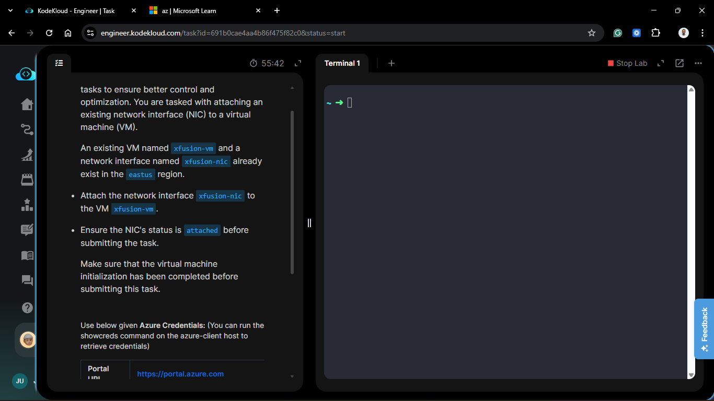
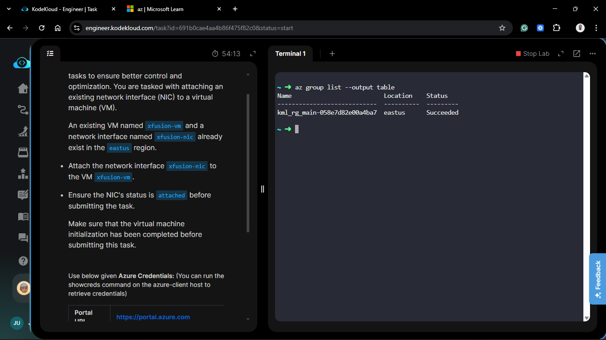
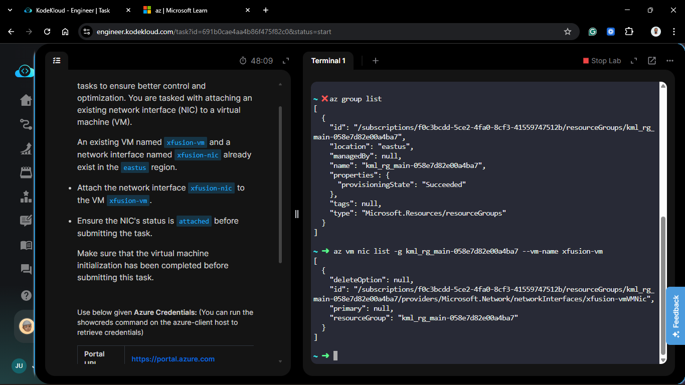
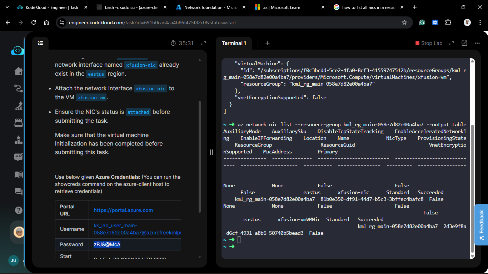
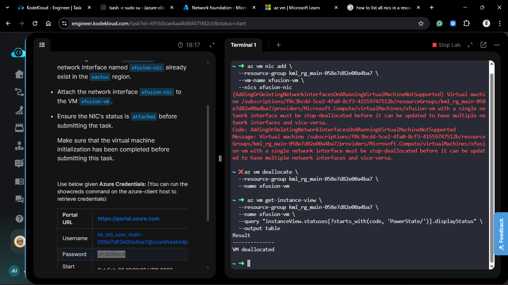
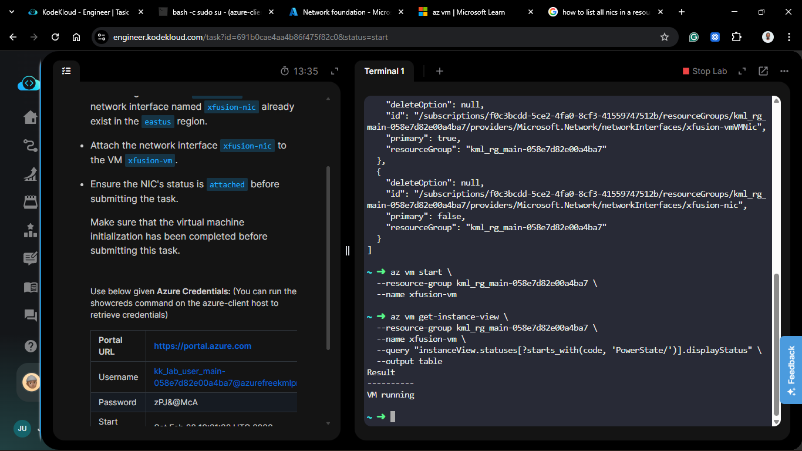
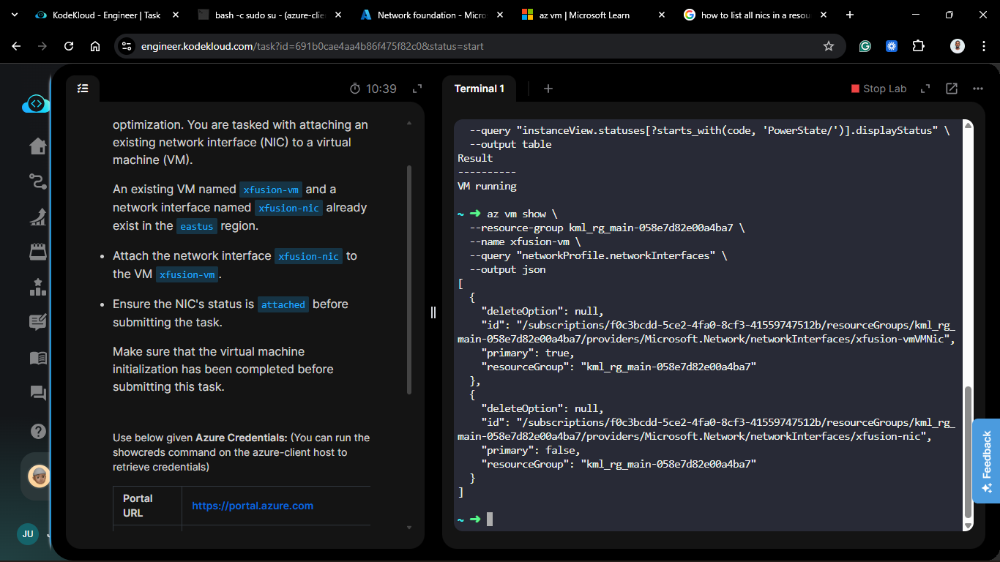
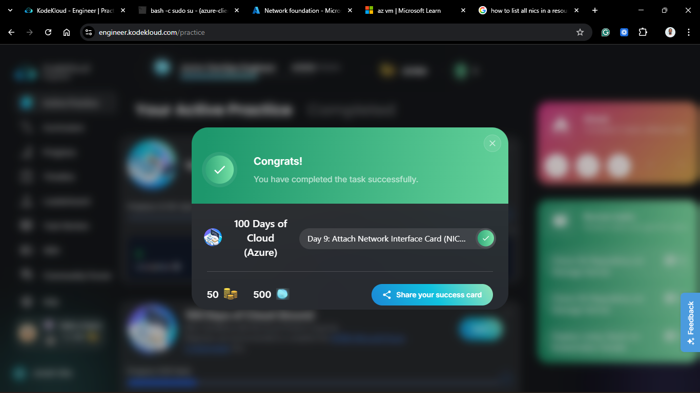

# Day 59: Attach Network Interface Card (NIC) to Azure Virtual Machine

## Project Description

As the xfusion DevOps team scales their Azure infrastructure, networking flexibility becomes a priority. Today's task involved attaching an existing secondary network interface (`xfusion-nic`) to the primary virtual machine (`xfusion-vm`). This multi-homing setup is essential for traffic isolation and advanced networking configurations.



**The Goal:**

Provision a secondary network path by attaching `xfusion-nic` to `xfusion-vm` in the `eastus` region using the Azure CLI.

## Technical Specifications

| Requirement        | Specification                  |
| :----------------- | :----------------------------- |
| **VM Name**        | `xfusion-vm`                   |
| **Secondary NIC**  | `xfusion-nic`                  |
| **Resource Group** | `kml_rg_main-058e7d82e00a4ba7` |
| **Location**       | `eastus`                       |
| **Primary NIC**    | `xfusion-vmVMNic`              |

---

## Steps & Configuration (Detailed CLI Workflow)

### 1. Resource Discovery

I began by listing the available resources to ensure I had the correct naming conventions and IDs for the specific lab environment.

```bash
# List Resource Groups
az group list --output table

# Identify the Target NIC
az network nic list --resource-group kml_rg_main-058e7d82e00a4ba7 --output table
```





### 2. Prepare the VM (Deallocation)

Azure requires certain VM sizes to be in a deallocated state to modify the network profile. I stopped and deallocated the VM to allow for the hardware reconfiguration.

```bash
az vm deallocate \
  --resource-group kml_rg_main-058e7d82e00a4ba7 \
  --name xfusion-vm
```



### 3. Attach the Secondary NIC

With the VM deallocated, I executed the `nic add` command to associate `xfusion-nic` as a secondary interface.

```bash
az vm nic add \
  --resource-group kml_rg_main-058e7d82e00a4ba7 \
  --vm-name xfusion-vm \
  --nics xfusion-nic
```

### 4. Restart and Verify

I restarted the VM and queried the network profile to confirm that both NICs were successfully attached.

```bash

# Start the VM

az vm start --resource-group kml_rg_main-058e7d82e00a4ba7 --name xfusion-vm

# Verify Network Profile

az vm show \
  --resource-group kml_rg_main-058e7d82e00a4ba7 \
  --name xfusion-vm \
  --query "networkProfile.networkInterfaces" \
  --output json
```




## Results

The final query confirmed the multi-NIC status:

**Primary NIC:** xfusion-vmVMNic (primary: true)

**Secondary NIC:** xfusion-nic (primary: false)

## 🧠 Theory: Cold-Plugging NICs and Deallocation

- **Hot-plug vs. Cold-plug:** While some cloud resources can be attached "hot" (while running), many Azure VM sizes require the instance to be "Deallocated." This releases the hardware from the physical host, allowing the Azure fabric to re-provision the VM with the new network topology.

- **Network Profile Hierarchy:** In the Azure Resource Manager (ARM), the VM has a networkProfile which contains an array of networkInterfaces. Adding a NIC simply appends a new resource ID to this array.

- **Traffic Routing:** By default, the OS will route traffic through the Primary NIC. Any specialized routing for the secondary NIC must be configured manually within the guest OS route tables.


