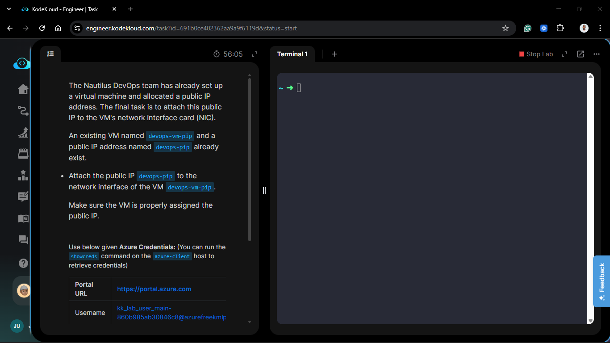
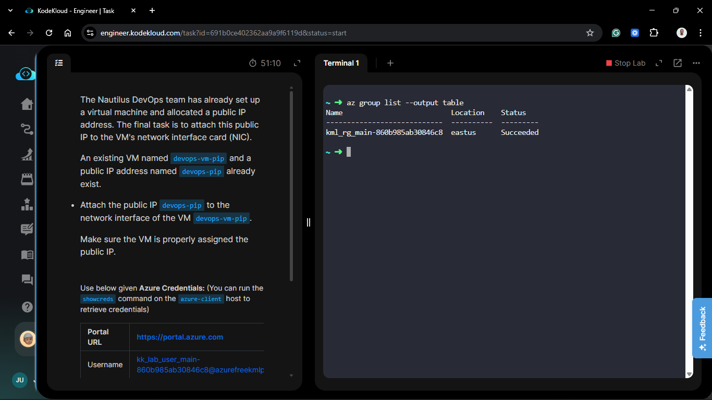
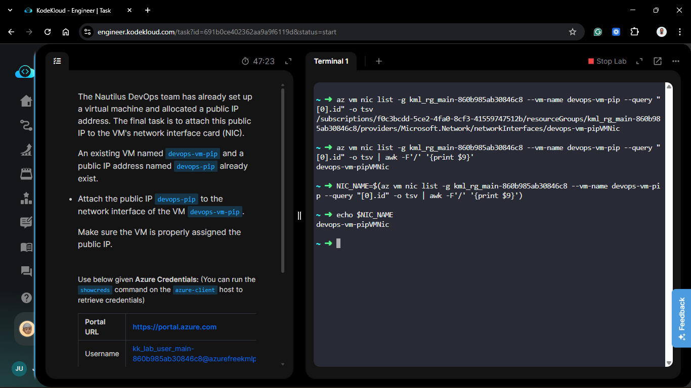
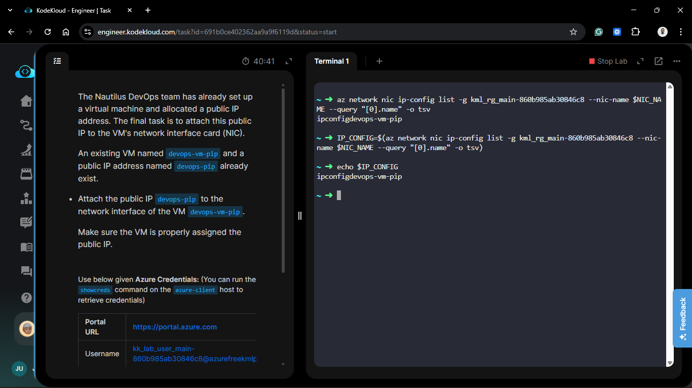
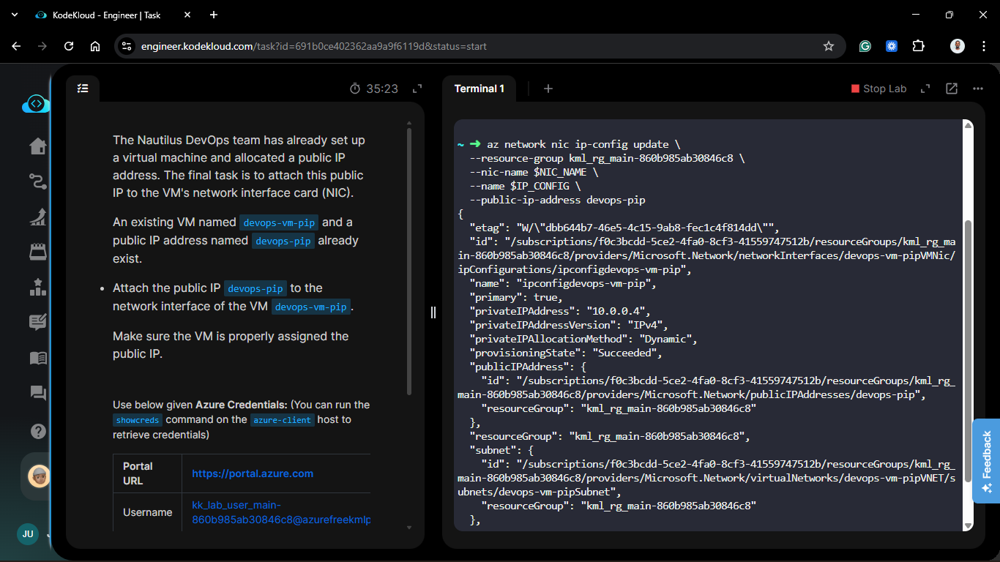
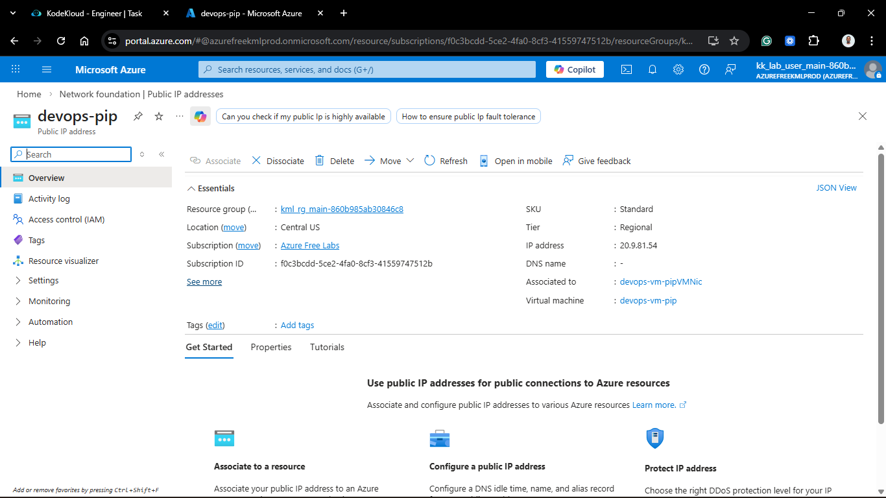

# Day 60: Attach Public IP to Azure Virtual Machine

## Project Description

As the Nautilus DevOps team finalizes the initial connectivity phase of the Azure migration, the final objective is to bridge the gap between the private Virtual Network and the public internet. While the Virtual Machine (`devops-vm-pip`) is functional and the Public IP (`devops-pip`) is allocated, they exist as separate resources. Today's task involves associating the Public IP with the VM's primary Network Interface (NIC) to allow external ingress.



**The Goal:**

Enable external accessibility for `devops-vm-pip` by mapping the `devops-pip` resource to its IP configuration via the Azure CLI.

## Technical Specifications

| Requirement        | Specification                  |
| :----------------- | :----------------------------- |
| **VM Name**        | `devops-vm-pip`                |
| **Public IP Name** | `devops-pip`                   |
| **Target NIC**     | `devops-vm-pipVMNic` (Primary) |
| **Resource Group** | `kml_rg_main-860b985ab30846c8` |

---

## Steps & Configuration (Azure CLI)

### 0. Check Resource Group

Before making any changes, I verified that the resource group containing both the VM and Public IP exists and is in a healthy state.

```bash
az group list --output table
```



### 1. Identify Resource Dependencies

To attach a Public IP, we must first identify the name of the Network Interface (NIC) and the specific IP configuration attached to the VM.

```bash
# Get the NIC name associated with the VM
NIC_NAME=$(az vm nic list -g kml_rg_main-860b985ab30846c8 --vm-name devops-vm-pip --query "[0].id" -o tsv | awk -F'/' '{print $9}')
```



```bash
# Get the IP Configuration name (usually 'ipconfig1')
IP_CONFIG=$(az network nic ip-config list -g kml_rg_main-860b985ab30846c8 --nic-name $NIC_NAME --query "[0].name" -o tsv)
```



### 2. Update the NIC IP Configuration

I executed the `az network nic ip-config update` command to link the existing Public IP resource to the NIC's configuration.

```bash
az network nic ip-config update \
  --resource-group kml_rg_main-860b985ab30846c8 \
  --nic-name $NIC_NAME \
  --name $IP_CONFIG \
  --public-ip-address devops-pip
```



### 3. Verify Public IP Association

I confirmed that the VM now possesses a valid external address by querying the VM's network profile.

```bash
az vm list-ip-addresses \
  --resource-group kml_rg_main-860b985ab30846c8 \
  --name devops-vm-pip \
  --output table
```




## Results

The CLI returned the reserved IPv4 address associated with `devops-pip`, confirming that the "front door" to our infrastructure is now open.

## 🧠 Theory: Public IP Association and Flow

- **Resource Decoupling:** In Azure, a Public IP is a standalone resource. This allows it to be moved between different NICs or Load Balancers, providing high flexibility during migration or disaster recovery.

- **IP Configurations:** A single NIC can have multiple IP configurations (Primary and Secondary). By updating the `ip-config`, we tell Azure which private IP should be "mapped" to our public entry point.

- **NAT (Network Address Translation):** When you attach a Public IP in Azure, the VM itself doesn't "see" the public address on its interface. Azure handles the NAT at the infrastructure level, translating traffic from `devops-pip` directly to the VM's private IP.


