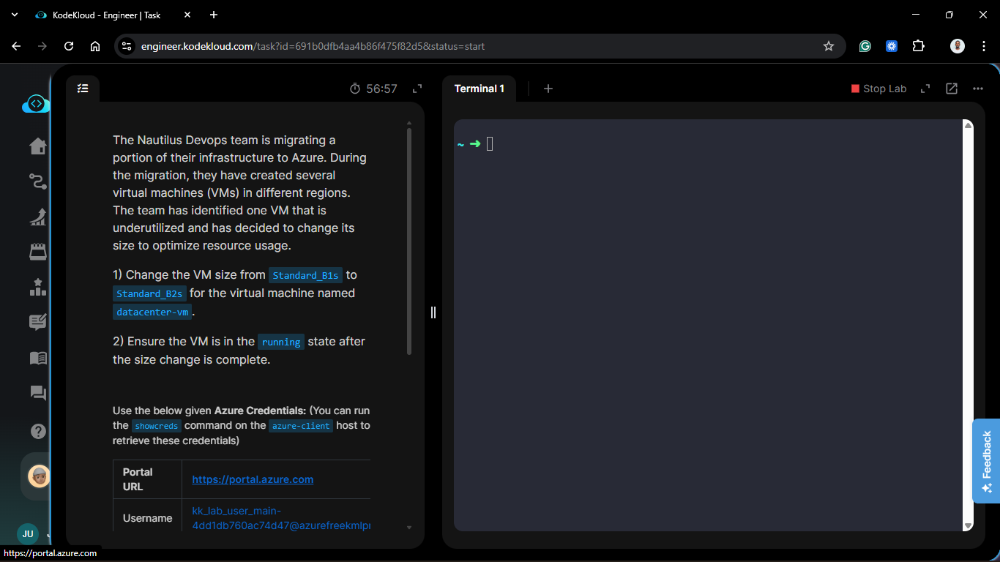
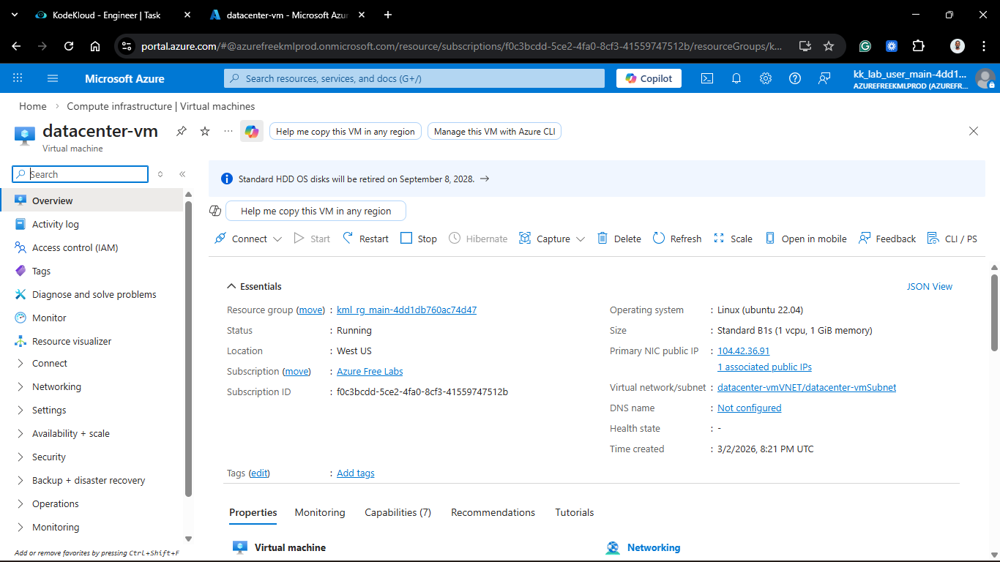
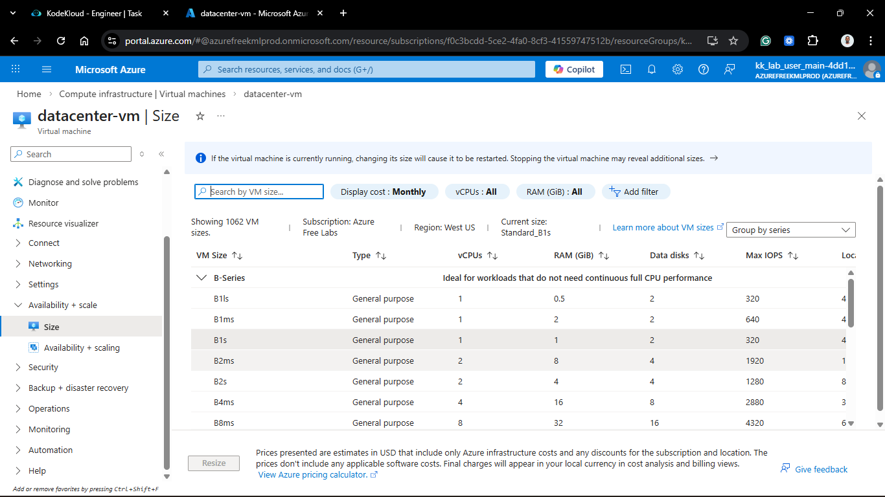
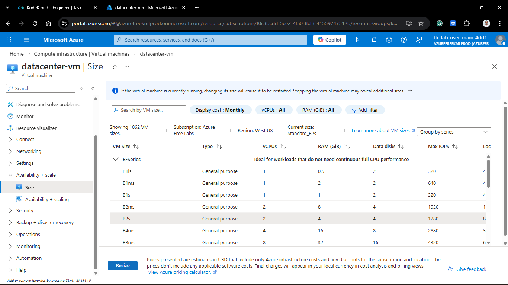
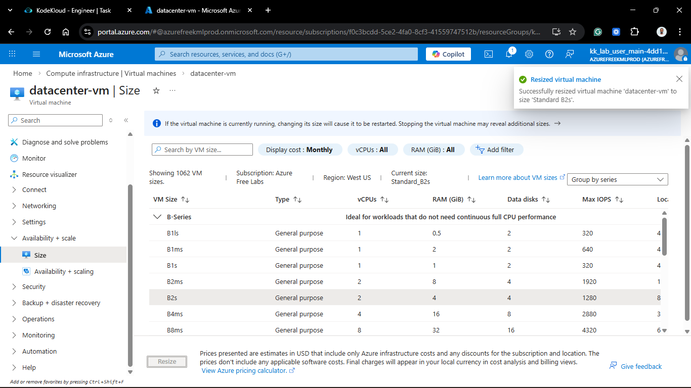
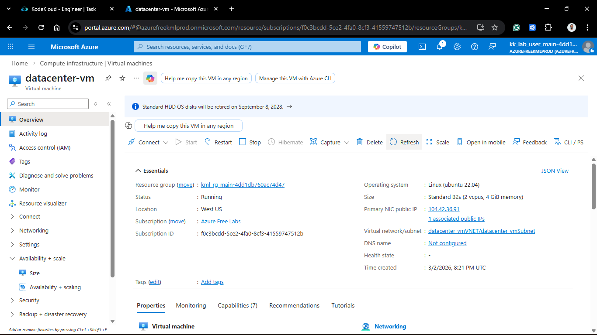
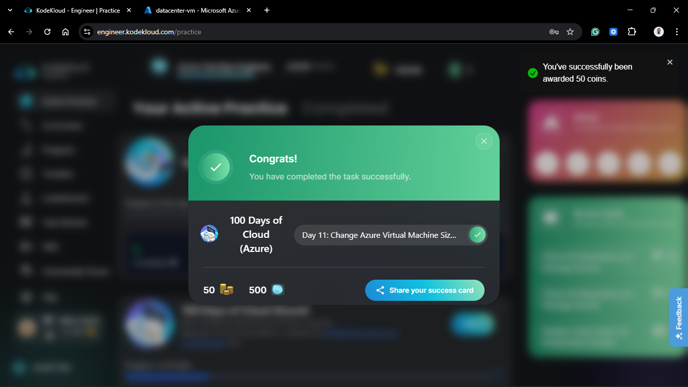

# Day 61: Change Azure Virtual Machine Size Using Console

## Project Description

As part of the continuous optimization phase of the Nautilus migration, the DevOps team monitors resource utilization to ensure cost-effectiveness. The `datacenter-vm`, originally provisioned as a `Standard_B1s`, was identified as under-resourced for its current workload. Today's task involves **Vertical Scaling**—resizing the instance to a `Standard_B2s` to provide additional CPU and RAM capacity.



**The Goal:**

Scale the `datacenter-vm` from 1 vCPU/1 GiB RAM (`B1s`) to 2 vCPUs/4 GiB RAM (`B2s`) using the Azure Portal, ensuring the instance returns to a healthy running state.

## Technical Specifications

| Component         | Specification              |
| :---------------- | :------------------------- |
| **VM Name**       | `datacenter-vm`            |
| **Current Size**  | `Standard_B1s` (Burstable) |
| **New Size**      | `Standard_B2s` (Burstable) |
| **RAM Increase**  | +300% (1 GiB to 4 GiB)     |
| **vCPU Increase** | +100% (1 to 2)             |

---

## Steps & Configuration (Console/Portal)

### 1. Locate the Resource

1. Log in to the **Azure Portal**.
2. Navigate to **Virtual Machines** and select `datacenter-vm`.
3. Observe the current size in the **Overview** blade.
   

### 2. Initiate Resizing

1. In the VM sidebar menu, scroll down to the **Availability + scale** section and select **Size**.
2. A list of available VM sizes for the current region (`eastus` or your lab region) will appear.
   

3. Search for or scroll to find **Standard_B2s**.
4. Select the **Standard_B2s** row and click the **Resize** button at the bottom.
   

### 3. Monitor State Change

- **Automatic Restart:** Azure will automatically restart the VM during the resizing process. This is required because the VM must be moved to a physical host that can accommodate the new hardware specifications.
- **Notification:** Wait for the portal notification: _"Successfully resized virtual machine datacenter-vm"_.
  

### 4. Verify Final State

1. Return to the **Overview** blade of the VM.
2. Confirm the **Size** now displays **Standard_B2s**.
3. Verify the **Status** is **Running**.
   

---

## Verification

1. **Portal Confirmation:** Verified the hardware profile update in the Azure Resource Manager (ARM).
2. **OS Level Check:**

   ```bash
   ssh azureuser@<VM_PUBLIC_IP>
   # Check updated RAM capacity
   free -m
   # Check updated CPU count
   nproc
   ```

## 🧠 Theory: Vertical Scaling and B-Series Credits

- **Vertical Scaling (Scaling Up):** This process involves changing the hardware capacity of an existing resource. While Azure makes this seamless, it **always results in a brief downtime** because the underlying physical hardware allocation changes.
- **B-Series Credit Bank:** When moving from a `B1s` to a `B2s`, the instance's **base performance** and **bursting capabilities** increase. The `B2s` has a higher threshold for earning CPU credits, making it better suited for applications with intermittent high-processing requirements.
- **Compatibility:** Not all VM sizes can be transitioned to one another without deallocating the VM first. However, within the same family (like the B-series), resizing is typically a direct action.


