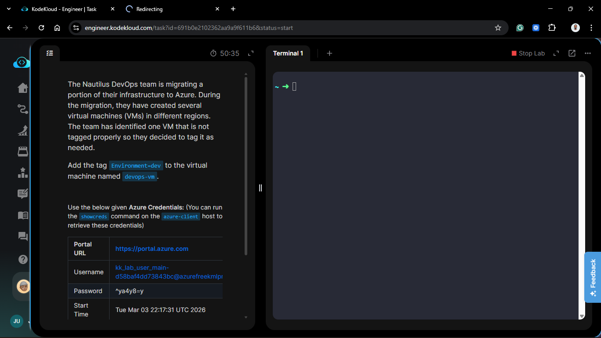
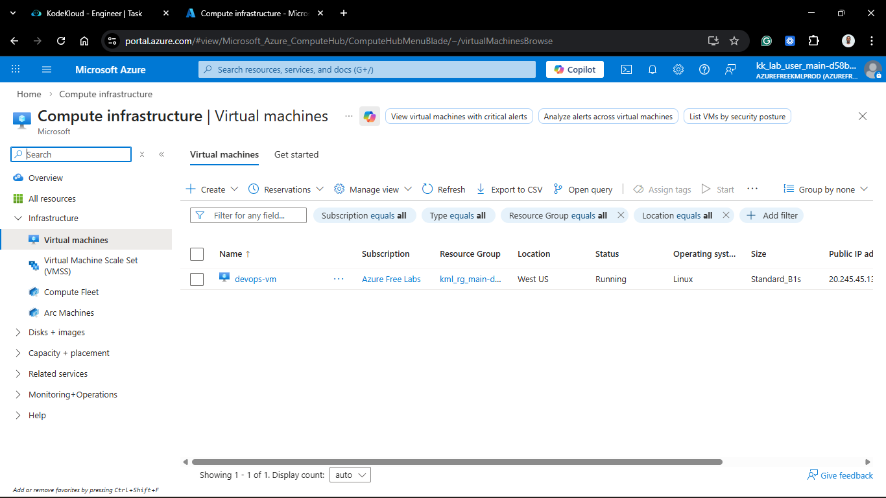
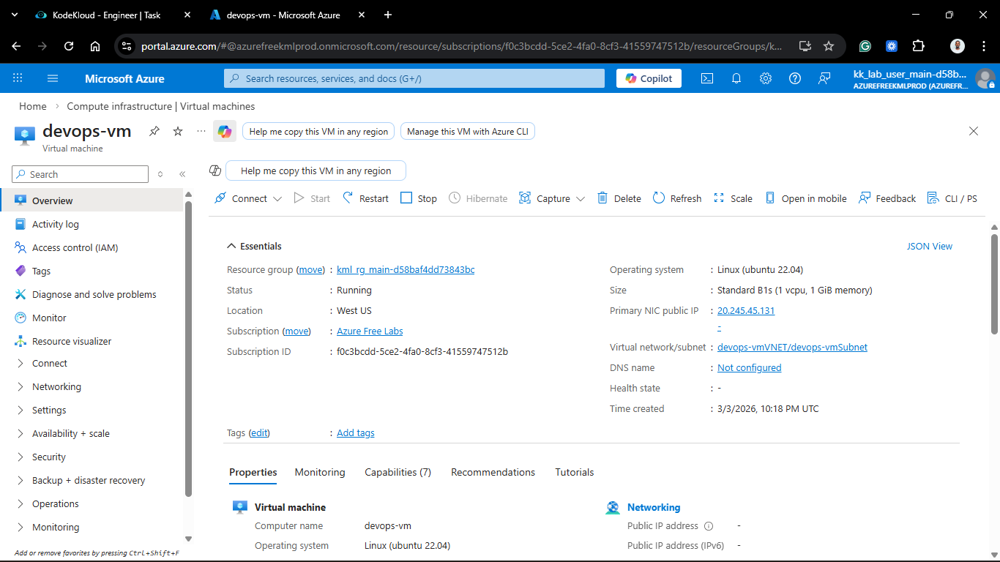
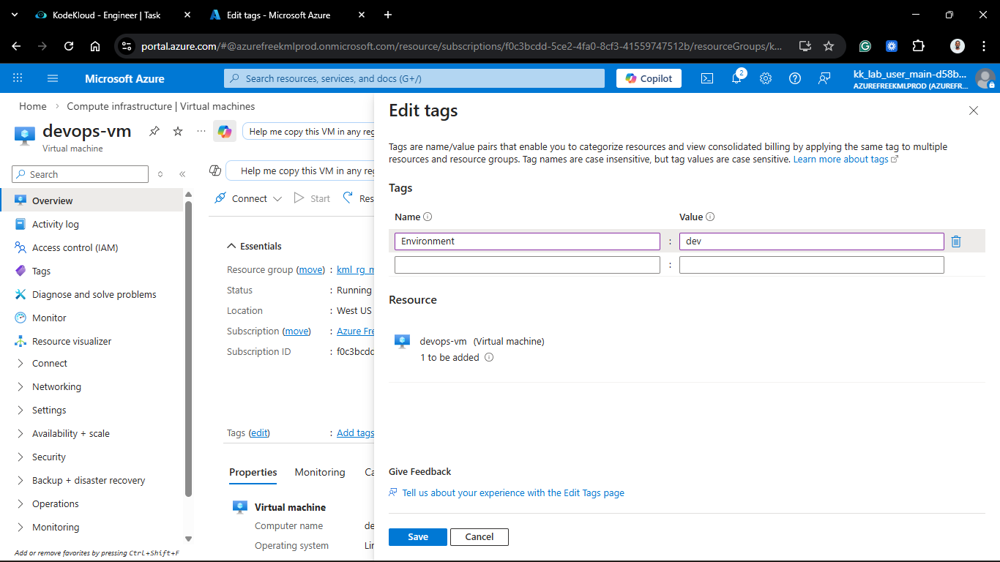
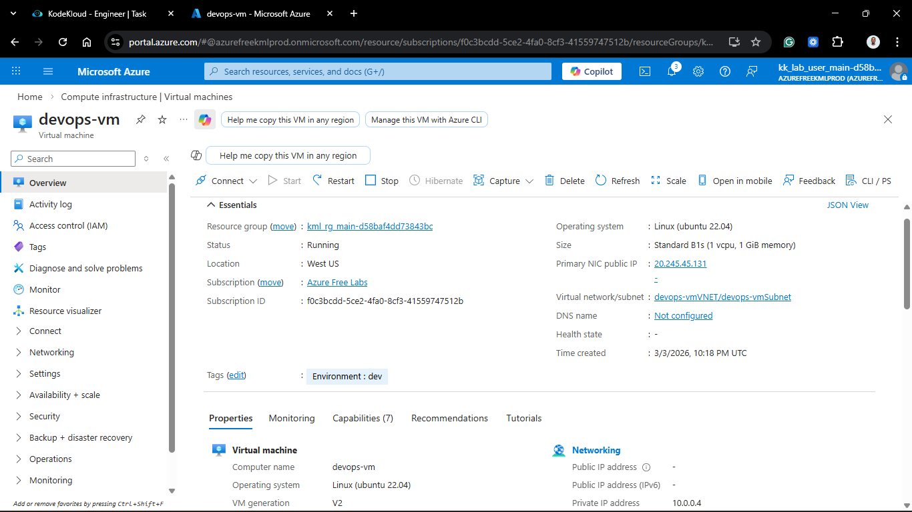
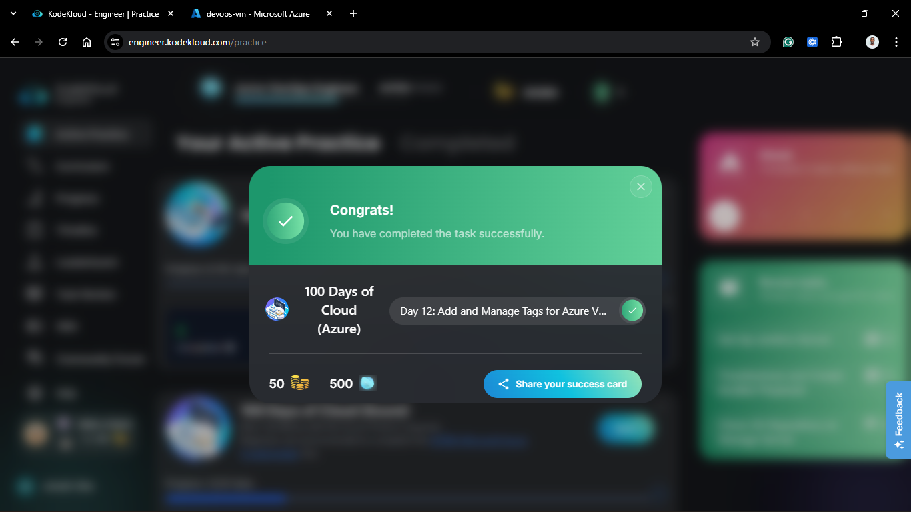

# Day 62 (Azure Day 12): Add and Manage Tags for Azure Virtual Machines

## Project Description

As the Nautilus DevOps migration expands, resource organization and cost management become critical. Without proper labeling, identifying the purpose and ownership of cloud resources in a multi-region environment is impossible. Today's task focuses on **Resource Governance** by applying standardized **Tags** to the `devops-vm`.

**The Goal:**
Implement a logical organization schema by adding the metadata tag `Environment=dev` to the `devops-vm` resource, ensuring it is correctly categorized within the global inventory.

## Technical Specifications

| Requirement        | Specification                    |
| :----------------- | :------------------------------- |
| **VM Name**        | `devops-vm`                      |
| **Tag Name (Key)** | `Environment`                    |
| **Tag Value**      | `dev`                            |
| **Scope**          | Resource Level (Virtual Machine) |

---

## Steps & Configuration (Console/Portal)

### 1. Access Resource Metadata

1. Log in to the **Azure Portal**.
2. Search for **Virtual Machines** and select the `devops-vm`.
3. On the VM Overview page, select **Tags**.
   
   

### 2. Apply the Organizational Tag

1. In the **Name** field, type `Environment`.
2. In the **Value** field, type `dev`.
3. Click **Apply** at the bottom of the blade to commit the metadata to the Azure Resource Manager (ARM).
   
   

### 3. Verification of Resource Metadata

1. Navigate back to the **Overview** blade.
2. Confirm that the **Tags** section now lists `Environment : dev`.
3. (Optional) Search for resources using the tag filter to ensure the VM appears in the "dev" environment category.

---

## Verification

1. **Portal Check:** Verified the tag is visible in the resource header.

2. **Resource Graph Check:** Confirmed the VM is now queryable via its `Environment` metadata.

## 🧠 Theory: The Power of Tagging in DevOps

- **Resource Governance:** Tags are name-value pairs that help you categorize resources. In a large migration, tags like Project, Owner, and Environment allow you to see exactly what a resource is for without looking at its technical specs.

- **Cost Management:** Azure Billing allows you to group costs by tags. This is how a DevOps team tells the Finance department exactly how much the "Development" environment is costing vs. "Production."

- **Automation Triggers:** Advanced DevOps workflows use tags as triggers. For example, a script could be set to automatically shut down all VMs tagged `Environment=dev` at 8 PM to save costs, while leaving `Environment=prod` running.

