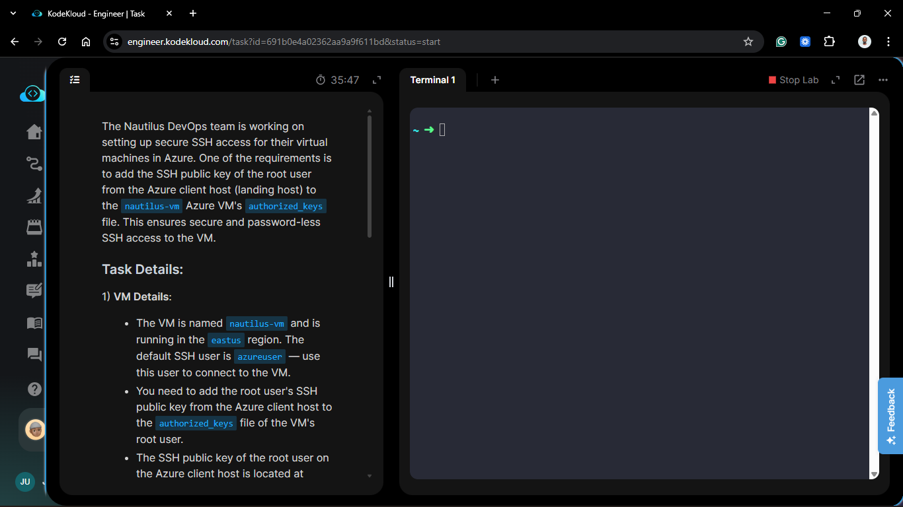
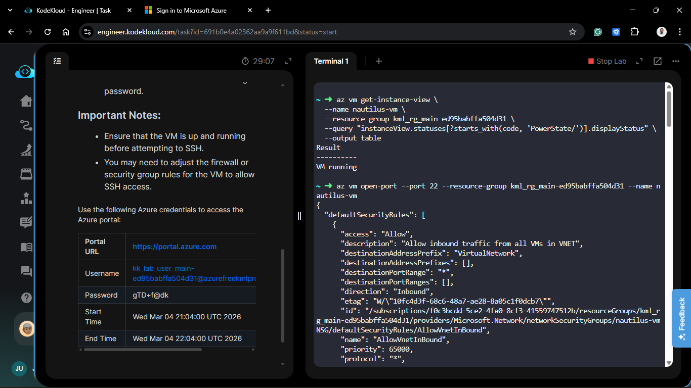
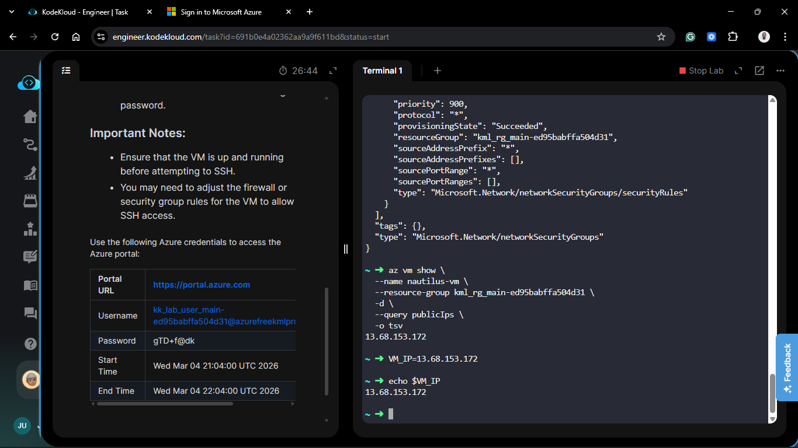
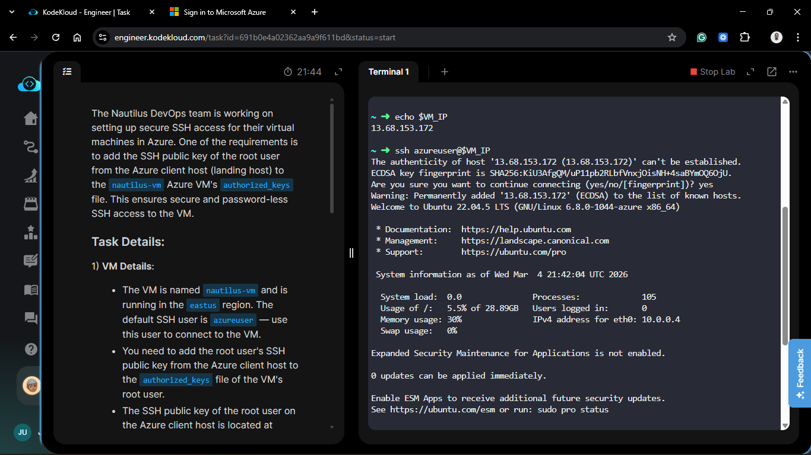
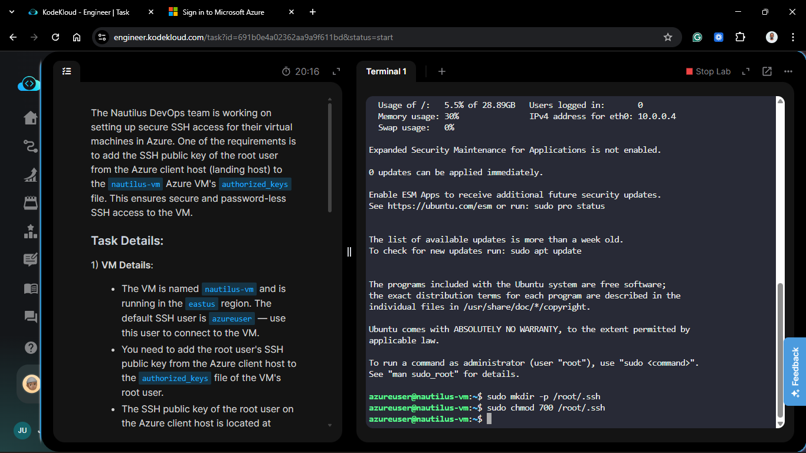
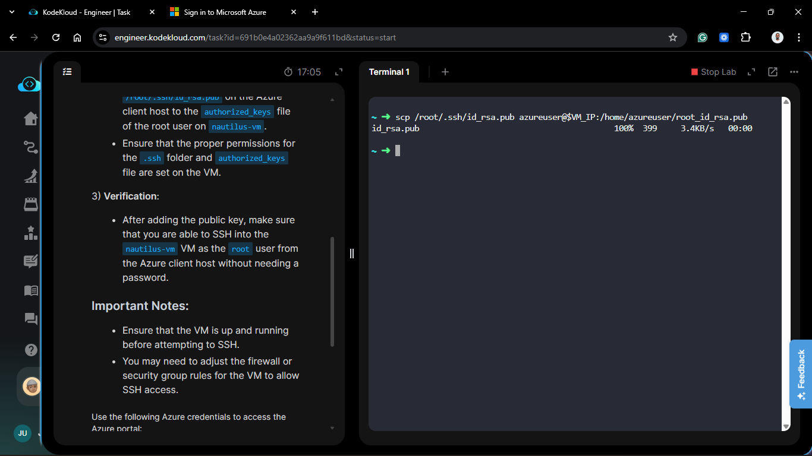
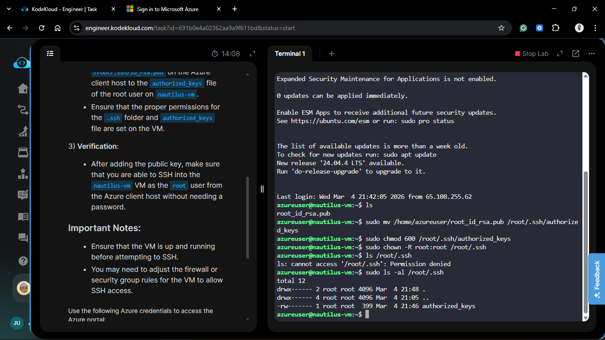
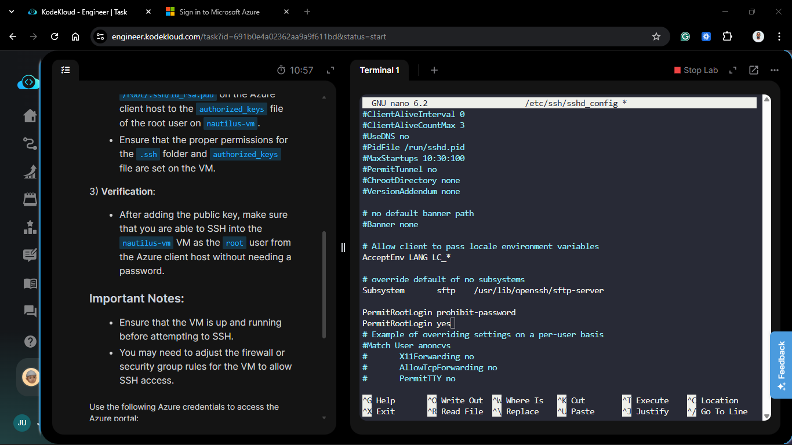
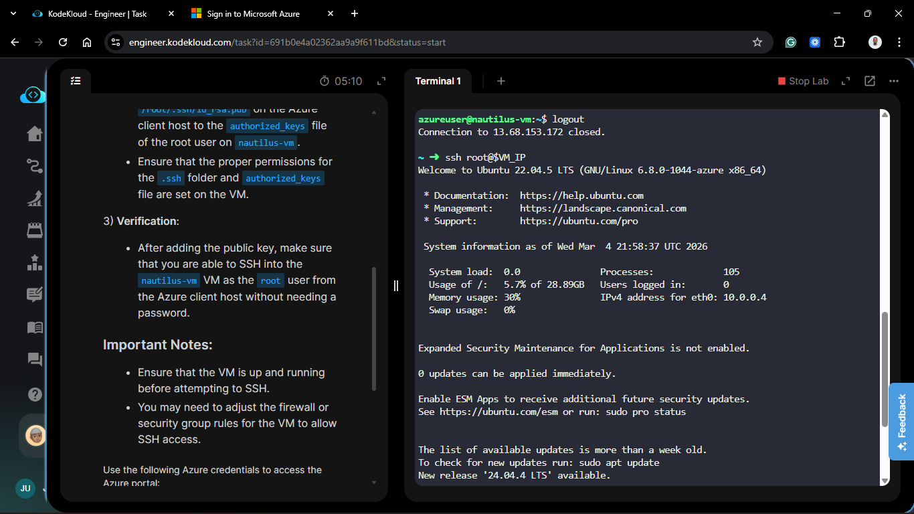
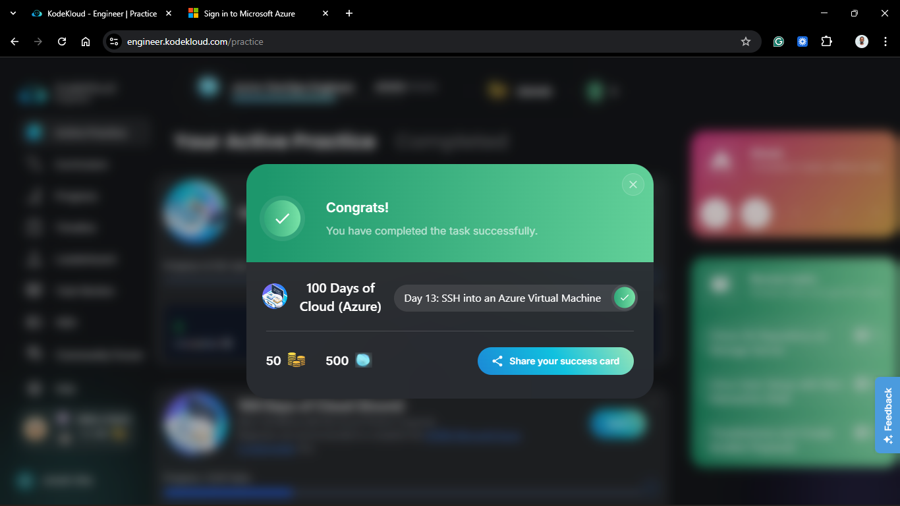

# Day 63: SSH into an Azure Virtual Machine

## Project Description

As the Nautilus DevOps team matures its Azure infrastructure, establishing robust, automated access between management hosts and target workloads is essential. Today's task involved setting up **Passwordless SSH** for the `root` user. By injecting the SSH public key from our `azure-client` host into the `nautilus-vm`, we enable secure, scriptable access—a prerequisite for automated configuration management and remote troubleshooting.



**The Goal:**

Configure key-based authentication for the `root` user on `nautilus-vm` using the public key from the landing host's root user.

## Technical Specifications

| Requirement        | Specification                  |
| :----------------- | :----------------------------- |
| **VM Name**        | `nautilus-vm`                  |
| **Resource Group** | `kml_rg_main-ed95babffa504d31` |
| **Region**         | `eastus`                       |
| **Target User**    | `root`                         |
| **Public IP**      | `13.68.153.172`                |

---

## Steps & Configuration (CLI Workflow)

### 1. Network Preparation

Before connecting, I ensured the VM was running and the firewall allowed SSH traffic. I used the `open-port` shortcut to update the Network Security Group (NSG).

```bash
# Verify VM Status
az vm get-instance-view -n nautilus-vm -g kml_rg_main-ed95babffa504d31 --query "instanceView.statuses[1].displayStatus"

# Open Port 22 (Inbound)
az vm open-port --port 22 -g kml_rg_main-ed95babffa504d31 -n nautilus-vm

# Retrieve Public IP
az vm show -n nautilus-vm -g kml_rg_main-ed95babffa504d31 -d --query publicIps -o tsv

VM_IP=13.68.153.172

# Verify Public IP
echo $VM_IP
```





### 2. Prepare the Target Environment

I accessed the VM as the default `azureuser` to prepare the root directory's hidden .ssh folder.

```bash
ssh azureuser@$VM_IP
sudo mkdir -p /root/.ssh
sudo chmod 700 /root/.ssh
```





### 3. Key Transfer and Injection

I used `scp` to move the public key from the `azure-client` host to the VM's home directory, then moved it to the final destination with appropriate ownership.

```bash
# Upload key to user home

scp /root/.ssh/id_rsa.pub azureuser@13.68.153.172:/home/azureuser/root_id_rsa.pub

# Move to root and set permissions

sudo mv /home/azureuser/root_id_rsa.pub /root/.ssh/authorized_keys
sudo chmod 600 /root/.ssh/authorized_keys
sudo chown -R root:root /root/.ssh
```





### 4. SSH Daemon Hardening

I modified `/etc/ssh/sshd_config` to ensure `PermitRootLogin` was correctly configured for key-based access and restarted the service.

```bash
sudo nano /etc/ssh/sshd_config
sudo systemctl restart sshd
```





## Verification

1. **Direct Root Connection:**

    ```bash
    ssh root@13.68.153.172
    ```

2. **Result:** Successfully established a root session from the `azure-client` host without a password prompt.

## 🧠 Theory: The "Jump-and-Move" Pattern

- **Security Barriers:** In most cloud images, you cannot scp directly into `/root`. By uploading to `/home/azureuser/` first, we bypass these restrictions while maintaining a secure chain of custody for the key.

- **NSG Priorities:** The `az vm open-port` command created a rule with priority 900. In Azure NSGs, lower numbers have higher priority. This ensures that even if a "DenyAll" rule exists at priority 65000, our SSH access remains open.

- **Idempotency:** This manual setup is the precursor to **Ansible**. Once this key is in place, we can use Ansible playbooks to manage the `nautilus-vm` without ever manually logging in again.


