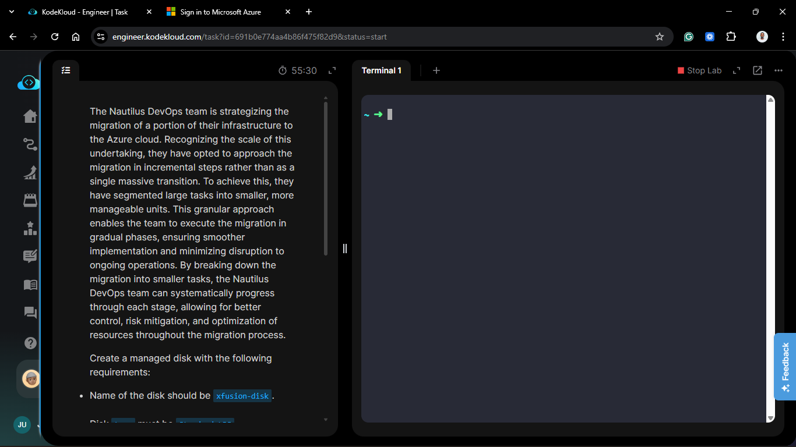
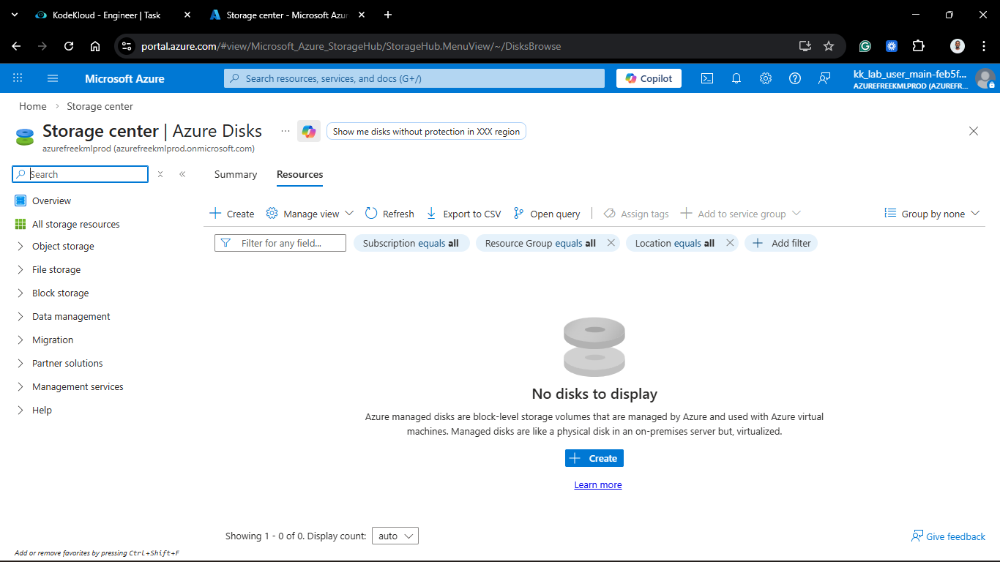
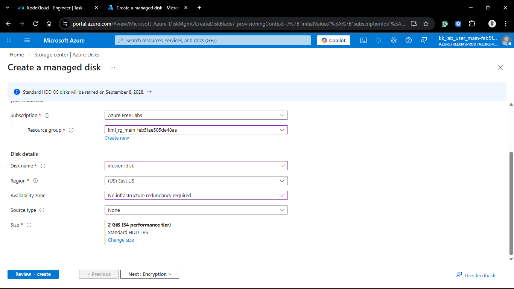
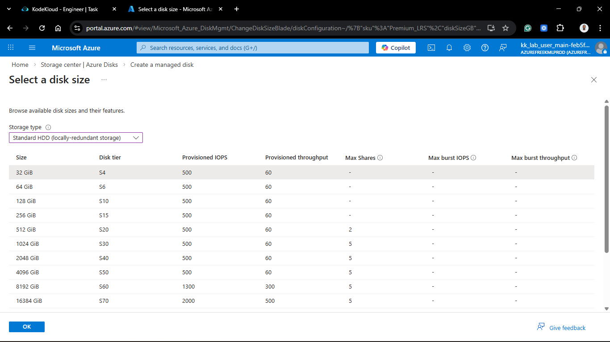
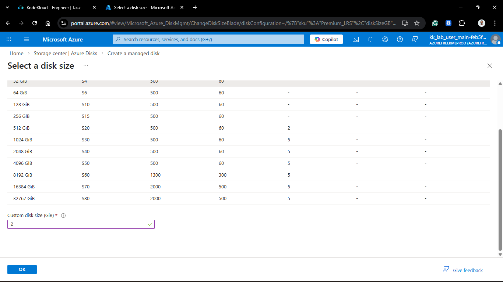
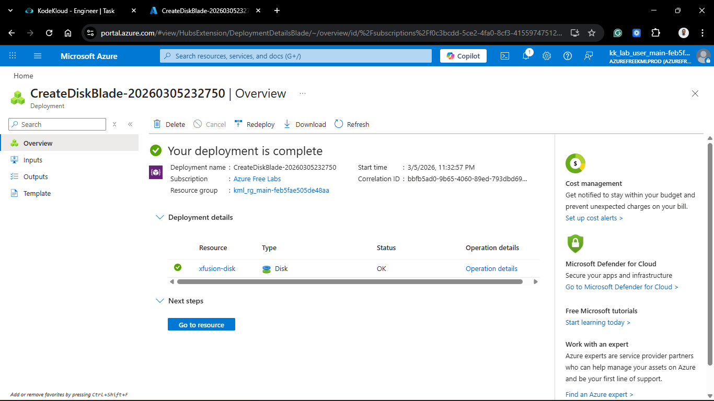
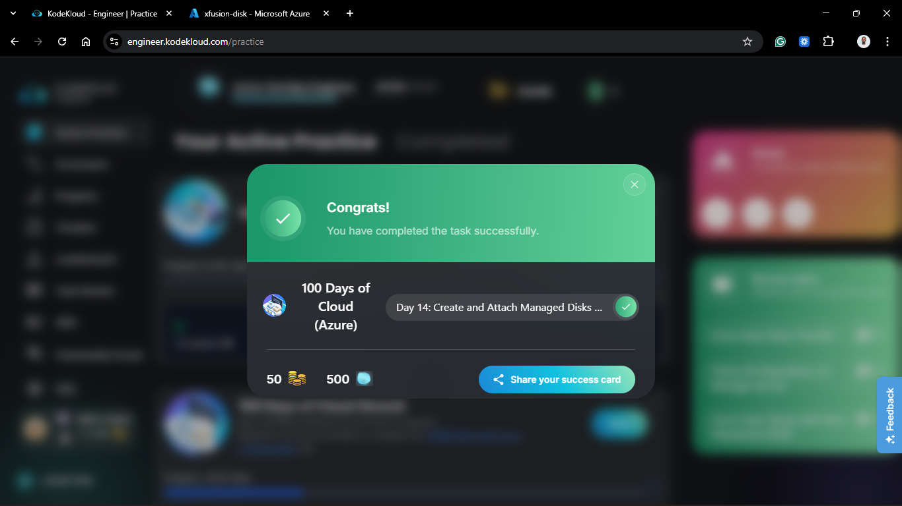

# Day 64 (Azure Day 14): Create Managed Disks via Azure Portal

## Project Description

As the Nautilus DevOps team continues the incremental migration to Azure, the focus remains on modular resource management. To support specialized application data that requires isolation from the operating system, we are provisioning standalone **Managed Disks**. This task involves creating a high-efficiency, small-footprint storage volume via the **Azure Portal**.

**The Goal:**

Provision a 2 GiB Managed Disk named `xfusion-disk` using the **Standard_LRS** storage tier to serve as a persistent data volume for the migration pilot.

## Technical Specifications

| Requirement        | Specification                     |
| :----------------- | :-------------------------------- |
| **Disk Name**      | `xfusion-disk`                    |
| **Storage Type**   | `Standard_LRS` (HDD)              |
| **Size**           | `2 GiB`                           |
| **Region**         | `eastus` (Matching project scope) |
| **Resource Group** | `kml_rg_main-ed95babffa504d31`    |

---

## Steps & Configuration (Azure Portal)

### 1. Initiate Disk Creation

1. Log in to the **Azure Portal**.
2. Search for **Disks** in the top search bar and select the service.
   

3. Click **+ Create**.

### 2. Configure Project & Instance Details

1. **Project Details:**
   - **Subscription:** Selected the active lab subscription.
   - **Resource Group:** Selected `kml_rg_main-ed95babffa504d31`.
2. **Instance Details:**
   - **Disk name:** `xfusion-disk`.
   - **Region:** `(US) East US`.
   - **Availability zone:** No infrastructure redundancy required (Default).
     

3. **Size & Performance:**
   - Clicked **Change size**.
   - **Storage type:** Selected **Standard HDD (locally redundant storage)**.
   - **Size:** Manually entered **2 GiB**.
   - Clicked **OK**.
     
     

### 3. Review and Create

1. Kept **Encryption**, **Networking**, and **Advanced** settings as default.
2. Clicked **Review + create**.
3. Once validation passed, clicked **Create**.
   

---

## Verification

1. **Deployment Check:** Verified the notification "Deployment is complete."
2. **Resource Overview:** Navigated to the `xfusion-disk` overview page.
3. **Status:** Confirmed the disk state is **Unattached**, meaning it is ready to be linked to a Virtual Machine.

## 🧠 Theory: Managed Disks and LRS Durability

- **Managed vs. Unmanaged:** By using **Managed Disks**, we offload the complexity of storage account management to Azure. We no longer need to worry about the 20,000 IOPS limit per storage account; Azure handles the underlying hardware placement and scaling.
- **Standard_LRS (Locally Redundant Storage):** LRS is the most cost-effective redundancy option. It protects data against server rack and drive failures by maintaining three synchronous copies of the data. For non-production development environments, this is the optimal balance of cost and reliability.
- **Granular Scaling:** By creating a 2 GiB disk, we follow the principle of "Just-in-Time" infrastructure. We avoid over-provisioning costs while maintaining the ability to expand the disk size later if the application requirements increase.

