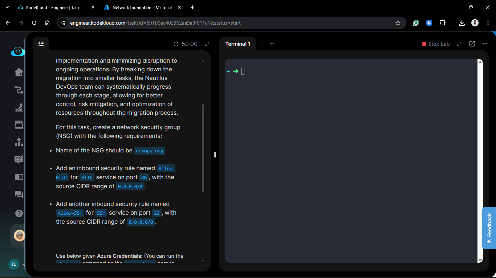
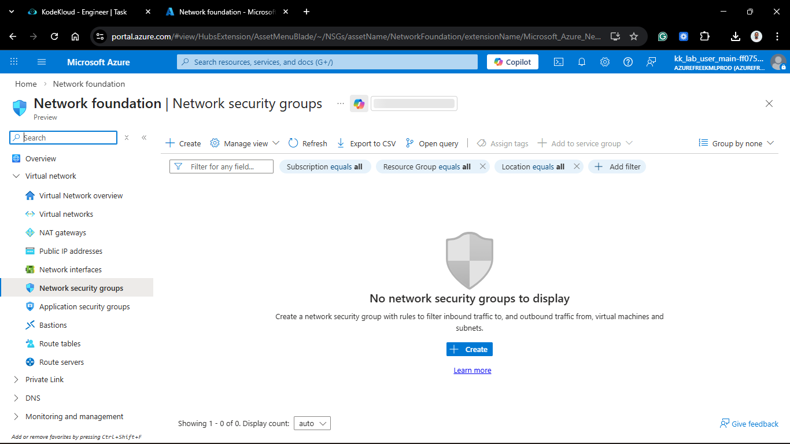
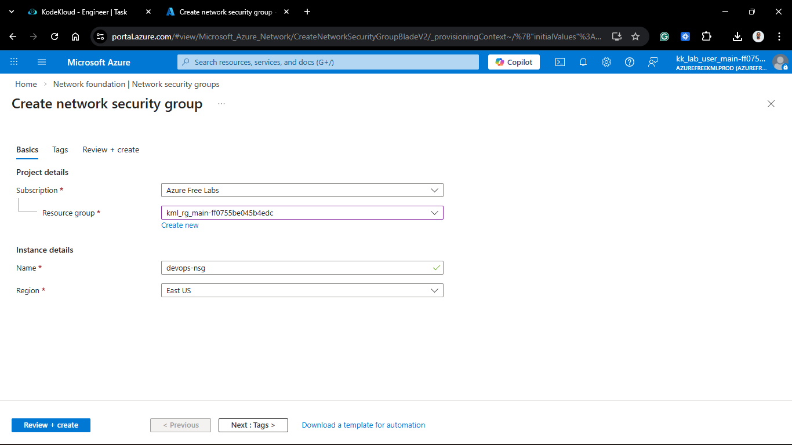
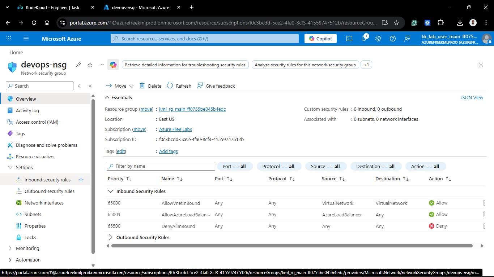
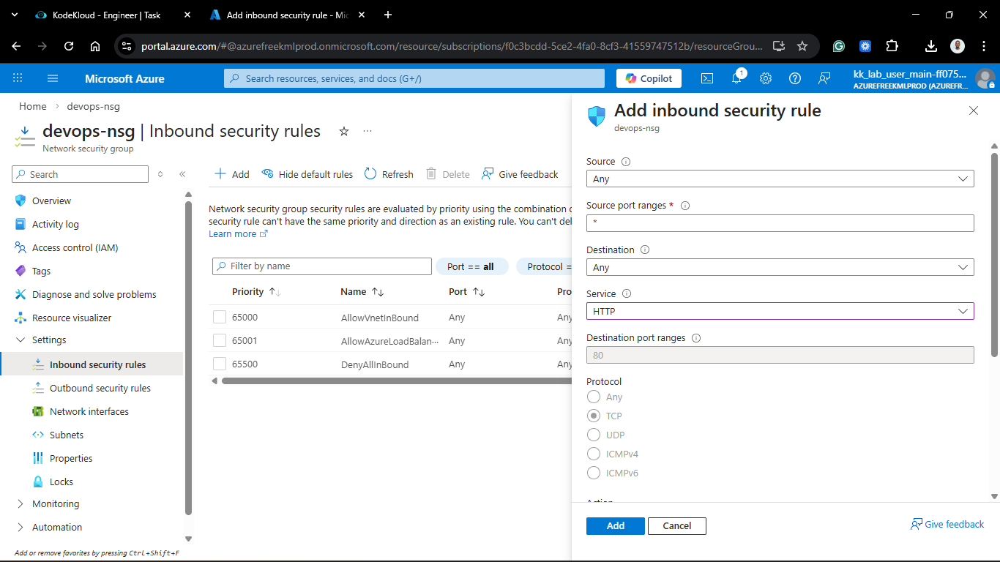
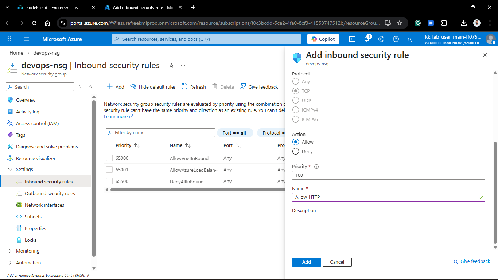
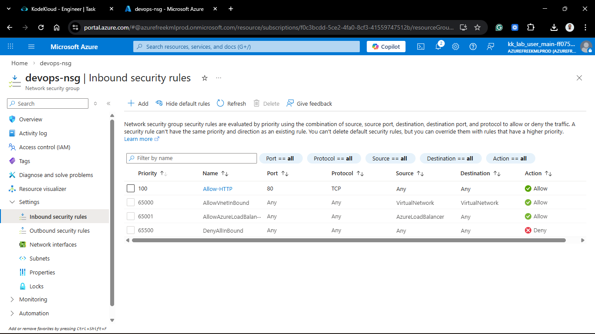
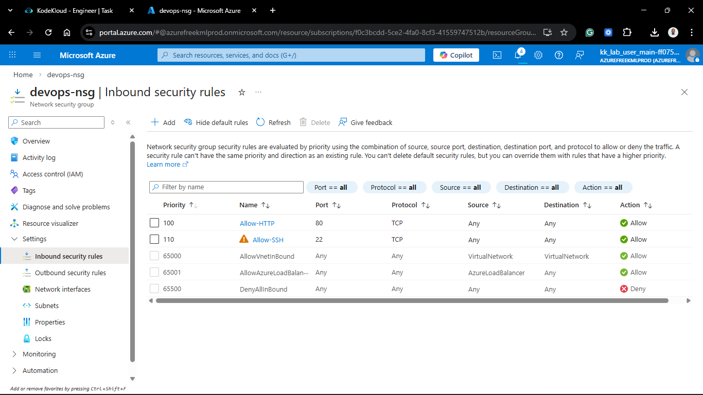
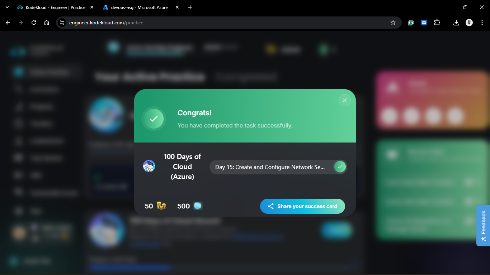

# Day 65: Create and Configure Network Security Group (NSG) in Azure

## Project Description

As the Nautilus DevOps migration moves into the application hosting phase, securing the network perimeter is paramount. Today's task involves the creation of a **Network Security Group (NSG)** named `devops-nsg`. This resource acts as a stateful firewall, allowing us to define granular Inbound and Outbound security rules to control traffic flow to our Virtual Machines and Subnets.

**The Goal:**

Provision a centralized security policy that explicitly permits administrative access (SSH) and web traffic (HTTP) while maintaining the default "Deny All" posture for unspecified external traffic.

## Technical Specifications

| Requirement        | Specification                                       |
| :----------------- | :-------------------------------------------------- |
| **NSG Name**       | `devops-nsg`                                        |
| **Region**         | `eastus` (Matching project scope)                   |
| **Rule 1 (Web)**   | Name: `Allow-HTTP`, Port: `80`, Source: `0.0.0.0/0` |
| **Rule 2 (Admin)** | Name: `Allow-SSH`, Port: `22`, Source: `0.0.0.0/0`  |

---

## Steps & Configuration (Azure Portal)

### 1. Create the NSG Resource

1. Log in to the **Azure Portal**.
2. Search for **Network security groups** and click **+ Create**.
   

3. **Project Details:**
   - **Subscription:** Selected the active migration subscription.
   - **Resource Group:** Selected `kml_rg_main-ed95babffa504d31`.
4. **Instance Details:**
   - **Name:** `devops-nsg`.
   - **Region:** `East US`.
5. Click **Review + create** and then **Create**.
   

### 2. Configure Inbound Security Rules

Once the NSG was deployed, I navigated to the **Inbound security rules** blade to add the specific permissions.

#### Rule A: HTTP Access

- **Source:** `Any` (or `0.0.0.0/0`)
- **Source port ranges:** `*`
- **Destination:** `Any`
- **Service:** `HTTP`
- **Destination port ranges:** `80`
- **Protocol:** `TCP`
- **Action:** `Allow`
- **Priority:** `100`
- **Name:** `Allow-HTTP`
  
  
  

#### Rule B: SSH Access

- **Source:** `Any`
- **Source port ranges:** `*`
- **Destination:** `Any`
- **Service:** `SSH`
- **Destination port ranges:** `22`
- **Protocol:** `TCP`
- **Action:** `Allow`
- **Priority:** `110`
- **Name:** `Allow-SSH`
  

---

## Verification

1. **Rule Check:** Navigated to the `devops-nsg` overview and verified both `Allow-HTTP` and `Allow-SSH` are listed with "Allow" actions.
2. **Priority Check:** Confirmed that these rules have a lower priority number (100, 110) than the default `DenyAllInBound` rule (65500), ensuring they are processed first.

## 🧠 Theory: NSG Rules and Stateful Filtering

- **Stateful Inspection:** NSGs are stateful. This means if you allow an inbound request on port 80, Azure automatically allows the outbound response back to the client without needing a reciprocal outbound rule.
- **Rule Priority:** Rules are processed in order of priority (lowest number first). Once a match is found, processing stops. By placing our rules at priority 100/110, we ensure they override the default security rules that block internet traffic.
- **Source CIDR 0.0.0.0/0:** This represents the entire internet. While necessary for a public web server, for SSH, it is a best practice in production to restrict the source to a specific IP address (like the Nautilus office IP) to prevent brute-force attacks.

